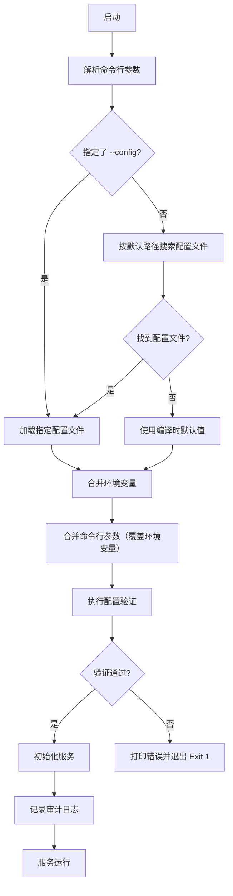
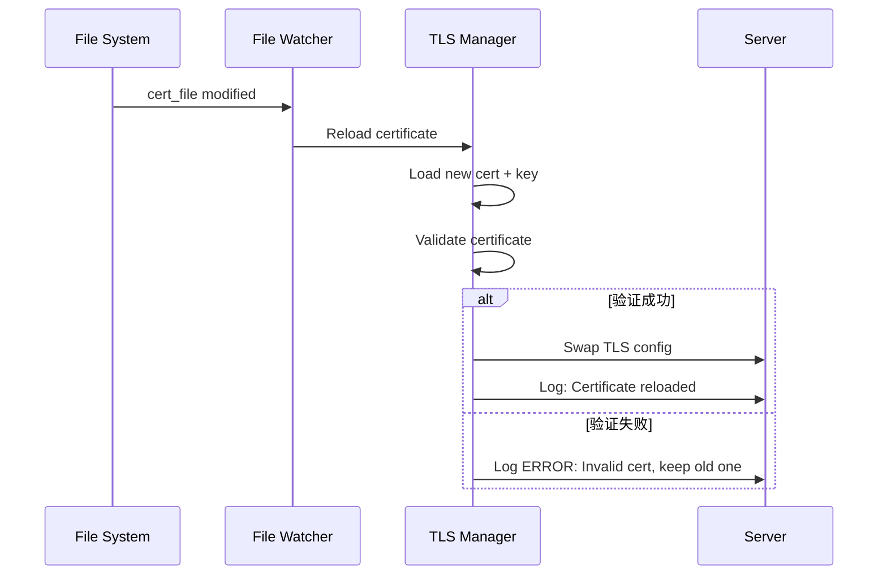

# RQ-0502-配置管理需求

**状态**: 已批准
**优先级**: P0（配置加载/验证/默认安全），P1（热加载），P2（增强工具链）
**来源**: RQ-0501-部署与交付需求.md (拆分), 项目架构需求
**创建日期**: 2025-12-12
**最后更新**: 2025-12-18 (同步快照保留策略配置)

## 1. 概述

本文档定义 TokMesh 的配置管理系统需求，包括配置加载、验证、热加载、审计等机制。配置管理是横切关注点，影响系统的启动、运行和运维体验。

优先级拆分（与“简单性优先/默认安全”一致）：
- **P0**：配置加载与覆盖顺序、零配置启动、启动期校验（Fail Fast）、默认监听安全策略（回环/显式对外告警）、错误输出规范
- **P1**：证书热加载（HTTPS/集群/Redis TLS）、日志级别热切换
- **P2**：更高级的对比/审计增强（如复杂 diff 输出样式扩展）、其它增强工具链能力

**设计原则**（参考 `specs/governance/principles.md`）:
- **简单性优先**: 配置结构清晰，避免过度嵌套，**配置项名称精简统一**（移除冗余后缀，统一开关语义）。
- **默认安全**: 敏感端口默认关闭，强制 TLS 优先。
- **快速失败**: 错误配置在启动时立即拒绝，不进入运行时。

---

## 2. 配置文件格式与优先级

### 2.1 文件格式

**主配置文件**: `config.yaml` (YAML 格式)

**理由**:
- 可读性强，支持注释
- 生态成熟（Kubernetes, Docker Compose 等）
- 支持复杂数据结构（嵌套对象、数组）

**备选格式**: 当前版本不支持 TOML/JSON 等其它格式（避免引入额外解析器与兼容性矩阵）；如未来确有必要，需通过新增 ADR/TK 明确范围后再引入。

### 2.2 配置优先级

**加载顺序**（从高到低）:

1. **命令行参数** - 最高优先级（用于临时覆盖）
   - 格式: `--<section>.<key>=<value>` (kebab-case)
   - 示例: `--server.http.address=127.0.0.1:5080`
   - 仅支持常用参数（具体支持的参数清单见 `DS-0502-配置管理设计.md`）

2. **环境变量 (ENV)** - 次高优先级（适合部署系统注入）
   - 格式: `TOKMESH_<SECTION>_<KEY>` (全大写，下划线分隔)
   - 示例: `TOKMESH_SERVER_HTTP_ADDRESS=127.0.0.1:5080`
   - 嵌套对象用 `_` 展开: `TOKMESH_SERVER_HTTPS_TLS_CERT_FILE=/path/to/cert.pem`

3. **配置文件** - 基线优先级
   - 读取路径优先级:
     1. `--config` 参数指定的路径
     2. `TOKMESH_SERVER_CONFIG_FILE` 环境变量
     3. 系统默认配置目录（服务化默认路径）
        - Linux: `/etc/tokmesh-server/config.yaml`
        - Windows: `%ProgramData%\tokmesh-server\config.yaml`
     4. `./config.yaml` (当前目录，仅开发/调试建议)
     5. `$XDG_CONFIG_HOME/tokmesh-server/config.yaml` (可选：非服务化运行；默认 `~/.config/tokmesh-server/config.yaml`)

4. **编译时默认值** - 最低优先级
   - 硬编码在二进制中
   - 必须保证"零配置启动"（即不提供任何配置文件时，服务也能以默认值启动）

### 2.3 配置覆盖规则

**部分覆盖**: 环境变量和命令行参数只覆盖指定的键，不影响其他配置。

### 2.4 配置值的类型与单位约定（必须遵循）

为避免“配置项名称带单位后缀”（如 `_kb/_seconds`）导致的冗余与口径漂移，本项目统一采用**“键名无单位、值带单位/格式”**的方式表达技术参数；仅当外部接口已固定语义时（如 API 参数 `ttl_seconds`），才使用明确的单位后缀。

#### 2.4.1 `duration`（时间间隔/TTL）

- **写法**: 必须写为字符串，遵循 Go `time.ParseDuration` 语法。
- **允许单位**: `ns`、`us`（或 `µs`）、`ms`、`s`、`m`、`h`。
- **示例**: `"100ms"`、`"60s"`、`"5m"`、`"2h"`。
- **适用范围**: 所有配置中的 `*_ttl`、`*_timeout`、`*_interval`、`*_grace_period` 等时间字段（除非该字段在文档中明确声明为其它类型）。

#### 2.4.2 `size`（字节大小）

- **写法**: 字符串 `<number><unit>`。
- **允许单位**: `B`、`KB`、`MB`、`GB`（不区分大小写）。
- **单位换算**: `1KB = 1024B`，`1MB = 1024KB`，`1GB = 1024MB`。
- **示例**: `"1MB"`、`"64MB"`、`"10GB"`。

#### 2.4.3 `rate`（速率/带宽上限）

- **写法**: 字符串 `<number><unit>`。
- **允许单位**:
  - **bit/s**: `Kbps`、`Mbps`、`Gbps`
  - **byte/s**: `KBps`、`MBps`、`GBps`
- **示例**: `"20Mbps"`、`"100MBps"`、`"1Gbps"`。
- **约束**: 不接受无单位纯数字（避免歧义）。

#### 2.4.4 `security.auth.argon2.memory`（例外：单位固定为 KB）

Argon2 参数的 `memory` 在实现层通常以 **KB** 为单位（与算法/库约定保持一致）。为保持简单性与避免复杂解析：
- **写法**: 正整数（不带单位后缀）
- **语义**: 单位为 **KB**
- **示例**: `16384` 表示 `16384KB`（约 `16MB`）

**路径解析规则（避免部署误用）**:
- 所有配置中的文件/目录路径（如 `*.crt`、`*.key`、WAL 目录等）若为相对路径，必须按**配置文件所在目录**解析（而非进程工作目录）。
- 生产环境建议使用绝对路径（如 `/etc/tokmesh-server/certs/server.crt`、`/var/lib/tokmesh-server/wal`），降低 systemd/容器工作目录差异带来的风险。

**示例**:
```yaml
# config.yaml
server:
  http:
    enabled: true
    address: "127.0.0.1:5080"
```

```bash
# 通过环境变量覆盖 API 端口
export TOKMESH_SERVER_HTTP_ADDRESS=127.0.0.1:9999

# 若同时提供命令行参数，则命令行优先生效（例如：--server.http.address=127.0.0.1:8888）

# 启动后实际配置:
# server.http.enabled = true (来自 config.yaml)
# server.http.address = "127.0.0.1:9999" (来自环境变量)
```

---

## 3. 配置加载流程

### 3.1 启动阶段加载

**流程图**（Mermaid）:



### 3.2 加载失败处理

**原则**: **快速失败 (Fail Fast)**

| 场景 | 行为 | 退出码 |
|------|------|--------|
| 配置文件不存在（但未指定 --config） | ⚠️ 警告日志，使用默认值继续 | 0 |
| 配置文件不存在（指定了 --config） | ❌ 错误退出 | 1 |
| 配置文件格式错误（YAML 语法错误） | ❌ 错误退出，打印行号 | 1 |
| 配置验证失败 | ❌ 错误退出，打印具体错误 | 1 |
| 环境变量格式错误 | ⚠️ 警告日志，忽略该变量 | 0 |

**错误信息格式**:
```
[FATAL] Configuration validation failed:
  - server.http.address: invalid port 99999 (must be 1-65535)
  - server.https.tls.cert_file: file not found at /path/to/cert.pem
  - cluster.data.replication_factor: value 5 exceeds cluster size 3

Exit code: 1
```

### 3.3 配置文件缺失时的行为

**单机模式默认配置**:
- HTTP: 监听 `127.0.0.1:5080`（默认仅本地回环）
- HTTPS: 默认禁用（需证书就绪后显式启用）
- Redis: **禁用**（不监听任何端口）
- Cluster: **禁用**（单机模式）

**启动日志示例**:
```
[WARN] No configuration file found, using built-in defaults
[INFO] Starting TokMesh in standalone mode
[INFO] HTTP listening on 127.0.0.1:5080
[WARN] HTTPS is disabled (enable `server.https.enabled` and configure `server.https.tls.*` for production)
```

---

## 4. 配置验证规则

### 4.1 验证层级

**三级验证**:

1. **类型验证** (Type Validation)
   - 检查数据类型（string, int, bool, array, object）
   - 示例: `server.http.address` 必须是字符串

2. **范围验证** (Range Validation)
   - 检查数值范围、字符串长度
   - 示例: `server.http.address` 中端口必须在 `1-65535` 之间

3. **逻辑验证** (Logic Validation)
   - 检查配置间的依赖关系
   - 示例: `server.https.enabled=true` 时，`server.https.tls.cert_file` 和 `server.https.tls.key_file` 必须存在

### 4.2 验证规则清单

> **注意**: 时间/大小/速率字段的写法与单位集合见 **2.4 节**。在配置加载阶段，这些字段视为字符串（或支持解组的 `time.Duration`/自定义 Size 类型），并在启动期执行严格校验（Fail Fast）。

#### 4.2.1 端口 (Port)

> **架构说明**: TokMesh 对外仅提供 HTTP/HTTPS 端口（业务 + 管理接口复用同一监听集合）。

| 配置项 | 类型 | 范围 | 默认值 | 验证规则 |
|--------|------|------|--------|----------|
| `server.http.address` | string | - | `127.0.0.1:5080` | 明文 HTTP 监听地址（host:port），默认仅本地回环 |
| `server.https.address` | string | - | `127.0.0.1:5443` | HTTPS 监听地址（host:port），默认仅本地回环 |
| `cluster.listen_address` | string | - | `127.0.0.1:5343` | 集群内部通信监听地址；默认仅本地回环。启用集群时必须**显式**改为内网地址并启用 mTLS（例如 `10.0.0.10:5343`） |
| `server.redis.address` | string | - | `127.0.0.1:6379` | Redis 兼容协议监听地址（明文，仅开发） |
| `server.redis_tls.address` | string | - | `127.0.0.1:6380` | Redis 兼容协议监听地址（TLS，生产环境） |

**端口命名规则**:
- `XX80` 结尾: 明文（仅开发环境）
- `XX43` 结尾: TLS 加密（生产环境必须）
- **例外**: Redis 协议端口保持业界标准 6379（明文）/6380（TLS），不遵循 XX80/XX43 规则

**端口冲突检测**:
- 同一 `host` 下所有已启用的监听地址端口不得重复
- 错误示例: `server.http.enabled=true` 且 `server.http.address=127.0.0.1:5080`，同时 `server.redis.enabled=true` 且 `server.redis.address=127.0.0.1:5080`

#### 4.2.2 TLS 证书

| 配置项 | 类型 | 验证规则 |
|--------|------|----------|
| `server.https.tls.cert_file` | string | 当 `server.https.enabled=true` 时必填；文件必须存在且可读；必须是 PEM 格式 |
| `server.https.tls.key_file` | string | 当 `server.https.enabled=true` 时必填；文件必须存在且可读；必须是 PEM 格式 |
| `server.https.tls.client_ca_file` | string | 可选；用于要求客户端证书（mTLS）；若填写，文件必须存在且可读 |
| `cluster.tls.cert_file` | string | 当 `cluster.enabled=true` 时必填；文件必须存在且可读；必须是 PEM 格式 |
| `cluster.tls.key_file` | string | 当 `cluster.enabled=true` 时必填；文件必须存在且可读；必须是 PEM 格式 |
| `cluster.tls.client_ca_file` | string | 当 `cluster.enabled=true` 时必填；集群内部 mTLS 客户端 CA |
| `server.redis_tls.tls.cert_file` | string | 当 `server.redis_tls.enabled=true` 时必填；文件必须存在且可读；必须是 PEM 格式 |
| `server.redis_tls.tls.key_file` | string | 当 `server.redis_tls.enabled=true` 时必填；文件必须存在且可读；必须是 PEM 格式 |
| `server.redis_tls.tls.client_ca_file` | string | 可选；若填写，文件必须存在且可读 |

**依赖验证逻辑**:
```python
if server.https.enabled:
    assert exists(server.https.tls.cert_file)
    assert exists(server.https.tls.key_file)

if cluster.enabled:
    assert exists(cluster.tls.cert_file)
    assert exists(cluster.tls.key_file)
    assert exists(cluster.tls.client_ca_file)

if server.redis_tls.enabled:
    assert exists(server.redis_tls.tls.cert_file)
    assert exists(server.redis_tls.tls.key_file)
```

**证书格式验证**:
- 启动时尝试加载证书
- 验证证书有效期（若过期，打印警告但不阻止启动）
- 验证证书与私钥是否匹配

#### 4.2.3 集群配置

| 配置项 | 验证规则 |
|--------|----------|
| `cluster.enabled` | **必须显式配置**：仅当 `cluster.enabled=true` 时才启用集群；不得因 `seeds` 等字段被动启用 |
| `cluster.discovery.seeds` | 若非空但 `cluster.enabled=false`，则启动期验证失败并提示“需显式开启 cluster.enabled” |
| `cluster.data.replication_factor` | 必须 ≥ 1；若 > `node_count`，打印警告并限制为 `node_count` |
| `cluster.bootstrap.expect_nodes` | 必须 ≥ 1；仅在初始化引导时生效 |
| `cluster.rebalance.max_rate` | 类型必须为 `rate`；值格式见 2.4.3；为空/非法格式启动期报错；可选：上限不得超过物理网卡带宽（超出则告警） |
| `cluster.rebalance.min_ttl` | 类型必须为 `duration`；值格式见 2.4.1；必须 ≥ 0s 且 ≤ 24h（过大将导致迁移效率下降） |
| `cluster.shutdown.timeout` | 类型必须为 `duration`；值格式见 2.4.1；必须 ≥ 10s 且 ≤ 300s |
| `server.shutdown.timeout` | 类型必须为 `duration`；值格式见 2.4.1；必须 ≥ 5s 且 ≤ 300s |
| `server.shutdown.grace_period` | 类型必须为 `duration`；值格式见 2.4.1；必须 ≥ 0s 且 ≤ `server.shutdown.timeout` |
| `cluster.advertise_address` | 当 `cluster.enabled=true` 时**必须显式配置为非空**，且必须是“其他节点可访问”的本机地址（避免自动探测选错网卡/Pod IP 导致互连失败） |

#### 4.2.4 存储配置

> **决策参考**：控制面 Raft 日志与快照持久化使用嵌入式 KV（默认 Badger），详见 `AD-0402-嵌入式KV选型策略.md`。

| 配置项 | 类型 | 范围 | 验证规则 |
|--------|------|------|----------|
| `storage.wal.dir` | string | - | 目录必须存在或可创建；必须有写权限 |
| `storage.wal.sync_mode` | string | `sync`, `batch` | 必须为枚举值之一 |
| `storage.wal.sync_interval` | duration | 1ms-10s | 值格式见 2.4.1；仅当 `sync_mode=batch` 时生效 |
| `storage.wal.batch_count` | int | 1-100000 | 仅当 `sync_mode=batch` 时生效；批量写入条数上限 |
| `storage.wal.batch_size` | size | 4KB-64MB | 仅当 `sync_mode=batch` 时生效；批量写入字节数 |
| `storage.snapshot.dir` | string | - | 目录必须存在或可创建；必须有写权限 |
| `storage.snapshot.interval` | duration | 1h-168h | 值格式见 2.4.1 |
| `storage.snapshot.threshold` | size | 100MB-10GB | WAL 累积大小达到此阈值时触发快照（与 interval 取先到者） |
| `storage.snapshot.retention_count` | int | 1-100 | 保留最近 N 个快照文件；默认 5 |
| `storage.snapshot.retention_days` | int | 1-365 | 保留最近 N 天内的快照；默认 7；与 retention_count 取并集 |
| `storage.badger.gc_interval` | duration | 100ms-10m | 值格式见 2.4.1；Badger GC 轮询间隔。默认 5m。 |
| `storage.badger.gc_threshold` | float | 0.5-1.0 | Badger value log GC 阈值。默认 0.7。|
| `storage.badger.cache_size` | size | 16MB-1GB | Badger block cache 大小 |

#### 4.2.5 会话配置

| 配置项 | 验证规则 |
|--------|----------|
| `session.ttl.default` | 类型必须为 `duration`；值格式见 2.4.1；必须 ≥ 1m 且 ≤ `max` |
| `session.ttl.max` | 类型必须为 `duration`；值格式见 2.4.1；必须 ≥ `default` 且 ≤ `8760h` (1年) |
| `session.ttl.gc_interval` | 类型必须为 `duration`；值格式见 2.4.1；必须在 `100ms-1m` 区间 |
| `session.ttl.sample_size` | 必须 ≥ 1 且 ≤ 10000 |
| `session.quota.max_per_user` | 必须 ≥ 1 且 ≤ 10000 |

#### 4.2.6 安全配置

| 配置项 | 类型 | 范围 | 验证规则 |
|--------|------|------|----------|
| `security.auth.rotation_grace` | duration | 0s-24h | 轮转宽限期；值格式见 2.4.1 |
| `security.auth.cache_capacity` | int | 1000-100000 | 验证缓存最大条目数 |
| `security.auth.cache_ttl` | duration | 10s-5m | 值格式见 2.4.1；缓存 TTL 不宜过长 |
| `security.auth.argon2.memory` | int(KB) | 8192-1048576 | Argon2 内存（单位 KB）；建议 16384-65536；过小降低安全性，过大增加 CPU/内存压力 |
| `security.auth.argon2.iterations` | int | 1-10 | Argon2 迭代次数 |
| `security.auth.argon2.parallelism` | int | 1-16 | Argon2 并行度 |
| `security.auth.allow_list` | list[string] | IP/CIDR 列表 | 可选：API Key 来源 IP 允许名单；每项必须为合法 CIDR，或单个 IP。示例：`["10.0.0.0/8","192.168.1.10"]` |
| `security.anti_replay.timestamp_window` | duration | 1s-5m | 写请求时间戳窗口（默认 30s）；值格式见 2.4.1 |
| `security.anti_replay.nonce_ttl` | duration | 1s-10m | Nonce 有效期（默认 60s）；值格式见 2.4.1 |
| `security.anti_replay.nonce_cache_size` | int | 1000-1000000 | Nonce 缓存容量（默认 100000）；过小降低防护效果，过大增加内存 |
| `security.storage.wal_encryption_key` | string | 64 字符（hex）或留空 | WAL 加密密钥（32 字节 hex 编码）；留空则自动生成并持久化到 `<wal.dir>/.encryption_key`；手动指定时必须是 64 字符的有效 hex 字符串 |

#### 4.2.7 可观测性 (Telemetry)

| 配置项 | 类型 | 默认值 | 验证规则 |
|--------|------|--------|----------|
| `telemetry.metrics.auth_enabled` | bool | `true` | `/metrics` 鉴权开关；默认开启以减少信息暴露面；开启时仅允许 `role=metrics` 或 `role=admin` 的 API Key 访问。 |
| `telemetry.logging.level` | string | `info` | 必须为 `debug`/`info`/`warn`/`error` 之一（支持 SIGHUP 热加载） |
| `telemetry.logging.dump_config` | bool | `false` | 启动时是否输出完整"生效配置"（已脱敏）；默认仅输出配置摘要 |
| `telemetry.tracing.enabled` | bool | `false` | P2 可选：启用分布式追踪；默认关闭 |
| `telemetry.tracing.endpoint` | string | `""` | P2 可选：OTLP/HTTP 导出端点；当 `enabled=true` 时必须为非空 |
| `telemetry.tracing.sampling_ratio` | float | `0.01` | P2 可选：采样率必须在 `[0.0, 1.0]` 区间 |
| `telemetry.audit.retention_days` | int | `90` | 必须 ≥ 1 且 ≤ 3650（1 天至 10 年） |

### 4.3 验证错误码

配置验证失败时返回的错误码定义详见 **`specs/governance/error-codes.md`** 第 3.6 节 (CFG 模块)。

**常用错误码快速参考**:

| 错误码 | 描述 | 示例 |
|--------|------|------|
| `TM-CFG-1001` | 类型错误 | `server.http.address` 应为字符串，实际为整数 |
| `TM-CFG-1002` | 范围错误 | `server.http.address=127.0.0.1:99999` 端口超出范围 `1-65535` |
| `TM-CFG-1003` | 文件不存在 | `cert_file=/path/to/cert.pem` 文件不存在 |
| `TM-CFG-1006` | 依赖缺失 | `server.https.enabled=true` 但未配置 `server.https.tls.cert_file` |

---

## 5. 配置热加载机制

### 5.1 支持热加载的配置

**以下配置支持热加载**（无需重启服务）:

| 配置项 | 触发方式 | 说明 |
|--------|----------|------|
| `server.https.tls.cert_file` | 文件监听 / SIGHUP | TLS 证书 |
| `server.https.tls.key_file` | 文件监听 / SIGHUP | TLS 私钥 |
| `cluster.tls.*` | 文件监听 / SIGHUP | 集群 mTLS 证书 |
| `server.redis_tls.tls.*` | 文件监听 / SIGHUP | Redis TLS 证书 |
| `telemetry.logging.level` | SIGHUP | 日志级别动态调整 |

**触发方式**:
1. **文件监听**: 使用 `fsnotify` 库监听证书文件的 `WRITE` 事件
2. **信号触发**: 接收 `SIGHUP` 信号时，重新加载支持热加载的配置

**热加载流程**:


**失败处理**:
- 若新证书加载失败（格式错误、已过期、私钥不匹配），保持旧证书继续使用
- 记录 `ERROR` 级别日志，但不中断服务
- 触发 Prometheus 指标 `tokmesh_tls_reload_failures_total`

### 5.2 不支持热加载的配置

**通用配置变更需要重启服务**，包括但不限于:
- 监听地址配置 (`server.*.address`)
- 集群配置 (`cluster.*`)
- 存储路径 (`storage.wal.dir`)
- 会话配额 (`session.quota.*`)

**理由**:
- **简单性优先**: 避免引入复杂的状态迁移逻辑
- **运行时风险**: 端口变更、集群拓扑变更可能导致连接中断

**用户体验**:
- 在配置文件中添加注释标注哪些配置支持热加载
- `tokmesh-cli config server test <file> [--remote]` 命令可检测配置变更是否需要重启

---

## 6. 配置审计

### 6.1 启动时审计日志

**要求**: 启动时必须记录“配置审计日志”，用于排查配置优先级与生效值。

为降低误用与信息暴露面，默认只记录**配置摘要**；只有显式配置 `telemetry.logging.dump_config=true` 时，才允许输出完整"生效配置"（已脱敏）。

说明：分布式追踪为 P2 可选能力，默认 `telemetry.tracing.enabled=false`；仅当显式启用时才要求初始化 Tracing 相关组件与导出配置。

**格式**: JSON Lines (一行一个 JSON 对象)

**脱敏规则**:
- `server.https.tls.key_file`: 只记录路径，不记录内容
- 任何包含 `password`, `secret`, `key` 的字段: 替换为 `***REDACTED***`
- 环境变量: 仅记录键名，不记录值

**示例日志（默认：仅摘要）**:
```json
{
  "timestamp": "2025-12-12T10:30:00Z",
  "level": "INFO",
  "event": "config_loaded",
  "config_source": {
    "file": "/etc/tokmesh-server/config.yaml",
    "env_overrides": ["TOKMESH_SERVER_HTTP_ADDRESS"],
    "cli_overrides": ["--cluster.enabled"]
  },
  "config_summary": {
    "server_http": {"enabled": true, "address": "127.0.0.1:5080"},
    "server_https": {"enabled": false, "address": "127.0.0.1:5443"},
    "telemetry": {"metrics": {"auth_enabled": true}, "logging": {"level": "info"}},
    "cluster": {"enabled": false}
  }
}
```

**示例日志（显式开启：输出完整生效配置，已脱敏）**（`telemetry.logging.dump_config=true`）:
```json
{
  "timestamp": "2025-12-12T10:30:00Z",
  "level": "INFO",
  "event": "config_loaded",
  "config_source": {
    "file": "/etc/tokmesh-server/config.yaml",
    "env_overrides": ["TOKMESH_SERVER_HTTP_ADDRESS"],
    "cli_overrides": ["--cluster.enabled"]
  },
  "effective_config": {
    "server": {
      "http": {"enabled": true, "address": "127.0.0.1:5080"},
      "https": {
        "enabled": true,
        "address": "127.0.0.1:5443",
        "tls": {
          "cert_file": "/etc/tokmesh-server/certs/server.crt",
          "key_file": "***REDACTED***"
        }
      }
    },
    "cluster": {"enabled": false}
  }
}
```

### 6.2 配置变更审计

**热加载触发时记录**:
```json
{
  "timestamp": "2025-12-12T11:00:00Z",
  "level": "INFO",
  "event": "config_reloaded",
  "component": "tls_manager",
  "changes": {
    "server.https.tls.cert_file": {
      "path": "/etc/tokmesh-server/certs/server.crt",
      "modified_at": "2025-12-12T10:59:55Z",
      "new_expiry": "2026-12-12T00:00:00Z"
    }
  },
  "status": "success"
}
```

**配置文件变更检测**（可选）:
- 在运行时周期性（每 60 秒）检查 `config.yaml` 的修改时间
- 若检测到变更，记录日志提示用户重启服务
- 示例日志:
  ```
  [WARN] Configuration file /etc/tokmesh-server/config.yaml has been modified.
  [WARN] TokMesh does not support hot-reload for most settings.
  [WARN] Please restart the service to apply changes.
  ```

---

## 7. 默认值清单

**完整默认配置**（用于"零配置启动"）:

```yaml
# --- Server Interfaces ---
server:
  http:
    enabled: true
    address: "127.0.0.1:5080"      # 明文（默认仅本地回环）

  https:
    enabled: false                      # 默认禁用；证书就绪后显式启用
    address: "127.0.0.1:5443"       # HTTPS（默认仅本地回环）
    tls:
      cert_file: ""
      key_file: ""
      client_ca_file: ""

  redis:
    enabled: false                    # 默认禁用明文 Redis
    address: "127.0.0.1:6379"         # 明文（仅开发）

  redis_tls:
    enabled: false
    address: "127.0.0.1:6380"         # TLS（生产环境）
    tls:
      cert_file: ""
      key_file: ""
      client_ca_file: ""

  shutdown:
    timeout: "30s"               # 优雅停机超时
    grace_period: "5s"           # 停止接受新请求后的等待时间

# --- Distributed Cluster ---
cluster:
  enabled: false              # 默认单机模式
  node_id: ""                 # 可选：留空则自动生成并持久化（推荐分发统一配置时不填写）
  listen_address: "127.0.0.1:5343"  # 默认仅本地；启用集群时必须显式改为内网地址
  advertise_address: ""          # 启用集群时必须显式配置为非空（避免自动探测选错网卡/Pod IP）
  tls:
    cert_file: ""
    key_file: ""
    client_ca_file: ""

  discovery:
    seeds: []                 # 留空（[]）= 不做节点发现（仅适合单机/单节点集群测试）；非空 = 加入/引导集群（需同时设置 cluster.enabled=true，建议包含至少 1 个已存在节点地址）

  bootstrap:
    expect_nodes: 1           # 单机

  data:
    replication_factor: 1     # 无副本

  raft:
    snapshot_threshold: 10000 # 触发快照的日志条数
    trailing_logs: 1000       # 快照后保留的日志条数

  rebalance:
    # 最大速率限制 (Max Rate)
    # 值格式见 2.4.3（必须写单位；不接受纯数字）
    # 示例: "100MBps" (Bytes/s), "1Gbps" (Bits/s)
    max_rate: "20Mbps"
    min_ttl: "60s"            # 剩余 TTL 低于此值不迁移

  shutdown:
    timeout: "60s"            # 优雅退出时数据迁移超时
    force_leave: false        # 超时后是否强制离开集群

# --- Business Logic ---
session:
  ttl:
    default: "2h"             # 2 小时
    max: "720h"               # 30 天
    gc_interval: "100ms"      # TTL 清理频率
    sample_size: 20           # TTL 采样大小
  quota:
    max_per_user: 50

# --- Security & Auth ---
security:
  auth:
    allow_list: []             # 可选：来源 IP 允许名单（CIDR 列表）；默认空=不启用
    # 示例：
    # allow_list:
    #   - "10.0.0.0/8"
    #   - "192.168.0.0/16"
    rotation_grace: "1h"
    cache_capacity: 10000     # 验证缓存最大条目数
    cache_ttl: "60s"          # 缓存有效期
    argon2:
      memory: 16384           # Argon2 内存（单位 KB），例如 16384KB（约 16MB）
      iterations: 2
      parallelism: 2

  anti_replay:
    timestamp_window: "30s"   # 写请求时间戳窗口
    nonce_ttl: "60s"          # Nonce 有效期
    nonce_cache_size: 100000  # Nonce 缓存容量

  storage:
    wal_encryption_key: ""    # WAL 加密密钥（32 字节 hex 编码，64 字符）；留空则自动生成并持久化

# --- Storage Engine ---
storage:
  wal:
    dir: "./data/wal"
    sync_mode: "batch"        # enum: "sync" (立即 fsync) | "batch" (批量 fsync)
    sync_interval: "1s"       # 批量 fsync 间隔，仅 sync_mode="batch" 时生效
    batch_count: 100          # 批量写入条数
    batch_size: "1MB"         # 批量写入字节数

  snapshot:
    dir: "./data/snapshots"
    interval: "1h"            # 每小时快照
    threshold: "1GB"          # WAL 累积大小达到此值时触发快照（与 interval 取先到者）
    retention_count: 5        # 保留最近 5 个快照
    retention_days: 7         # 保留最近 7 天内的快照（与 count 取并集）

  badger:
    gc_interval: "5m"         # GC 轮询间隔
    gc_threshold: 0.7         # value log GC 阈值
    cache_size: "64MB"        # Block Cache 大小

# --- Observability ---
telemetry:
  metrics:
    auth_enabled: true
    # 路径固定为 /metrics；复用对外 HTTP/HTTPS 监听，不单独配置端口

  tracing:
    enabled: false
    endpoint: ""            # OTLP/HTTP endpoint
    sampling_ratio: 0.01    # 采样率（0.0-1.0）

  audit:
    retention_days: 90      # 审计日志保留天数（1-3650）

  logging:
    # 当前阶段仅支持 level 与 dump_config；输出介质由部署侧日志采集配置负责。
    level: "info"           # debug, info, warn, error
    dump_config: false
```

### 7.1 配置项字典（注释/注意事项/枚举）

本节补充“配置项注释 + 使用说明 + 注意事项 + 字典值清单（枚举）”，用于降低误用风险。

**通用安全警示**:
- 将监听地址配置为 `0.0.0.0` / `::` 等价于对外暴露服务，必须由管理员显式确认并落实防火墙与 API Key 管理。
- 任何私钥文件（`*.key`）必须最小权限；配置审计日志默认不输出完整配置，避免暴露拓扑与路径。

#### 7.1.1 HTTP / HTTPS（对外业务 + 管理 + Telemetry 复用）

| 配置项 | 类型 | 默认值 | 字典值/范围 | 说明（含安全警示） |
|---|---|---|---|---|
| `server.http.enabled` | bool | `true` | `true/false` | 明文 HTTP 开关。**不推荐**对公网暴露明文端口。 |
| `server.http.address` | string | `127.0.0.1:5080` | `host:port` | 默认仅回环监听。若显式配置为 `0.0.0.0:5080`，表示对外暴露明文接口。 |
| `server.http.max_body_size` | size | `"100MB"` | `1MB-1GB` | 单次请求体大小上限（值格式见 2.4.2）。用于保护服务端免受超大请求导致的内存/磁盘压力；对 `Admin Restore` 上传等接口尤其重要。 |
| `server.https.enabled` | bool | `false` | `true/false` | HTTPS 开关。启用需配置证书/私钥；生产推荐启用。 |
| `server.https.address` | string | `127.0.0.1:5443` | `host:port` | 若需对外提供 TLS 服务，显式配置为 `0.0.0.0:5443` / `[::]:5443`。 |
| `server.https.tls.cert_file` | string | `""` | 文件路径 | PEM 证书路径。 |
| `server.https.tls.key_file` | string | `""` | 文件路径 | PEM 私钥路径。**安全警示**：私钥不得入库，权限需最小化。 |
| `server.https.tls.client_ca_file` | string | `""` | 文件路径 | 可选：开启 mTLS。 |

#### 7.1.2 Cluster（内部端口，必须 mTLS，默认不启用）

| 配置项 | 类型 | 默认值 | 字典值/范围 | 说明（含安全警示） |
|---|---|---|---|---|
| `cluster.enabled` | bool | `false` | `true/false` | 是否启用集群。 |
| `cluster.listen_address` | string | `127.0.0.1:5343` | `host:port` | **启用集群时必须显式改为内网地址**（例如 `10.0.0.10:5343`）。 |
| `cluster.advertise_address` | string | `""` | `host:port` | **启用集群时必须显式配置为非空**；对外宣告地址，必须是其他节点可访问的本机地址（避免自动探测选错网卡/Pod IP）。 |
| `cluster.discovery.seeds` | list[string] | `[]` | 地址列表 | 种子节点列表。`[]` 表示不做节点发现（仅适合单机/单节点集群测试）；非空表示加入/引导集群（建议至少包含 1 个已存在节点地址，也可包含本机地址）。 |
| `cluster.node_id` | string | `""` | 字符串 | 节点唯一标识符。留空则自动生成并持久化（推荐：分发统一配置时不填写）。 |
| `cluster.bootstrap.expect_nodes` | int | `1` | `≥1` | 全新集群初始化时的预期节点数（仅初始化引导时生效）。 |
| `cluster.data.replication_factor` | int | `1` | `≥1` | 数据复制因子（1=无副本，2=主备，3=三副本）；若 > 节点数则限制为节点数并告警。 |
| `cluster.raft.snapshot_threshold` | int | `10000` | `≥1000` | Raft 日志条目数达到此阈值时触发快照。 |
| `cluster.raft.trailing_logs` | int | `1000` | `≥100` | 快照后保留的日志条数。 |
| `cluster.rebalance.max_rate` | rate | `"20Mbps"` | `1Kbps-10Gbps` | 数据迁移最大速率限制（值格式见 2.4.3）。 |
| `cluster.rebalance.min_ttl` | duration | `"60s"` | `0s-24h` | 剩余 TTL 低于此值的 Session 不迁移（值格式见 2.4.1）。 |
| `cluster.shutdown.timeout` | duration | `"60s"` | `10s-300s` | 优雅停机时数据迁移超时（值格式见 2.4.1）。 |
| `cluster.shutdown.force_leave` | bool | `false` | `true/false` | 超时后是否强制离开集群。 |
| `cluster.tls.cert_file` | string | `""` | 文件路径 | 节点证书（PEM）。 |
| `cluster.tls.key_file` | string | `""` | 文件路径 | 节点私钥（PEM）。 |
| `cluster.tls.client_ca_file` | string | `""` | 文件路径 | **必需**：用于节点间 mTLS 校验的 CA。 |

**节点标识（NodeID）自动生成与持久化（减少误用）**：
- 目标：允许管理员分发“一份通用集群配置文件”，避免因复制 `node_id: node-1` 导致节点冲突。
- 规则：
  - 若 `cluster.node_id` 为空：服务端启动时从本地持久化文件读取；若不存在则生成一次并写入，后续重启保持不变。
  - 若 `cluster.node_id` 非空：使用显式值（更适合少量节点/手工运维）。
- 持久化位置（建议）：
  - Linux 服务化：`/var/lib/tokmesh-server/node-id`
  - 容器/Kubernetes：同样建议落在数据卷目录（例如挂载到 `/var/lib/tokmesh-server/`）；**若未挂载持久化卷，Pod 重建会导致 node_id 变化，集群成员视图会频繁抖动**。
- 分发统一配置的实践建议（仍需每节点差异项）：
  - 推荐在配置文件中不填写 `cluster.node_id`。
  - `cluster.listen_address` / `cluster.advertise_address` 通常是每节点不同的：建议通过环境变量或启动参数覆盖（例如 `TOKMESH_CLUSTER_LISTEN_ADDRESS`、`TOKMESH_CLUSTER_ADVERTISE_ADDRESS`），从而保持同一份 `config.yaml` 可复制分发。
  - 集群 mTLS 证书同样是每节点不同：可保持路径一致（如 `./certs/node.crt`），但证书内容需按节点签发且 SAN 覆盖该节点实际地址。

#### 7.1.3 Redis 协议（P2，可选）

| 配置项 | 类型 | 默认值 | 字典值/范围 | 说明（含安全警示） |
|---|---|---|---|---|
| `server.redis.enabled` | bool | `false` | `true/false` | 明文 Redis 端口。**仅开发**；生产不建议开启。 |
| `server.redis.address` | string | `127.0.0.1:6379` | `host:port` | 明文监听地址。 |
| `server.redis_tls.enabled` | bool | `false` | `true/false` | Redis over TLS 开关。 |
| `server.redis_tls.address` | string | `127.0.0.1:6380` | `host:port` | TLS 监听地址。 |
| `server.redis_tls.tls.cert_file` | string | `""` | 文件路径 | TLS 证书（PEM）。 |
| `server.redis_tls.tls.key_file` | string | `""` | 文件路径 | TLS 私钥（PEM）。 |
| `server.redis_tls.tls.client_ca_file` | string | `""` | 文件路径 | 可选：开启 mTLS。 |

#### 7.1.4 Telemetry（Metrics/Logging/Tracing）

| 配置项 | 类型 | 默认值 | 字典值/范围 | 说明（含安全警示） |
|---|---|---|---|---|
| `telemetry.metrics.auth_enabled` | bool | `true` | `true/false` | `/metrics` 是否鉴权。默认开启；若确实需要无鉴权抓取，必须显式设为 `false` 且确保仅内网可达。 |
| `telemetry.logging.level` | string | `info` | `debug` \| `info` \| `warn` \| `error` | 日志级别（支持热加载）。 |
| `telemetry.logging.dump_config` | bool | `false` | `true/false` | 是否输出完整生效配置（已脱敏）。**安全警示**：生产默认关闭。 |
| `telemetry.tracing.enabled` | bool | `false` | `true/false` | P2 可选：追踪开关（默认关闭）。 |
| `telemetry.tracing.endpoint` | string | `""` | URL | P2 可选：OTLP/HTTP 导出端点；`enabled=true` 时必填非空。 |
| `telemetry.tracing.sampling_ratio` | float | `0.01` | `[0.0, 1.0]` | P2 可选：采样率。 |
| `telemetry.audit.retention_days` | int | `90` | `1-3650` | 审计日志保留天数（超期自动清理）；默认 90 天；范围 1 天至 10 年。 |

给初级管理员的理解与建议（避免误用）：
- Tracing 默认关闭，不影响 Metrics/Logging 的可用性；通常只在排障/链路分析时开启。
- 开启 Tracing 会带来额外开销（CPU/网络/存储），并可能包含请求路径/错误等信息；生产环境需评估数据合规与采样比例。
- 启用时请先准备 OTLP/HTTP 接收端（通常是 OpenTelemetry Collector），并从 `sampling_ratio=0.01` 起逐步调整。

#### 7.1.5 Storage（WAL/Snapshot）

| 配置项 | 类型 | 默认值 | 字典值/范围 | 说明 |
|---|---|---|---|---|
| `storage.wal.dir` | string | `./data/wal` | 目录路径 | WAL 目录（需可写）。 |
| `storage.wal.sync_mode` | string | `batch` | `sync` \| `batch` | `sync`：每次 fsync；`batch`：批量 fsync。 |
| `storage.wal.sync_interval` | duration | `1s` | `1ms-10s` | 仅 `sync_mode=batch` 生效。 |
| `storage.snapshot.dir` | string | `./data/snapshots` | 目录路径 | 快照目录（需可写）。 |
| `storage.snapshot.interval` | duration | `1h` | `1h-168h` | 快照周期（小时）。 |
| `storage.snapshot.threshold` | size | `1GB` | `100MB-10GB` | WAL 累积大小达到此值时触发快照（与 interval 取先到者）。 |
| `storage.snapshot.retention_count` | int | `5` | `1-100` | 保留最近 N 个快照文件。 |
| `storage.snapshot.retention_days` | int | `7` | `1-365` | 保留最近 N 天内的快照（与 retention_count 取并集）。 |

**给初级管理员的推荐理解（避免误用）**：
- `storage.wal.dir` / `storage.snapshot.dir`：建议生产放到可持久化磁盘（Linux 服务化常用 `/var/lib/tokmesh-server/` 下），并确保运行用户有写权限；容器环境必须挂载卷，否则重启会丢数据/影响恢复。
- `storage.wal.sync_mode`：
  - `batch`（默认）：性能更好，但崩溃时可能丢失最近一小段未刷盘数据（取决于 `sync_interval` 与批量参数）。
  - `sync`：更稳健（每次写都刷盘），但吞吐/延迟可能下降。
- `storage.snapshot.*`：用于控制 WAL 增长与加快恢复；不确定就保持默认。

`telemetry.logging.dump_config` 的脱敏与风险说明（避免误用）：
- **绝不输出**：任何 API Key、Token、私钥内容（`*.key`）、密钥材料本体。
- **可能仍会输出**：证书/目录路径、监听地址、种子节点列表、集群拓扑参数等（这些信息对攻击者仍可能有价值）。
- 结论：生产环境默认应保持 `false`；仅在排障时短期开启，并确保日志采集/存储符合最小权限。

#### 7.1.6 Network ACL（可选）

| 配置项 | 类型 | 默认值 | 字典值/范围 | 说明（含安全警示） |
|---|---|---|---|---|
| `security.network.trusted_proxies` | list[string] | `[]` | CIDR 列表 | 可选：启用“可信反向代理”模式。当该列表非空时：仅当直连 TCP 源 IP 命中该列表时，才允许从 `Forwarded` / `X-Forwarded-For`（或 `X-Real-IP`）解析真实客户端 IP；否则**忽略**这些头，避免被伪造绕过 allow_list/审计/限流。 |
| `security.auth.allow_list` | list[string] | `[]` | IP/CIDR 列表 | 可选：对 API Key 请求做来源 IP 允许名单限制。示例（IPv4/IPv6 混用）：`["10.0.0.0/8","192.168.1.10","192.168.1.0/24","2001:db8::1","2001:db8::/64"]`。来源 IP 的判定遵循下方“可信代理”规则（默认仅按直连 TCP 源 IP）。 |

给初级管理员的使用建议（避免误用）：
- 默认策略（推荐）：`security.network.trusted_proxies=[]`，**不信任/不读取** `Forwarded` / `X-Forwarded-For` / `X-Real-IP`，仅按“直连 TCP 源 IP”判定。此模式下，如果服务前面有反向代理/Ingress/NAT，`allow_list` 往往会失效或误判（因为你看到的来源 IP 是代理/NAT 的地址）。
- 反向代理/Ingress 场景（推荐）：配置 `security.network.trusted_proxies` 为“代理/Ingress 的固定出网地址段（CIDR）”，并在代理侧正确注入 `Forwarded` 或 `X-Forwarded-For`。TokMesh 仅在“直连源 IP 属于 trusted_proxies”时才读取这些头，避免客户端直连伪造 Header 绕过 allow_list/审计/限流。

来源 IP 判定规则（用于 allow_list/审计/限流的一致口径）：
- 若 `security.network.trusted_proxies` 为空：`client_ip = tcp_remote_ip`。
- 若 `security.network.trusted_proxies` 非空：
  - 若 `tcp_remote_ip` **不**命中该列表：`client_ip = tcp_remote_ip`，并**忽略** `Forwarded`/`X-Forwarded-For`/`X-Real-IP`。
  - 若 `tcp_remote_ip` 命中该列表：按优先级解析客户端 IP：
    1. 优先解析标准 `Forwarded` 头（如 `for=...`）。
    2. 其次解析 `X-Forwarded-For`（取“最左侧第一个非空 IP”作为候选；更严格的“从右向左剥离可信代理”实现细节由设计文档定义）。
    3. 再次解析 `X-Real-IP`。
  - 若头部缺失/非法：回退 `client_ip = tcp_remote_ip`。

全局 `security.auth.allow_list` 与单 Key `allowedlist` 的组合规则（务实且默认安全）：
- 两者都为空：不做来源 IP 限制。
- 仅配置全局：对所有 API Key 生效。
- 仅配置单 Key：仅对该 Key 生效。
- 两者都配置：取**交集**（必须同时命中全局与该 Key 的 allow_list 才允许），避免单 Key 意外放宽全局边界。

集群一致性约束（你已明确的前提：集群内每个节点都对外提供 API）：
- 当集群的每个节点都对外提供 5080/5443 API 时，`security.auth.allow_list` 应在所有节点保持一致（同一套配置分发/自动化下发），否则会出现“同一请求在不同节点上放行/拒绝不一致”的运维问题（尤其在负载均衡/轮询场景）。
- `security.auth.allow_list` 主要用于限制“外部客户端/网关/运维机/Prometheus”等访问对外 API；集群节点间通信仍应依赖 `cluster.*` 端口隔离与 mTLS（`cluster.tls.*`），不要通过放宽 allow_list 来“让节点互连”。

**配置项总数**: 以最终实现的配置 schema 为准（本文档为需求级清单）

---

## 8. 错误处理与用户体验

### 8.1 友好的错误提示

**反模式**（不应该出现的错误）:
```
Error: invalid config
```

**正确示例**:
```
[FATAL] Configuration validation failed at startup

Error 1/3: TM-CFG-1002
  Path: server.http.address
  Value: 127.0.0.1:99999
  Problem: Port number exceeds maximum allowed value
  Expected: host:port, port must be between 1 and 65535
  Solution: Set a valid listen address in config.yaml or use environment variable:
            export TOKMESH_SERVER_HTTP_ADDRESS=127.0.0.1:5080

Error 2/3: TM-CFG-1003
  Path: server.https.tls.cert_file
  Value: /etc/tokmesh-server/certs/server.crt
  Problem: File not found
  Solution: Ensure the certificate file exists or disable HTTPS:
            server.https.enabled: false

Error 3/3: TM-CFG-1006
  Path: server.https.enabled
  Value: true
  Problem: HTTPS is enabled but TLS certificate is not configured
  Dependencies: server.https.tls.cert_file, server.https.tls.key_file
  Solution: Either disable HTTPS or provide valid TLS certificates

Exit code: 1
For more help, see: https://tokmesh.dev/docs/configuration
```

### 8.2 配置验证命令

**提供 CLI 工具进行服务端配置验证** (参见 RQ-0602 config 命令职责划分):

```bash
# 测试服务端配置文件（默认本地校验；--remote 触发服务端完整校验）
$ tokmesh-cli config server test /etc/tokmesh-server/config.yaml --remote
✓ Configuration is valid
✓ All required files exist
✓ No port conflicts detected
⚠ Warning: HTTPS is disabled (not suitable for production)

# 查看合并后的有效配置
$ tokmesh-cli config server show --merged
# 输出合并后的 YAML（脱敏）

# 比较配置差异（Phase 2）
$ tokmesh-cli config server diff --old=/etc/tokmesh-server/config.yaml --new=/tmp/new-config.yaml
Changed:
  + server.http.address: 127.0.0.1:5080 -> 127.0.0.1:9999
  + cluster.enabled: false -> true
  + cluster.discovery.seeds: [] -> ["192.168.1.10:5343"]

Restart required: Yes
```

---

## 9. 验收标准 (Acceptance Criteria)

### 9.1 功能验收

- [ ] **配置加载**: 服务能从 `config.yaml`, 环境变量, 命令行参数加载配置，优先级正确
- [ ] **零配置启动**: 不提供任何配置文件时，服务能以默认值启动并监听本地 HTTP 5080（HTTPS 5443 需证书就绪后才可启用）
- [ ] **配置验证**: 所有 4.2 节定义的验证规则都已实现
- [ ] **端口冲突检测**: 配置 `server.http.enabled=true` 且 `server.http.address=127.0.0.1:5080`，同时 `server.redis.enabled=true` 且 `server.redis.address=127.0.0.1:5080` 时启动失败
- [ ] **TLS 依赖检测**: 开启 HTTPS 但未提供 `server.https.tls.cert_file` 时启动失败，错误码为 `TM-CFG-1006`
- [ ] **证书热加载**: 修改 `server.https.tls.cert_file` 后，服务在 5 秒内自动重新加载证书，无需重启
- [ ] **日志级别热加载**: 发送 SIGHUP 信号后，`telemetry.logging.level` 变更立即生效
- [ ] **配置审计**: 启动时打印 JSON 格式的配置摘要；当 `telemetry.logging.dump_config=true` 时，输出完整"生效配置"（已脱敏）
- [ ] **Tracing（可选）**: 当 `telemetry.tracing.enabled=true` 时，Tracing 初始化成功并可按 `telemetry.tracing.sampling_ratio` 采样；当 `telemetry.tracing.enabled=false` 时不初始化 Tracing 组件
- [ ] **友好错误**: 配置错误时，错误信息包含具体字段、问题描述和解决方案
- [ ] **/metrics 鉴权**: `telemetry.metrics.auth_enabled=true` 时，未提供 API Key 访问 `/metrics` 必须被拒绝；提供 `role=metrics`（或 `role=admin`）Key 时必须允许

### 9.2 安全验收

 - [ ] **默认安全**: 默认配置下仅监听本地回环 HTTP；Redis 禁用；HTTPS 默认禁用并有醒目警告
- [ ] **脱敏日志**: 审计日志中不包含任何明文密码、私钥或 Secret
- [ ] **证书验证**: 启动时验证证书与私钥是否匹配，不匹配时启动失败

### 9.3 工具验收

- [ ] **tokmesh-cli config server test**: 能测试服务端配置文件并返回清晰的错误（可选 `--remote` 执行服务端完整校验）
- [ ] **tokmesh-cli config server show --merged**: 能显示合并后的有效配置（脱敏）
- [ ] **tokmesh-cli config server diff**: 能比较两个配置文件的差异，并提示是否需要重启（Phase 2）

---

## 10. 实现建议

### 10.1 推荐库

- **选型裁决**: 以 `specs/adrs/AD-0501-配置与CLI框架选型.md` 为准（避免 Viper 依赖膨胀）。
- **配置解析/合并**: `github.com/knadh/koanf/v2`（File/Env/Flag 合并）
- **配置验证**: 手写验证函数（减少外部依赖）
- **文件监听**: `github.com/fsnotify/fsnotify`
- **命令行解析**: `tokmesh-server` 使用 stdlib `flag`；`tokmesh-cli` 使用 `github.com/urfave/cli/v2`

### 10.2 代码组织

```
internal/config/
├── loader.go         // 配置加载器（优先级合并）
├── validator.go      // 配置验证器
├── defaults.go       // 默认值定义
├── types.go          // 配置结构体定义（对应 YAML）
├── hot_reload.go     // 热加载机制（TLS 证书）
└── audit.go          // 审计日志
```

### 10.3 配置结构体定义

**要求**:
- 使用 struct tags 定义验证规则:
	  ```go
	  type ServerConfig struct {
	      HTTP  HTTPConfig  `yaml:"http"`
	      HTTPS HTTPSConfig `yaml:"https"`
	  }

	  type HTTPConfig struct {
	      Enabled bool   `yaml:"enabled"`
	      Address string `yaml:"address"`
	  }
	  ```
- 每个字段都应有 `yaml` tag
- 验证逻辑在 `validator.go` 中手写实现（如端口范围、路径存在性、依赖检测等）

---

## 11. 参考文档

- **RQ-0501-部署与交付需求.md**: 交付形态与部署需求（配置管理章节）
- **RQ-0602-CLI交互模式与连接管理.md**: CLI 命令职责划分（config cli/server 子命令规范）
- **specs/governance/principles.md**: 架构原则（简单性、默认安全、快速失败）
- **specs/governance/conventions.md**: 开发规约
- 外部参考: [12-Factor App: III. Config](https://12factor.net/config)

---

## 12. 变更历史

| 日期 | 版本 | 变更说明 | 作者 |
|------|------|----------|------|
| 2025-12-17 | v1.2 | 配置项重构：精简字段命名，统一单位处理与开关语义 | AI Agent |
| 2025-12-13 | v1.1 | CLI 命令语法对齐 RQ-0602（config → config server） | AI Agent |
| 2025-12-12 | v1.0 | 初始版本 | AI Agent |
