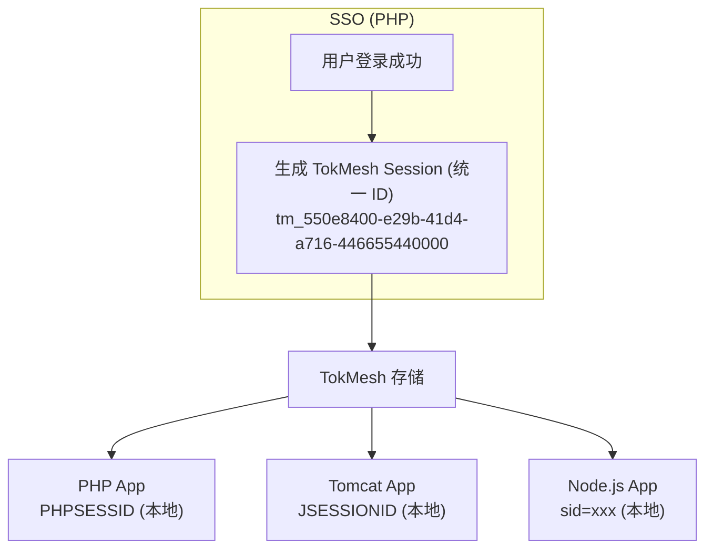
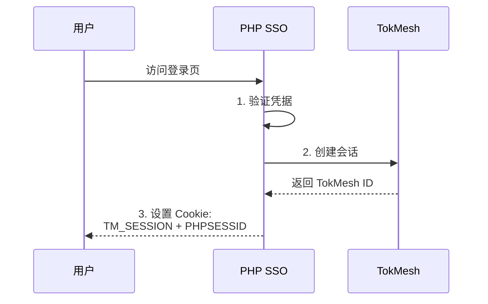
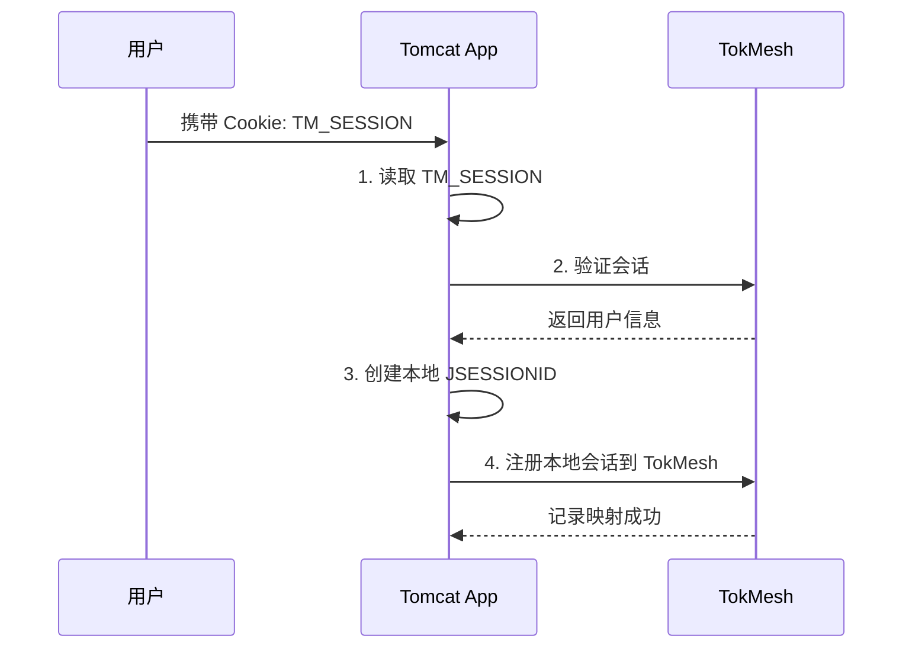
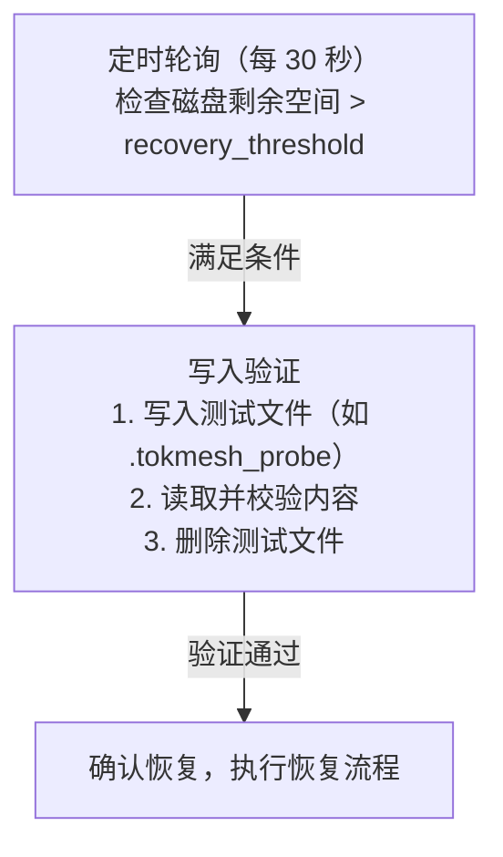

# RQ-254901 - 会话令牌存储引擎

状态: 已批准
优先级: P0（必须）
创建日期: 2025-12-06
批准日期: 2025-12-07
来源文档: CP-254901, CP-254902
审阅者: yangsen

## 需求来源

TokMesh 的核心定位是**会话/令牌缓存与校验加速器**，需要一个高性能的存储引擎作为基础。该引擎需要支持会话和令牌的高速存取、多维度索引、以及完整的持久化能力。

## 需求描述

### 1. 存储能力

#### 1.1 数据模型

支持两种核心数据类型：

**会话（Session）**：

| 字段 | 类型 | 必需 | 索引 | 长度限制 | 说明 |
|------|------|------|------|---------|------|
| session_id | string | 是 | 主键 | 64 字符 | 会话唯一标识（建议 UUID/ULID） |
| user_id | string | 是 | 二级 | 128 字符 | 用户唯一标识 |
| client_ip | string | 是 | 二级 | 45 字符 | IPv4(15) / IPv6(39) + 端口 |
| device_type | enum | 是 | 二级 | - | web/mobile/desktop/api/iot |
| device_id | string | 否 | - | 256 字符 | 设备唯一标识（可选） |
| user_agent | string | 否 | - | 2048 字符 | User-Agent 字符串 |
| session_type | enum | 否 | 二级 | - | normal/vip/admin，默认 normal |
| created_at | timestamp | 是 | - | - | 创建时间 |
| last_active_at | timestamp | 是 | - | - | 最后活跃时间 |
| expires_at | timestamp | 是 | - | - | 过期时间 |
| status | enum | 是 | - | - | active/expired/revoked |
| metadata | map | 否 | - | 4 KB | 业务扩展字段（整体大小限制） |

**令牌（Token）**：

| 字段 | 类型 | 必需 | 索引 | 长度限制 | 说明 |
|------|------|------|------|---------|------|
| token_id | string | 是 | 主键 | 64 字符 | 令牌 ID（jti） |
| token_hash | string | 是 | - | 64 字符 | SHA-256 摘要（十六进制） |
| session_id | string | 否 | 二级 | 64 字符 | 关联的会话 ID |
| user_id | string | 是 | 二级 | 128 字符 | 用户 ID |
| token_type | enum | 是 | 二级 | - | access/refresh/admin |
| scope | string | 否 | - | 1024 字符 | 权限范围（空格分隔） |
| issuer | string | 否 | - | 256 字符 | 签发方（域名或 URL） |
| issued_at | timestamp | 是 | - | - | 签发时间（iat） |
| expires_at | timestamp | 是 | - | - | 过期时间（exp） |
| status | enum | 是 | - | - | valid/revoked/expired |

#### 1.1.1 字段长度限制的设计依据

**标识符字段**（session_id, token_id, user_id）：
- **64-128 字符**：覆盖 UUID(36)、ULID(26)、自定义 ID 格式
- **性能考虑**：短 ID 减少内存占用和索引开销
- **安全考虑**：足够长度避免碰撞和猜测攻击

**IP 地址字段**：
- **45 字符**：IPv6 最长 39 字符，预留端口号空间（如 `[::1]:8080`）

**User-Agent 字段**：
- **2048 字符**：覆盖主流浏览器的 UA 长度（通常 < 1000 字符）
- **防护考虑**：限制过长 UA 导致的内存攻击

**Scope 字段**：
- **1024 字符**：支持多个作用域空格分隔（如 `read write admin:users`）
- **OAuth2 兼容**：符合 OAuth2 规范的 scope 长度

**Metadata 字段**：
- **4 KB 整体限制**：避免滥用扩展字段导致内存膨胀
- **序列化考虑**：JSON 序列化后的总大小

#### 1.1.2 长度超限处理

当输入字段超过长度限制时：
- **创建/更新操作**：返回 `INVALID_ARGUMENT` 错误，拒绝操作
- **错误信息**：明确指出哪个字段超限及限制值
- **示例**：`user_agent exceeds maximum length of 2048 characters`

#### 1.1.3 会话ID格式兼容性

**设计目标**：兼容主流 Web 开发框架的 SessionID 格式，降低迁移成本。

**常见框架 SessionID 格式**：

| 框架/语言 | 格式 | 典型长度 | 示例 |
|----------|------|---------|------|
| **UUID/GUID** | 十六进制+连字符 | 36 字符 | `550e8400-e29b-41d4-a716-446655440000` |
| **JSESSIONID** (Tomcat) | 十六进制 | 32 字符 | `5F4D0D8B9A0E1C2F3E4A5B6C7D8E9F0A` |
| **JSESSIONID** (集群) | 十六进制+路由 | 32-50 字符 | `5F4D0D8B9A0E1C2F3E4A5B6C7D8E9F0A.node1` |
| **Jetty** | 十六进制 | 32-48 字符 | `node0abc123def456...` |
| **JBoss/WildFly** | 十六进制+路由 | 32-50 字符 | `abc123def456.server1` |
| **ASP.NET** | Base64 编码 | 24 字符 | `j0HfCBlTGZwOb4bXMV7FQw==` |
| **WebLogic** | 自定义格式 | 52 字符 | `!1234567890123456789012345678901234567890123456!` |
| **PHP** (PHPSESSID) | 十六进制 | 26-32 字符 | `a1b2c3d4e5f6g7h8i9j0k1l2m3` |
| **Express.js** | Base64 编码 | 32 字符 | `s%3Ae7H4...` |
| **Django** | 十六进制 | 32 字符 | `a1b2c3d4e5f67890a1b2c3d4e5f67890` |
| **Flask** | Base64 编码 | 可变 | `eyJfcGVybWFuZW50Ijp0cnVlfQ...` |
| **Spring Session** | UUID 格式 | 36 字符 | `7e8f9a0b-1c2d-3e4f-5a6b-7c8d9e0f1a2b` |
| **Rails** | Base64 编码 | 32 字符 | `BAh7CEkiD3Nlc3Npb25faWQGOgZFVEki...` |

**TokMesh 支持策略**：

**1. 长度兼容**：
- 最大 64 字符覆盖所有常见框架
- 最短无限制（建议 ≥ 16 字符，安全性考虑）

**2. 格式兼容**：
- 支持任意字符集（UTF-8）
- 支持特殊字符（`-`, `_`, `!`, `=`, `%` 等）
- 不强制特定格式

**3. 推荐格式**（新系统）：
- **UUID v4**：`550e8400-e29b-41d4-a716-446655440000`（36字符）
- **ULID**：`01ARZ3NDEKTSV4RRFFQ69G5FAV`（26字符，时间排序友好）
- **自定义**：Base64(随机16字节) = 24字符

**4. 迁移兼容性**：

从现有系统迁移时，TokMesh 接受原系统的 SessionID 格式：

```json
{
  "session_id": "j0HfCBlTGZwOb4bXMV7FQw==",  // ASP.NET SessionID
  "user_id": "12345",
  ...
}
```

**5. 安全建议**：

| 长度范围 | 安全性 | 适用场景 |
|---------|--------|---------|
| < 16 字符 | ⚠️ 低 | 不推荐（易被猜测） |
| 16-24 字符 | ✅ 中 | 短期会话（如访问令牌） |
| 26-36 字符 | ✅ 高 | 长期会话（推荐） |
| > 36 字符 | ✅ 高 | 特殊安全需求 |

**验收标准补充**：
- [ ] 支持 UUID/GUID 格式（36字符）
- [ ] 支持 ASP.NET SessionID（24字符）
- [ ] 支持 Tomcat SessionID（32字符）
- [ ] 支持 WebLogic SessionID（52字符）
- [ ] 支持 PHP SessionID（26-32字符）
- [ ] 最大长度 64 字符限制生效
- [ ] 拒绝超过 64 字符的 SessionID

#### 1.2 索引能力

**主键索引**（哈希索引，O(1) 查询）：
- 会话 ID
- 令牌 ID

**二级索引**（支持范围查询）：
- 用户 ID → 会话列表 / 令牌列表
- IP 地址 → 会话列表（支持 CIDR 查询）
- 终端类型 → 会话列表
- 会话类型 → 会话列表
- 令牌类型 → 令牌列表

**复合索引**：
- 用户 ID + 终端类型
- 用户 ID + IP 地址

#### 1.3 存储容量

**目标规模**：
- 十万级在线会话 + 对应令牌

**内存占用估算**：

基于字段长度限制的内存占用估算（单条记录）：

| 对象 | 固定字段 | 可变字段（平均） | 索引开销 | 小计 |
|------|---------|---------------|---------|------|
| 会话 | 200 B | 500 B | 300 B | 1 KB |
| 令牌 | 150 B | 200 B | 200 B | 550 B |

**典型场景内存占用**：
- 10 万会话 + 20 万令牌：约 **210 MB**（数据 + 索引）
- 50 万会话 + 100 万令牌：约 **1 GB**
- 100 万会话 + 200 万令牌：约 **2 GB**

**可配置上限**：
- `max_sessions`：最大会话数（默认 1,000,000）
- `max_tokens`：最大令牌数（默认 2,000,000）
- `max_memory_bytes`：最大内存使用量（默认 4 GB）

#### 1.4 跨系统会话同步

**设计背景**：

在异构技术栈环境（如 PHP SSO + Tomcat 业务系统 + Node.js 微服务）中，各框架原生 SessionID 格式不同、长度不等：

| 框架 | SessionID 格式 | 长度 | 生成方式 |
|------|---------------|------|---------|
| PHP (PHPSESSID) | 十六进制 | 26-32 字符 | `session.hash_function` 配置 |
| Tomcat (JSESSIONID) | 十六进制 | 32 字符 | `SecureRandom` 生成 |
| ASP.NET | Base64 | 24 字符 | 加密 GUID |
| Node.js (Express) | Base64 | 32 字符 | `uid-safe` 生成 |

**核心矛盾**：
- 各框架**独立生成** SessionID，格式不统一
- 直接使用 PHPSESSID 或 JSESSIONID 作为 TokMesh 会话 ID 会导致**无法跨系统关联**

##### 1.4.1 统一会话 ID 设计

TokMesh 作为 SSO 会话中枢，**不直接使用**各框架原生 SessionID，而是：

1. **生成统一格式的 TokMesh SessionID**（推荐 UUID v4）
2. **各业务系统通过 Cookie 或 Header 传递该 ID**
3. **本地 SessionID（PHPSESSID、JSESSIONID 等）仅用于本地状态管理**

**架构示意**：



##### 1.4.2 会话对象扩展字段

为支持跨系统会话同步，会话对象增加以下字段：

| 字段 | 类型 | 必需 | 索引 | 长度限制 | 说明 |
|------|------|------|------|---------|------|
| local_sessions | array | 否 | - | 10 条 | 关联的本地会话列表 |

**local_sessions 子对象**：

| 字段 | 类型 | 必需 | 说明 |
|------|------|------|------|
| system | string | 是 | 系统标识（如 `tomcat-app1`） |
| local_id | string | 是 | 本地 SessionID |
| registered_at | timestamp | 是 | 注册时间 |

**说明**：
- `sso_origin`、`sso_session_id` 等来源信息如需记录，可存入 `metadata` 扩展字段
- 通过 API Key 身份可隐式确定调用来源

**示例**：

```json
{
  "session_id": "tm_550e8400-e29b-41d4-a716-446655440000",
  "user_id": "12345",
  "metadata": {
    "sso_origin": "php-sso",
    "sso_session_id": "a1b2c3d4e5f6g7h8i9j0k1l2m3"
  },
  "local_sessions": [
    {"system": "php-sso", "local_id": "a1b2c3d4e5f6g7h8i9j0k1l2m3", "registered_at": "..."},
    {"system": "tomcat-app1", "local_id": "5F4D0D8B9A0E1C2F3E4A5B6C7D8E9F0A", "registered_at": "..."},
    {"system": "node-gateway", "local_id": "s%3Ae7H4abc123...", "registered_at": "..."}
  ]
}
```

##### 1.4.3 会话传递机制

| 方式 | 适用场景 | 配置 | 安全性 |
|------|---------|------|--------|
| **Cookie** | 同域/子域 | `TM_SESSION` Cookie，Domain 设为顶级域 | ✅ 高 |
| **Header** | 跨域 API 调用 | `X-TokMesh-Session` Header | ✅ 高 |
| **URL 参数** | 跨域跳转（一次性） | `?tm_session=xxx`，需二次验证 | ⚠️ 中 |

**Cookie 配置示例**：

```
Set-Cookie: TM_SESSION=tm_550e8400-e29b-41d4-a716-446655440000;
            Domain=.example.com;
            Path=/;
            HttpOnly;
            Secure;
            SameSite=Lax;
            Max-Age=3600
```

##### 1.4.4 跨系统会话同步流程

**用户首次访问 PHP SSO 登录**：



**用户访问 Tomcat 业务系统**：



##### 1.4.5 单点登出（SLO）说明

**TokMesh 职责边界**：

TokMesh 定位为「缓存与校验加速器」，**不负责**单点登出的协调通知。

| 职责 | 负责方 | 说明 |
|------|-------|------|
| 删除 TokMesh 会话 | SSO 系统 | 调用 TokMesh 管理 API |
| 通知业务端清理本地会话 | SSO 系统 | SSO 自行实现 Webhook/消息队列 |
| 校验时发现会话失效 | TokMesh | 返回 `SESSION_NOT_FOUND` |

**被动失效机制**：

业务端每次请求都会调用 TokMesh 校验，当会话被删除后：
1. TokMesh 返回 `SESSION_NOT_FOUND`
2. 业务端清理本地 Session（JSESSIONID 等）
3. 引导用户重新登录

**延迟分析**：
- 被动失效延迟 = 业务端校验间隔（通常每次请求都校验，延迟 < 1 秒）
- 对于安全敏感场景，SSO 可自行实现主动通知

#### 1.5 内存驱逐策略

当内存使用达到上限时，采用以下驱逐策略：

**优先级驱逐（默认）**：
1. 优先清理已过期但未删除的数据
2. 按 TTL 剩余时间排序，清理即将过期的数据
3. 按最后访问时间排序，清理长期未活跃的会话（LRU）

**配置选项**：
- `eviction_policy`：驱逐策略
  - `ttl-first`：优先清理即将过期的数据（默认）
  - `lru`：最近最少使用（Least Recently Used）
  - `reject`：拒绝新写入，返回 `RESOURCE_EXHAUSTED` 错误
- `eviction_threshold`：触发驱逐的内存使用百分比（默认 90%）
- `eviction_target`：驱逐后的目标内存使用百分比（默认 80%）

**驱逐保护**：
- VIP 用户会话优先级高于普通用户
- 管理员会话不参与驱逐（除非已过期）
- 正在活跃的会话（最近 5 分钟内访问）优先级高于长期未活跃会话

### 2. TTL 管理

#### 2.1 默认 TTL 配置

**会话（Session）默认 TTL**：

| 会话类型 | TTL | Sliding | Max TTL | 说明 |
|---------|-----|---------|---------|------|
| normal（普通） | 1 小时 | 是 | 24 小时 | Web/移动端标准会话 |
| vip（VIP） | 2 小时 | 是 | 48 小时 | VIP 用户延长时限 |
| admin（管理员） | 30 分钟 | 否 | - | 安全优先，固定过期 |

**令牌（Token）默认 TTL**：

| 令牌类型 | TTL | Sliding | 说明 |
|---------|-----|---------|------|
| access（访问） | 15 分钟 | 否 | 短期访问令牌（OAuth2 推荐） |
| refresh（刷新） | 7 天 | 否 | 长期刷新令牌 |
| admin（管理） | 5 分钟 | 否 | 管理操作令牌，安全优先 |

**设计依据**：
- **普通会话 1 小时**：行业标准，平衡安全性和用户体验
- **访问令牌 15 分钟**：参考 OAuth2 最佳实践（5-30 分钟）
- **刷新令牌 7 天**：减少频繁登录，常见移动应用配置
- **管理令牌 5 分钟**：高权限操作，最小化风险窗口
- **Sliding TTL**：仅用于会话（保持用户登录），令牌不滑动（明确有效期）

**配置示例**：
```yaml
ttl:
  session:
    normal:
      ttl: 3600s        # 1 小时
      sliding: true
      max_ttl: 86400s   # 24 小时
    vip:
      ttl: 7200s        # 2 小时
      sliding: true
      max_ttl: 172800s  # 48 小时
    admin:
      ttl: 1800s        # 30 分钟
      sliding: false
  token:
    access:
      ttl: 900s         # 15 分钟
      sliding: false
    refresh:
      ttl: 604800s      # 7 天
      sliding: false
    admin:
      ttl: 300s         # 5 分钟
      sliding: false
```

#### 2.2 TTL 约束

**强制要求**：
- 所有会话和令牌**必须**设置 TTL
- 最小 TTL：1 分钟（60 秒）
- 最大 TTL：90 天（7,776,000 秒）
- **不支持**永不过期的会话/令牌

**设计依据**：
- TokMesh 定位为「缓存加速器」，缓存数据必须可重建
- 永久令牌应由 SSO 系统数据库（MySQL/PostgreSQL）管理
- 90 天上限覆盖 Refresh Token 等长周期令牌场景

#### 2.3 固定 TTL（Fixed TTL）
- 创建时设定过期时间
- 到期自动标记为过期
- 适用于：访问令牌、管理会话

#### 2.4 滑动 TTL（Sliding TTL）
- 每次访问自动延长过期时间
- 支持配置最大 TTL 上限（防止无限延长）
- 适用于：普通/VIP 会话

#### 2.5 分级 TTL（Tiered TTL）
- 按用户类型配置不同 TTL
- 按令牌类型配置不同 TTL
- 按终端类型配置不同 TTL（可选）

#### 2.6 过期清理

**渐进式清理**：
- 后台线程定期扫描过期数据
- 每次清理一小批（可配置，如 1000 条）
- 清理间隔可配置（如 100ms）

**懒惰删除**：
- 访问时检查是否过期
- 过期则立即删除并返回"未找到"

**随机 TTL 抖动**：
- 在设定的 TTL 基础上增加随机偏移（如 ±5%）
- 避免大量会话同时过期

### 3. 持久化

#### 3.1 WAL（Write-Ahead Log）

**基本机制**：
- 所有写操作先写入 WAL 日志
- 支持同步写入（fsync）和异步写入
- 日志文件轮转（按大小或时间）
- 启动时从 WAL 恢复数据

**日志格式**：

采用 **Protobuf 二进制格式**，为未来集群扩展做准备：

```protobuf
message WALEntry {
  uint64 sequence = 1;      // 序列号（单调递增）
  int64 timestamp_ns = 2;   // 纳秒时间戳
  OpType op_type = 3;       // 操作类型
  bytes key = 4;            // 主键（session_id 或 token_id）
  bytes value = 5;          // 序列化后的对象（仅 SET/UPDATE）
  uint32 crc32 = 6;         // 校验和（防止数据损坏）
}

enum OpType {
  SET = 0;      // 创建/覆盖
  DELETE = 1;   // 删除
  EXPIRE = 2;   // 过期清理（用于审计追踪）
}
```

**格式选型依据**：

| 考量 | Protobuf 优势 |
|------|--------------|
| 集群复制效率 | 体积比 JSON 小 50%，网络带宽减半 |
| 解析性能 | 比 JSON 快 5 倍，Slave 追赶更快 |
| 版本兼容 | 字段编号机制，支持滚动升级 |
| 确定性序列化 | Raft 日志比较需要稳定字节序 |
| 生态对齐 | 与 etcd、TiKV 等主流实现一致 |

**调试支持**：

WAL 为二进制格式，通过 `tokmesh-cli` 命令行工具提供可读导出：

```bash
# 导出 WAL 为 JSON（调试用）
tokmesh-cli wal export --input /var/lib/tokmesh/wal/0001.wal --output wal.json

# 查看 WAL 摘要
tokmesh-cli wal inspect --input /var/lib/tokmesh/wal/0001.wal

# 验证 WAL 完整性
tokmesh-cli wal verify --dir /var/lib/tokmesh/wal/
```

**刷盘策略**：

```yaml
wal:
  fsync_mode: everysec    # none / everysec / always
  # none: 完全由 OS 决定（开发环境）
  # everysec: 每秒刷盘（默认，最多丢失 1 秒数据）
  # always: 每次写操作都 fsync（极高持久性要求）

  batch_size: 1000        # 批量写入条数
  batch_timeout: 100ms    # 批量写入超时（达到任一条件即刷盘）
```

#### 3.2 快照（Snapshot）

**基本机制**：
- 定期生成全量快照
- 快照与 WAL 配合实现快速恢复
- 快照完成后可清理旧 WAL 文件

**快照格式**：

与 WAL 保持一致，采用 **Protobuf 二进制格式**：

```protobuf
message Snapshot {
  uint64 version = 1;           // 快照格式版本（用于兼容性）
  uint64 wal_sequence = 2;      // 对应的 WAL 序列号（恢复起点）
  int64 timestamp_ns = 3;       // 快照生成时间
  repeated Session sessions = 4;
  repeated Token tokens = 5;
  SnapshotMeta meta = 6;
}

message SnapshotMeta {
  uint64 session_count = 1;
  uint64 token_count = 2;
  uint32 checksum = 3;          // 整体校验和（CRC32）
}
```

**触发条件**：

```yaml
snapshot:
  # 定时触发
  interval: 1h

  # 变更数量触发
  wal_threshold: 10000    # WAL 条目数达到阈值

  # 两者满足任一即触发，取先到者
```

**手动触发**：

```bash
# 立即生成快照
tokmesh-cli snapshot create

# 查看快照列表
tokmesh-cli snapshot list

# 查看快照摘要
tokmesh-cli snapshot inspect --input /var/lib/tokmesh/snapshots/1701936000.snap

# 导出快照为 JSON（调试用）
tokmesh-cli snapshot export --input snapshot.snap --output snapshot.json
```

**快照隔离（不阻塞写入）**：

快照生成期间不阻塞写操作，采用快照隔离机制：

```
时间线：
|-------- 快照进行中 --------|
         ↓ 记录 wal_sequence = S
[WAL] ..., S-1, S, S+1, S+2, S+3 ...
                 ↑ 新写入继续进入 WAL

快照内容：截至序列号 S 的数据状态
恢复时：加载快照 → 重放 S+1, S+2, S+3 ...
```

**实现要点**：
1. 快照开始时记录当前 WAL 序列号 `S`
2. 遍历内存数据，序列化写入快照文件
3. 期间新写入正常进入 WAL（序列号 > S）
4. 快照完成，文件头记录 `wal_sequence = S`
5. 恢复时：加载快照 → 重放序列号 > S 的 WAL 条目

**并发控制**：
- 快照遍历使用读锁（或无锁快照读）
- 写操作使用细粒度锁（单记录级别）
- 快照期间写入性能无明显下降

#### 3.3 WAL 保留策略

```yaml
wal:
  retention:
    max_disk_usage: 300MB   # WAL 文件总大小上限（默认）
```

**清理逻辑**：
1. 当 WAL 总大小超过 `max_disk_usage` 时触发清理
2. 从最旧的 WAL 文件开始删除
3. **保护规则**：至少保留最近一个快照之后的 WAL（确保可恢复）

**典型场景估算**（500 在线用户、30 业务系统）：

| 时间范围 | WAL 大小 | 说明 |
|---------|---------|------|
| 1 天 | ~3 MB | 日常运行 |
| 1 周 | ~20 MB | - |
| 1 个月 | ~80 MB | - |
| 300 MB 上限 | ~3 个月 | 足够回溯 |

#### 3.4 磁盘空间不足处理

**分级处理策略**：

| 磁盘剩余 | 状态 | 行为 |
|---------|------|------|
| > 20% | 正常 | 正常运行 |
| 10%-20% | 告警 | 告警 + 强制触发快照 + 清理旧 WAL |
| < 10% | 降级 | 告警 + 降级为纯内存模式 |

**配置**：

```yaml
storage:
  disk:
    warning_threshold: 20%      # 告警阈值
    critical_threshold: 10%     # 降级阈值
    fallback_mode: memory       # 降级模式：memory（纯内存）/ readonly（只读）
```

**降级模式说明**：

| 模式 | 行为 | 风险 |
|------|------|------|
| `memory` | 停止 WAL 写入，继续接受请求 | 重启后丢失降级期间的数据 |
| `readonly` | 拒绝写入，只允许读取和校验 | 新会话无法创建 |

**恢复检测机制**：

采用**定时轮询 + 写入验证**双重确认：



**设计依据**：
- `statfs` 返回空间充足，但磁盘可能仍不可写（只读挂载、权限问题等）
- 写入验证确保实际可写后再恢复，避免恢复后立即再次降级

**恢复流程**：

当检测通过后：

```
1. 立即生成全量快照（当前内存状态）
2. 重置 WAL 序列号（从快照序列号 + 1 开始）
3. 恢复 WAL 写入
4. 退出降级模式
5. 记录恢复事件到审计日志
```

**完整配置**：

```yaml
storage:
  disk:
    warning_threshold: 20%      # 告警阈值
    critical_threshold: 10%     # 降级阈值
    recovery_threshold: 25%     # 恢复阈值（高于降级阈值，避免反复切换）
    check_interval: 30s         # 磁盘空间检查间隔
    fallback_mode: memory       # 降级模式：memory / readonly
```

**阈值设计说明**：
- `recovery_threshold` > `critical_threshold`：形成滞回区间，避免磁盘空间在临界值附近时频繁切换模式

#### 3.5 持久化失败处理

**故障类型与处理策略**：

| 故障 | 处理 | 告警级别 |
|------|------|---------|
| WAL 写入失败 | 重试 3 次 → 失败则降级为纯内存模式 | Critical |
| WAL 校验失败（恢复时） | 跳过损坏条目，继续恢复 | Warning |
| 快照写入失败 | 重试 → 失败则保留旧快照 | Error |
| 快照校验失败（恢复时） | 尝试加载上一个快照 | Error |
| 所有快照损坏 | 从空状态启动（丢失数据） | Critical |

**配置**：

```yaml
storage:
  error_handling:
    wal_write_retries: 3              # WAL 写入重试次数
    skip_corrupted_wal: true          # 恢复时跳过损坏的 WAL 条目
    fallback_to_older_snapshot: true  # 快照损坏时尝试旧快照
```

**数据丢失场景说明**：

TokMesh 定位为「缓存加速器」，数据可从 SSO 重建：
- WAL 条目损坏：丢失单条操作，影响范围小
- 快照损坏：回退到旧快照 + WAL 重放，可能丢失部分数据
- 全部损坏：从空状态启动，用户重新登录即可恢复

#### 3.6 恢复流程

1. 加载最近的快照（校验失败则尝试上一个）
2. 重放快照之后的 WAL 日志（跳过损坏条目）
3. 清理过期数据
4. 服务就绪

### 4. 性能要求

| 操作 | 性能目标 |
|------|---------|
| 单键查询（GET） | P99 < 0.5ms |
| 单键写入（SET） | P99 < 1ms |
| 批量查询（MGET） | P99 < 2ms（100 keys） |
| 批量写入（MSET） | P99 < 5ms（100 keys） |
| 二级索引查询 | P99 < 2ms |
| 整体 QPS | 10万+ QPS（单节点） |

### 4.5 并发控制

#### 4.5.1 读写并发模型

采用**单写多读**模型（参考 Redis）：

- **写操作**：单线程序列化执行
  - 所有写操作通过命令队列序列化
  - 避免锁竞争，保证写入顺序
  - 写操作包括：创建、更新、删除、TTL 修改

- **读操作**：多线程并发执行
  - 读操作无锁或使用读写锁
  - 允许多个读操作并发访问
  - 读操作包括：GET、批量查询、索引查询

#### 4.5.2 数据一致性保证

- **写后读一致性**：写操作完成后，后续读操作立即可见
- **快照隔离**：读操作看到一致性快照，不受写操作影响
- **索引更新原子性**：数据和索引的更新在同一写事务中完成

#### 4.5.3 并发冲突处理

- **会话 ID 冲突**：创建时检查主键冲突，返回 `ALREADY_EXISTS` 错误
- **并发更新**：后到的写操作覆盖先前的写操作（Last-Write-Wins）
- **并发删除**：删除不存在的键返回成功（幂等性）

### 5. 部署模式（MVP）

- **单节点模式**：MVP 阶段仅支持单节点部署
- **后续规划**：主从复制 → 分布式集群（Raft）

## 验收标准

### 功能验收

1. [ ] 支持会话和令牌的 CRUD 操作
2. [ ] 支持主键索引和二级索引查询
3. [ ] 支持三种 TTL 模型（固定/滑动/分级）
4. [ ] 支持渐进式过期清理
5. [ ] 支持 WAL 日志持久化
6. [ ] 支持快照持久化
7. [ ] 支持故障恢复（从 WAL + 快照恢复）
8. [ ] 字段长度验证：超限字段拒绝写入并返回明确错误
9. [ ] 跨系统会话同步：支持 sso_origin、local_sessions 扩展字段
10. [ ] 本地会话注册：业务系统可注册本地 SessionID 映射

### 性能验收

1. [ ] 单键查询 P99 < 0.5ms
2. [ ] 单键写入 P99 < 1ms
3. [ ] 整体 QPS 达到 10万+（校验操作）
4. [ ] 内存占用符合预期（十万会话 < 500MB）

### 可靠性验收

1. [ ] 进程重启后数据不丢失
2. [ ] 模拟故障后可正常恢复
3. [ ] 过期数据能被正确清理

## 非功能约束

- **内存优先**：热数据全部在内存，不做冷热分离（MVP 阶段）
- **单线程写入**：写操作序列化，避免锁竞争（参考 Redis 模型）
- **读写分离**：读操作可并发，写操作序列化

## 相关设计

- 待创建：D001 - 存储引擎架构设计

## 相关需求

- RQ-254902 - 业务校验 API（依赖本需求）
- RQ-254903 - 管理 API（依赖本需求）

---

*本文档定义了 TokMesh 存储引擎的核心需求，是后续 API 和功能实现的基础。*
