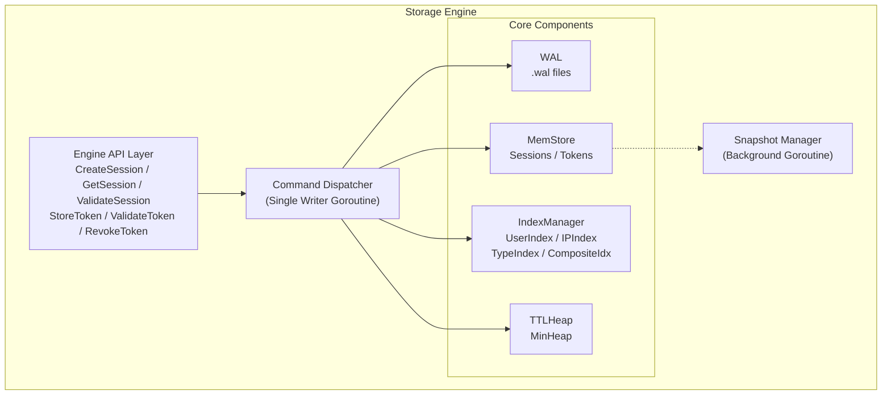
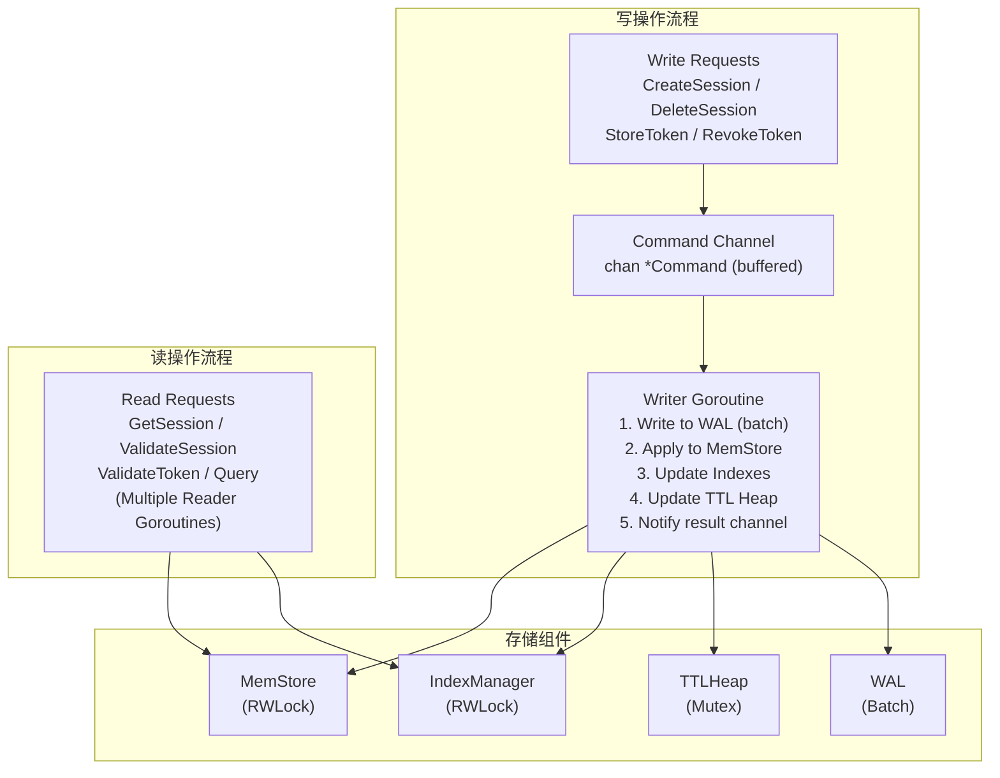
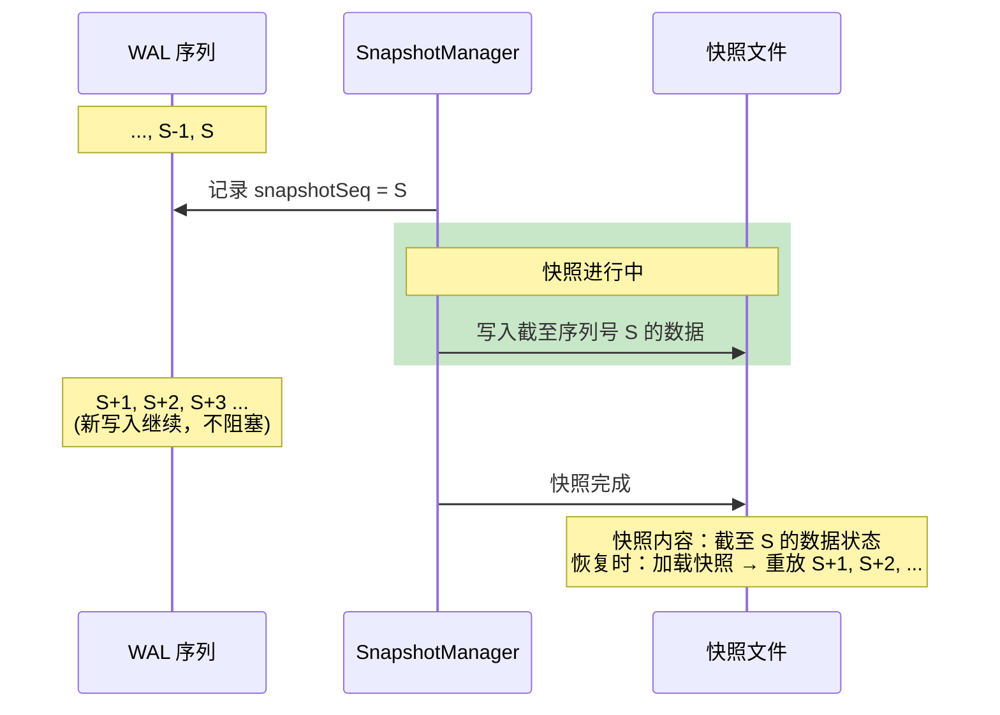
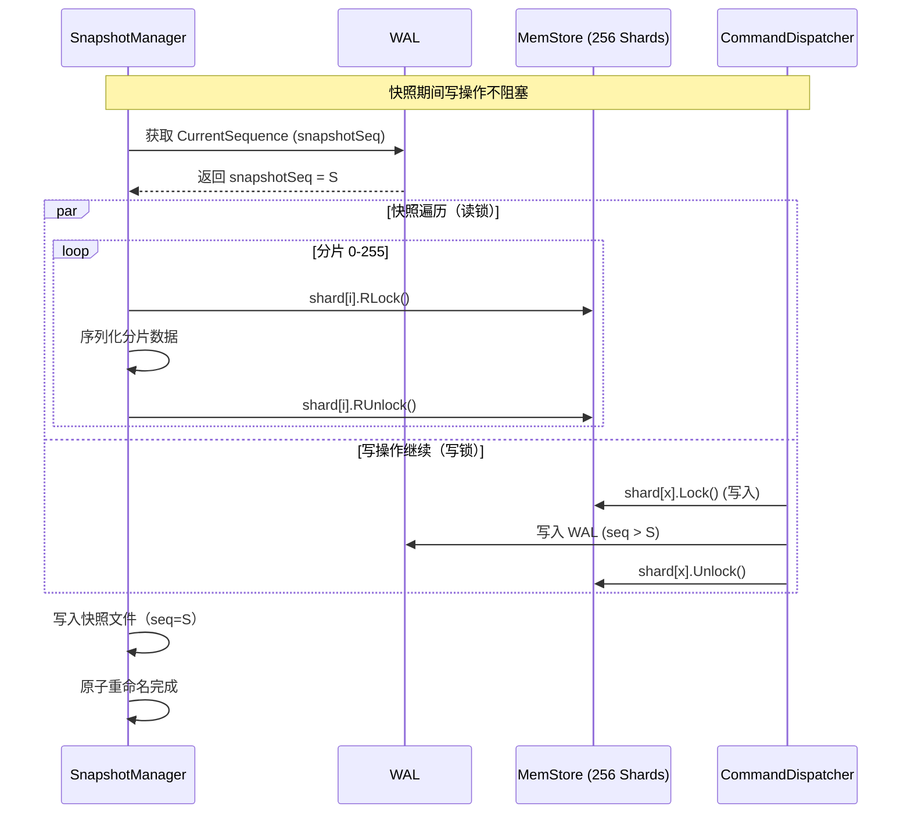
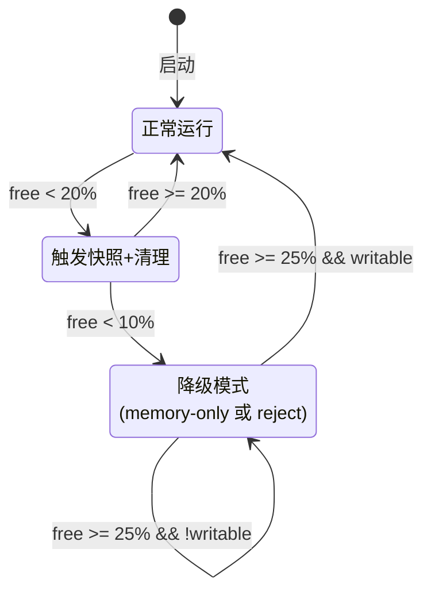
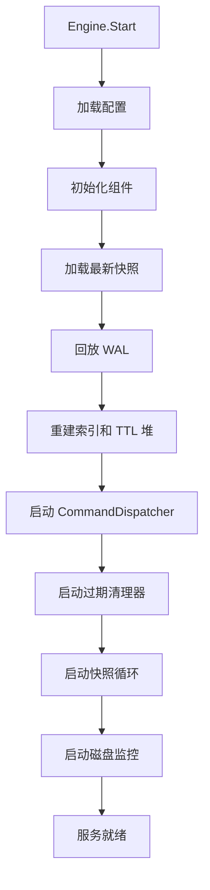
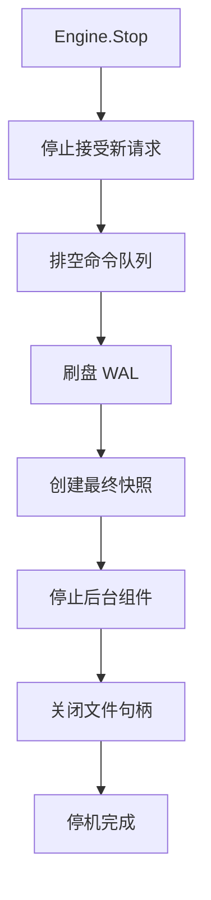

# DN-254901 - 会话令牌存储引擎架构设计

状态: 已批准
优先级: P0（必须）
创建日期: 2025-12-07
批准日期: 2025-12-07
关联需求: RQ-254901
设计者: AI 设计代理
审阅者: yangsen

---

## 1. 概述

### 1.1 设计目标

本设计文档定义 TokMesh 核心存储引擎的技术实现方案。该引擎是 TokMesh 的基础设施层，为上层业务 API（RQ-254902）和管理 API（RQ-254903）提供高性能的会话/令牌存储能力。

**核心目标**：

| 目标 | 指标 | 说明 |
|------|------|------|
| 高性能读取 | P99 < 0.5ms | 校验操作为核心路径 |
| 高性能写入 | P99 < 1ms | 包含 WAL 持久化 |
| 高吞吐量 | 10万+ QPS | 单节点目标 |
| 数据可靠 | 最多丢失 1 秒 | everysec 刷盘策略 |
| 快速恢复 | < 30 秒 | 百万级数据恢复 |

### 1.2 设计原则

1. **简单优先**：采用成熟的设计模式，避免过度工程
2. **Go 原生**：充分利用 Go 标准库，减少外部依赖
3. **可测试性**：核心模块可独立测试，接口清晰
4. **渐进式复杂度**：MVP 阶段实现核心功能，为后续扩展预留接口

### 1.3 架构总览



**核心组件**：

| 组件 | 职责 | 并发模型 |
|------|------|---------|
| Engine API Layer | 对外暴露存储引擎接口 | 多 goroutine 并发调用 |
| Command Dispatcher | 序列化写操作，保证一致性 | 单 goroutine |
| MemStore | 内存数据存储（会话/令牌） | 分片锁读写 |
| IndexManager | 二级索引管理 | 随主数据更新 |
| TTLHeap | 过期时间最小堆 | 单 goroutine 扫描 |
| WAL | 写前日志持久化 | 批量异步刷盘 |
| Snapshot Manager | 快照生成与恢复 | 后台 goroutine |

---

## 2. 数据结构设计

### 2.1 核心数据模型

#### 2.1.1 会话结构 (Session)

```go
// Session 表示一个用户会话
type Session struct {
    // 主键
    SessionID string `json:"session_id"` // 最大 64 字符

    // 核心字段
    UserID     string     `json:"user_id"`      // 最大 128 字符
    ClientIP   string     `json:"client_ip"`    // 最大 45 字符
    DeviceType DeviceType `json:"device_type"`  // web/mobile/desktop/api/iot
    DeviceID   string     `json:"device_id"`    // 最大 256 字符，可选
    UserAgent  string     `json:"user_agent"`   // 最大 2048 字符，可选

    // 会话类型与状态
    SessionType SessionType `json:"session_type"` // normal/vip/admin
    Status      Status      `json:"status"`       // active/expired/revoked

    // 时间戳
    CreatedAt    int64 `json:"created_at"`     // Unix 纳秒
    LastActiveAt int64 `json:"last_active_at"` // Unix 纳秒
    ExpiresAt    int64 `json:"expires_at"`     // Unix 纳秒

    // TTL 配置
    TTLConfig TTLConfig `json:"ttl_config"`

    // 扩展字段
    LocalSessions []LocalSession     `json:"local_sessions,omitempty"` // 最多 10 条
    Metadata      map[string]string  `json:"metadata,omitempty"`       // 最大 4KB

    // 安全相关（可选）
    DeviceFingerprint string `json:"device_fingerprint,omitempty"` // SHA-256
    CSRFTokenHash     string `json:"csrf_token_hash,omitempty"`
    CSRFExpiresAt     int64  `json:"csrf_expires_at,omitempty"`

    // 内部字段（不序列化）
    version   uint64 // 乐观锁版本号
    heapIndex int    // TTL 堆中的索引位置
}

// TTLConfig 存储 TTL 配置
type TTLConfig struct {
    TTL      int64 `json:"ttl"`       // TTL 秒数
    Sliding  bool  `json:"sliding"`   // 是否滑动 TTL
    MaxTTL   int64 `json:"max_ttl"`   // 最大 TTL（滑动时有效）
    OriginalExpiresAt int64 `json:"original_expires_at"` // 首次过期时间
}

// LocalSession 表示关联的本地会话
type LocalSession struct {
    System       string `json:"system"`        // 系统标识
    LocalID      string `json:"local_id"`      // 本地 SessionID
    RegisteredAt int64  `json:"registered_at"` // 注册时间
}
```

#### 2.1.2 令牌结构 (Token)

```go
// Token 表示一个令牌
type Token struct {
    // 主键
    TokenID   string `json:"token_id"`   // 最大 64 字符（jti）
    TokenHash string `json:"token_hash"` // SHA-256，64 字符

    // 关联
    SessionID string `json:"session_id,omitempty"` // 关联的会话 ID
    UserID    string `json:"user_id"`              // 用户 ID

    // 令牌属性
    TokenType TokenType `json:"token_type"` // access/refresh/admin
    Scope     string    `json:"scope"`      // 最大 1024 字符
    Issuer    string    `json:"issuer"`     // 最大 256 字符

    // 时间戳
    IssuedAt  int64 `json:"issued_at"`  // Unix 纳秒
    ExpiresAt int64 `json:"expires_at"` // Unix 纳秒

    // 状态
    Status Status `json:"status"` // valid/revoked/expired

    // 内部字段
    version   uint64
    heapIndex int
}
```

#### 2.1.3 枚举类型定义

```go
type DeviceType uint8

const (
    DeviceTypeWeb DeviceType = iota
    DeviceTypeMobile
    DeviceTypeDesktop
    DeviceTypeAPI
    DeviceTypeIoT
)

type SessionType uint8

const (
    SessionTypeNormal SessionType = iota
    SessionTypeVIP
    SessionTypeAdmin
)

type TokenType uint8

const (
    TokenTypeAccess TokenType = iota
    TokenTypeRefresh
    TokenTypeAdmin
)

type Status uint8

const (
    StatusActive Status = iota
    StatusExpired
    StatusRevoked
)
```

### 2.2 内存存储结构 (MemStore)

采用 **分片 Map + 读写锁** 架构，平衡并发性能和实现复杂度。

#### 2.2.1 分片设计

```go
const (
    // 分片数量，必须是 2 的幂次
    NumShards = 256

    // 分片掩码
    ShardMask = NumShards - 1
)

// MemStore 是分片的内存存储
type MemStore struct {
    sessionShards [NumShards]*SessionShard
    tokenShards   [NumShards]*TokenShard

    // 统计信息
    stats *StoreStats
}

// SessionShard 单个会话分片
type SessionShard struct {
    mu       sync.RWMutex
    sessions map[string]*Session // key: SessionID
}

// TokenShard 单个令牌分片
type TokenShard struct {
    mu     sync.RWMutex
    tokens map[string]*Token // key: TokenID
}
```

#### 2.2.2 分片路由算法

使用 FNV-1a 哈希的高性能分片路由：

```go
// getShard 返回 key 对应的分片索引
func getShard(key string) uint32 {
    h := fnv.New32a()
    h.Write([]byte(key))
    return h.Sum32() & ShardMask
}

// 或使用更快的内联实现
func getShardFast(key string) uint32 {
    var h uint32 = 2166136261 // FNV offset basis
    for i := 0; i < len(key); i++ {
        h ^= uint32(key[i])
        h *= 16777619 // FNV prime
    }
    return h & ShardMask
}
```

#### 2.2.3 分片数量选择依据

| 分片数 | 锁竞争概率 | 内存开销 | 适用场景 |
|--------|-----------|---------|---------|
| 64 | 较高 | 低 | < 10 万数据 |
| **256** | 低 | 中等 | 10-100 万数据（推荐） |
| 1024 | 极低 | 较高 | > 100 万数据 |

选择 256 分片的理由：
- 256 分片下，100 万条数据平均每分片 3900 条
- 单分片锁持有时间 < 1μs，锁竞争概率极低
- 内存开销约 256 * 48 bytes = 12KB（可忽略）

### 2.3 索引结构设计 (IndexManager)

#### 2.3.1 索引类型

```go
// IndexManager 管理所有二级索引
type IndexManager struct {
    // 会话索引
    userSessionIdx    *ShardedIndex // UserID -> []SessionID
    ipSessionIdx      *IPIndex      // ClientIP -> []SessionID（支持 CIDR 查询）
    deviceTypeIdx     *TypeIndex    // DeviceType -> []SessionID
    sessionTypeIdx    *TypeIndex    // SessionType -> []SessionID

    // 复合索引
    userDeviceIdx     *CompositeIndex // UserID+DeviceType -> []SessionID
    userIPIdx         *CompositeIndex // UserID+ClientIP -> []SessionID

    // 令牌索引
    userTokenIdx      *ShardedIndex // UserID -> []TokenID
    sessionTokenIdx   *ShardedIndex // SessionID -> []TokenID
    tokenTypeIdx      *TypeIndex    // TokenType -> []TokenID
}

// NewIndexManager 创建索引管理器
func NewIndexManager() *IndexManager {
    return &IndexManager{
        userSessionIdx:  NewShardedIndex(),
        ipSessionIdx:    NewIPIndex(),  // 使用 IPIndex 支持 CIDR
        deviceTypeIdx:   NewTypeIndex(5), // 5 种设备类型
        sessionTypeIdx:  NewTypeIndex(3), // 3 种会话类型
        userDeviceIdx:   NewCompositeIndex(),
        userIPIdx:       NewCompositeIndex(),
        userTokenIdx:    NewShardedIndex(),
        sessionTokenIdx: NewShardedIndex(),
        tokenTypeIdx:    NewTypeIndex(3), // 3 种令牌类型
    }
}

// ShardedIndex 分片的倒排索引
type ShardedIndex struct {
    shards [NumShards]*IndexShard
}

type IndexShard struct {
    mu    sync.RWMutex
    index map[string]*IDSet // 索引键 -> ID 集合
}

// IDSet 高效的 ID 集合（使用 map 模拟 set）
type IDSet struct {
    ids map[string]struct{}
}

// TypeIndex 枚举类型索引（固定数量的桶）
type TypeIndex struct {
    mu      sync.RWMutex
    buckets []*IDSet // 下标即枚举值
}

// CompositeIndex 复合索引
type CompositeIndex struct {
    shards [NumShards]*IndexShard
}

// buildCompositeKey 构建复合索引键
func buildCompositeKey(parts ...string) string {
    return strings.Join(parts, "\x00")
}
```

#### 2.3.2 索引操作

```go
// Add 添加索引条目
func (idx *ShardedIndex) Add(indexKey, id string) {
    shard := idx.shards[getShard(indexKey)]
    shard.mu.Lock()
    defer shard.mu.Unlock()

    if shard.index[indexKey] == nil {
        shard.index[indexKey] = NewIDSet()
    }
    shard.index[indexKey].Add(id)
}

// RemoveFromIndex 移除索引条目
func (idx *ShardedIndex) Remove(indexKey, id string) {
    shard := idx.shards[getShard(indexKey)]
    shard.mu.Lock()
    defer shard.mu.Unlock()

    if set := shard.index[indexKey]; set != nil {
        set.Remove(id)
        if set.Len() == 0 {
            delete(shard.index, indexKey)
        }
    }
}

// Lookup 查询索引
func (idx *ShardedIndex) Lookup(indexKey string) []string {
    shard := idx.shards[getShard(indexKey)]
    shard.mu.RLock()
    defer shard.mu.RUnlock()

    if set := shard.index[indexKey]; set != nil {
        return set.ToSlice()
    }
    return nil
}
```

#### 2.3.3 索引一致性保证

索引更新与主数据更新在同一个写事务中完成：

```go
// updateSessionWithIndex 原子更新会话和索引
func (e *Engine) updateSessionWithIndex(old, new *Session) {
    // 1. 移除旧索引
    if old != nil {
        e.indexMgr.RemoveSessionIndexes(old)
    }

    // 2. 更新主数据
    e.memStore.PutSession(new)

    // 3. 添加新索引
    e.indexMgr.AddSessionIndexes(new)
}

// AddSessionIndexes 添加会话的所有索引
func (m *IndexManager) AddSessionIndexes(session *Session) {
    sessionID := session.SessionID

    // 用户索引
    m.userSessionIdx.Add(session.UserID, sessionID)

    // IP 索引（使用 IPIndex 支持 CIDR 查询）
    m.ipSessionIdx.Add(session.ClientIP, sessionID)

    // 设备类型索引
    m.deviceTypeIdx.Add(int(session.DeviceType), sessionID)

    // 会话类型索引
    m.sessionTypeIdx.Add(int(session.SessionType), sessionID)

    // 复合索引
    m.userDeviceIdx.Add(buildCompositeKey(session.UserID, fmt.Sprintf("%d", session.DeviceType)), sessionID)
    m.userIPIdx.Add(buildCompositeKey(session.UserID, session.ClientIP), sessionID)
}

// RemoveSessionIndexes 移除会话的所有索引
func (m *IndexManager) RemoveSessionIndexes(session *Session) {
    sessionID := session.SessionID

    // 用户索引
    m.userSessionIdx.Remove(session.UserID, sessionID)

    // IP 索引
    m.ipSessionIdx.Remove(session.ClientIP, sessionID)

    // 设备类型索引
    m.deviceTypeIdx.Remove(int(session.DeviceType), sessionID)

    // 会话类型索引
    m.sessionTypeIdx.Remove(int(session.SessionType), sessionID)

    // 复合索引
    m.userDeviceIdx.Remove(buildCompositeKey(session.UserID, fmt.Sprintf("%d", session.DeviceType)), sessionID)
    m.userIPIdx.Remove(buildCompositeKey(session.UserID, session.ClientIP), sessionID)
}

// UpdateSessionIndexes 更新会话索引（先删后加）
func (m *IndexManager) UpdateSessionIndexes(old, new *Session) {
    if old != nil {
        m.RemoveSessionIndexes(old)
    }
    if new != nil {
        m.AddSessionIndexes(new)
    }
}

// AddTokenIndexes 添加令牌的所有索引
func (m *IndexManager) AddTokenIndexes(token *Token) {
    tokenID := token.TokenID

    m.userTokenIdx.Add(token.UserID, tokenID)
    if token.SessionID != "" {
        m.sessionTokenIdx.Add(token.SessionID, tokenID)
    }
    m.tokenTypeIdx.Add(int(token.TokenType), tokenID)
}

// RemoveTokenIndexes 移除令牌的所有索引
func (m *IndexManager) RemoveTokenIndexes(token *Token) {
    tokenID := token.TokenID

    m.userTokenIdx.Remove(token.UserID, tokenID)
    if token.SessionID != "" {
        m.sessionTokenIdx.Remove(token.SessionID, tokenID)
    }
    m.tokenTypeIdx.Remove(int(token.TokenType), tokenID)
}

// UpdateTokenIndexes 更新令牌索引
func (m *IndexManager) UpdateTokenIndexes(old, new *Token) {
    if old != nil {
        m.RemoveTokenIndexes(old)
    }
    if new != nil {
        m.AddTokenIndexes(new)
    }
}

// Clear 清空所有索引（用于恢复时重建）
func (m *IndexManager) Clear() {
    m.userSessionIdx = NewShardedIndex()
    m.ipSessionIdx = NewIPIndex()
    m.deviceTypeIdx = NewTypeIndex(5)
    m.sessionTypeIdx = NewTypeIndex(3)
    m.userDeviceIdx = NewCompositeIndex()
    m.userIPIdx = NewCompositeIndex()
    m.userTokenIdx = NewShardedIndex()
    m.sessionTokenIdx = NewShardedIndex()
    m.tokenTypeIdx = NewTypeIndex(3)
}
```

### 2.4 TTL 管理结构 (TTLHeap)

使用最小堆管理过期时间，支持 O(log n) 的插入/更新和 O(1) 的最小值查询。

#### 2.4.1 堆结构定义

```go
// TTLHeap 过期时间最小堆
// 使用 itemMap 维护 ID 到堆项的映射，确保每个 ID 只有一个堆项
type TTLHeap struct {
    mu      sync.Mutex
    items   []*TTLItem
    itemMap map[string]*TTLItem // ID -> TTLItem，用于 O(1) 查找和更新
}

// NewTTLHeap 创建 TTL 堆
func NewTTLHeap() *TTLHeap {
    return &TTLHeap{
        items:   make([]*TTLItem, 0),
        itemMap: make(map[string]*TTLItem),
    }
}

// TTLItem 堆中的元素
type TTLItem struct {
    ID        string   // SessionID 或 TokenID
    ExpiresAt int64    // Unix 纳秒
    ItemType  ItemType // session 或 token
    Index     int      // 在堆中的索引（用于更新）
}

type ItemType uint8

const (
    ItemTypeSession ItemType = iota
    ItemTypeToken
)

// 实现 heap.Interface
func (h *TTLHeap) Len() int           { return len(h.items) }
func (h *TTLHeap) Less(i, j int) bool { return h.items[i].ExpiresAt < h.items[j].ExpiresAt }
func (h *TTLHeap) Swap(i, j int) {
    h.items[i], h.items[j] = h.items[j], h.items[i]
    h.items[i].Index = i
    h.items[j].Index = j
}

func (h *TTLHeap) Push(x interface{}) {
    item := x.(*TTLItem)
    item.Index = len(h.items)
    h.items = append(h.items, item)
}

func (h *TTLHeap) Pop() interface{} {
    old := h.items
    n := len(old)
    item := old[n-1]
    old[n-1] = nil // GC
    item.Index = -1
    h.items = old[:n-1]
    return item
}
```

#### 2.4.2 TTL 操作

```go
// UpsertExpiry 插入或更新过期时间戳
// 如果 ID 已存在，更新其过期时间（用于滑动 TTL 续期）；否则新建条目
// 这确保每个 ID 在堆中只有一个条目，支持滑动 TTL 正确续期
func (h *TTLHeap) UpsertExpiry(id string, expiresAt int64, itemType ItemType) {
    h.mu.Lock()
    defer h.mu.Unlock()

    // 检查是否已存在
    if existing, ok := h.itemMap[id]; ok {
        // 已存在：更新过期时间并调整堆位置
        existing.ExpiresAt = expiresAt
        heap.Fix(h, existing.Index)
        return
    }

    // 不存在：新建条目
    item := &TTLItem{
        ID:        id,
        ExpiresAt: expiresAt,
        ItemType:  itemType,
    }
    heap.Push(h, item)
    h.itemMap[id] = item
}

// Remove 从堆中移除指定 ID 的条目
// 用于会话/令牌被显式删除或撤销时
func (h *TTLHeap) Remove(id string) {
    h.mu.Lock()
    defer h.mu.Unlock()

    item, ok := h.itemMap[id]
    if !ok {
        return
    }

    // 从堆中移除
    heap.Remove(h, item.Index)
    delete(h.itemMap, id)
}

// PopExpired 弹出所有已过期的项目
func (h *TTLHeap) PopExpired(now int64, limit int) []*TTLItem {
    h.mu.Lock()
    defer h.mu.Unlock()

    var expired []*TTLItem
    for len(h.items) > 0 && h.items[0].ExpiresAt <= now && len(expired) < limit {
        item := heap.Pop(h).(*TTLItem)
        delete(h.itemMap, item.ID) // 同步清理 map
        expired = append(expired, item)
    }
    return expired
}

// Peek 查看最近的过期时间（不移除）
func (h *TTLHeap) Peek() (int64, bool) {
    h.mu.Lock()
    defer h.mu.Unlock()

    if len(h.items) == 0 {
        return 0, false
    }
    return h.items[0].ExpiresAt, true
}

// Len 返回堆中元素数量（线程安全）
func (h *TTLHeap) Size() int {
    h.mu.Lock()
    defer h.mu.Unlock()
    return len(h.items)
}
```

#### 2.4.3 TTL 抖动算法

防止大量会话同时过期：

```go
// applyJitter 为 TTL 添加随机抖动
func applyJitter(ttl time.Duration, jitterPercent float64) time.Duration {
    if jitterPercent <= 0 {
        return ttl
    }

    // 计算抖动范围
    jitterRange := float64(ttl) * jitterPercent / 100

    // 生成 [-jitterRange, +jitterRange] 范围的随机偏移
    offset := (rand.Float64()*2 - 1) * jitterRange

    return ttl + time.Duration(offset)
}

// 示例：1 小时 TTL，5% 抖动
// 实际 TTL 范围：[57 分钟, 63 分钟]
```

---

## 3. 并发模型设计

### 3.1 单写多读架构

采用类似 Redis 的单写多读模型，写操作通过命令队列序列化执行。



### 3.2 命令调度器��现

```go
// Command 表示一个写命令
type Command struct {
    Op      OpType
    Key     string
    Value   interface{} // *Session 或 *Token
    Result  chan *CommandResult
    Context context.Context
}

type OpType uint8

const (
    OpSet OpType = iota
    OpDelete
    OpExpire
    OpUpdateTTL
)

type CommandResult struct {
    Err      error
    Sequence uint64 // WAL 序列号
}

// CommandDispatcher 命令调度器
// 注意：采用 COW 快照后，调度器无需暂停控制字段
type CommandDispatcher struct {
    commandCh chan *Command
    wal       *WAL
    memStore  *MemStore
    indexMgr  *IndexManager
    ttlHeap   *TTLHeap

    // 批处理
    batchSize    int
    batchTimeout time.Duration

    // 状态
    sequence uint64
    closed   int32

    // 生命周期控制
    doneCh    chan struct{}    // processLoop 退出信号，用于优雅停机
}

// NewCommandDispatcher 创建命令调度器
func NewCommandDispatcher(config DispatcherConfig) *CommandDispatcher {
    return &CommandDispatcher{
        commandCh:    make(chan *Command, config.ChannelSize), // 默认 10000
        batchSize:    config.BatchSize,                        // 默认 1000
        batchTimeout: config.BatchTimeout,                     // 默认 100ms
        doneCh:       make(chan struct{}),                     // 初始化完成信号通道
    }
}

// DispatcherConfig 调度器配置
type DispatcherConfig struct {
    ChannelSize  int           // 命令通道容量，默认 10000
    BatchSize    int           // 批处理大小，默认 1000
    BatchTimeout time.Duration // 批处理超时，默认 100ms
}

// Start 启动调度器
func (d *CommandDispatcher) Start() {
    go d.processLoop()
}

// processLoop 主处理循环
// 注意：COW 快照机制下，写操作无需暂停，循环逻辑简化
func (d *CommandDispatcher) processLoop() {
    // 确保退出时发送完成信号
    defer close(d.doneCh)

    batch := make([]*Command, 0, d.batchSize)
    timer := time.NewTimer(d.batchTimeout)
    defer timer.Stop()

    for {
        select {
        case cmd, ok := <-d.commandCh:
            if !ok {
                // 通道关闭，处理剩余命令后退出
                if len(batch) > 0 {
                    d.processBatch(batch)
                }
                // 退出循环，defer 会关闭 doneCh 通知 Shutdown
                return
            }
            batch = append(batch, cmd)

            // 批次满，立即处理
            if len(batch) >= d.batchSize {
                timer.Stop()
                d.processBatch(batch)
                batch = batch[:0]
                timer.Reset(d.batchTimeout)
            }

        case <-timer.C:
            // 超时，处理当前批次
            if len(batch) > 0 {
                d.processBatch(batch)
                batch = batch[:0]
            }
            timer.Reset(d.batchTimeout)
        }
    }
}

// processBatch 批量处理命令
func (d *CommandDispatcher) processBatch(batch []*Command) {
    // 1. 批量写入 WAL
    entries := make([]*WALEntry, len(batch))
    for i, cmd := range batch {
        d.sequence++
        entries[i] = &WALEntry{
            Sequence:    d.sequence,
            TimestampNs: time.Now().UnixNano(),
            OpType:      cmd.Op,
            Key:         cmd.Key,
            Value:       d.serialize(cmd.Value),
        }
    }

    if err := d.wal.WriteBatch(entries); err != nil {
        // WAL 写入失败，所有命令都失败
        for _, cmd := range batch {
            cmd.Result <- &CommandResult{Err: err}
        }
        return
    }

    // 2. 应用到内存
    for i, cmd := range batch {
        d.applyCommand(cmd, entries[i].Sequence)
    }
}

// applyCommand 应用单个命令到内存
func (d *CommandDispatcher) applyCommand(cmd *Command, seq uint64) {
    var err error

    switch cmd.Op {
    case OpSet:
        switch v := cmd.Value.(type) {
        case *Session:
            old := d.memStore.GetSession(cmd.Key)
            d.memStore.PutSession(v)
            d.indexMgr.UpdateSessionIndexes(old, v)
            // 使用 UpsertExpiry 确保滑动 TTL 续期时不会产生重复堆项
            d.ttlHeap.UpsertExpiry(cmd.Key, v.ExpiresAt, ItemTypeSession)
        case *Token:
            old := d.memStore.GetToken(cmd.Key)
            d.memStore.PutToken(v)
            d.indexMgr.UpdateTokenIndexes(old, v)
            d.ttlHeap.UpsertExpiry(cmd.Key, v.ExpiresAt, ItemTypeToken)
        }
    case OpDelete:
        // 删除时同步移除 TTL 堆中的条目
        d.ttlHeap.Remove(cmd.Key)
        // ... 删除逻辑
    case OpExpire:
        // 过期时从 TTL 堆移除（PopExpired 已处理）
        // ... 过期处理逻辑
    }

    cmd.Result <- &CommandResult{Err: err, Sequence: seq}
}
```

### 3.3 读操作并发访问

读操作直接访问 MemStore，使用读锁：

```go
// GetSession 获取会话（读操作）
func (s *MemStore) GetSession(sessionID string) *Session {
    shard := s.sessionShards[getShard(sessionID)]
    shard.mu.RLock()
    defer shard.mu.RUnlock()

    session := shard.sessions[sessionID]
    if session == nil {
        return nil
    }

    // 检查是否过期
    if session.ExpiresAt <= time.Now().UnixNano() {
        return nil // 懒惰删除：返回 nil，后台会清理
    }

    return session
}

// ValidateSession 校验会话（读操作 + 可选写操作）
func (e *Engine) ValidateSession(ctx context.Context, req *ValidateRequest) (*ValidateResult, error) {
    // 1. 读取会话
    session := e.memStore.GetSession(req.SessionID)
    if session == nil {
        return &ValidateResult{Valid: false, Reason: "not_found"}, nil
    }

    // 2. 检查状态
    if session.Status != StatusActive {
        return &ValidateResult{Valid: false, Reason: session.Status.String()}, nil
    }

    // 3. 检查过期
    now := time.Now().UnixNano()
    if session.ExpiresAt <= now {
        return &ValidateResult{Valid: false, Reason: "expired"}, nil
    }

    // 4. 可选：刷新 TTL（写操作）
    if req.Refresh && session.TTLConfig.Sliding {
        // 发送到写队列
        e.refreshSessionTTL(ctx, session)
    }

    return &ValidateResult{
        Valid:     true,
        UserID:    session.UserID,
        ExpiresAt: session.ExpiresAt,
    }, nil
}
```

### 3.4 并发控制总结

| 操作类型 | 锁类型 | 并发度 | 说明 |
|---------|--------|--------|------|
| 读取会话/令牌 | 分片读锁 | 高 | 不同分片完全并行 |
| 查询索引 | 分片读锁 | 高 | 索引也分片 |
| 创建/更新/删除 | 命令队列 | 串行 | 单 goroutine 处理 |
| TTL 扫描 | 堆互斥锁 | 低 | 后台定时扫描 |
| 快照生成 | 快照读 | 低 | 不阻塞写入 |

---

## 4. WAL 持久化设计

### 4.1 WAL 文件格式

采用 Protobuf 二进制格式，每条记录包含长度前缀：

```
┌─────────────────────────────────────────────────────────┐
│                    WAL File Layout                       │
├─────────────────────────────────────────────────────────┤
│  File Header (32 bytes)                                  │
│  ├─ Magic: "TMWL" (4 bytes)                             │
│  ├─ Version: uint32 (4 bytes)                           │
│  ├─ Created: int64 (8 bytes)                            │
│  ├─ FirstSeq: uint64 (8 bytes)                          │
│  └─ Reserved (8 bytes)                                  │
├─────────────────────────────────────────────────────────┤
│  Record 1                                                │
│  ├─ Length: uint32 (4 bytes, little-endian)             │
│  ├─ CRC32: uint32 (4 bytes)                             │
│  └─ Payload: WALEntry (protobuf encoded)                │
├─────────────────────────────────────────────────────────┤
│  Record 2                                                │
│  ├─ Length: uint32                                       │
│  ├─ CRC32: uint32                                        │
│  └─ Payload: WALEntry                                    │
├─────────────────────────────────────────────────────────┤
│  ...                                                     │
└─────────────────────────────────────────────────────────┘
```

### 4.2 WAL 核心结构

```protobuf
// wal.proto
syntax = "proto3";
package tokmesh.wal;

message WALEntry {
    uint64 sequence = 1;      // 单调递增序列号
    int64 timestamp_ns = 2;   // 纳秒时间戳
    OpType op_type = 3;       // 操作类型
    string key = 4;           // 主键
    bytes value = 5;          // 序列化后的对象
}

enum OpType {
    OP_SET = 0;
    OP_DELETE = 1;
    OP_EXPIRE = 2;
}
```

### 4.3 WAL 实现

```go
// WAL 写前日志
type WAL struct {
    dir      string
    current  *os.File
    sequence uint64

    // 刷盘配置
    fsyncMode FSyncMode

    // 批处理缓冲
    buffer    *bytes.Buffer
    bufMu     sync.Mutex

    // 文件轮转
    maxFileSize int64
    fileSeq     uint32

    // 状态
    closed int32
}

type FSyncMode int

const (
    FSyncNone     FSyncMode = iota // 不主动刷盘
    FSyncEverySec                   // 每秒刷盘
    FSyncAlways                     // 每次写入都刷盘
)

// WriteBatch 批量写入 WAL
func (w *WAL) WriteBatch(entries []*WALEntry) error {
    w.bufMu.Lock()
    defer w.bufMu.Unlock()

    // 编码所有条目
    for _, entry := range entries {
        if err := w.encodeEntry(entry); err != nil {
            return err
        }
    }

    // 写入文件
    if _, err := w.current.Write(w.buffer.Bytes()); err != nil {
        return err
    }
    w.buffer.Reset()

    // 根据策略刷盘
    if w.fsyncMode == FSyncAlways {
        if err := w.current.Sync(); err != nil {
            return err
        }
    }

    // 检查是否需要轮转文件
    if err := w.checkRotate(); err != nil {
        // 轮转失败记录警告但不影响写入
        log.Warn("WAL rotation failed", "err", err)
    }

    return nil
}

// encodeEntry 编码单条记录
func (w *WAL) encodeEntry(entry *WALEntry) error {
    // 序列化
    data, err := proto.Marshal(entry)
    if err != nil {
        return err
    }

    // 计算 CRC
    crc := crc32.ChecksumIEEE(data)

    // 写入长度 + CRC + 数据
    binary.Write(w.buffer, binary.LittleEndian, uint32(len(data)))
    binary.Write(w.buffer, binary.LittleEndian, crc)
    w.buffer.Write(data)

    return nil
}

// startFsyncLoop 启动定时刷盘
func (w *WAL) startFsyncLoop() {
    if w.fsyncMode != FSyncEverySec {
        return
    }

    go func() {
        ticker := time.NewTicker(time.Second)
        defer ticker.Stop()

        for range ticker.C {
            if atomic.LoadInt32(&w.closed) == 1 {
                return
            }
            w.bufMu.Lock()
            w.current.Sync()
            w.bufMu.Unlock()
        }
    }()
}
```

### 4.4 WAL 文件轮转

```go
// checkRotate 检查是否需要轮转
func (w *WAL) checkRotate() error {
    info, err := w.current.Stat()
    if err != nil {
        return err
    }

    if info.Size() >= w.maxFileSize {
        return w.rotate()
    }
    return nil
}

// rotate 轮转到新文件
func (w *WAL) rotate() error {
    // 刷盘并关闭当前文件
    if err := w.current.Sync(); err != nil {
        return err
    }
    if err := w.current.Close(); err != nil {
        return err
    }

    // 创建新文件
    w.fileSeq++
    filename := fmt.Sprintf("%s/%08d.wal", w.dir, w.fileSeq)
    f, err := os.OpenFile(filename, os.O_CREATE|os.O_WRONLY|os.O_APPEND, 0644)
    if err != nil {
        return err
    }

    // 写入文件头
    if err := w.writeHeader(f); err != nil {
        f.Close()
        return err
    }

    w.current = f
    return nil
}
```

### 4.5 WAL 恢复

```go
// Recover 从 WAL 恢复数据
func (w *WAL) Recover(afterSeq uint64, apply func(*WALEntry) error) error {
    // 列出所有 WAL 文件
    files, err := w.listWALFiles()
    if err != nil {
        return err
    }

    // 按序列号排序
    sort.Slice(files, func(i, j int) bool {
        return files[i].seq < files[j].seq
    })

    // 逐文件恢复
    for _, file := range files {
        if err := w.recoverFile(file.path, afterSeq, apply); err != nil {
            // 记录警告，继续处理
            log.Warn("WAL recovery error", "file", file.path, "err", err)
        }
    }

    return nil
}

// recoverFile 恢复单个 WAL 文件
func (w *WAL) recoverFile(path string, afterSeq uint64, apply func(*WALEntry) error) error {
    f, err := os.Open(path)
    if err != nil {
        return err
    }
    defer f.Close()

    // 跳过文件头
    if _, err := f.Seek(32, io.SeekStart); err != nil {
        return err
    }

    reader := bufio.NewReader(f)

    for {
        // 读取长度
        var length, crc uint32
        if err := binary.Read(reader, binary.LittleEndian, &length); err != nil {
            if err == io.EOF {
                break
            }
            return err
        }
        if err := binary.Read(reader, binary.LittleEndian, &crc); err != nil {
            return err
        }

        // 读取数据
        data := make([]byte, length)
        if _, err := io.ReadFull(reader, data); err != nil {
            return err
        }

        // 校验 CRC
        if crc32.ChecksumIEEE(data) != crc {
            log.Warn("CRC mismatch, skipping entry")
            continue
        }

        // 解析条目
        var entry WALEntry
        if err := proto.Unmarshal(data, &entry); err != nil {
            log.Warn("Failed to unmarshal entry", "err", err)
            continue
        }

        // 跳过已应用的条目
        if entry.Sequence <= afterSeq {
            continue
        }

        // 应用条目
        if err := apply(&entry); err != nil {
            log.Warn("Failed to apply entry", "seq", entry.Sequence, "err", err)
        }
    }

    return nil
}
```

---

## 5. 快照设计

### 5.1 快照文件格式

```
┌─────────────────────────────────────────────────────────┐
│                   Snapshot File Layout                   │
├─────────────────────────────────────────────────────────┤
│  File Header (64 bytes)                                  │
│  ├─ Magic: "TMSN" (4 bytes)                             │
│  ├─ Version: uint32 (4 bytes)                           │
│  ├─ WALSequence: uint64 (8 bytes)                       │
│  ├─ Timestamp: int64 (8 bytes)                          │
│  ├─ SessionCount: uint64 (8 bytes)                      │
│  ├─ TokenCount: uint64 (8 bytes)                        │
│  ├─ Checksum: uint32 (4 bytes)                          │
│  └─ Reserved (20 bytes)                                 │
├─────────────────────────────────────────────────────────┤
│  Sessions Section                                        │
│  ├─ Section Header: "SESS" + count (8 bytes)            │
│  ├─ Session 1 (length-prefixed protobuf)                │
│  ├─ Session 2                                           │
│  └─ ...                                                 │
├─────────────────────────────────────────────────────────┤
│  Tokens Section                                          │
│  ├─ Section Header: "TOKN" + count (8 bytes)            │
│  ├─ Token 1 (length-prefixed protobuf)                  │
│  ├─ Token 2                                             │
│  └─ ...                                                 │
├─────────────────────────────────────────────────────────┤
│  Footer                                                  │
│  ├─ Magic: "DONE" (4 bytes)                             │
│  └─ Checksum: uint32 (4 bytes)                          │
└─────────────────────────────────────────────────────────┘
```

### 5.2 快照生成

快照生成采用 **COW (Copy-on-Write) 快照隔离**机制，确保快照期间**不阻塞写操作**（符合 RQ-254901 第 3.2 节"快照隔离"要求）。

#### 5.2.1 COW 快照隔离原理



**核心机制**：
1. 快照开始时记录当前 WAL 序列号 `snapshotSeq`
2. 使用**读锁逐分片遍历**，每个分片独立加读锁/解锁
3. 写操作正常进入 WAL（序列号 > snapshotSeq），使用写锁不受快照影响
4. 快照完成后，文件头记录 `wal_sequence = snapshotSeq`
5. 恢复时：加载快照 → 重放序列号 > snapshotSeq 的 WAL 条目



#### 5.2.2 快照管理器实现

```go
// SnapshotManager 快照管理器（COW 快照隔离）
type SnapshotManager struct {
    dir         string
    memStore    *MemStore
    wal         *WAL

    // 触发条件
    interval     time.Duration
    walThreshold uint64

    // 状态
    lastSeq    uint64
    inProgress int32

    // 性能指标
    lastDuration time.Duration
    lastSize     int64
}

// CreateSnapshot 创建一致性快照（不阻塞写操作）
func (m *SnapshotManager) CreateSnapshot() error {
    // 防止并发创建
    if !atomic.CompareAndSwapInt32(&m.inProgress, 0, 1) {
        return errors.New("snapshot already in progress")
    }
    defer atomic.StoreInt32(&m.inProgress, 0)

    startTime := time.Now()

    // 1. 获取当前 WAL 序列号作为快照点
    //    此时刻之后的写入将进入新的 WAL 条目（seq > snapshotSeq）
    snapshotSeq := m.wal.CurrentSequence()

    // 2. 创建临时文件
    tmpFile := fmt.Sprintf("%s/snapshot-%d.tmp", m.dir, time.Now().UnixNano())
    f, err := os.Create(tmpFile)
    if err != nil {
        return err
    }

    success := false
    defer func() {
        f.Close()
        if !success {
            os.Remove(tmpFile) // 失败时清理临时文件
        }
    }()

    writer := bufio.NewWriterSize(f, 1<<20) // 1MB 缓冲

    // 3. 写入头部（先占位，后回填）
    header := make([]byte, 64)
    if _, err := writer.Write(header); err != nil {
        return err
    }

    // 4. 写入会话（COW：逐分片加读锁，不阻塞写操作）
    sessionCount, err := m.writeSessionsSectionCOW(writer)
    if err != nil {
        return err
    }

    // 5. 写入令牌（同样使用 COW 方式）
    tokenCount, err := m.writeTokensSectionCOW(writer)
    if err != nil {
        return err
    }

    // 6. 写入尾部
    if err := m.writeFooter(writer); err != nil {
        return err
    }

    // 7. 刷盘
    if err := writer.Flush(); err != nil {
        return err
    }
    if err := f.Sync(); err != nil {
        return err
    }

    // 8. 回写头部（记录 snapshotSeq）
    if err := m.updateHeader(f, snapshotSeq, sessionCount, tokenCount); err != nil {
        return err
    }

    // 9. 原子重命名
    finalPath := fmt.Sprintf("%s/snapshot-%d.snap", m.dir, snapshotSeq)
    if err := os.Rename(tmpFile, finalPath); err != nil {
        return err
    }

    success = true
    m.lastSeq = snapshotSeq
    m.lastDuration = time.Since(startTime)

    // 获取快照文件大小
    if fi, err := os.Stat(finalPath); err == nil {
        m.lastSize = fi.Size()
    }

    log.Info("Snapshot created",
        "seq", snapshotSeq,
        "sessions", sessionCount,
        "tokens", tokenCount,
        "duration", m.lastDuration,
        "size", m.lastSize)

    // 10. 异步清理旧 WAL（不影响主流程）
    go m.cleanupOldWAL(snapshotSeq)

    return nil
}

// writeSessionsSectionCOW 使用 COW 方式写入会话段
// 逐分片加读锁，不阻塞其他分片的写操作
func (m *SnapshotManager) writeSessionsSectionCOW(w *bufio.Writer) (uint64, error) {
    // 写入段头
    w.WriteString("SESS")
    binary.Write(w, binary.LittleEndian, uint64(0)) // 占位，后面不回填（简化）

    var count uint64
    now := time.Now().UnixNano()

    // 逐分片遍历（COW 核心：每个分片独立加锁）
    for i := 0; i < NumShards; i++ {
        shard := m.memStore.sessionShards[i]

        // 仅对当前分片加读锁（其他分片可正常读写）
        shard.mu.RLock()

        // 复制分片数据到临时切片（减少锁持有时间）
        sessions := make([]*Session, 0, len(shard.sessions))
        for _, session := range shard.sessions {
            // 跳过已过期的
            if session.ExpiresAt > now {
                sessions = append(sessions, session)
            }
        }

        shard.mu.RUnlock() // 尽快释放读锁

        // 在锁外序列化（性能优化）
        for _, session := range sessions {
            data, err := proto.Marshal(sessionToProto(session))
            if err != nil {
                return 0, err
            }

            // 写入长度前缀 + 数据
            binary.Write(w, binary.LittleEndian, uint32(len(data)))
            w.Write(data)
            count++
        }
    }

    return count, nil
}

// writeTokensSectionCOW 使用 COW 方式写入令牌段
func (m *SnapshotManager) writeTokensSectionCOW(w *bufio.Writer) (uint64, error) {
    w.WriteString("TOKN")
    binary.Write(w, binary.LittleEndian, uint64(0))

    var count uint64
    now := time.Now().UnixNano()

    for i := 0; i < NumShards; i++ {
        shard := m.memStore.tokenShards[i]

        shard.mu.RLock()
        tokens := make([]*Token, 0, len(shard.tokens))
        for _, token := range shard.tokens {
            if token.ExpiresAt > now {
                tokens = append(tokens, token)
            }
        }
        shard.mu.RUnlock()

        for _, token := range tokens {
            data, err := proto.Marshal(tokenToProto(token))
            if err != nil {
                return 0, err
            }
            binary.Write(w, binary.LittleEndian, uint32(len(data)))
            w.Write(data)
            count++
        }
    }

    return count, nil
}
```

### 5.3 快照恢复

快照恢复后需要重建索引，确保索引与主数据一致：

```go
// LoadSnapshot 加载快照
func (m *SnapshotManager) LoadSnapshot() (uint64, error) {
    // 查找最新的快照
    snapshotPath, err := m.findLatestSnapshot()
    if err != nil {
        return 0, err
    }
    if snapshotPath == "" {
        return 0, nil // 无快照，从空开始
    }

    f, err := os.Open(snapshotPath)
    if err != nil {
        return 0, err
    }
    defer f.Close()

    // 读取并验证头部
    header, err := m.readHeader(f)
    if err != nil {
        return 0, err
    }

    // 读取会话（仅加载主数据，不建索引）
    if err := m.loadSessionsSection(f, header.SessionCount); err != nil {
        return 0, err
    }

    // 读取令牌（仅加载主数据，不建索引）
    if err := m.loadTokensSection(f, header.TokenCount); err != nil {
        return 0, err
    }

    // 验证尾部
    if err := m.verifyFooter(f); err != nil {
        return 0, err
    }

    return header.WALSequence, nil
}

// RebuildIndexes 重建所有索引
// 在快照加载和 WAL 回放完成后调用，确保索引与主数据完全一致
func (e *Engine) RebuildIndexes() error {
    log.Info("Rebuilding indexes...")
    start := time.Now()

    // 清空现有索引
    e.indexMgr.Clear()

    // 重建会话索引
    sessionCount := 0
    for i := 0; i < NumShards; i++ {
        shard := e.memStore.sessionShards[i]
        shard.mu.RLock()
        for _, session := range shard.sessions {
            e.indexMgr.AddSessionIndexes(session)
            sessionCount++
        }
        shard.mu.RUnlock()
    }

    // 重建令牌索引
    tokenCount := 0
    for i := 0; i < NumShards; i++ {
        shard := e.memStore.tokenShards[i]
        shard.mu.RLock()
        for _, token := range shard.tokens {
            e.indexMgr.AddTokenIndexes(token)
            tokenCount++
        }
        shard.mu.RUnlock()
    }

    // 重建 TTL 堆（包括 session 和 token）
    e.rebuildTTLHeapForAll()

    log.Info("Index rebuild complete",
        "sessions", sessionCount,
        "tokens", tokenCount,
        "duration", time.Since(start))

    return nil
}

// rebuildTTLHeapForAll 重建所有项的 TTL 堆
// 遍历所有 session 和 token 分片，将未过期的条目重新插入 TTL 堆
func (e *Engine) rebuildTTLHeapForAll() {
    // 清空现有堆
    e.ttlHeap = NewTTLHeap()

    now := time.Now().UnixNano()

    // 添加所有未过期的会话
    for i := 0; i < NumShards; i++ {
        shard := e.memStore.sessionShards[i]
        shard.mu.RLock()
        for id, session := range shard.sessions {
            if session.ExpiresAt > now {
                e.ttlHeap.UpsertExpiry(id, session.ExpiresAt, ItemTypeSession)
            }
        }
        shard.mu.RUnlock()
    }

    // 添加所有未过期的令牌
    for i := 0; i < NumShards; i++ {
        shard := e.memStore.tokenShards[i]
        shard.mu.RLock()
        for id, token := range shard.tokens {
            if token.ExpiresAt > now {
                e.ttlHeap.UpsertExpiry(id, token.ExpiresAt, ItemTypeToken)
            }
        }
        shard.mu.RUnlock()
    }
}

// findLatestSnapshot 查找最新快照
func (m *SnapshotManager) findLatestSnapshot() (string, error) {
    pattern := filepath.Join(m.dir, "snapshot-*.snap")
    matches, err := filepath.Glob(pattern)
    if err != nil {
        return "", err
    }

    if len(matches) == 0 {
        return "", nil
    }

    // 按序列号排序，取最大
    sort.Slice(matches, func(i, j int) bool {
        seqI := extractSeqFromPath(matches[i])
        seqJ := extractSeqFromPath(matches[j])
        return seqI > seqJ
    })

    return matches[0], nil
}
```

### 5.4 快照触发策略

```go
// startSnapshotLoop 启动快照循环
func (m *SnapshotManager) startSnapshotLoop() {
    go func() {
        ticker := time.NewTicker(m.interval)
        defer ticker.Stop()

        for {
            select {
            case <-ticker.C:
                // 定时触发
                m.CreateSnapshot()

            case <-m.triggerCh:
                // 手动触发或 WAL 阈值触发
                m.CreateSnapshot()
            }
        }
    }()
}

// checkWALThreshold 检查 WAL 阈值
func (m *SnapshotManager) checkWALThreshold() {
    currentSeq := m.wal.CurrentSequence()
    if currentSeq-m.lastSeq >= m.walThreshold {
        select {
        case m.triggerCh <- struct{}{}:
        default:
            // 已有触发在队列中
        }
    }
}
```

---

## 6. 存储引擎 API

### 6.1 核心接口定义

```go
// Engine 存储引擎主接口
type Engine interface {
    // 生命周期
    Start() error
    Stop() error

    // 会话操作
    CreateSession(ctx context.Context, session *Session) error
    GetSession(ctx context.Context, sessionID string) (*Session, error)
    ValidateSession(ctx context.Context, sessionID string, refresh bool) (*ValidateResult, error)
    RefreshSession(ctx context.Context, sessionID string, ttl time.Duration) error
    DeleteSession(ctx context.Context, sessionID string) error
    RegisterLocalSession(ctx context.Context, sessionID string, local *LocalSession) error

    // 令牌操作
    StoreToken(ctx context.Context, token *Token) error
    GetToken(ctx context.Context, tokenID string) (*Token, error)
    ValidateToken(ctx context.Context, tokenID string, tokenHash string) (*ValidateResult, error)
    RevokeToken(ctx context.Context, tokenID string) error

    // 批量操作
    BatchValidateSessions(ctx context.Context, sessionIDs []string, refresh bool) (map[string]*ValidateResult, error)
    BatchValidateTokens(ctx context.Context, tokenIDs []string) (map[string]*ValidateResult, error)
    BatchDeleteSessions(ctx context.Context, sessionIDs []string) (int, []string, error)

    // 查询操作
    QuerySessions(ctx context.Context, query *SessionQuery) (*QueryResult, error)
    QueryTokens(ctx context.Context, query *TokenQuery) (*QueryResult, error)

    // 统计
    Stats() *EngineStats
}

// ValidateResult 校验结果
type ValidateResult struct {
    Valid     bool
    UserID    string
    ExpiresAt int64
    Reason    string // 无效原因
}

// SessionQuery 会话查询条件
type SessionQuery struct {
    UserID          string
    ClientIP        string      // 精确 IP 匹配
    AlignedCIDR     string      // 对齐 CIDR 查询，仅支持 /8,/16,/24,/32(IPv4) 或 /32,/48,/64,/128(IPv6)
    DeviceType      *DeviceType
    SessionType     *SessionType
    Status          *Status
    CreatedAfter    int64
    CreatedBefore   int64
    LastActiveAfter int64
    LastActiveBefore int64
    PageSize        int
    PageToken       string
}

// QueryResult 查询结果
type QueryResult struct {
    Items         []interface{}
    TotalCount    int
    NextPageToken string
}

// EngineStats 引擎统计
type EngineStats struct {
    SessionCount    int64
    TokenCount      int64
    MemoryBytes     int64
    IndexMemoryBytes int64
    WALSequence     uint64
    LastSnapshotSeq uint64
    Uptime          time.Duration
}
```

### 6.2 配置结构

```go
// EngineConfig 引擎配置
type EngineConfig struct {
    // 存储目录
    DataDir string `yaml:"data_dir"`

    // 容量限制
    MaxSessions    int64 `yaml:"max_sessions"`
    MaxTokens      int64 `yaml:"max_tokens"`
    MaxMemoryBytes int64 `yaml:"max_memory_bytes"`

    // WAL 配置
    WAL WALConfig `yaml:"wal"`

    // 快照配置
    Snapshot SnapshotConfig `yaml:"snapshot"`

    // TTL 配置
    TTL TTLPolicyConfig `yaml:"ttl"`

    // 驱逐配置
    Eviction EvictionConfig `yaml:"eviction"`

    // 磁盘配置
    Disk DiskConfig `yaml:"disk"`
}

type WALConfig struct {
    FSyncMode    string        `yaml:"fsync_mode"`    // none / everysec / always
    BatchSize    int           `yaml:"batch_size"`
    BatchTimeout time.Duration `yaml:"batch_timeout"`
    MaxFileSize  int64         `yaml:"max_file_size"`
    Retention    struct {
        MaxDiskUsage int64 `yaml:"max_disk_usage"`
    } `yaml:"retention"`
}

type SnapshotConfig struct {
    Interval     time.Duration `yaml:"interval"`
    WALThreshold uint64        `yaml:"wal_threshold"`
}

type TTLPolicyConfig struct {
    Session map[string]TTLRule `yaml:"session"`
    Token   map[string]TTLRule `yaml:"token"`
    JitterPercent float64 `yaml:"jitter_percent"`
}

type TTLRule struct {
    TTL     time.Duration `yaml:"ttl"`
    Sliding bool          `yaml:"sliding"`
    MaxTTL  time.Duration `yaml:"max_ttl"`
}

type EvictionConfig struct {
    Policy    string  `yaml:"policy"`    // ttl-first / lru / reject
    Threshold float64 `yaml:"threshold"` // 触发阈值 %
    Target    float64 `yaml:"target"`    // 目标 %
}

// DiskConfig 磁盘监控配置（YAML 解析版本，完整定义见第 9 节）
type DiskConfig struct {
    WarningThreshold  float64       `yaml:"warning_threshold"`
    CriticalThreshold float64       `yaml:"critical_threshold"`
    RecoveryThreshold float64       `yaml:"recovery_threshold"`
    CheckInterval     time.Duration `yaml:"check_interval"`
    DegradedMode      string        `yaml:"degraded_mode"` // memory / reject
}
```

### 6.3 默认配置

```yaml
data_dir: /var/lib/tokmesh

max_sessions: 1000000
max_tokens: 2000000
max_memory_bytes: 4294967296  # 4 GB

wal:
  fsync_mode: everysec
  batch_size: 1000
  batch_timeout: 100ms
  max_file_size: 67108864  # 64 MB
  retention:
    max_disk_usage: 314572800  # 300 MB

snapshot:
  interval: 1h
  wal_threshold: 10000

ttl:
  session:
    normal:
      ttl: 3600s
      sliding: true
      max_ttl: 86400s
    vip:
      ttl: 7200s
      sliding: true
      max_ttl: 172800s
    admin:
      ttl: 1800s
      sliding: false
  token:
    access:
      ttl: 900s
      sliding: false
    refresh:
      ttl: 604800s
      sliding: false
    admin:
      ttl: 300s
      sliding: false
  jitter_percent: 5.0

eviction:
  policy: ttl-first
  threshold: 90
  target: 80

disk:
  warning_threshold: 20
  critical_threshold: 10
  recovery_threshold: 25
  check_interval: 30s
  fallback_mode: memory
```

---

## 7. 过期清理机制

### 7.1 渐进式清理

```go
// ExpirationCleaner 过期清理器
type ExpirationCleaner struct {
    engine    *Engine
    ttlHeap   *TTLHeap

    batchSize int
    interval  time.Duration

    stopped int32
}

// Start 启动清理循环
func (c *ExpirationCleaner) Start() {
    go c.cleanLoop()
}

// cleanLoop 清理主循环
func (c *ExpirationCleaner) cleanLoop() {
    ticker := time.NewTicker(c.interval)
    defer ticker.Stop()

    for range ticker.C {
        if atomic.LoadInt32(&c.stopped) == 1 {
            return
        }
        c.cleanBatch()
    }
}

// cleanBatch 清理一批过期数据
func (c *ExpirationCleaner) cleanBatch() {
    now := time.Now().UnixNano()
    expired := c.ttlHeap.PopExpired(now, c.batchSize)

    for _, item := range expired {
        switch item.ItemType {
        case ItemTypeSession:
            c.engine.expireSession(item.ID)
        case ItemTypeToken:
            c.engine.expireToken(item.ID)
        }
    }

    // 记录指标
    metrics.ExpiredItemsCleaned.Add(float64(len(expired)))
}
```

### 7.2 懒惰删除

在读取时检查过期。使用有缓冲的过期通道避免 goroutine 泄露：

```go
// ExpiredIDQueue 过期 ID 处理队列
// 用于懒惰删除：读取时发现过期后异步提交到此队列处理
type ExpiredIDQueue struct {
    expiredCh chan string  // 带缓冲的过期 ID 通道
    stopped   int32
}

// NewExpiredIDQueue 创建过期 ID 队列
func NewExpiredIDQueue(bufferSize int) *ExpiredIDQueue {
    return &ExpiredIDQueue{
        expiredCh: make(chan string, bufferSize), // 默认 10000
    }
}

// TryEnqueueForExpire 尝试将过期 ID 入队等待清理（非阻塞）
func (q *ExpiredIDQueue) TryEnqueueForExpire(id string) bool {
    select {
    case q.expiredCh <- id:
        return true
    default:
        // 队列已满，跳过（后台清理器会兜底处理）
        return false
    }
}

// Start 启动过期处理循环
func (q *ExpiredIDQueue) Start(engine *Engine) {
    go func() {
        for id := range q.expiredCh {
            if atomic.LoadInt32(&q.stopped) == 1 {
                return
            }
            engine.queueExpire(id)
        }
    }()
}

// Stop 停止队列
func (q *ExpiredIDQueue) Stop() {
    atomic.StoreInt32(&q.stopped, 1)
    close(q.expiredCh)
}

// GetSession 带懒惰删除的读取
func (s *MemStore) GetSession(sessionID string) *Session {
    shard := s.sessionShards[getShard(sessionID)]
    shard.mu.RLock()
    session := shard.sessions[sessionID]
    shard.mu.RUnlock()

    if session == nil {
        return nil
    }

    // 懒惰检查过期
    if session.ExpiresAt <= time.Now().UnixNano() {
        // 通过缓冲通道发送过期通知（非阻塞，避免 goroutine 泄露）
        s.engine.expiredIDQueue.TryEnqueueForExpire(sessionID)
        return nil
    }

    return session
}
```

---

## 8. 内存驱逐机制

### 8.1 驱逐优先级

驱逐遵循以下优先级（从高到低，越高越先被驱逐）：

| 优先级 | 类型 | 说明 |
|--------|------|------|
| 1 (最先驱逐) | 已过期 | ExpiresAt <= now（包含已过期的 Admin/VIP/Normal） |
| 2 | Normal + 非活跃 | SessionType=Normal 且 LastActiveAt < now - 5min |
| 3 | Normal + 活跃 | SessionType=Normal 且 LastActiveAt >= now - 5min |
| 4 | VIP + 非活跃 | SessionType=VIP 且 LastActiveAt < now - 5min |
| 5 | VIP + 活跃 | SessionType=VIP 且 LastActiveAt >= now - 5min |
| 6 (受保护) | Admin | **未过期的 Admin 会话永不参与驱逐**（符合 RQ-254901 要求） |

**重要说明**：
- 已过期的 Admin 会话会在优先级 1 被清理（作为过期数据处理）
- 未过期的 Admin 会话受绝对保护，即使内存压力极大也不会被驱逐
- 若所有可驱逐会话清理后仍超阈值，系统记录告警但保持 Admin 会话不变

### 8.2 驱逐策略实现

```go
// EvictionManager 驱逐管理器
type EvictionManager struct {
    engine     *Engine
    memStore   *MemStore

    policy     EvictionPolicy
    threshold  float64
    target     float64

    // 活跃保护时间窗口
    activeWindow time.Duration // 默认 5 分钟

    // LRU 追踪（仅 LRU 策略使用）
    lruList    *list.List
    lruMap     map[string]*list.Element
    lruMu      sync.Mutex
}

type EvictionPolicy int

const (
    EvictionTTLFirst EvictionPolicy = iota
    EvictionLRU
    EvictionReject
)

// EvictionPriority 驱逐优先级
type EvictionPriority int

const (
    PriorityExpired EvictionPriority = iota // 已过期，最先驱逐
    PriorityNormalInactive                   // 普通+非活跃
    PriorityNormalActive                     // 普通+活跃
    PriorityVIPInactive                      // VIP+非活跃
    PriorityVIPActive                        // VIP+活跃
    PriorityAdmin                            // Admin，最后驱逐
)

// CheckAndEvict 检查并执行驱逐
func (m *EvictionManager) CheckAndEvict() error {
    stats := m.engine.Stats()
    usagePercent := float64(stats.MemoryBytes) / float64(m.engine.config.MaxMemoryBytes) * 100

    if usagePercent < m.threshold {
        return nil
    }

    log.Warn("Memory threshold reached, starting eviction",
        "usage", usagePercent, "threshold", m.threshold)

    switch m.policy {
    case EvictionTTLFirst:
        return m.evictByPolicyTTLFirst()
    case EvictionLRU:
        return m.evictByLRU()
    case EvictionReject:
        return ErrResourceExhausted
    }

    return nil
}

// getEvictionPriority 计算会话的驱逐优先级
func (m *EvictionManager) getEvictionPriority(session *Session) EvictionPriority {
    now := time.Now().UnixNano()
    activeThreshold := now - m.activeWindow.Nanoseconds()

    // 已过期
    if session.ExpiresAt <= now {
        return PriorityExpired
    }

    isActive := session.LastActiveAt >= activeThreshold

    switch session.SessionType {
    case SessionTypeAdmin:
        return PriorityAdmin
    case SessionTypeVIP:
        if isActive {
            return PriorityVIPActive
        }
        return PriorityVIPInactive
    default: // Normal
        if isActive {
            return PriorityNormalActive
        }
        return PriorityNormalInactive
    }
}

// evictByPolicyTTLFirst 按 TTL 优先策略驱逐
// 先按优先级分层（Expired → NormalInactive → NormalActive → VIPInactive → VIPActive）
// 同层内按 ExpiresAt 升序驱逐（先驱逐即将过期的）
// 注意：遵循 RQ-254901 要求，未过期的 Admin 会话永不参与驱逐
func (m *EvictionManager) evictByPolicyTTLFirst() error {
    targetBytes := int64(float64(m.engine.config.MaxMemoryBytes) * m.target / 100)

    // 按优先级顺序驱逐（不包含 PriorityAdmin，仅驱逐已过期的 Admin）
    // 驱逐顺序：Expired → NormalInactive → NormalActive → VIPInactive → VIPActive
    for priority := PriorityExpired; priority <= PriorityVIPActive; priority++ {
        if m.engine.Stats().MemoryBytes <= targetBytes {
            break
        }

        evicted := m.evictByPriority(priority, targetBytes)
        log.Info("Eviction round complete",
            "priority", priority,
            "evicted", evicted)
    }

    // 若遍历完所有可驱逐优先级仍超阈值，记录告警但不驱逐未过期的 Admin
    if m.engine.Stats().MemoryBytes > targetBytes {
        log.Warn("Memory still exceeds target after eviction, but admin sessions are protected",
            "current_bytes", m.engine.Stats().MemoryBytes,
            "target_bytes", targetBytes)
    }

    return nil
}

// evictByPriority 驱逐指定优先级的会话
func (m *EvictionManager) evictByPriority(priority EvictionPriority, targetBytes int64) int {
    evicted := 0

    // 收集该优先级的候选项
    candidates := m.collectCandidates(priority, 1000) // 每轮最多处理 1000 个

    // 按 ExpiresAt 排序（先驱逐即将过期的）
    sort.Slice(candidates, func(i, j int) bool {
        return candidates[i].ExpiresAt < candidates[j].ExpiresAt
    })

    for _, session := range candidates {
        if m.engine.Stats().MemoryBytes <= targetBytes {
            break
        }

        m.engine.evict(session.SessionID, ItemTypeSession)
        evicted++
    }

    return evicted
}

// collectCandidates 收集指定优先级的候选会话
func (m *EvictionManager) collectCandidates(priority EvictionPriority, limit int) []*Session {
    var candidates []*Session

    for i := 0; i < NumShards && len(candidates) < limit; i++ {
        shard := m.memStore.sessionShards[i]
        shard.mu.RLock()

        for _, session := range shard.sessions {
            if m.getEvictionPriority(session) == priority {
                candidates = append(candidates, session)
                if len(candidates) >= limit {
                    break
                }
            }
        }

        shard.mu.RUnlock()
    }

    return candidates
}
```

### 8.3 LRU 驱逐实现

当配置 `policy: lru` 时，使用 LRU (Least Recently Used) 策略驱逐最久未访问的会话。LRU 策略同样遵循优先级规则（Admin > VIP > Normal）。

```go
// LRUEvictionTracker LRU 驱逐追踪器
// 使用双向链表 + 哈希表实现 O(1) 操作
type LRUEvictionTracker struct {
    list    *list.List            // 双向链表，头部最新，尾部最旧
    items   map[string]*list.Element // SessionID -> 链表元素
    mu      sync.RWMutex

    // 分层 LRU（按优先级分离）
    normalList  *list.List
    normalItems map[string]*list.Element
    vipList     *list.List
    vipItems    map[string]*list.Element
    adminList   *list.List
    adminItems  map[string]*list.Element
}

// lruItem LRU 项
type lruItem struct {
    SessionID    string
    SessionType  SessionType
    LastAccessAt int64 // 最后访问时间（纳秒）
}

// NewLRUEvictionTracker 创建 LRU 追踪器
func NewLRUEvictionTracker() *LRUEvictionTracker {
    return &LRUEvictionTracker{
        normalList:  list.New(),
        normalItems: make(map[string]*list.Element),
        vipList:     list.New(),
        vipItems:    make(map[string]*list.Element),
        adminList:   list.New(),
        adminItems:  make(map[string]*list.Element),
    }
}

// Access 记录访问（移动到链表头部）
func (t *LRUEvictionTracker) Access(sessionID string, sessionType SessionType) {
    t.mu.Lock()
    defer t.mu.Unlock()

    l, items := t.selectLRUListByType(sessionType)

    if elem, ok := items[sessionID]; ok {
        // 已存在，移动到头部
        l.MoveToFront(elem)
        elem.Value.(*lruItem).LastAccessAt = time.Now().UnixNano()
    } else {
        // 新增
        item := &lruItem{
            SessionID:    sessionID,
            SessionType:  sessionType,
            LastAccessAt: time.Now().UnixNano(),
        }
        elem := l.PushFront(item)
        items[sessionID] = elem
    }
}

// Remove 移除会话
func (t *LRUEvictionTracker) Remove(sessionID string, sessionType SessionType) {
    t.mu.Lock()
    defer t.mu.Unlock()

    l, items := t.selectLRUListByType(sessionType)

    if elem, ok := items[sessionID]; ok {
        l.Remove(elem)
        delete(items, sessionID)
    }
}

// selectLRUListByType 根据会话类型选择对应的 LRU 链表和索引映射
func (t *LRUEvictionTracker) selectLRUListByType(sessionType SessionType) (*list.List, map[string]*list.Element) {
    switch sessionType {
    case SessionTypeAdmin:
        return t.adminList, t.adminItems
    case SessionTypeVIP:
        return t.vipList, t.vipItems
    default:
        return t.normalList, t.normalItems
    }
}

// PopLRU 弹出最久未访问的 N 个会话（按优先级顺序）
// 返回的会话按驱逐优先级排序：Normal → VIP
// 注意：Admin 会话永不参与 LRU 驱逐（符合 RQ-254901 要求）
func (t *LRUEvictionTracker) PopLRU(n int) []string {
    t.mu.Lock()
    defer t.mu.Unlock()

    result := make([]string, 0, n)

    // 先从 Normal 链表尾部取
    for len(result) < n && t.normalList.Len() > 0 {
        elem := t.normalList.Back()
        item := elem.Value.(*lruItem)
        result = append(result, item.SessionID)
        t.normalList.Remove(elem)
        delete(t.normalItems, item.SessionID)
    }

    // 再从 VIP 链表尾部取
    for len(result) < n && t.vipList.Len() > 0 {
        elem := t.vipList.Back()
        item := elem.Value.(*lruItem)
        result = append(result, item.SessionID)
        t.vipList.Remove(elem)
        delete(t.vipItems, item.SessionID)
    }

    // Admin 链表不参与驱逐（仅用于统计和监控）
    // 未过期的 Admin 会话受绝对保护

    return result
}

// evictByLRU LRU 驱逐实现
// 注意：遵循 RQ-254901 要求，未过期的 Admin 会话永不参与驱逐
func (m *EvictionManager) evictByLRU() error {
    targetBytes := int64(float64(m.engine.config.MaxMemoryBytes) * m.target / 100)

    evicted := 0
    batchSize := 100 // 每次取 100 个候选项

    for m.engine.Stats().MemoryBytes > targetBytes {
        // 从 LRU 追踪器获取最久未访问的会话（不含 Admin）
        candidates := m.lruTracker.PopLRU(batchSize)
        if len(candidates) == 0 {
            break // 无更多可驱逐项（Normal 和 VIP 已清空）
        }

        for _, sessionID := range candidates {
            if m.engine.Stats().MemoryBytes <= targetBytes {
                break
            }
            m.engine.evict(sessionID, ItemTypeSession)
            evicted++
        }
    }

    log.Info("LRU eviction complete", "evicted", evicted)

    // 若仍超阈值，记录告警但保持 Admin 会话不变
    if m.engine.Stats().MemoryBytes > targetBytes {
        log.Warn("Memory still exceeds target after LRU eviction, admin sessions are protected",
            "current_bytes", m.engine.Stats().MemoryBytes,
            "target_bytes", targetBytes,
            "admin_sessions", m.lruTracker.adminList.Len())
    }

    return nil
}
```

### 8.4 驱逐触发机制

驱逐可由以下方式触发：

```go
// 1. 定期检查触发（后台 goroutine）
func (m *EvictionManager) Start() {
    go m.monitorLoop()
}

func (m *EvictionManager) monitorLoop() {
    ticker := time.NewTicker(m.config.CheckInterval) // 默认 10s
    defer ticker.Stop()

    for {
        select {
        case <-ticker.C:
            if err := m.CheckAndEvict(); err != nil {
                log.Error("Eviction check failed", "err", err)
            }
        case <-m.stopCh:
            return
        }
    }
}

// 2. 写操作触发检查（同步，如果内存超阈值）
func (e *Engine) CreateSession(session *Session) error {
    // 预检查内存
    if e.evictionMgr.ShouldReject() {
        return ErrResourceExhausted
    }

    // 执行写操作...

    // 异步触发驱逐检查（非阻塞）
    select {
    case e.evictionMgr.triggerCh <- struct{}{}:
    default:
        // 已有检查在进行中，跳过
    }

    return nil
}

// ShouldReject 判断是否应拒绝写入（仅 Reject 策略）
func (m *EvictionManager) ShouldReject() bool {
    if m.policy != EvictionReject {
        return false
    }
    stats := m.engine.Stats()
    return float64(stats.MemoryBytes)/float64(m.engine.config.MaxMemoryBytes)*100 >= m.threshold
}
```

### 8.5 驱逐配置

```yaml
eviction:
  policy: ttl-first       # ttl-first | lru | reject
  threshold: 90           # 触发驱逐的内存使用率 %
  target: 80              # 驱逐后的目标内存使用率 %
  check_interval: 10s     # 定期检查间隔
  active_window: 5m       # 活跃会话保护时间窗口（TTL 策略）
  protected_types:        # 受保护的会话类型（最后才驱逐）
    - admin
    - vip
  batch_size: 100         # 每轮驱逐批次大小
```

### 8.6 驱逐指标

```go
// 驱逐相关指标（Prometheus）
var (
    evictionTotal = prometheus.NewCounterVec(
        prometheus.CounterOpts{
            Name: "tokmesh_eviction_total",
            Help: "Total number of evicted sessions",
        },
        []string{"policy", "priority"},
    )
    evictionDuration = prometheus.NewHistogram(
        prometheus.HistogramOpts{
            Name:    "tokmesh_eviction_duration_seconds",
            Help:    "Duration of eviction operations",
            Buckets: prometheus.ExponentialBuckets(0.001, 2, 10),
        },
    )
    memoryUsagePercent = prometheus.NewGauge(
        prometheus.GaugeOpts{
            Name: "tokmesh_memory_usage_percent",
            Help: "Current memory usage percentage",
        },
    )
)
```

---

## 9. 磁盘空间监控

### 9.1 配置定义

```go
// DiskConfig 磁盘监控配置（运行时版本，含类型转换后的字段）
type DiskConfig struct {
    DataDir           string        // 数据目录
    CheckInterval     time.Duration // 检查间隔（默认 30s）
    WarningThreshold  float64       // 警告阈值（剩余空间 %，默认 20）
    CriticalThreshold float64       // 临界阈值（剩余空间 %，默认 10）
    RecoveryThreshold float64       // 恢复阈值（剩余空间 %，默认 25）
    DegradedMode      DegradedMode  // 降级模式（从 YAML string 转换）
}

// DegradedMode 降级运行模式
type DegradedMode int

const (
    DegradedMemoryOnly  DegradedMode = iota // 纯内存模式（停止 WAL 写入）
    DegradedRejectWrite                     // 拒绝写入模式
)
```

### 9.2 磁盘使用量获取

```go
// DiskUsage 磁盘使用信息
type DiskUsage struct {
    Total       uint64  // 总空间（字节）
    Used        uint64  // 已用空间（字节）
    Free        uint64  // 剩余空间（字节）
    UsedPercent float64 // 使用百分比
}

// getDiskUsage 获取磁盘使用量
// 使用 syscall.Statfs 获取文件系统统计信息
func (m *DiskMonitor) getDiskUsage() (*DiskUsage, error) {
    var stat syscall.Statfs_t

    if err := syscall.Statfs(m.config.DataDir, &stat); err != nil {
        return nil, fmt.Errorf("statfs failed: %w", err)
    }

    // 计算字节数
    total := stat.Blocks * uint64(stat.Bsize)
    free := stat.Bfree * uint64(stat.Bsize)
    used := total - free

    // 可用空间（考虑 reserved blocks）
    avail := stat.Bavail * uint64(stat.Bsize)

    return &DiskUsage{
        Total:       total,
        Used:        used,
        Free:        avail, // 使用非 root 用户可用空间
        UsedPercent: float64(used) / float64(total) * 100,
    }, nil
}
```

### 9.3 监控与状态检查

```go
// DiskMonitor 磁盘空间监控
type DiskMonitor struct {
    engine    *Engine
    config    DiskConfig

    degraded  int32           // 是否处于降级模式
    stopCh    chan struct{}   // 停止信号
    lastCheck *DiskUsage      // 最近一次检查结果
    mu        sync.RWMutex
}

// NewDiskMonitor 创建磁盘监控器
func NewDiskMonitor(engine *Engine, config DiskConfig) *DiskMonitor {
    // 设置默认值
    if config.CheckInterval == 0 {
        config.CheckInterval = 30 * time.Second
    }
    if config.WarningThreshold == 0 {
        config.WarningThreshold = 20
    }
    if config.CriticalThreshold == 0 {
        config.CriticalThreshold = 10
    }
    if config.RecoveryThreshold == 0 {
        config.RecoveryThreshold = 25
    }

    return &DiskMonitor{
        engine: engine,
        config: config,
        stopCh: make(chan struct{}),
    }
}

// Start 启动监控
func (m *DiskMonitor) Start() {
    // 立即执行一次检查
    m.check()
    go m.monitorLoop()
}

// Stop 停止监控
func (m *DiskMonitor) Stop() {
    close(m.stopCh)
}

// monitorLoop 监控循环
func (m *DiskMonitor) monitorLoop() {
    ticker := time.NewTicker(m.config.CheckInterval)
    defer ticker.Stop()

    for {
        select {
        case <-ticker.C:
            m.check()
        case <-m.stopCh:
            return
        }
    }
}

// check 检查磁盘状态
func (m *DiskMonitor) check() {
    usage, err := m.getDiskUsage()
    if err != nil {
        log.Error("Failed to get disk usage", "err", err)
        metrics.DiskCheckErrors.Inc()
        return
    }

    // 保存最近检查结果
    m.mu.Lock()
    m.lastCheck = usage
    m.mu.Unlock()

    // 更新指标
    metrics.DiskFreePercent.Set(100 - usage.UsedPercent)
    metrics.DiskFreeBytes.Set(float64(usage.Free))

    freePercent := 100 - usage.UsedPercent

    switch {
    case freePercent < m.config.CriticalThreshold:
        // 临界：进入降级模式
        if atomic.CompareAndSwapInt32(&m.degraded, 0, 1) {
            log.Warn("Disk critical, entering degraded mode",
                "free_percent", freePercent,
                "free_bytes", usage.Free,
                "threshold", m.config.CriticalThreshold)
            m.engine.enterDegradedMode(m.config.DegradedMode)
            metrics.DegradedModeActive.Set(1)
        }

    case freePercent < m.config.WarningThreshold:
        // 警告：触发快照 + 清理
        log.Warn("Disk warning, triggering cleanup",
            "free_percent", freePercent,
            "threshold", m.config.WarningThreshold)

        // 创建快照以便清理旧 WAL
        if err := m.engine.snapshot.CreateSnapshot(); err != nil {
            log.Error("Failed to create snapshot for cleanup", "err", err)
        }

        // 清理旧 WAL
        cleaned, err := m.engine.wal.CleanupOld()
        if err != nil {
            log.Error("Failed to cleanup old WAL", "err", err)
        } else {
            log.Info("WAL cleanup complete", "files_removed", cleaned)
        }

    case freePercent >= m.config.RecoveryThreshold:
        // 恢复：退出降级模式
        if atomic.CompareAndSwapInt32(&m.degraded, 1, 0) {
            if m.verifyWritable() {
                log.Info("Disk recovered, exiting degraded mode",
                    "free_percent", freePercent)
                m.engine.exitDegradedMode()
                metrics.DegradedModeActive.Set(0)
            } else {
                // 验证失败，保持降级状态
                atomic.StoreInt32(&m.degraded, 1)
                log.Warn("Disk space recovered but write verification failed")
            }
        }
    }
}

// IsDegraded 是否处于降级模式
func (m *DiskMonitor) IsDegraded() bool {
    return atomic.LoadInt32(&m.degraded) == 1
}

// GetLastUsage 获取最近的磁盘使用信息
func (m *DiskMonitor) GetLastUsage() *DiskUsage {
    m.mu.RLock()
    defer m.mu.RUnlock()
    return m.lastCheck
}

// verifyWritable 验证磁盘可写
func (m *DiskMonitor) verifyWritable() bool {
    testFile := filepath.Join(m.config.DataDir, ".tokmesh_probe")

    // 写入测试
    if err := os.WriteFile(testFile, []byte("probe"), 0644); err != nil {
        log.Debug("Disk write verification failed", "err", err)
        return false
    }

    // 读取验证
    data, err := os.ReadFile(testFile)
    if err != nil || string(data) != "probe" {
        log.Debug("Disk read verification failed", "err", err)
        return false
    }

    // 清理
    os.Remove(testFile)
    return true
}
```

### 9.4 引擎降级模式处理

```go
// Engine 降级模式相关方法
func (e *Engine) enterDegradedMode(mode DegradedMode) {
    e.mu.Lock()
    defer e.mu.Unlock()

    e.degraded = true
    e.degradedModeType = mode

    switch mode {
    case DegradedMemoryOnly:
        // 停止 WAL 写入，继续内存操作
        e.wal.Disable()
        log.Warn("Engine entered memory-only mode, WAL disabled")

    case DegradedRejectWrite:
        // 拒绝所有写入
        log.Warn("Engine entered reject mode, all writes will fail")
    }
}

func (e *Engine) exitDegradedMode() {
    e.mu.Lock()
    defer e.mu.Unlock()

    if !e.degraded {
        return
    }

    // 重新启用 WAL
    if e.degradedModeType == DegradedMemoryOnly {
        if err := e.wal.Enable(); err != nil {
            log.Error("Failed to re-enable WAL", "err", err)
            return
        }

        // 创建快照以记录降级期间的内存变更
        go func() {
            if err := e.snapshot.CreateSnapshot(); err != nil {
                log.Error("Failed to create recovery snapshot", "err", err)
            }
        }()
    }

    e.degraded = false
    log.Info("Engine exited degraded mode")
}

// CreateSession 写操作降级检查示例
func (e *Engine) CreateSession(session *Session) error {
    // 降级模式检查
    if e.degraded {
        switch e.degradedModeType {
        case DegradedRejectWrite:
            return ErrDiskFull
        case DegradedMemoryOnly:
            // 继续执行，但不写 WAL
        }
    }

    // ... 正常执行逻辑
    return nil
}
```

### 9.5 磁盘监控配置

```yaml
disk:
  data_dir: /var/lib/tokmesh/data
  check_interval: 30s       # 检查间隔
  warning_threshold: 20     # 警告阈值（剩余空间 %）
  critical_threshold: 10    # 临界阈值（剩余空间 %）
  recovery_threshold: 25    # 恢复阈值（剩余空间 %）
  degraded_mode: memory     # 降级模式：memory | reject
```

### 9.6 磁盘监控指标

```go
// 磁盘监控相关指标（Prometheus）
var (
    diskFreePercent = prometheus.NewGauge(
        prometheus.GaugeOpts{
            Name: "tokmesh_disk_free_percent",
            Help: "Disk free space percentage",
        },
    )
    diskFreeBytes = prometheus.NewGauge(
        prometheus.GaugeOpts{
            Name: "tokmesh_disk_free_bytes",
            Help: "Disk free space in bytes",
        },
    )
    diskCheckErrors = prometheus.NewCounter(
        prometheus.CounterOpts{
            Name: "tokmesh_disk_check_errors_total",
            Help: "Total disk check errors",
        },
    )
    degradedModeActive = prometheus.NewGauge(
        prometheus.GaugeOpts{
            Name: "tokmesh_degraded_mode_active",
            Help: "Whether degraded mode is active (1 = active, 0 = normal)",
        },
    )
    walCleanupTotal = prometheus.NewCounter(
        prometheus.CounterOpts{
            Name: "tokmesh_wal_cleanup_total",
            Help: "Total WAL files cleaned up",
        },
    )
)
```

### 9.7 状态转换图



---

## 10. 性能分析与容量规划

### 10.1 内存占用估算

#### 10.1.1 单条记录内存占用

**会话 (Session)**:

| 组件 | 字节数 | 说明 |
|------|--------|------|
| 结构体基础 | 200 | 固定字段 |
| SessionID | 40 | 平均 36 字符 + 字符串头 |
| UserID | 32 | 平均 24 字符 |
| ClientIP | 24 | IPv4 约 15 字符 |
| UserAgent | 200 | 平均长度 |
| Metadata | 256 | 平均使用 |
| LocalSessions | 200 | 平均 2 条 |
| **小计** | **~950 B** | |
| 索引开销 | 300 | 5 个索引，每个约 60B |
| **总计** | **~1.2 KB** | |

**令牌 (Token)**:

| 组件 | 字节数 | 说明 |
|------|--------|------|
| 结构体基础 | 120 | 固定字段 |
| TokenID | 40 | jti |
| TokenHash | 80 | SHA-256 十六进制 |
| Scope | 128 | 平均 |
| **小计** | **~400 B** | |
| 索引开销 | 150 | 3 个索引 |
| **总计** | **~550 B** | |

#### 10.1.2 典型场景内存规划

| 场景 | 会话数 | 令牌数 | 数据内存 | 索引内存 | 总内存 |
|------|--------|--------|---------|---------|--------|
| 小型 | 10,000 | 20,000 | 21 MB | 8 MB | **~30 MB** |
| 中型 | 100,000 | 200,000 | 210 MB | 80 MB | **~300 MB** |
| 大型 | 500,000 | 1,000,000 | 1.05 GB | 400 MB | **~1.5 GB** |
| 极限 | 1,000,000 | 2,000,000 | 2.1 GB | 800 MB | **~3 GB** |

### 10.2 性能基准

#### 10.2.1 预期性能指标

| 操作 | P50 | P99 | P99.9 | 说明 |
|------|-----|-----|-------|------|
| GetSession | 0.1ms | 0.3ms | 0.5ms | 纯内存读取 |
| ValidateSession | 0.15ms | 0.4ms | 0.6ms | 含状态检查 |
| CreateSession | 0.3ms | 0.8ms | 1.2ms | 含 WAL 批量写 |
| DeleteSession | 0.2ms | 0.6ms | 1.0ms | 含索引更新 |
| BatchValidate (100) | 1ms | 3ms | 5ms | 批量读取 |
| Query (单索引) | 0.5ms | 1.5ms | 3ms | 索引查询 |

#### 10.2.2 吞吐量估算

基于 256 分片 + 单写 goroutine 架构：

| 操作 | 单核 QPS | 8 核 QPS | 说明 |
|------|----------|----------|------|
| 纯读取 | 200,000 | 800,000+ | 读操作完全并行 |
| 纯写入 | 50,000 | 50,000 | 写操作串行 |
| 混合 (90% 读) | 150,000 | 500,000+ | 典型生产负载 |

### 10.3 启动恢复时间

| 数据规模 | 快照大小 | WAL 大小 | 恢复时间 |
|---------|---------|---------|---------|
| 10 万会话 | 80 MB | 10 MB | < 3 秒 |
| 50 万会话 | 400 MB | 50 MB | < 10 秒 |
| 100 万会话 | 800 MB | 100 MB | < 20 秒 |

---

## 11. 目录结构

```
internal/
├── storage/
│   ├── engine.go           # 存储引擎主入口
│   ├── engine_test.go
│   ├── config.go           # 配置定义
│   ├── memstore/
│   │   ├── memstore.go     # 分片内存存储
│   │   ├── memstore_test.go
│   │   ├── session.go      # 会话操作
│   │   ├── token.go        # 令牌操作
│   │   └── shard.go        # 分片实现
│   ├── index/
│   │   ├── manager.go      # 索引管理器
│   │   ├── sharded.go      # 分片索引
│   │   ├── composite.go    # 复合索引
│   │   └── idset.go        # ID 集合
│   ├── ttl/
│   │   ├── heap.go         # TTL 最小堆
│   │   ├── cleaner.go      # 过期清理器
│   │   └── policy.go       # TTL 策略
│   ├── wal/
│   │   ├── wal.go          # WAL 实现
│   │   ├── wal_test.go
│   │   ├── entry.go        # WAL 条目
│   │   ├── recovery.go     # WAL 恢复
│   │   └── proto/          # Protobuf 定义
│   │       └── wal.proto
│   ├── snapshot/
│   │   ├── manager.go      # 快照管理
│   │   ├── writer.go       # 快照写入
│   │   ├── reader.go       # 快照读取
│   │   └── proto/
│   │       └── snapshot.proto
│   ├── eviction/
│   │   ├── manager.go      # 驱逐管理
│   │   └── lru.go          # LRU 实现
│   └── diskmon/
│       └── monitor.go      # 磁盘监控
├── model/
│   ├── session.go          # 会话模型
│   ├── token.go            # 令牌模型
│   └── types.go            # 枚举类型
└── proto/
    └── model.proto         # 模型 Protobuf 定义
```

---

## 12. 验收标准

### 12.1 功能验收

| 编号 | 验收项 | 验收方法 |
|------|--------|---------|
| F-01 | 会话 CRUD 操作正常 | 单元测试 + 集成测试 |
| F-02 | 令牌 CRUD 操作正常 | 单元测试 + 集成测试 |
| F-03 | 主键索引 O(1) 查询 | 基准测试验证 |
| F-04 | 二级索引查询正确 | 单元测试 |
| F-05 | 滑动 TTL 正确续期 | 单元测试 |
| F-06 | 固定 TTL 不可续期 | 单元测试 |
| F-07 | 过期自动清理 | 时间模拟测试 |
| F-08 | WAL 持久化正确 | 崩溃恢复测试 |
| F-09 | 快照生成正确 | 快照验证测试 |
| F-10 | 从 WAL + 快照恢复 | 恢复测试 |
| F-11 | 字段长度校验 | 边界测试 |
| F-12 | 容量限制生效 | 压力测试 |
| F-13 | 驱逐策略生效 | 内存压力测试 |

### 12.2 性能验收

| 编号 | 验收项 | 指标 | 验收方法 |
|------|--------|------|---------|
| P-01 | 单键读取延迟 | P99 < 0.5ms | 基准测试 |
| P-02 | 单键写入延迟 | P99 < 1ms | 基准测试 |
| P-03 | 批量读取延迟 | P99 < 2ms (100 keys) | 基准测试 |
| P-04 | 整体 QPS | > 100,000 | 压力测试 |
| P-05 | 内存效率 | < 1.5KB/会话 | 内存分析 |
| P-06 | 恢复时间 | < 30s (100 万数据) | 恢复测试 |

### 12.3 可靠性验收

| 编号 | 验收项 | 验收方法 |
|------|--------|---------|
| R-01 | 进程崩溃后数据恢复 | 故障注入测试 |
| R-02 | WAL 损坏可跳过继续 | 损坏注入测试 |
| R-03 | 快照损坏回退旧版本 | 损坏注入测试 |
| R-04 | 磁盘满降级运行 | 磁盘限制测试 |
| R-05 | 磁盘恢复后自动恢复 | 恢复场景测试 |

---

## 13. 风险与缓解

| 风险 | 概率 | 影响 | 缓解措施 |
|------|------|------|---------|
| 单写 goroutine 成为瓶颈 | 中 | 高 | 批处理优化；后续可分片写 |
| 索引内存占用过大 | 低 | 中 | 监控预警；可选关闭部分索引 |
| 快照生成阻塞服务 | 低 | 中 | 快照隔离；增量快照（后续） |
| WAL 文件损坏 | 低 | 中 | CRC 校验；跳过损坏条目 |

---

## 14. 后续规划

### 14.1 MVP 后优化

1. **增量快照**：仅写入变更数据，减少快照时间
2. **压缩存储**：对 UserAgent 等字段进行压缩
3. **索引可配置**：允许关闭不需要的二级索引

### 14.2 集群演进

1. **主从复制**：基于 WAL 的异步复制
2. **Raft 一致性**：多节点强一致集群
3. **分片集群**：按用户 ID 哈希分片

---

## 15. 生命周期管理

### 15.1 启动流程



```go
// Start 启动存储引擎
func (e *Engine) Start() error {
    log.Info("Starting storage engine...")

    // 1. 加载快照
    lastSeq, err := e.snapshot.LoadSnapshot()
    if err != nil {
        return fmt.Errorf("load snapshot failed: %w", err)
    }
    log.Info("Snapshot loaded", "sequence", lastSeq)

    // 2. 回放 WAL（从快照之后的序列号开始）
    if err := e.wal.Recover(lastSeq, e.applyWALEntry); err != nil {
        return fmt.Errorf("WAL recovery failed: %w", err)
    }
    log.Info("WAL recovery complete")

    // 3. 重建索引（确保索引与主数据一致）
    if err := e.RebuildIndexes(); err != nil {
        return fmt.Errorf("rebuild indexes failed: %w", err)
    }

    // 4. 启动后台组件
    e.dispatcher.Start()
    e.cleaner.Start()
    e.snapshot.StartLoop()
    e.diskMonitor.Start()
    e.expiredIDQueue.Start(e)

    log.Info("Storage engine started")
    return nil
}
```

### 15.2 优雅停机流程



```go
// Stop 优雅停机
func (e *Engine) Stop() error {
    log.Info("Stopping storage engine...")

    // 1. 标记停机中，拒绝新请求
    atomic.StoreInt32(&e.stopping, 1)

    // 2. 停止后台组件（按依赖顺序）
    e.diskMonitor.Stop()
    e.snapshot.StopLoop()
    e.cleaner.Stop()
    e.expiredIDQueue.Stop()

    // 3. 关闭命令通道，等待队列排空
    ctx, cancel := context.WithTimeout(context.Background(), 30*time.Second)
    defer cancel()

    if err := e.dispatcher.Shutdown(ctx); err != nil {
        log.Warn("Dispatcher shutdown timeout", "err", err)
    }

    // 4. 最终 WAL 刷盘
    if err := e.wal.Sync(); err != nil {
        log.Error("Final WAL sync failed", "err", err)
    }

    // 5. 创建最终快照（可选）
    if e.config.Snapshot.OnShutdown {
        if err := e.snapshot.CreateSnapshot(); err != nil {
            log.Warn("Final snapshot failed", "err", err)
        }
    }

    // 6. 关闭 WAL 文件
    if err := e.wal.Close(); err != nil {
        log.Error("WAL close failed", "err", err)
    }

    log.Info("Storage engine stopped")
    return nil
}

// Shutdown 调度器优雅关闭
func (d *CommandDispatcher) Shutdown(ctx context.Context) error {
    // 关闭命令通道
    close(d.commandCh)
    atomic.StoreInt32(&d.closed, 1)

    // 等待处理完成
    select {
    case <-d.doneCh:
        return nil
    case <-ctx.Done():
        return ctx.Err()
    }
}
```

---

## 16. IP/CIDR 前缀查询设计

### 16.1 设计目标

支持按 IP 地址或 CIDR 网段查询会话，满足安全审计和批量操作需求。

### 16.2 支持的 CIDR 掩码长度

为保证查询精确性和性能，**仅支持以下掩码长度**：

| IP 版本 | 支持的掩码 | 说明 |
|---------|-----------|------|
| IPv4 | /8, /16, /24, /32 | 按字节边界对齐 |
| IPv6 | /32, /48, /64, /128 | 常用网段边界 |

对于其他掩码（如 /20, /36），API 将返回错误，要求调用方使用支持的掩码或多次查询组合。

### 16.3 索引结构

采用**前缀树（Trie）+ 倒排索引**的混合方案：

```go
// 支持的 IPv4 掩码长度
var supportedIPv4Masks = map[int]bool{8: true, 16: true, 24: true, 32: true}

// 支持的 IPv6 掩码长度
var supportedIPv6Masks = map[int]bool{32: true, 48: true, 64: true, 128: true}

// IPIndex IP 地址索引（支持精确匹配和 CIDR 查询）
type IPIndex struct {
    mu       sync.RWMutex

    // 精确匹配：IP -> SessionIDs（快速路径）
    exactIdx map[string]*IDSet

    // CIDR 查询：前缀树（按字节分支）
    v4Trie   *IPTrie
    v6Trie   *IPTrie
}

// NewIPIndex 创建 IP 索引
func NewIPIndex() *IPIndex {
    return &IPIndex{
        exactIdx: make(map[string]*IDSet),
        v4Trie:   NewIPTrie(),
        v6Trie:   NewIPTrie(),
    }
}

// IPTrie IP 前缀树节点
type IPTrie struct {
    children [256]*IPTrie     // 按字节分支
    sessions *IDSet           // 该前缀下的所有会话（仅叶子节点存储）
}

// NewIPTrie 创建前缀树
func NewIPTrie() *IPTrie {
    return &IPTrie{}
}

// Add 添加 IP 索引
func (idx *IPIndex) Add(ip string, sessionID string) {
    idx.mu.Lock()
    defer idx.mu.Unlock()

    // 精确索引
    if idx.exactIdx[ip] == nil {
        idx.exactIdx[ip] = NewIDSet()
    }
    idx.exactIdx[ip].Add(sessionID)

    // 前缀树索引
    parsed := net.ParseIP(ip)
    if parsed == nil {
        return
    }

    if v4 := parsed.To4(); v4 != nil {
        idx.v4Trie.Insert(v4, sessionID)
    } else {
        idx.v6Trie.Insert(parsed.To16(), sessionID)
    }
}

// Remove 移除 IP 索引
func (idx *IPIndex) Remove(ip string, sessionID string) {
    idx.mu.Lock()
    defer idx.mu.Unlock()

    // 移除精确索引
    if set := idx.exactIdx[ip]; set != nil {
        set.Remove(sessionID)
        if set.Len() == 0 {
            delete(idx.exactIdx, ip)
        }
    }

    // 移除前缀树索引
    parsed := net.ParseIP(ip)
    if parsed == nil {
        return
    }

    if v4 := parsed.To4(); v4 != nil {
        idx.v4Trie.Remove(v4, sessionID)
    } else {
        idx.v6Trie.Remove(parsed.To16(), sessionID)
    }
}

// Lookup 精确 IP 查询
func (idx *IPIndex) Lookup(ip string) []string {
    idx.mu.RLock()
    defer idx.mu.RUnlock()

    if set := idx.exactIdx[ip]; set != nil {
        return set.ToSlice()
    }
    return nil
}

// QueryAlignedCIDR 按对齐掩码的 CIDR 查询
// 仅支持以下字节对齐的掩码长度，拒绝其他掩码：
//   - IPv4: /8, /16, /24, /32
//   - IPv6: /32, /48, /64, /128
// 返回匹配网段内的所有会话 ID
func (idx *IPIndex) QueryAlignedCIDR(cidr string) ([]string, error) {
    idx.mu.RLock()
    defer idx.mu.RUnlock()

    _, ipNet, err := net.ParseCIDR(cidr)
    if err != nil {
        return nil, fmt.Errorf("invalid CIDR: %w", err)
    }

    ones, _ := ipNet.Mask.Size()
    isIPv4 := ipNet.IP.To4() != nil

    // 校验掩码长度
    if isIPv4 {
        if !supportedIPv4Masks[ones] {
            return nil, fmt.Errorf("unsupported IPv4 mask /%d, only /8, /16, /24, /32 are supported", ones)
        }
    } else {
        if !supportedIPv6Masks[ones] {
            return nil, fmt.Errorf("unsupported IPv6 mask /%d, only /32, /48, /64, /128 are supported", ones)
        }
    }

    // 遍历前缀树匹配的节点
    var result []string
    if isIPv4 {
        result = idx.v4Trie.Query(ipNet.IP.To4(), ones/8)
    } else {
        result = idx.v6Trie.Query(ipNet.IP.To16(), ones/8)
    }

    return result, nil
}

// Insert 向前缀树插入（按字节深度遍历到叶子）
func (t *IPTrie) Insert(ip net.IP, sessionID string) {
    node := t
    for _, b := range ip {
        if node.children[b] == nil {
            node.children[b] = &IPTrie{}
        }
        node = node.children[b]
    }
    if node.sessions == nil {
        node.sessions = NewIDSet()
    }
    node.sessions.Add(sessionID)
}

// Remove 从前缀树移除
func (t *IPTrie) Remove(ip net.IP, sessionID string) {
    node := t
    for _, b := range ip {
        if node.children[b] == nil {
            return // 路径不存在
        }
        node = node.children[b]
    }
    if node.sessions != nil {
        node.sessions.Remove(sessionID)
    }
}

// Query 按前缀字节数查询前缀树
// prefixBytes: 前缀字节数（如 /24 对应 3 字节）
func (t *IPTrie) Query(ip net.IP, prefixBytes int) []string {
    // 定位到前缀节点
    node := t
    for i := 0; i < prefixBytes && node != nil; i++ {
        node = node.children[ip[i]]
    }

    if node == nil {
        return nil
    }

    // 收集该节点及所有子节点的会话
    var result []string
    var collect func(*IPTrie)
    collect = func(n *IPTrie) {
        if n == nil {
            return
        }
        if n.sessions != nil {
            result = append(result, n.sessions.ToSlice()...)
        }
        for _, child := range n.children {
            collect(child)
        }
    }
    collect(node)

    return result
}
```

### 16.4 查询接口

```go
// SessionQuery 扩展 IPPrefix 字段实现
type SessionQuery struct {
    // ... 其他字段 ...
    ClientIP    string // 精确 IP 匹配
    AlignedCIDR string // 对齐 CIDR 查询，仅支持 /8,/16,/24,/32(IPv4) 或 /32,/48,/64,/128(IPv6)
}

// QuerySessions CIDR 查询实现
func (e *Engine) QuerySessions(ctx context.Context, query *SessionQuery) (*QueryResult, error) {
    var sessionIDs []string
    var err error

    if query.AlignedCIDR != "" {
        // 对齐 CIDR 查询（校验掩码是否为 /8,/16,/24,/32 或 /32,/48,/64,/128）
        sessionIDs, err = e.indexMgr.ipSessionIdx.QueryAlignedCIDR(query.AlignedCIDR)
        if err != nil {
            return nil, fmt.Errorf("CIDR query failed: %w", err)
        }
    } else if query.ClientIP != "" {
        // 精确 IP 查询
        sessionIDs = e.indexMgr.ipSessionIdx.Lookup(query.ClientIP)
    }

    // 加载会话并过滤其他条件
    return e.filterAndPaginate(sessionIDs, query)
}
```

### 16.5 性能分析

| 查询类型 | 复杂度 | 说明 |
|---------|--------|------|
| 精确 IP | O(1) | 直接 map 查找 |
| /24 网段 | O(n) | n = 该网段下的会话数 |
| /16 网段 | O(n) | n = 该网段下的会话数 |
| /8 网段 | O(n) | 可能较大，建议限制结果数 |

**空间开销**：每个 IP 在前缀树中占用约 32 字节（IPv4）或 128 字节（IPv6）。

---

## 17. 参考资料

- Redis 持久化机制：RDB + AOF
- etcd WAL 实现
- Go 标准库 container/heap
- FNV 哈希算法

---

*本设计文档为 TokMesh 存储引擎的完整技术设计，是 RQ-254901 需求的实现蓝图。*

**设计状态**: 草稿
**待评审**: 是
**下一步**: 任务分解 (TK 系列)
