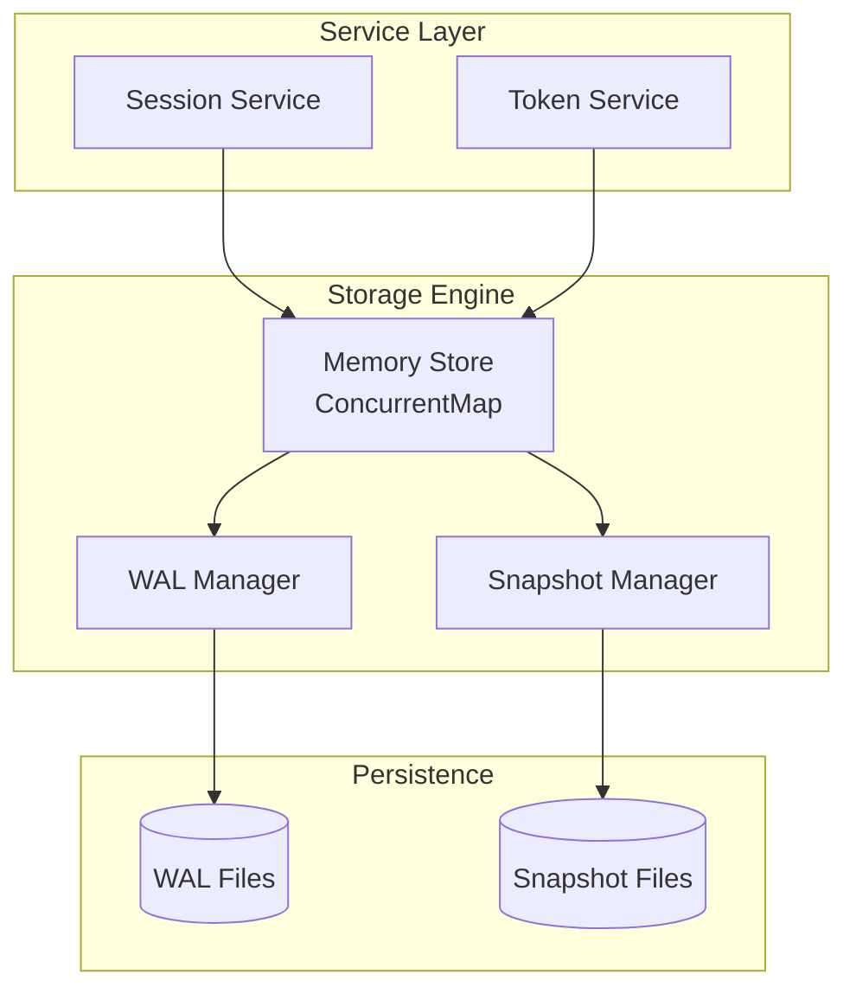
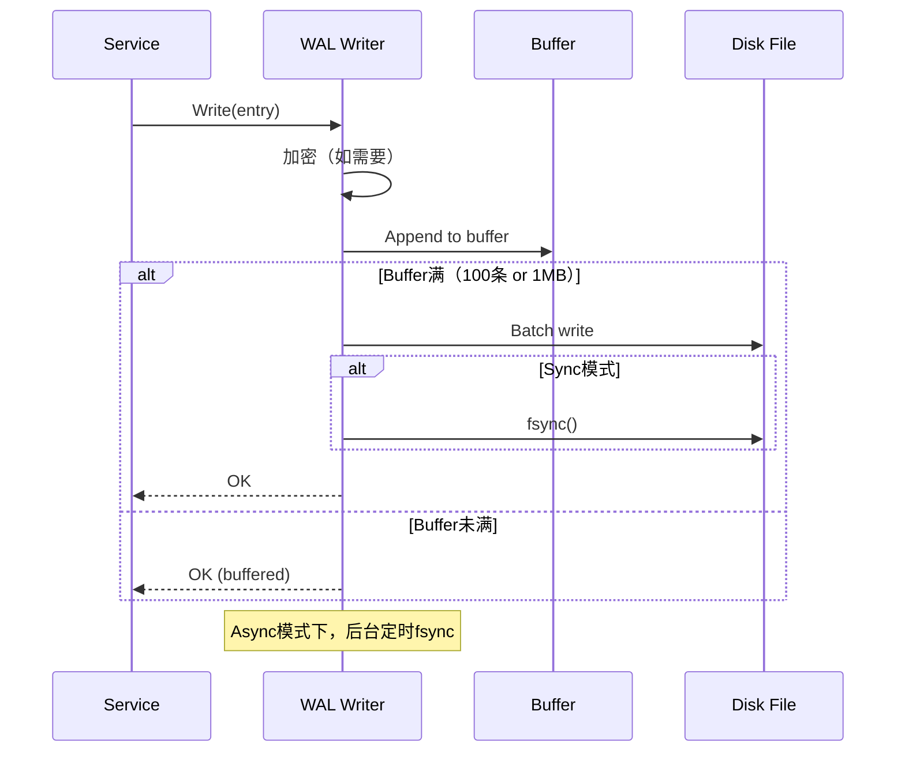
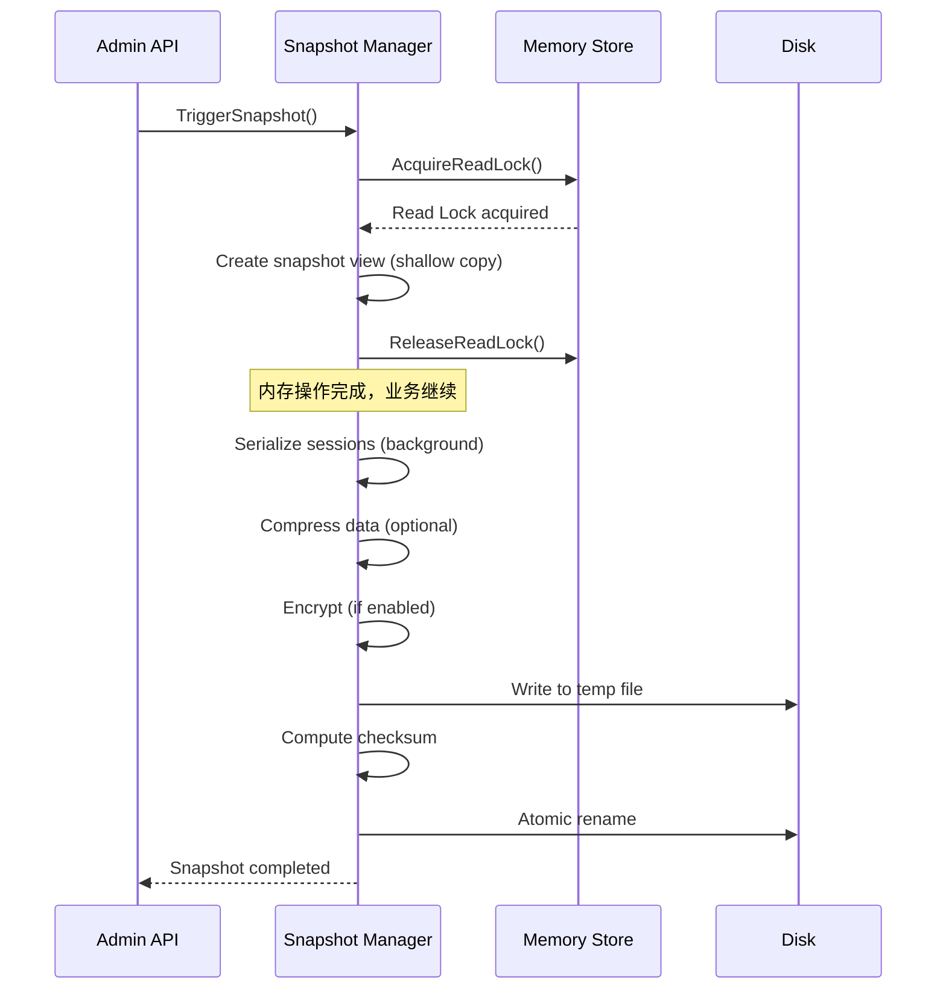
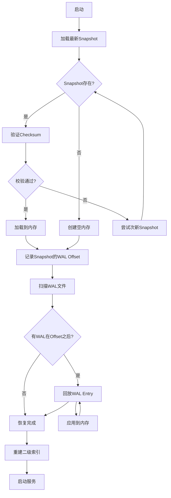

# DS-0102 - 存储引擎设计

**状态**: 已批准
**优先级**: P0
**来源**: DS-0101-核心数据模型设计.md, AD-0102-并发Map选型决策.md, RQ-0101-核心数据模型.md
**作者**: Claude Code
**创建日期**: 2025-12-17
**最后更新**: 2025-12-19

> **实现偏差说明**: 本文档原设计 WAL/Snapshot 使用 Protobuf 序列化，实际实现采用 JSON + 二进制头混合格式。详见 [AD-0105-WAL与Snapshot序列化格式决策](../adrs/AD-0105-WAL与Snapshot序列化格式决策.md)。

## 1. 概述

本文档详细设计 TokMesh 的存储引擎实现，包括预写日志（WAL）、快照（Snapshot）和内存并发控制（ConcurrentMap）三大核心组件。设计目标是在保障数据持久性和一致性的前提下，实现高性能的内存存储。

### 1.1 架构定位



### 1.2 核心约束

- **持久化保证**：所有写操作先写WAL，成功后才修改内存
- **故障恢复目标**：冷启动 < 5s（符合RQ-0402）
- **并发性能**：支持10,000 TPS写入，100,000 TPS读取
- **内存占用**：单节点默认配置 < 512MB

---

## 2. WAL (预写日志) 设计

### 2.1 文件格式

#### 2.1.1 文件命名规则

```
wal-<segment-id>.log
```

示例：`wal-0000001.log`, `wal-0000002.log`

- **segment-id**：8位零填充的递增序列号
- **滚动阈值**：单个文件 >= 64MB 或包含 >= 100,000 条记录

#### 2.1.2 文件结构

```
┌─────────────────────────────────────────┐
│ Magic Bytes (8 bytes): "TOKMWAL\x01"   │  固定魔数 + 版本号
├─────────────────────────────────────────┤
│ Entry 1 (Length+CRC+Type+JSON Payload)  │
├─────────────────────────────────────────┤
│ ...                                     │
├─────────────────────────────────────────┤
│ Entry N (Length+CRC+Type+JSON Payload)  │
├─────────────────────────────────────────┤
│ Checksum (32 bytes): SHA-256           │  整个文件的校验和
└─────────────────────────────────────────┘
```

> 注意：WAL/Snapshot 序列化格式以 `specs/adrs/AD-0105-WAL与Snapshot序列化格式决策.md` 为准；本章节同步为 **JSON + 二进制头** 的现行口径。

#### 2.1.3 Entry 线格式（JSON + 二进制头）

每条 Entry 的线格式为：

```
[Length:4][CRC32:4][Type:1][Payload:Length-5]
```

- `Length`：大端 `uint32`，表示 `CRC32 + Type + Payload` 的总长度
- `CRC32`：IEEE CRC32，覆盖 `Type + Payload`
- `Type`：`1=CREATE`，`2=UPDATE`，`3=DELETE`
- `Payload`：JSON

Payload（JSON）字段约定：

```json
{
  "ts": 1734567890123,
  "sid": "tmss-xxxxxxxxxxxxxxxxxxxxxxxxxx",
  "ver": 1,
  "session": { "...": "..." },
  "enc_session": "BASE64(nonce+ciphertext)"
}
```

- `DELETE` 仅要求 `ts/sid`；`CREATE/UPDATE` 必须包含 `session` 或 `enc_session`（二选一）

### 2.2 批量写入与fsync策略

#### 2.2.1 批量缓冲区

```go
type WALWriter struct {
    mu          sync.Mutex
    file        *os.File
    buffer      []*WALEntry       // 批量缓冲区
    bufferSize  int               // 当前缓冲区大小（字节）
    encoder     *proto.MarshalOptions

    // 配置
    maxBatchSize   int            // 默认100条
    maxBatchBytes  int            // 默认1MB
    syncMode       SyncMode       // sync/batch
    syncInterval   time.Duration  // batch模式下的fsync间隔

    // 加密
    cipher      cipher.AEAD       // 自适应加密（见 specs/adrs/AD-0201-自适应加密算法决策.md）
}

type SyncMode string

const (
    SyncModeSync  SyncMode = "sync"   // 每批立即fsync
    SyncModeBatch SyncMode = "batch"  // 定时fsync (按 syncInterval)
)
```

#### 2.2.2 写入流程



#### 2.2.3 批量写入实现

```go
func (w *WALWriter) Write(ctx context.Context, entry *WALEntry) error {
    w.mu.Lock()
    defer w.mu.Unlock()

    // 1. 加密（如果启用）
    if w.cipher != nil {
        encrypted, err := w.encryptEntry(entry)
        if err != nil {
            return fmt.Errorf("encrypt entry: %w", err)
        }
        entry.EncryptedPayload = encrypted
        entry.SessionData = nil  // 清空明文
    }

    // 2. 序列化
    data, err := w.encoder.Marshal(entry)
    if err != nil {
        return fmt.Errorf("marshal entry: %w", err)
    }

    // 3. 添加到缓冲区
    w.buffer = append(w.buffer, entry)
    w.bufferSize += len(data)

    // 4. 检查是否需要flush
    if len(w.buffer) >= w.maxBatchSize || w.bufferSize >= w.maxBatchBytes {
        return w.flushLocked()
    }

    return nil
}

func (w *WALWriter) flushLocked() error {
    if len(w.buffer) == 0 {
        return nil
    }

    // 1. 批量序列化
    batch := &WALBatch{Entries: w.buffer}
    data, err := proto.Marshal(batch)
    if err != nil {
        return err
    }

    // 2. 写入文件
    if _, err := w.file.Write(data); err != nil {
        return err
    }

    // 3. fsync（根据模式）
    if w.syncMode == SyncModeSync {
        if err := w.file.Sync(); err != nil {
            return err
        }
    }

    // 4. 清空缓冲区
    w.buffer = w.buffer[:0]
    w.bufferSize = 0

    return nil
}
```

### 2.3 文件滚动策略

#### 2.3.1 触发条件

- **大小触发**：当前文件 >= 64MB
- **数量触发**：当前文件 >= 100,000 条记录
- **时间触发**：单个文件持续写入 >= 1小时（可配置）

#### 2.3.2 滚动流程

```go
func (w *WALWriter) rotateIfNeeded() error {
    w.mu.Lock()
    defer w.mu.Unlock()

    // 检查触发条件
    stat, _ := w.file.Stat()
    if stat.Size() < w.maxSegmentSize && w.entryCount < w.maxSegmentEntries {
        return nil
    }

    // 1. Flush当前缓冲区
    if err := w.flushLocked(); err != nil {
        return err
    }

    // 2. 写入文件校验和
    checksum := w.computeChecksum()
    if err := w.writeChecksum(checksum); err != nil {
        return err
    }

    // 3. 关闭当前文件
    if err := w.file.Sync(); err != nil {
        return err
    }
    if err := w.file.Close(); err != nil {
        return err
    }

    // 4. 创建新文件
    nextSegmentID := w.currentSegmentID + 1
    newFile, err := w.createSegment(nextSegmentID)
    if err != nil {
        return err
    }

    w.file = newFile
    w.currentSegmentID = nextSegmentID
    w.entryCount = 0

    return nil
}
```

### 2.4 损坏恢复机制

#### 2.4.1 校验策略

- **Entry级校验**：每个Entry包含CRC32校验码（Protobuf内嵌）
- **File级校验**：文件末尾包含SHA-256全文校验和

#### 2.4.2 恢复流程

```go
func (w *WALReader) Recover(ctx context.Context) ([]*WALEntry, error) {
    var entries []*WALEntry

    segments, err := w.listSegments()
    if err != nil {
        return nil, err
    }

    for _, seg := range segments {
        // 1. 验证Magic Bytes
        if !w.verifyMagic(seg) {
            log.Warn("invalid magic, skip segment", "segment", seg)
            continue
        }

        // 2. 读取Header
        header, err := w.readHeader(seg)
        if err != nil {
            log.Warn("invalid header, skip segment", "segment", seg, "error", err)
            continue
        }

        // 3. 验证文件校验和
        if !w.verifyChecksum(seg) {
            log.Warn("checksum mismatch, trying recovery", "segment", seg)
            // 尝试部分恢复（读取到损坏位置为止）
            partialEntries := w.recoverPartial(seg)
            entries = append(entries, partialEntries...)
            continue
        }

        // 4. 读取所有Entry
        segEntries, err := w.readEntries(seg)
        if err != nil {
            log.Error("read entries failed", "segment", seg, "error", err)
            continue
        }

        entries = append(entries, segEntries...)
    }

    return entries, nil
}

func (w *WALReader) recoverPartial(segPath string) []*WALEntry {
    var entries []*WALEntry

    file, _ := os.Open(segPath)
    defer file.Close()

    // 跳过Header
    file.Seek(int64(headerSize), io.SeekStart)

    for {
        entry, err := w.readNextEntry(file)
        if err != nil {
            // 遇到损坏Entry，停止读取
            break
        }
        entries = append(entries, entry)
    }

    log.Info("partial recovery completed", "segment", segPath, "recovered", len(entries))
    return entries
}
```

### 2.5 清理策略

- **触发时机**：Snapshot完成后
- **保留规则**：保留最近N个segment（默认N=3），删除更早的segment
- **安全检查**：确保保留的segment覆盖最新Snapshot之后的所有操作

---

## 3. Snapshot (快照) 设计

### 3.1 快照文件格式

#### 3.1.1 文件命名

```
snapshot-<timestamp>-<sequence>.snap
```

示例：`snapshot-20251217103000-0001.snap`

- **timestamp**：创建时间（YYYYMMDDHHmmss）
- **sequence**：同一秒内的序列号（4位）

#### 3.1.2 文件结构

```
┌─────────────────────────────────────────┐
│ Magic Bytes (8 bytes): "TOKMSNAP"      │
├─────────────────────────────────────────┤
│ HeaderLen (4 bytes)                      │  大端 uint32
├─────────────────────────────────────────┤
│ HeaderJSON (HeaderLen bytes)             │  元数据（JSON）
├─────────────────────────────────────────┤
│ DataLen (4 bytes)                        │  大端 uint32
├─────────────────────────────────────────┤
│ Data (DataLen bytes)                     │  Session JSON 或加密后 bytes
├─────────────────────────────────────────┤
│ Checksum (32 bytes): SHA-256           │
└─────────────────────────────────────────┘
```

#### 3.1.3 Header / Data 约定（JSON）

HeaderJSON（示例）：

```json
{
  "version": 1,
  "created_at": 1734567890123,
  "node_id": "tmnd-xxxxxxxxxxxxxxxxxxxxxxxxxx",
  "session_count": 12345,
  "wal_last_offset": 4294967296,
  "encrypted": false
}
```

Data：
- `encrypted=false`：`json.Marshal([]*Session)` 的输出
- `encrypted=true`：`Cipher.Encrypt(plainJSON)` 的输出（nonce+ciphertext 原始 bytes）

### 3.2 Copy-on-Write实现

#### 3.2.1 快照视图

```go
type SnapshotView struct {
    mu          sync.RWMutex
    sessions    map[string]*Session  // 快照时刻的Session副本
    createdAt   time.Time
    walOffset   uint64               // 对应的WAL offset
}

type SnapshotManager struct {
    mu              sync.Mutex
    memStore        *MemoryStore
    currentSnapshot *SnapshotView
    snapshotChan    chan *SnapshotRequest
}
```

#### 3.2.2 快照创建流程



#### 3.2.3 实现代码

```go
func (m *SnapshotManager) CreateSnapshot(ctx context.Context, desc string) (*SnapshotInfo, error) {
    // 1. 创建快照视图（持有读锁时间极短）
    view := m.createSnapshotView()

    // 2. 后台序列化（不持有锁）
    return m.serializeSnapshot(ctx, view, desc)
}

func (m *SnapshotManager) createSnapshotView() *SnapshotView {
    m.memStore.mu.RLock()
    defer m.memStore.mu.RUnlock()

    // Shallow copy（仅复制map，不复制Session对象）
    view := &SnapshotView{
        sessions:  make(map[string]*Session, len(m.memStore.sessions)),
        createdAt: time.Now(),
        walOffset: m.memStore.lastWALOffset,
    }

    for id, sess := range m.memStore.sessions {
        // 复制指针（Session对象不可变，安全）
        view.sessions[id] = sess
    }

    return view
}

func (m *SnapshotManager) serializeSnapshot(ctx context.Context, view *SnapshotView, desc string) (*SnapshotInfo, error) {
    // 1. 创建临时文件
    tempFile := m.getTempFilePath()
    file, err := os.Create(tempFile)
    if err != nil {
        return nil, err
    }
    defer file.Close()

    // 2. 写入Magic Bytes
    file.Write([]byte("TOKMSNAP"))

    // 3. 写入Header
	    header := &SnapshotHeader{
	        Version:      1,
	        CreatedAt:    view.createdAt.UnixMilli(),
	        NodeID:       m.nodeID,
	        SessionCount: uint64(len(view.sessions)),
	        WalLastOffset: view.walOffset,
	        Compression:  SnapshotHeader_NONE, // Phase1：不启用压缩（避免引入额外依赖）；如需压缩需新增 ADR 并在 P2 引入
	    }
    headerData, _ := proto.Marshal(header)
    file.Write(headerData)

    // 4. 构建索引并写入数据块
    index, dataBlock := m.buildIndexAndData(view.sessions)

	    // 5. 压缩（Phase1：不压缩）
	    payload := dataBlock

	    // 6. 加密（如果启用）
	    if m.cipher != nil {
	        encrypted, err := m.encryptData(payload)
	        if err != nil {
	            return nil, err
	        }
	        payload = encrypted
	    }

	    // 7. 写入索引和数据
	    indexData, _ := proto.Marshal(index)
	    file.Write(indexData)
	    file.Write(payload)

    // 8. 计算并写入校验和
    checksum := m.computeFileChecksum(tempFile)
    file.Write(checksum)

    file.Sync()

    // 9. 原子重命名
    finalPath := m.getFinalFilePath(view.createdAt)
    if err := os.Rename(tempFile, finalPath); err != nil {
        return nil, err
    }

    return &SnapshotInfo{
        Path:      finalPath,
        CreatedAt: view.createdAt,
        Size:      getFileSize(finalPath),
        Checksum:  hex.EncodeToString(checksum),
    }, nil
}
```

### 3.3 触发条件

根据DS-0101第4.2.1节和DS-0502配置定义：

| 触发条件 | 默认值 | 配置项 |
|---------|--------|--------|
| 时间间隔 | 1小时 | `storage.snapshot.interval` |
| WAL大小 | 1GB | `storage.snapshot.threshold` |
| 手动触发 | - | Admin API `/admin/v1/backups/snapshots` |

### 3.4 快照保留与清理策略

| 配置项 | 默认值 | 说明 |
|--------|--------|------|
| `storage.snapshot.retention_count` | 5 | 保留最近 N 个快照文件 |
| `storage.snapshot.retention_days` | 7 | 保留最近 N 天内的快照（与 count 取并集） |

**清理逻辑**:
1. 新快照创建成功后触发清理检查
2. 保留满足以下**任一条件**的快照：
   - 最近 `retention_count` 个快照
   - 创建时间在 `retention_days` 天内的快照
3. 删除不满足保留条件的旧快照
4. **安全约束**：始终保留至少 1 个有效快照（即使超出保留策略）

```go
func (m *SnapshotManager) cleanupOldSnapshots() error {
    snapshots, err := m.listSnapshots() // 按时间升序排列
    if err != nil || len(snapshots) <= 1 {
        return nil // 至少保留1个快照
    }

    cutoffTime := time.Now().Add(-m.retentionDays)
    keepCount := m.retentionCount

    toDelete := []string{}
    for i, snap := range snapshots {
        remaining := len(snapshots) - i
        // 保留最后 keepCount 个
        if remaining <= keepCount {
            break
        }
        // 保留 retentionDays 内的
        if snap.CreatedAt.After(cutoffTime) {
            continue
        }
        toDelete = append(toDelete, snap.Path)
    }

    for _, path := range toDelete {
        os.Remove(path)
        log.Info("old snapshot removed", "path", path)
    }
    return nil
}
```

### 3.5 加载与恢复

```go
func (m *SnapshotManager) LoadLatestSnapshot(ctx context.Context) error {
    // 1. 查找最新快照
    snapshots, err := m.listSnapshots()
    if err != nil || len(snapshots) == 0 {
        return ErrNoSnapshot
    }

    latestSnap := snapshots[len(snapshots)-1]

    // 2. 验证校验和
    if !m.verifyChecksum(latestSnap) {
        return ErrChecksumMismatch
    }

    // 3. 读取Header
    header, err := m.readHeader(latestSnap)
    if err != nil {
        return err
    }

    // 4. 读取索引
    index, err := m.readIndex(latestSnap)
    if err != nil {
        return err
    }

    // 5. 读取数据块
    dataBlock, err := m.readDataBlock(latestSnap)
    if err != nil {
        return err
    }

    // 6. 解密（如果需要）
    if m.cipher != nil {
        decrypted, err := m.decryptData(dataBlock)
        if err != nil {
            return err
        }
        dataBlock = decrypted
    }

	    // 7. 解压缩（Phase1：不压缩）
	    decompressed := dataBlock

	    // 8. 反序列化 Sessions
	    var sessions SessionDataBlock
    if err := proto.Unmarshal(decompressed, &sessions); err != nil {
        return err
    }

    // 9. 加载到内存
    m.memStore.LoadFromSnapshot(sessions.Sessions, header.WalLastOffset)

    log.Info("snapshot loaded",
        "path", latestSnap,
        "sessions", len(sessions.Sessions),
        "wal_offset", header.WalLastOffset)

    return nil
}
```

### 3.6 二级索引（与 `GET /sessions` 全量过滤对齐）

为与 `specs/1-requirements/RQ-0301-业务接口规约-OpenAPI.md` 的“搜索会话”能力对齐，存储引擎必须支持从内存中按多条件过滤并分页返回 Session（允许部分条件降级为扫描，但必须有保护措施）。

#### 3.6.1 索引集合（建议 Phase1 实现）

- `by_session_id`: `session_id -> *Session`（主索引）
- `by_token_hash`: `token_hash -> session_id`（Validate 高频路径）
- `by_user_id`: `user_id -> set[session_id]`
- `by_device_id`: `device_id -> set[session_id]`
- `by_key_id`: `created_by(key_id) -> set[session_id]`
- `by_ip`: `ip -> set[session_id]`（仅精确 IP；CIDR 查询走扫描）

#### 3.6.2 字段语义（避免歧义）

- `key_id` 对应 Session 的 `created_by`（API Key ID，形如 `tmak-...`）。
- `ip_address` 查询默认匹配 Session 的 `last_access_ip`；若为空则匹配 `ip_address`（创建时 IP）。

#### 3.6.3 维护策略

- **同步更新**：与主索引在同一临界区更新（要么全部成功，要么全部失败）。
- **恢复重建**：启动恢复完成后，通过遍历主索引重建所有二级索引（与第 5 章“重建二级索引”步骤一致）。
- **惰性清理配合**：对“已过期/已吊销”的 Session，在惰性删除后必须从所有二级索引中移除。

#### 3.6.4 降级与保护（必须）

- **候选集优先**：先通过 `by_user_id/by_device_id/by_key_id/by_ip` 取交集缩小候选集，再做时间范围（`created_after/before`）、`active_after` 与 `status` 过滤，并执行排序与分页。
- **issuer 限制**：issuer 不允许无 `user_id` 的全表搜索（避免枚举全局会话）；该约束在服务层执行（见 `specs/2-designs/DS-0103-核心服务层设计.md`）。
- **分页上限**：`page_size` 最大 100（与 RQ-0301 对齐），避免 OOM。
- **扫描告警**：当查询触发全表扫描或候选集过大导致排序开销显著时，记录告警日志（后续可据此演进更强索引）。

---

## 4. ConcurrentMap (内存并发控制) 设计

### 4.1 设计选型

根据AD-0102决策，采用**分段锁ConcurrentMap**（16 shards）。

### 4.2 数据结构

```go
type ConcurrentMap struct {
    shards    []*Shard
    shardMask uint32  // 用于快速取模（shardCount - 1）
    seed      maphash.Seed
}

type Shard struct {
    mu    sync.RWMutex
    items map[string]*Session
}

const DefaultShardCount = 16

func NewConcurrentMap(shardCount int) *ConcurrentMap {
    if shardCount == 0 {
        shardCount = DefaultShardCount
    }

    // 确保shardCount是2的幂（用于位运算优化）
    if !isPowerOfTwo(shardCount) {
        panic("shardCount must be power of 2")
    }

    shards := make([]*Shard, shardCount)
    for i := range shards {
        shards[i] = &Shard{
            items: make(map[string]*Session),
        }
    }

    return &ConcurrentMap{
        shards:    shards,
        shardMask: uint32(shardCount - 1),
        seed:      maphash.MakeSeed(),
    }
}
```

### 4.3 Shard选择策略

```go
func (m *ConcurrentMap) getShard(key string) *Shard {
    // 使用 stdlib hash/maphash（避免引入额外依赖）
    hash := maphash.String(m.seed, key)
    idx := hash & m.shardMask  // 等价于 hash % shardCount
    return m.shards[idx]
}
```

### 4.4 核心操作

#### 4.4.1 Get (读操作)

```go
func (m *ConcurrentMap) Get(key string) (*Session, bool) {
    shard := m.getShard(key)
    shard.mu.RLock()
    defer shard.mu.RUnlock()

    sess, exists := shard.items[key]
    return sess, exists
}
```

#### 4.4.2 Set (写操作)

```go
func (m *ConcurrentMap) Set(key string, value *Session) {
    shard := m.getShard(key)
    shard.mu.Lock()
    defer shard.mu.Unlock()

    shard.items[key] = value
}
```

#### 4.4.3 CompareAndSwap (CAS乐观锁)

```go
func (m *ConcurrentMap) CompareAndSwap(key string, expectedVersion uint64, newValue *Session) bool {
    shard := m.getShard(key)
    shard.mu.Lock()
    defer shard.mu.Unlock()

    current, exists := shard.items[key]
    if !exists || current.Version != expectedVersion {
        return false  // 版本冲突
    }

    newValue.Version = expectedVersion + 1
    shard.items[key] = newValue
    return true
}
```

#### 4.4.4 Range (遍历)

```go
func (m *ConcurrentMap) Range(fn func(key string, value *Session) bool) {
    for _, shard := range m.shards {
        shard.mu.RLock()
        for k, v := range shard.items {
            if !fn(k, v) {
                shard.mu.RUnlock()
                return
            }
        }
        shard.mu.RUnlock()
    }
}
```

### 4.5 性能优化

#### 4.5.1 读写路径分离

- **读路径**：使用RLock，允许并发读
- **写路径**：使用Lock，独占访问

#### 4.5.2 减少锁持有时间

```go
// ❌ 反模式：锁内执行慢操作
func (m *ConcurrentMap) BadUpdate(key string) error {
    shard := m.getShard(key)
    shard.mu.Lock()
    defer shard.mu.Unlock()

    sess := shard.items[key]
    slowValidation(sess)  // 慢操作在锁内！
    sess.LastActive = time.Now().UnixMilli()
    return nil
}

// ✅ 正确：锁外执行慢操作
func (m *ConcurrentMap) GoodUpdate(key string) error {
    // 1. 锁外执行慢操作
    shard := m.getShard(key)
    shard.mu.RLock()
    sess := shard.items[key]
    shard.mu.RUnlock()

    if err := slowValidation(sess); err != nil {
        return err
    }

    // 2. 锁内仅修改数据
    shard.mu.Lock()
    current := shard.items[key]
    if current.Version != sess.Version {
        shard.mu.Unlock()
        return ErrVersionConflict
    }
    current.LastActive = time.Now().UnixMilli()
    current.Version++
    shard.mu.Unlock()

    return nil
}
```

---

## 5. 故障恢复流程

### 5.1 完整恢复流程



### 5.2 冷启动时间优化

目标：< 5s（RQ-0402）

#### 5.2.1 优化策略

| 阶段 | 优化措施 | 预期耗时 |
|------|---------|---------|
| Snapshot加载 | 并行I/O，预分配内存 | < 2s |
| WAL回放 | 批量应用，跳过过期Session | < 1s |
| 索引重建 | 并发重建，使用Channel | < 1s |
| 服务就绪 | 懒加载非关键组件 | < 1s |

#### 5.2.2 实现

```go
func (s *StorageEngine) Recover(ctx context.Context) error {
    startTime := time.Now()

    // 1. 并行加载Snapshot
    snapErr := s.snapshotMgr.LoadLatestSnapshot(ctx)
    if snapErr != nil && !errors.Is(snapErr, ErrNoSnapshot) {
        return fmt.Errorf("load snapshot: %w", snapErr)
    }

    walOffset := uint64(0)
    if snapErr == nil {
        walOffset = s.memStore.GetLastWALOffset()
    }

    log.Info("snapshot loaded", "elapsed", time.Since(startTime))

    // 2. 回放WAL
    entries, err := s.walMgr.RecoverFrom(ctx, walOffset)
    if err != nil {
        return fmt.Errorf("recover WAL: %w", err)
    }

    // 批量应用（优化：跳过已过期Session）
    applied := s.applyWALEntries(entries)
    log.Info("WAL replayed", "total", len(entries), "applied", applied, "elapsed", time.Since(startTime))

    // 3. 重建二级索引（并发）
    s.rebuildIndexes()
    log.Info("indexes rebuilt", "elapsed", time.Since(startTime))

    // 4. 启动后台任务
    s.startBackgroundTasks()

    elapsed := time.Since(startTime)
    if elapsed > 5*time.Second {
        log.Warn("recovery exceeded target", "elapsed", elapsed, "target", "5s")
    } else {
        log.Info("recovery completed", "elapsed", elapsed)
    }

    return nil
}

func (s *StorageEngine) applyWALEntries(entries []*WALEntry) int {
    now := time.Now().UnixMilli()
    applied := 0

    for _, entry := range entries {
        // 优化：跳过已过期的CREATE操作
        if entry.OpType == WALEntry_CREATE && entry.SessionData.ExpiresAt < now {
            continue
        }

        switch entry.OpType {
        case WALEntry_CREATE, WALEntry_UPDATE:
            s.memStore.Set(entry.SessionId, entry.SessionData)
        case WALEntry_DELETE:
            s.memStore.Delete(entry.SessionId)
        }
        applied++
    }

    return applied
}
```

---

## 6. 性能基准

### 6.1 内存操作性能

| 操作 | 目标 | 实现方案 |
|------|------|---------|
| Get | P99 < 1ms | ConcurrentMap + RWMutex |
| Set | P99 < 5ms | ConcurrentMap + WAL批量写 |
| CAS | P99 < 10ms | 乐观锁 + Version字段 |
| Range (100万) | < 500ms | 分段遍历，避免长时间持锁 |

### 6.2 持久化性能

| 操作 | 目标 | 实现方案 |
|------|------|---------|
| WAL写入（batch 模式） | ≥ 20,000 writes/s | 批量写 + 定时fsync |
| WAL写入（同步） | ≥ 5,000 writes/s | 批量写 + 每批fsync |
| Snapshot生成 | 100万Session < 10s | 并行序列化 + 原子写入（Phase1 默认不压缩；P2 可选压缩） |
| 故障恢复 | 冷启动 < 5s | 见5.2节优化策略 |

### 6.3 错误码映射

存储引擎操作失败时，应返回以下错误码（引用 `specs/governance/error-codes.md`）：

| 场景 | 错误码 | 描述 |
|------|--------|------|
| WAL 写入失败 | `TM-SYS-5001` | 存储层错误。磁盘空间不足、I/O 错误等 |
| WAL 文件损坏 | `TM-SYS-5001` | 存储层错误。校验和验证失败 |
| Snapshot 加载失败 | `TM-SYS-5001` | 存储层错误。Snapshot 文件损坏或不存在 |
| Snapshot 创建失败 | `TM-SYS-5002` | 备份/还原失败。无法创建快照文件 |
| 快照还原失败 | `TM-SYS-5002` | 备份/还原失败。还原过程中发生错误 |
| 版本冲突 | `TM-SESS-4091` | CAS 失败，客户端应重试 |

---

## 7. 验收标准

### 7.1 功能性验收

- [ ] WAL写入后可正确恢复（包括CREATE/UPDATE/DELETE）
- [ ] Snapshot包含所有内存Session
- [ ] 故障恢复流程正确（Snapshot + WAL回放）
- [ ] ConcurrentMap并发读写正确（无竞态）
- [ ] 版本冲突正确检测（CAS失败）

### 7.2 性能验收

- [ ] Get操作P99 < 1ms（10万并发）
- [ ] WAL batch 模式写入 ≥ 20,000 writes/s
- [ ] Snapshot生成时间 < 10s（100万Session）
- [ ] 冷启动时间 < 5s（含100万Session）

### 7.3 可靠性验收

- [ ] 模拟崩溃后，数据恢复零丢失（同步模式）
- [ ] 模拟崩溃后，数据丢失 ≤ sync_interval（batch 模式，默认1s）
- [ ] WAL文件损坏时，部分恢复成功
- [ ] Snapshot校验和失败时，回退到次新快照

### 7.4 压力测试

- [ ] 10,000 TPS写入持续1小时，无错误
- [ ] 100万Session内存占用 < 2GB
- [ ] 16 shards下，锁冲突率 < 5%

---

## 8. 未决问题

- [ ] 是否需要支持增量Snapshot？（Phase 3可选）
- [ ] WAL是否需要支持Segment级别的加密密钥轮转？
- [ ] ConcurrentMap的Shard数量是否需要动态调整？

---

## 9. 变更历史

| 日期 | 版本 | 变更说明 | 作者 |
|------|------|----------|------|
| 2025-12-17 | v1.0 | 初始版本 | Claude Code |
