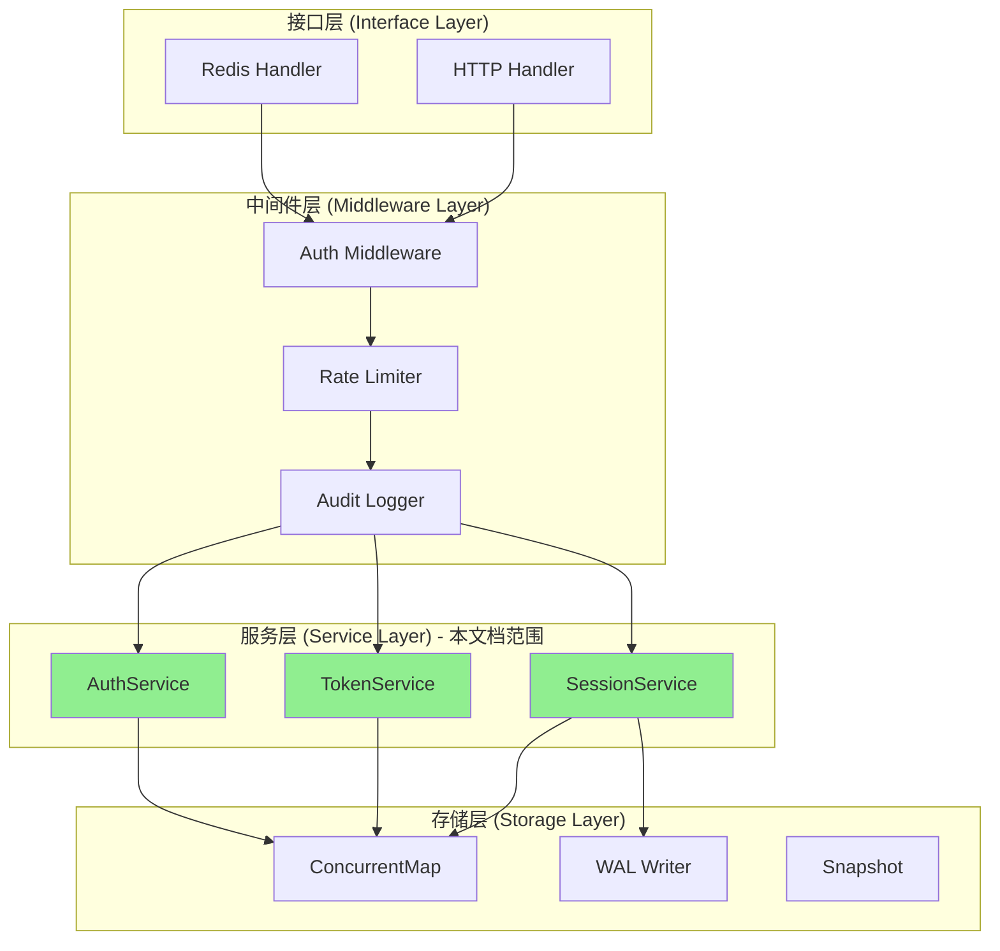
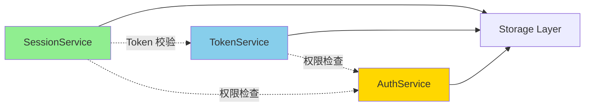
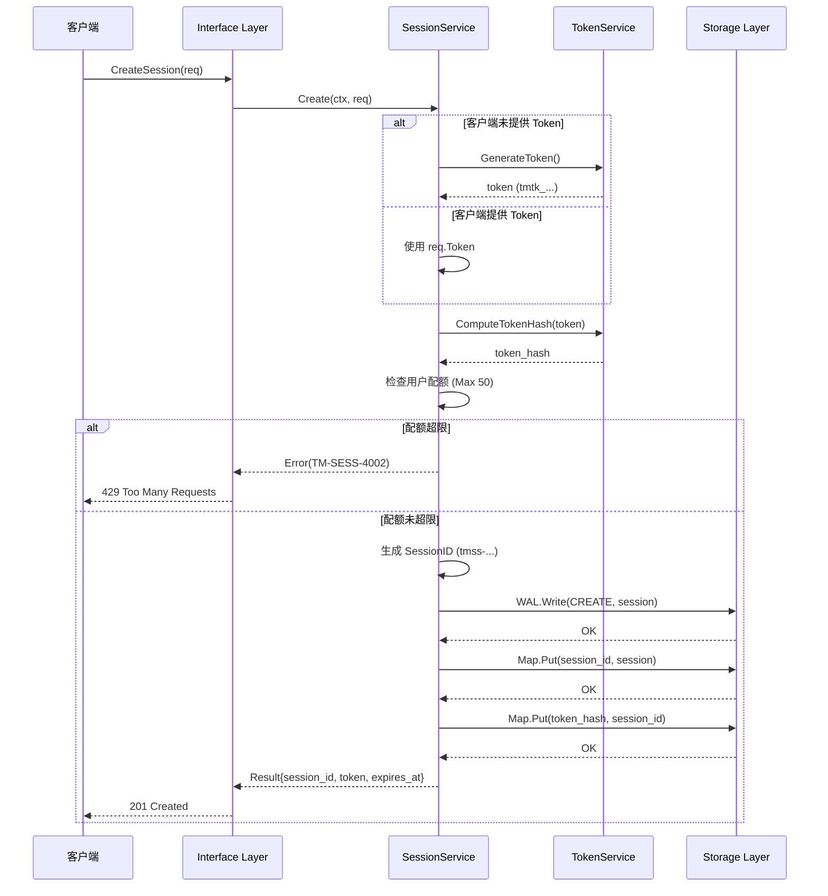
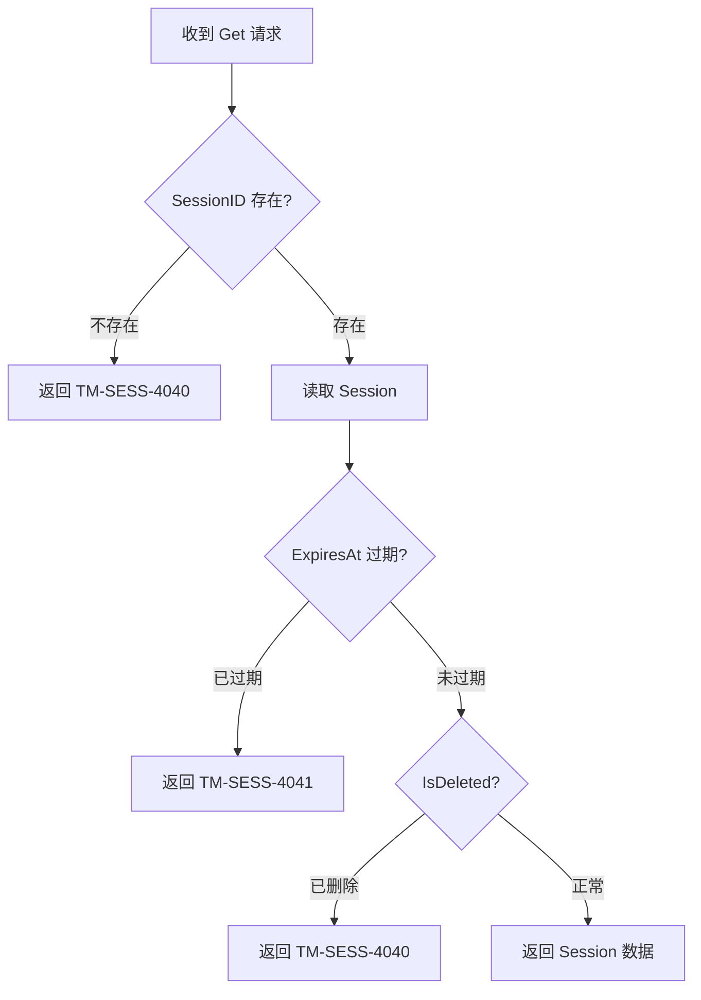
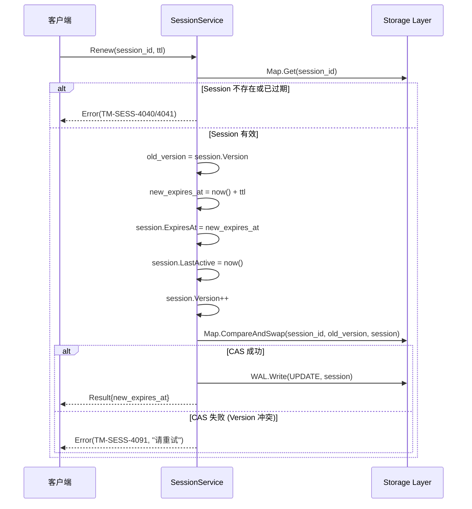
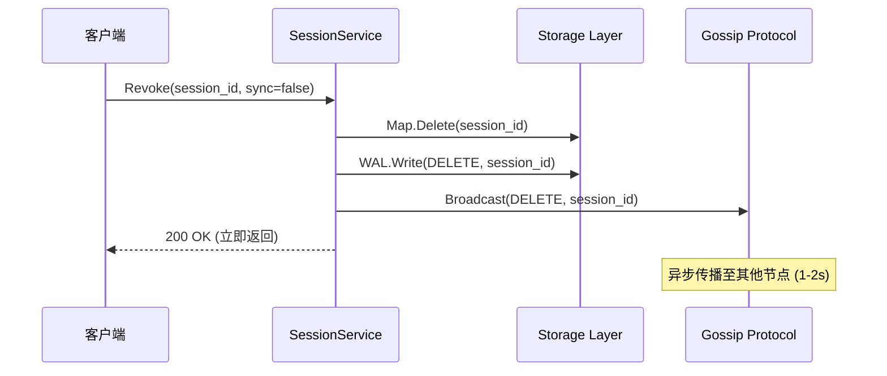
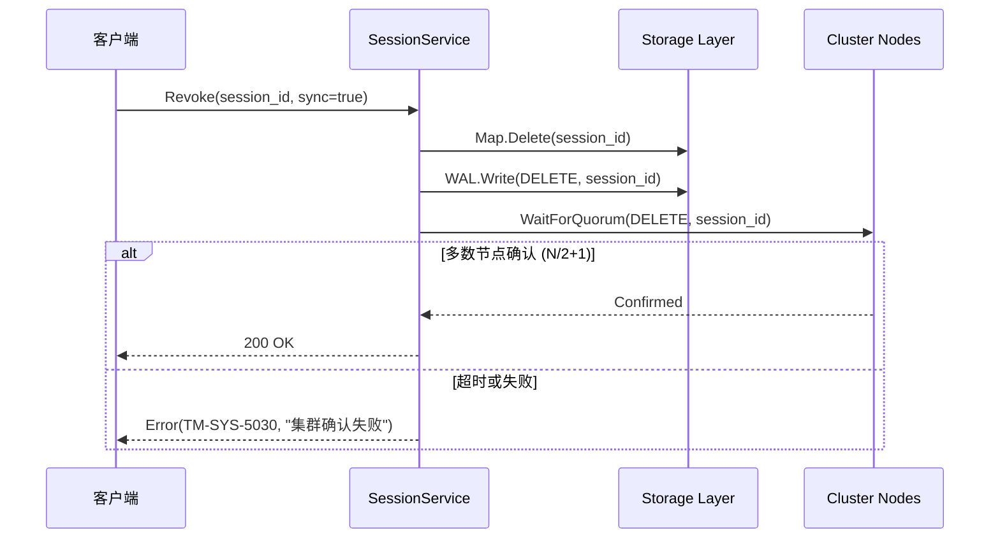
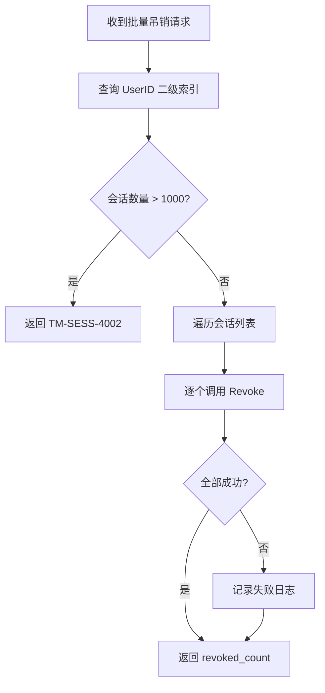
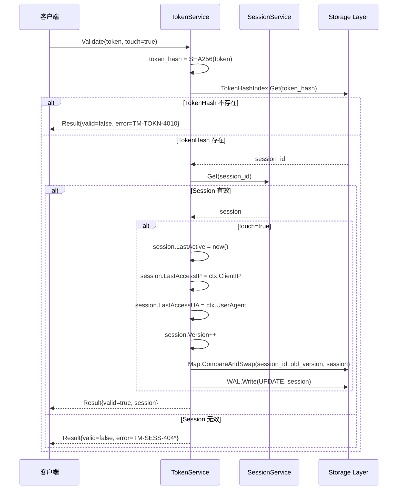
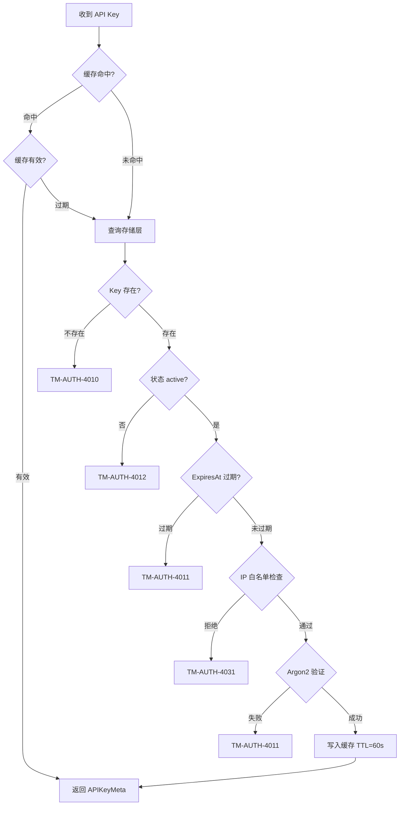

# DS-0103 - 核心服务层设计

**状态**: 已批准
**优先级**: P0
**来源**: RQ-0101-核心数据模型.md, RQ-0102-会话生命周期管理.md, RQ-0201-安全与鉴权体系.md, DS-0101-核心数据模型设计.md, DS-0102-存储引擎设计.md, DS-0201-安全与鉴权设计.md
**作者**: Claude Code
**创建日期**: 2025-12-17
**最后更新**: 2025-12-17

## 1. 概述

本文档详细设计 TokMesh 的核心服务层（Core Service Layer），定义 SessionService、TokenService 和 AuthService 三个核心服务的接口、实现逻辑、并发控制和错误处理策略。服务层位于接口层（HTTP/Redis）和存储层之间，封装所有业务逻辑，确保跨协议的一致性。

### 1.1 设计目标

- **协议无关**: 服务层不依赖具体传输协议（HTTP/Redis），通过 `context.Context` 传递元信息
- **原子操作**: 每个服务方法提供原子性保证，内部协调存储层操作
- **并发安全**: 使用乐观锁（Version）和存储层并发控制机制
- **可测试性**: 接口清晰，易于单元测试和集成测试

### 1.2 架构层次



## 2. 服务层架构

### 2.1 服务接口定义

所有服务遵循统一的接口设计模式：

```go
// ServiceContext 服务上下文，包含请求元信息
type ServiceContext struct {
    RequestID   string        // 请求 ID
    APIKeyID    string        // 调用者的 API Key ID
    APIKeyRole  Role          // 调用者的角色
    ClientIP    string        // 客户端 IP
    UserAgent   string        // 客户端 User-Agent
    TraceID     string        // Trace ID (可选)
}

// Result[T] 统一返回结果
type Result[T any] struct {
    Data  T
    Error *ServiceError
}

// ServiceError 服务层错误
type ServiceError struct {
    Code    string // TM-* 错误码 (specs/governance/error-codes.md)
    Message string
    Details map[string]interface{}
}
```

### 2.2 服务依赖关系



**依赖原则**:
- SessionService 可调用 TokenService 进行 Token 校验
- TokenService 和 AuthService 相互独立
- 所有服务通过存储层接口访问数据，不直接操作底层实现

### 2.3 错误处理策略

| 错误类型 | 处理策略 | 示例 |
|---------|---------|------|
| **参数校验失败** | 返回 `TM-ARG-*` 错误，不执行业务逻辑 | `TM-ARG-1001`: 无效的 user_id |
| **资源不存在** | 返回 `TM-SESS-4040` / `TM-TOKN-4010` | Session 或 Token 不存在 |
| **并发冲突** | 返回 `TM-SESS-4091`，客户端应重试 | Version 冲突 |
| **配额超限** | 返回 `TM-SESS-4002`，拒绝操作 | 单用户会话数超限 |
| **存储层故障** | 返回 `TM-SYS-5000`，记录详细日志 | WAL 写入失败 |

## 3. SessionService 设计

### 3.1 接口定义

```go
type SessionService interface {
    // Create 创建新会话
    Create(ctx context.Context, req *CreateSessionRequest) Result[*CreateSessionResponse]

    // Get 获取会话详情
    Get(ctx context.Context, req *GetSessionRequest) Result[*Session]

    // List 搜索会话（支持分页/过滤/排序）
    List(ctx context.Context, req *ListSessionsRequest) Result[*ListSessionsResponse]

    // Renew 续期会话
    Renew(ctx context.Context, req *RenewSessionRequest) Result[*RenewSessionResponse]

    // Revoke 吊销会话
    Revoke(ctx context.Context, req *RevokeSessionRequest) Result[*RevokeSessionResponse]

    // RevokeByUser 批量吊销用户的所有会话
    RevokeByUser(ctx context.Context, req *RevokeByUserRequest) Result[*RevokeByUserResponse]
}

type CreateSessionRequest struct {
    UserID      string            // 必填
    DeviceID    string            // 可选
    Data        map[string]string // 可选
    TTL         time.Duration     // 可选，默认使用配置值
    Token       string            // 可选，客户端提供的 Token（不提供则服务端生成）
}

type CreateSessionResponse struct {
    SessionID string
    Token     string // 仅当服务端生成时返回
    ExpiresAt int64
}

type GetSessionRequest struct {
    SessionID string
}

type ListSessionsRequest struct {
    // 访问控制：
    // - role=admin：允许全量过滤条件
    // - role=issuer：必须提供 UserID（避免 issuer 枚举全局会话）
    UserID      string
    DeviceID    string
    KeyID       string // 创建者 API Key ID（tmak-...）
    IPAddress   string // 精确 IP 或 CIDR（CIDR 场景实现可降级为扫描）
    Status      string // active/expired（语义与 RQ-0301 一致；服务层以当前时间判断）

    CreatedAfter  *time.Time
    CreatedBefore *time.Time
    ActiveAfter   *time.Time

    SortBy    string // created_at(default) | last_active
    SortOrder string // desc(default) | asc

    Page int // default 1
    Size int // default 20, max 100

    // 字段裁剪：由接口层在返回 DTO 时执行；服务层仍返回完整 Session（避免引入多态 DTO）
    Fields []string
}

type ListSessionsResponse struct {
    Items    []*Session
    Total    int
    Page     int
    PageSize int
}

type RenewSessionRequest struct {
    SessionID  string
    TTL        time.Duration
}

type RenewSessionResponse struct {
    NewExpiresAt int64
}

type RevokeSessionRequest struct {
    SessionID string
    Sync      bool // 是否同步等待集群确认
}

type RevokeSessionResponse struct {
    Success bool
}

type RevokeByUserRequest struct {
    UserID string
    Sync   bool
}

type RevokeByUserResponse struct {
    RevokedCount int
}
```

### 3.2 Create 流程设计



**关键逻辑**:
1. **Token 生成**: 若客户端未提供，调用 TokenService.GenerateToken()
2. **配额检查**: 查询 UserID 二级索引，统计当前会话数（未过期）
3. **SessionID 生成**: `tmss-` + 26 字符小写 ULID（总长 31；见 `specs/adrs/AD-0104-ID生成策略决策.md`），冲突重试最多 3 次（极小概率）
4. **持久化顺序**:
   - 先写 WAL（CREATE 操作）
   - 再更新内存索引（主索引 + TokenHash 索引 + UserID 二级索引）
5. **原子性**: 如果任一步骤失败，回滚已写入的索引

### 3.3 Get 流程设计



**关键逻辑**:
1. **惰性删除**: 检查 `ExpiresAt` 和 `IsDeleted` 标记
2. **过期处理**: 若已过期，返回 `TM-SESS-4041`，不自动删除（交给后台清理任务）
3. **只读操作**: 不修改 Session 状态，不写入 WAL

### 3.4 Renew 流程设计



**关键逻辑**:
1. **乐观锁 (CAS)**: 使用 `Version` 字段进行并发控制
2. **不可变字段**: `ip_address` 和 `user_agent` 不可修改
3. **仅更新两个字段**: `expires_at` 和 `last_active`
4. **冲突处理**: 若 Version 不匹配，返回 `TM-SESS-4091`，客户端应重试

### 3.5 Revoke 流程设计

**模式 A: 最终一致性 (默认)**



**模式 B: 强一致性 (sync=true)**



**关键逻辑**:
1. **幂等性**: 删除不存在的 Session 也返回成功
2. **索引清理**: 同时删除 TokenHash 索引和 UserID 二级索引
3. **标记删除**: 先将 `IsDeleted` 置为 true，延迟物理删除（给其他节点同步时间）

### 3.6 RevokeByUser 批量吊销



**关键逻辑**:
1. **批量上限**: 单次最多吊销 1000 个 Session
2. **部分失败处理**: 即使部分删除失败，也返回成功删除的数量
3. **性能优化**: 并发删除（goroutine 池），限制并发数为 100

## 4. TokenService 设计

### 4.1 接口定义

```go
type TokenService interface {
    // GenerateToken 生成新的 Token
    GenerateToken() (string, error)

    // ComputeTokenHash 计算 Token 的 SHA-256 哈希值
    ComputeTokenHash(token string) string

    // Validate 验证 Token 有效性
    Validate(ctx context.Context, req *ValidateTokenRequest) Result[*ValidateTokenResponse]

    // CheckNonce 检查 Nonce 是否已使用（防重放）
    CheckNonce(ctx context.Context, nonce string, timestamp int64) error
}

type ValidateTokenRequest struct {
    Token    string
    Touch    bool   // 是否更新 last_active
}

type ValidateTokenResponse struct {
    Valid   bool
    Session *Session // Valid=true 时返回
}
```

### 4.2 GenerateToken 实现

```go
func (s *TokenService) GenerateToken() (string, error) {
    // 1. 生成 32 字节随机数
    randomBytes := make([]byte, 32)
    if _, err := rand.Read(randomBytes); err != nil {
        return "", fmt.Errorf("failed to generate random bytes: %w", err)
    }

    // 2. Base64 RawURL 编码 (43 字符)
    encoded := base64.RawURLEncoding.EncodeToString(randomBytes)

    // 3. 添加前缀 tmtk_
    token := "tmtk_" + encoded

    return token, nil
}
```

**特性**:
- **熵**: 32 字节 = 256 位随机性
- **固定长度**: 48 字符（`tmtk_` + 43 字符）
- **URL 安全**: 使用 Base64 RawURL（无 `+` 和 `/`）

### 4.3 ComputeTokenHash 实现

```go
func (s *TokenService) ComputeTokenHash(token string) string {
    // SHA-256 哈希
    hash := sha256.Sum256([]byte(token))

    // 添加前缀 tmth_ + Hex 编码
    return "tmth_" + hex.EncodeToString(hash[:])
}
```

**特性**:
- **单向性**: 不可从 Hash 逆推 Token
- **唯一性**: 不同 Token 产生不同 Hash（碰撞概率极低）
- **格式**: `tmth_` + 64 字符 Hex

### 4.4 Validate 流程设计



**关键逻辑**:
1. **两级查找**: TokenHash 索引 → SessionID → Session 对象
2. **touch 参数**: 若为 true，更新 `last_active`、`last_access_ip`、`last_access_ua`
3. **性能优化**: TokenHash 索引只存储 SessionID（8 字节），避免冗余存储

### 4.5 CheckNonce 防重放实现

#### 4.5.1 NonceCache 实现方案

**选型决策**（遵循依赖治理原则 `AD-0103`）:
- **首选**: 内部实现 LRU 缓存（基于 `container/list` + `map`），避免引入第三方依赖
- **备选**: 如性能测试证明内部实现不满足需求，可引入 `github.com/hashicorp/golang-lru/v2`，但需走例外流程并更新依赖白名单

```go
// NonceCache 基于 stdlib 的 LRU 实现
// 内部使用 container/list + map，无第三方依赖
type NonceCache struct {
    mu       sync.RWMutex
    items    map[string]*list.Element  // nonce -> element
    order    *list.List                // LRU 顺序链表
    capacity int                       // 最大容量
    ttl      time.Duration             // 条目过期时间
}

type nonceEntry struct {
    nonce     string
    createdAt time.Time
}

func NewNonceCache(capacity int, ttl time.Duration) *NonceCache {
    return &NonceCache{
        items:    make(map[string]*list.Element),
        order:    list.New(),
        capacity: capacity,
        ttl:      ttl,
    }
}

func (c *NonceCache) Contains(nonce string) bool {
    c.mu.RLock()
    defer c.mu.RUnlock()
    elem, exists := c.items[nonce]
    if !exists {
        return false
    }
    // 检查是否过期
    entry := elem.Value.(*nonceEntry)
    return time.Since(entry.createdAt) < c.ttl
}

func (c *NonceCache) Add(nonce string) {
    c.mu.Lock()
    defer c.mu.Unlock()

    // 如果已存在，移到链表头部
    if elem, exists := c.items[nonce]; exists {
        c.order.MoveToFront(elem)
        return
    }

    // 容量满时，淘汰最旧条目
    for c.order.Len() >= c.capacity {
        oldest := c.order.Back()
        if oldest != nil {
            entry := oldest.Value.(*nonceEntry)
            delete(c.items, entry.nonce)
            c.order.Remove(oldest)
        }
    }

    // 添加新条目
    entry := &nonceEntry{nonce: nonce, createdAt: time.Now()}
    elem := c.order.PushFront(entry)
    c.items[nonce] = elem
}
```

#### 4.5.2 CheckNonce 实现

```go
func (s *TokenService) CheckNonce(ctx context.Context, nonce string, timestamp int64) error {
    // 1. 检查时间戳窗口 (±30s)
    now := time.Now().UnixMilli()
    if abs(now - timestamp) > 30000 {
        return &ServiceError{
            Code:    "TM-AUTH-4014",
            Message: "Timestamp out of acceptable window",
        }
    }

    // 2. 检查 Nonce 是否已使用
    if s.nonceCache.Contains(nonce) {
        return &ServiceError{
            Code:    "TM-AUTH-4015",
            Message: "Nonce already used (replay attack detected)",
        }
    }

    // 3. 记录 Nonce
    s.nonceCache.Add(nonce)

    return nil
}
```

**配置**:
- **缓存容量**: 100,000 条（可配置 `security.anti_replay.nonce_cache_size`）
- **TTL**: 60 秒（可配置 `security.anti_replay.nonce_ttl`，Duration 格式如 `"60s"`）
- **清理策略**: LRU 淘汰 + TTL 过期双重保护

## 5. AuthService 设计

### 5.1 接口定义

```go
type AuthService interface {
    // ValidateAPIKey 验证 API Key
    ValidateAPIKey(ctx context.Context, keyID, keySecret string) Result[*APIKeyMeta]

    // CheckPermission 检查权限
    CheckPermission(ctx context.Context, role Role, action string) error

    // CheckRateLimit 检查速率限制
    CheckRateLimit(ctx context.Context, keyID string, limit int) error

    // InvalidateCache 失效缓存（Key 禁用/删除时调用）
    InvalidateCache(keyID string)
}

type APIKeyMeta struct {
    KeyID       string
    Role        Role
    Allowedlist []string // IP/CIDR 列表
    RateLimit   int
    ExpiresAt   int64
}

type Role string

const (
    RoleMetrics   Role = "metrics"
    RoleValidator Role = "validator"
    RoleIssuer    Role = "issuer"
    RoleAdmin     Role = "admin"
)
```

### 5.2 ValidateAPIKey 流程设计



**关键逻辑**:
1. **缓存优先**: 命中后跳过 Argon2 验证（耗时 50-100ms）
2. **安全检查顺序**: 状态 → 过期时间 → IP 白名单 → Secret 验证
3. **IP 白名单交集**: 全局 `security.auth.allow_list` 与单 Key `allowedlist` 取交集

### 5.3 Argon2 验证实现

```go
func (s *AuthService) verifySecret(secretHash, inputSecret string) bool {
    // secretHash 格式: $argon2id$v=19$m=16384,t=2,p=2$<salt>$<hash>
    return argon2.CompareHashAndPassword(secretHash, []byte(inputSecret)) == nil
}
```

**性能数据**（基准测试）:
- **硬件**: Intel i7-12700K
- **参数**: memory=16MB, iterations=2, parallelism=2
- **耗时**: 平均 65ms（P99 < 100ms）
- **QPS**: 单核约 15 次/秒

**缓存收益**:
- **命中率 95%** 时，有效 QPS 提升至 300+ 次/秒
- **命中率 99%** 时，有效 QPS 提升至 1500+ 次/秒

### 5.4 CheckPermission 权限矩阵

| 接口路径 | metrics | validator | issuer | admin |
|---------|---------|-----------|--------|-------|
| `GET /metrics` | ✅ | ✅ | ✅ | ✅ |
| `GET /health` | ✅ | ✅ | ✅ | ✅ |
| `POST /tokens/validate` | ❌ | ✅ | ✅ | ✅ |
| `POST /sessions` | ❌ | ❌ | ✅ | ✅ |
| `POST /sessions/{session_id}/renew` | ❌ | ❌ | ✅ | ✅ |
| `POST /sessions/{session_id}/revoke` | ❌ | ❌ | ✅ | ✅ |
| `POST /admin/v1/keys` | ❌ | ❌ | ❌ | ✅ |
| `GET /admin/v1/status` | ❌ | ❌ | ❌ | ✅ |

**实现代码**:

```go
func (s *AuthService) CheckPermission(ctx context.Context, role Role, action string) error {
    // action 格式: "POST /sessions" 或 "GET /admin/v1/keys"

    switch {
    case strings.HasPrefix(action, "GET /metrics"):
        return nil // 所有角色均可访问
    case strings.HasPrefix(action, "GET /health"):
        return nil
    case strings.HasPrefix(action, "POST /tokens/validate"):
        if role == RoleMetrics {
            return permissionDenied()
        }
        return nil
    case strings.HasPrefix(action, "POST /sessions"):
        if role != RoleIssuer && role != RoleAdmin {
            return permissionDenied()
        }
        return nil
    case strings.HasPrefix(action, "/admin/"):
        if role != RoleAdmin {
            return permissionDenied()
        }
        return nil
    default:
        return permissionDenied()
    }
}

func permissionDenied() error {
    return &ServiceError{
        Code:    "TM-AUTH-4030",
        Message: "Permission denied",
    }
}
```

### 5.5 CheckRateLimit 限流实现

**算法**: 令牌桶（Token Bucket）

```go
type RateLimiter struct {
    limiters sync.Map // map[key_id]*rate.Limiter
}

func (r *RateLimiter) CheckRateLimit(ctx context.Context, keyID string, limit int) error {
    limiter, _ := r.limiters.LoadOrStore(keyID,
        rate.NewLimiter(rate.Limit(limit), limit)) // burst = limit

    if !limiter.(*rate.Limiter).Allow() {
        return &ServiceError{
            Code:    "TM-SYS-4290",
            Message: "Rate limit exceeded",
            Details: map[string]interface{}{
                "limit": limit,
                "retry_after": limiter.(*rate.Limiter).Reserve().Delay().Seconds(),
            },
        }
    }

    return nil
}
```

**特性**:
- **突发支持**: burst = limit，允许短时间内的突发请求
- **平滑限流**: 令牌以恒定速率补充
- **动态限制**: 不同 Key 有不同的 limit 值

## 6. 并发控制机制

### 6.1 乐观锁（Version-based CAS）

**适用场景**: Session 更新操作（Renew、Validate with touch）

```go
func (s *SessionService) updateSessionWithCAS(
    ctx context.Context,
    sessionID string,
    updateFn func(*Session) error,
) error {
    maxRetries := 3

    for retry := 0; retry < maxRetries; retry++ {
        // 1. 读取当前版本
        session, err := s.storage.Get(sessionID)
        if err != nil {
            return err
        }
        oldVersion := session.Version

        // 2. 执行更新
        if err := updateFn(session); err != nil {
            return err
        }
        session.Version++

        // 3. CAS 写入
        if s.storage.CompareAndSwap(sessionID, oldVersion, session) {
            // 4. 写入 WAL
            s.wal.Write(ctx, &WALEntry{
                OpType:      UPDATE,
                SessionID:   sessionID,
                SessionData: session,
                Version:     session.Version,
            })
            return nil
        }

        // CAS 失败，重试
        time.Sleep(time.Millisecond * time.Duration(retry+1))
    }

    return &ServiceError{
        Code:    "TM-SESS-4091",
        Message: "Version conflict, please retry",
    }
}
```

### 6.2 分段锁（ConcurrentMap 内部）

**原理**: 详见 `DS-0102-存储引擎设计.md` 第 3 章

- **Shard 数量**: 16 个
- **哈希算法**: stdlib `hash/maphash`（避免引入额外依赖）
- **锁类型**: `sync.RWMutex`

### 6.3 并发场景分析

| 场景 | 并发控制 | 冲突处理 |
|------|---------|---------|
| 多个请求同时 Renew 同一 Session | Version CAS | 只有一个成功，其余重试 |
| 同时创建相同 TokenHash 的 Session | ConcurrentMap 原子操作 | 只有一个成功，其余返回冲突 |
| 同时 Get 和 Renew 同一 Session | 读写锁 | Get 不阻塞 Renew |
| 批量吊销 + 单个 Get | 分段锁 | 不同 Shard 不冲突 |

## 7. 性能目标

### 7.1 服务层性能指标

| 操作 | 目标 QPS (单节点) | P99 延迟 | 说明 |
|------|------------------|---------|------|
| **Create Session** | ≥ 5,000 | < 5ms | 含 Token 生成 + WAL 写入 |
| **Get Session** | ≥ 50,000 | < 1ms | 纯内存读取 |
| **Renew Session** | ≥ 10,000 | < 3ms | CAS + WAL 写入 |
| **Revoke Session** | ≥ 10,000 | < 2ms | 异步模式 |
| **Validate Token** | ≥ 20,000 | < 2ms | 含 TokenHash 查找 + 业务校验 |
| **ValidateAPIKey (缓存命中)** | ≥ 100,000 | < 0.5ms | 纯内存查找 |
| **ValidateAPIKey (缓存未命中)** | ≥ 15 | < 100ms | 含 Argon2 验证 |

### 7.2 并发性能

| 场景 | 并发数 | 预期吞吐量 | 说明 |
|------|--------|-----------|------|
| 高并发读 (Get) | 1000 | ≥ 50,000 TPS | 读多写少场景 |
| 读写混合 (70% Get + 30% Create) | 1000 | ≥ 15,000 TPS | 典型业务场景 |
| 批量吊销 (RevokeByUser) | 100 | ≥ 500 批次/s | 每批次 50 个 Session |

### 7.3 资源占用

| 资源 | 目标 | 说明 |
|------|------|------|
| **内存 (100 万 Session)** | < 512 MB | 含索引和缓存 |
| **CPU (10,000 TPS)** | < 50% | 4 核 CPU |
| **CPU (Argon2 验证)** | 1 核 100% | 单次验证 |

## 8. 错误处理详细设计

### 8.1 错误码分类

| 错误码前缀 | 类型 | HTTP Status | 示例 |
|----------|------|-------------|------|
| `TM-ARG-*` | 参数校验 | 400 | TM-ARG-1001: 无效的 user_id |
| `TM-SESS-404*` | 资源不存在 | 404 | TM-SESS-4040: Session 不存在 |
| `TM-SESS-409*` | 资源冲突 | 409 | TM-SESS-4091: Version 冲突 |
| `TM-SESS-4002` | 配额超限 | 429 | 单用户会话数超限 |
| `TM-TOKN-401*` | Token 无效 | 401 | TM-TOKN-4010: Token 不存在 |
| `TM-TOKN-4090` | Token 冲突 | 409 | Token Hash 冲突（极罕见） |
| `TM-AUTH-401*` | 鉴权失败 | 401 | TM-AUTH-4011: API Key 无效 |
| `TM-AUTH-403*` | 权限不足 | 403 | TM-AUTH-4030: Permission denied |
| `TM-SYS-429*` | 速率限制 | 429 | TM-SYS-4290: Rate limit exceeded |
| `TM-SYS-500*` | 系统错误 | 500 | TM-SYS-5000: Internal error |

### 8.2 错误响应格式

**JSON 响应体**:

```json
{
  "error": {
    "code": "TM-SESS-4091",
    "message": "Version conflict, please retry",
    "details": {
      "session_id": "tmss-abc123xyz",
      "current_version": 42,
      "attempted_version": 41
    }
  }
}
```

**HTTP Headers**:

```http
HTTP/1.1 409 Conflict
X-Request-ID: req-abc123
X-Error-Code: TM-SESS-4091
Retry-After: 1
```

### 8.3 重试策略建议

| 错误码 | 客户端应重试? | 重试策略 |
|--------|-------------|---------|
| TM-SESS-4091 | ✅ 是 | 指数退避（最多 3 次） |
| TM-SYS-4290 | ✅ 是 | 按 Retry-After 头延迟 |
| TM-AUTH-4011 | ❌ 否 | 凭证无效，不应重试 |
| TM-SESS-4040 | ❌ 否 | 资源不存在，不应重试 |
| TM-SYS-5000 | ✅ 是 | 线性退避（最多 3 次） |

## 9. 可观测性设计

### 9.1 结构化日志

**日志级别**:
- **INFO**: 正常业务操作（Create、Revoke）
- **WARN**: 配额超限、并发冲突、速率限制
- **ERROR**: 存储层故障、Argon2 验证失败、系统错误

**日志字段** (JSON 格式):

```json
{
  "timestamp": "2025-12-17T10:30:45.123Z",
  "level": "INFO",
  "service": "SessionService",
  "method": "Create",
  "request_id": "req-abc123",
  "api_key_id": "tmak-admin001",
  "session_id": "tmss-xyz789",
  "user_id": "user-12345",
  "duration_ms": 3.45,
  "result": "success"
}
```

**敏感信息脱敏**:
- Token: `tmtk_***REDACTED***`
- API Key Secret: `tmas_***REDACTED***`
- TokenHash: `tmth_***REDACTED***`

### 9.2 指标暴露 (Prometheus)

**服务层指标**:

```prometheus
# 请求计数器
tokmesh_service_requests_total{service="SessionService",method="Create",status="success"} 12345

# 请求延迟直方图
tokmesh_service_request_duration_seconds{service="SessionService",method="Create",quantile="0.99"} 0.005

# 并发冲突计数
tokmesh_session_version_conflicts_total{method="Renew"} 42

# 配额超限计数
tokmesh_session_quota_exceeded_total{user_id="user-12345"} 5

# API Key 验证缓存命中率
tokmesh_auth_cache_hit_rate{key="apikey"} 0.95

# Argon2 验证耗时
tokmesh_auth_argon2_duration_seconds{quantile="0.99"} 0.089
```

### 9.3 Trace (可选，P2)

**Span 定义**:

```
Span: SessionService.Create
├─ Span: TokenService.GenerateToken
├─ Span: Storage.WAL.Write
├─ Span: Storage.Map.Put (session_id)
└─ Span: Storage.Map.Put (token_hash)
```

## 10. 验收标准 (Acceptance Criteria)

### 10.1 功能验收

#### SessionService
- [ ] Create: 不传 Token 时服务端生成，传入 Token 时回显一致
- [ ] Create: 配额超限时返回 `TM-SESS-4002`
- [ ] Get: 过期 Session 返回 `TM-SESS-4041`
- [ ] List: 支持 `user_id/device_id/key_id/ip_address/time_range/active_after/sort/page/size/fields` 等过滤与分页（与 `RQ-0301` 对齐）
- [ ] List: issuer 调用时必须提供 `user_id`（避免枚举全局会话）
- [ ] Renew: 更新 `expires_at` 但不修改 `ip_address` 和 `user_agent`
- [ ] Renew: 并发更新冲突时返回 `TM-SESS-4091`
- [ ] Revoke: 幂等性（重复吊销返回成功）
- [ ] RevokeByUser: 批量吊销数量正确，部分失败不影响已成功项

#### TokenService
- [ ] GenerateToken: 生成的 Token 长度固定 48 字符
- [ ] ComputeTokenHash: 相同 Token 产生相同 Hash，不同 Token 产生不同 Hash
- [ ] Validate: 有效 Token 返回 Session 数据，无效 Token 返回 `TM-TOKN-4010`
- [ ] Validate: `touch=true` 时更新 `last_active` 和访问信息
- [ ] CheckNonce: 重复 Nonce 被拒绝，返回 `TM-AUTH-4014`

#### AuthService
- [ ] ValidateAPIKey: 缓存命中时跳过 Argon2 验证
- [ ] ValidateAPIKey: 禁用 Key 返回 `TM-AUTH-4012`
- [ ] ValidateAPIKey: IP 白名单拦截生效，返回 `TM-AUTH-4031`
- [ ] CheckPermission: 权限矩阵正确（metrics 不能访问 `/sessions`）
- [ ] CheckRateLimit: 超限时返回 `TM-SYS-4290` 和 `Retry-After` 头
- [ ] InvalidateCache: Key 禁用后缓存立即失效

### 10.2 性能验收

#### 吞吐量测试
- [ ] Create Session: 单节点 ≥ 5,000 TPS (128 并发)
- [ ] Get Session: 单节点 ≥ 50,000 TPS (256 并发)
- [ ] Validate Token: 单节点 ≥ 20,000 TPS (128 并发)
- [ ] 混合场景 (70% Get + 30% Create): ≥ 15,000 TPS

#### 延迟测试
- [ ] Create Session: P99 < 5ms
- [ ] Get Session: P99 < 1ms
- [ ] Renew Session: P99 < 3ms
- [ ] Validate Token: P99 < 2ms

#### 并发冲突测试
- [ ] 100 并发 Renew 同一 Session: 成功率 > 90%，失败请求返回 `TM-SESS-4091`
- [ ] 1000 并发 Get 不同 Session: 无错误，P99 < 2ms

#### 资源占用测试
- [ ] 100 万 Session 内存占用 < 512 MB
- [ ] 10,000 TPS 时 CPU 占用 < 50% (4 核)

### 10.3 可靠性验收

#### 存储层故障
- [ ] WAL 写入失败时返回 `TM-SYS-5000`，不修改内存状态
- [ ] 存储层恢复后，服务自动恢复正常

#### 并发安全
- [ ] 100 并发创建相同 TokenHash: 只有 1 个成功，其余返回冲突
- [ ] 并发 Get 和 Delete 同一 Session: Get 返回 404 或正常数据，无 panic

#### 数据一致性
- [ ] Renew 后立即 Get，`expires_at` 已更新
- [ ] Revoke 后立即 Validate Token，返回无效

### 10.4 可观测性验收

- [ ] 所有操作记录结构化日志（JSON 格式）
- [ ] 敏感信息（Token、Secret）已脱敏
- [ ] Prometheus 指标暴露正常，`/metrics` 可访问
- [ ] 并发冲突、配额超限、速率限制等异常有独立计数器

## 11. 未决问题 (Open Questions)

1. **批量操作优化**: RevokeByUser 是否需要支持流式删除（避免一次性加载大量 Session）？
2. **跨节点 Nonce 同步**: 是否需要引入分布式 Nonce 存储（如 Redis）以防止跨节点重放攻击？
3. **Version 字段跨节点语义**: 在集群模式下，Version 是否需要改为全局递增（Lamport Timestamp）？
4. **长连接场景**: Redis 协议的 AUTH 状态是否需要支持 Session 过期后自动重新鉴权？

## 12. 参考文档

- [DS-0101-核心数据模型设计.md](./DS-0101-核心数据模型设计.md) - Session/Token 数据结构定义
- [DS-0102-存储引擎设计.md](./DS-0102-存储引擎设计.md) - WAL/Snapshot/ConcurrentMap 实现
- [DS-0201-安全与鉴权设计.md](./DS-0201-安全与鉴权设计.md) - API Key 管理、Argon2、限流
- [DS-0301-接口与协议层设计.md](./DS-0301-接口与协议层设计.md) - HTTP/Redis 协议映射
- [RQ-0102-会话生命周期管理.md](../1-requirements/RQ-0102-会话生命周期管理.md) - 会话生命周期需求
- [RQ-0201-安全与鉴权体系.md](../1-requirements/RQ-0201-安全与鉴权体系.md) - 安全需求定义
- [specs/governance/error-codes.md](../governance/error-codes.md) - 统一错误码定义
