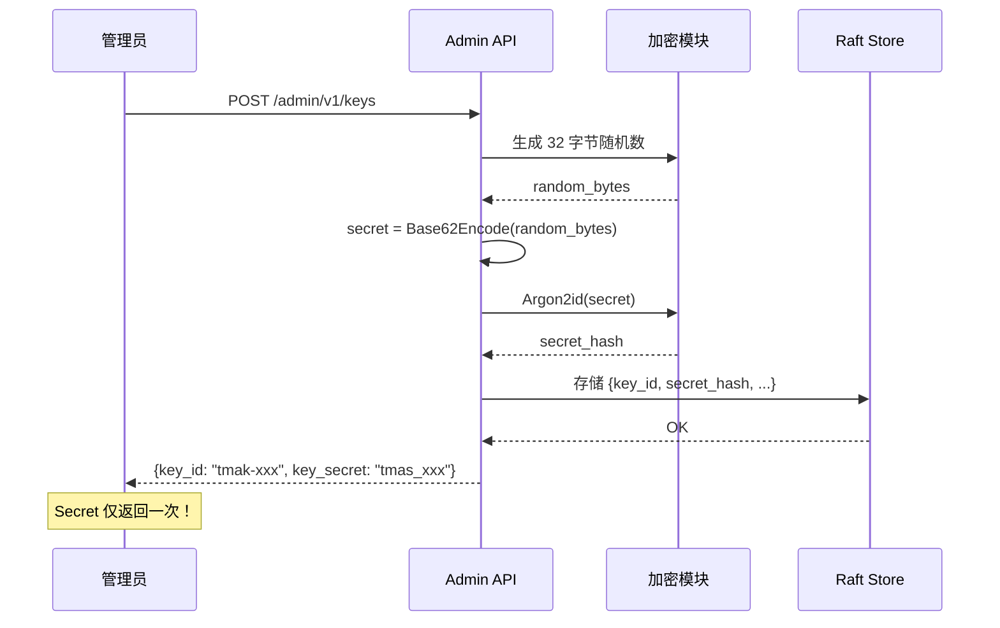
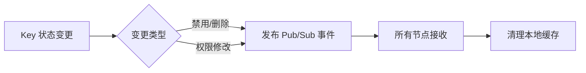
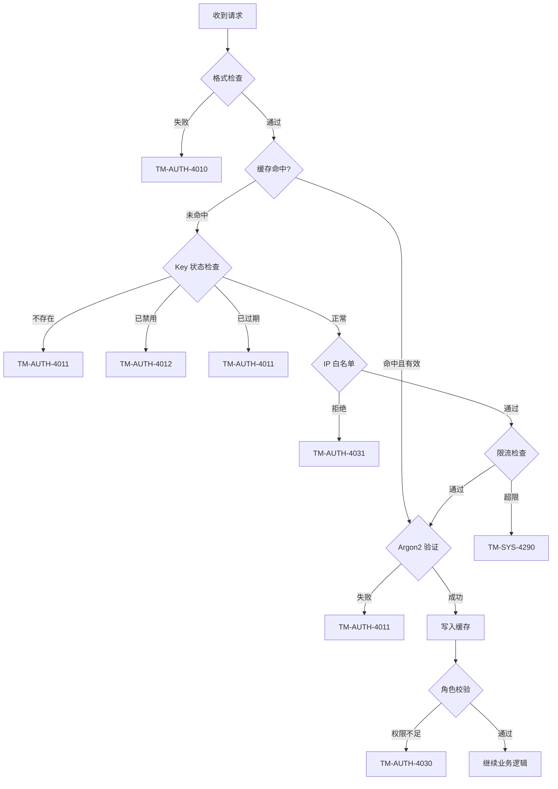
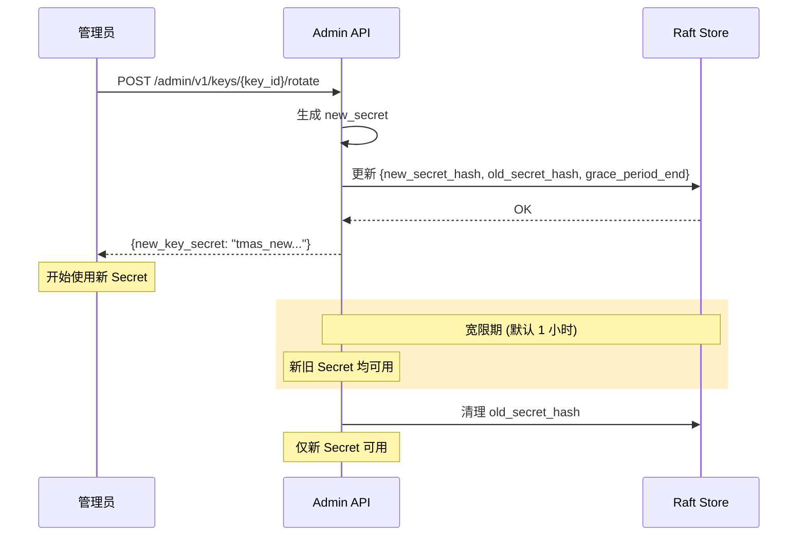

# DS-0201 - 安全与鉴权设计

**状态**: 草稿
**优先级**: P0
**来源**: RQ-0201-安全与鉴权体系.md
**作者**: Claude Code
**创建日期**: 2025-12-12
**最后更新**: 2025-12-18

## 1. 概述

本文档详细设计 TokMesh 的安全与鉴权体系，包括 API Key 管理、密码学实现、访问控制机制、数据加密策略以及核心防御措施。设计目标是在保障安全性的前提下，最大化性能和易用性。

## 2. API Key 管理体系

### 2.1 数据模型

**单一事实来源**: `specs/1-requirements/RQ-0201-安全与鉴权体系.md`。

本设计文档在此给出 `APIKey` 的设计级数据模型（字段名与角色枚举等），并实现其**鉴权逻辑**与**生命周期管理**。

#### 2.1.1 APIKey Go Struct 定义

```go
// APIKey 代表一个 API 访问密钥实体
type APIKey struct {
    KeyID           string            `json:"key_id"`            // tmak-xxxxxxxxxx, 唯一标识（公开）
    SecretHash      string            `json:"-"`                 // Argon2id 哈希值（不可见）
    OldSecretHash   string            `json:"-"`                 // 轮转时的旧 Secret 哈希（不可见）
    GracePeriodEnd  int64             `json:"grace_period_end"`  // 宽限期结束时间 (Unix MS)，0 表示无轮转
    Role            Role              `json:"role"`              // admin/issuer/validator/metrics
    Allowedlist     []string          `json:"allowedlist"`       // IP/CIDR 允许名单
    RateLimit       int               `json:"rate_limit"`        // QPS 限制
    ExpiresAt       int64             `json:"expires_at"`        // 绝对过期时间 (Unix MS)，0 表示永久
    Status          KeyStatus         `json:"status"`            // active/disabled
    Description     string            `json:"description"`       // 描述信息
    CreatedAt       int64             `json:"created_at"`        // 创建时间 (Unix MS)
    CreatedBy       string            `json:"created_by"`        // 创建者的 API Key ID 或 "system"
    LastUsed        int64             `json:"last_used"`         // 最后使用时间 (Unix MS)
    Version         uint64            `json:"version"`           // 版本号，用于乐观锁
}

// Role 角色枚举
type Role string

const (
    RoleMetrics   Role = "metrics"   // 仅监控指标访问
    RoleValidator Role = "validator" // 仅令牌校验与只读查询
    RoleIssuer    Role = "issuer"    // 会话/令牌写操作 + validator 能力
    RoleAdmin     Role = "admin"     // 系统管理全权限
)

// KeyStatus Key 状态枚举
type KeyStatus string

const (
    KeyStatusActive   KeyStatus = "active"   // 正常可用
    KeyStatusDisabled KeyStatus = "disabled" // 已禁用
)
```

**字段说明**:
- `KeyID`: 格式 `tmak-` + 26 字符小写 ULID（总长 31；见 `specs/1-requirements/RQ-0101-核心数据模型.md` 第 2 节），由服务端生成（公开可见）
- `SecretHash`: Argon2id 哈希值，PHC 格式存储（如 `$argon2id$v=19$m=16384...`），严禁暴露
- `OldSecretHash`: 轮转时保存的旧 Secret 哈希，宽限期内两者均可用
- `GracePeriodEnd`: 宽限期结束时间戳（Unix MS），超过此时间后 `OldSecretHash` 失效
- `Allowedlist`: IP/CIDR 列表，如 `["192.168.1.10", "10.0.0.0/8", "2001:db8::/64"]`
  - 单个 IP 等价于 `/32` (IPv4) 或 `/128` (IPv6)
  - 空列表表示不限制 IP
- `ExpiresAt`: 绝对过期时间，`0` 表示永久有效
- `LastUsed`: 最后使用时间，每次鉴权成功后异步更新（避免阻塞主路径）
- `Version`: 用于乐观锁（CAS），防止并发修改冲突

#### 2.1.2 数据约束

| 字段 | 类型 | 最大长度/约束 | 必填 |
|------|------|--------------|------|
| `KeyID` | string | 固定 `tmak-` + 26 字符小写 ULID（总长 31） | ✅ |
| `SecretHash` | string | PHC 格式，约 100 字符 | ✅ |
| `Role` | enum | `metrics/validator/issuer/admin` | ✅ |
| `Allowedlist` | []string | 最多 100 条 CIDR | ❌ |
| `RateLimit` | int | 1 - 1,000,000 (QPS) | ✅ |
| `Description` | string | 最多 256 字符 | ❌ |

#### 2.1.3 存储位置

- **Raft Store**: APIKey 数据存储在 Raft 共识层，确保集群一致性
- **本地缓存**: 验证缓存（见 3.2 节）存储在本地内存（LRU Cache）
- **持久化**: 通过 Raft Snapshot 持久化到磁盘

### 2.2 密钥生成流程



### 2.3 密码学参数

| 参数 | 值 | 说明 |
|------|-----|------|
| **算法** | Argon2id v1.3 | 抗 GPU/ASIC 攻击 |
| **内存** | 16 MB | 平衡安全与性能 |
| **迭代** | 2 次 | 对高熵 Secret 足够安全 |
| **并行度** | 2 | 适配多核 CPU |
| **Salt** | 16 字节随机 | PHC 格式存储 |

**配置项**: `security.auth.argon2.{memory, iterations, parallelism}`（其中 `memory` 单位为 KB）

### 2.4 Secret 格式

- **算法**: 32 字节 CSPRNG → Base62 编码
- **格式**: `tmas_<base62_encoded_32_bytes>`（总长约 48 字符）
- **敏感标记**: 使用下划线 `_` 表示敏感凭证

## 3. 验证缓存 (Validation Cache)

### 3.1 设计动机

Argon2 验证每次耗时 50-100ms，无法支撑高 QPS 场景。引入本地缓存避免重复计算。

### 3.2 缓存结构

```go
type AuthCache struct {
    cache *lru.Cache[string, *CacheEntry]
    ttl   time.Duration
}

type CacheEntry struct {
    Valid     bool       // 验证结果
    KeyMeta   *APIKey    // 关联的 Key 元数据
    ExpiresAt time.Time  // 缓存过期时间
}
```

### 3.3 缓存策略

| 参数 | 默认值 | 配置项 |
|------|--------|--------|
| **算法** | LRU | - |
| **容量** | 10,000 条 | `security.auth.cache_capacity` |
| **TTL** | 60 秒 | `security.auth.cache_ttl` |
| **Key** | `SHA256(key_id + secret)` | 快速哈希 |

### 3.4 缓存失效机制



**事件格式**: `{"type": "KEY_INVALIDATE", "key_id": "tmak-xxx"}`

## 4. 鉴权流程

### 4.0 来源 IP 判定（信任边界）

为避免客户端伪造 `Forwarded` / `X-Forwarded-For` / `X-Real-IP` 绕过 allow_list、污染审计与限流统计，TokMesh 必须实现“可信代理”模式：

- 默认：仅按直连 TCP 源 IP 判定 `client_ip`（不读取/不信任上述 Header）。
- 可选：当 `security.network.trusted_proxies`（CIDR 列表；见 `specs/1-requirements/RQ-0502-配置管理需求.md` 7.1.6）非空时：
  - 若 `tcp_remote_ip` 不命中 trusted_proxies：忽略 Header，`client_ip=tcp_remote_ip`。
  - 若 `tcp_remote_ip` 命中 trusted_proxies：允许解析 Header 得到 `client_ip`（解析优先级与回退规则以配置需求文档为准）。

审计与可观测性要求（默认安全）：
- 审计日志必须同时记录 `tcp_remote_ip` 与 `client_ip`（若两者不同，表示存在可信代理链路）。
- allow_list 与限流均以 `client_ip` 为口径（当 trusted_proxies 为空时，两者相同）。

### 4.1 完整校验流程



### 4.2 性能优化

- **快速路径**: 缓存命中时跳过 Argon2，直接校验 IP/限流/角色
- **并行校验**: IP 白名单和限流检查可并行执行
- **短路返回**: 任一步骤失败立即返回，不执行后续逻辑

## 5. 密钥轮转 (Key Rotation)

### 5.1 轮转流程



### 5.2 宽限期配置

- **默认时长**: 1 小时
- **配置项**: `security.auth.rotation_grace`
- **验证逻辑**: 按顺序尝试 `new_secret_hash` → `old_secret_hash`

## 6. 防重放机制 (Anti-Replay)

### 6.1 设计策略

| 维度 | 设计选择 | 说明 |
|------|----------|------|
| **适用操作** | POST | 写操作 |
| **时间戳窗口** | ±30 秒 | 容忍时钟偏差 |
| **Nonce 存储** | 本地内存 | TTL 60s |
| **跨节点同步** | 不同步 | 避免广播风暴 |

### 6.2 请求格式

```http
POST /sessions HTTP/1.1
Authorization: Bearer <api_key>   # 推荐
X-API-Key: <api_key>              # 兼容
X-Timestamp: 1702368000000
X-Nonce: abc123def456
```

### 6.3 风险缓解

| 风险 | 缓解措施 |
|------|----------|
| 跨节点重放 | 幂等设计 (DELETE/PUT) |
| 非幂等重放 (POST /sessions) | 用户配额兜底 (Max 50) |
| 时钟偏差 | 响应头返回服务器时间 |

**部署建议**: 负载均衡层启用会话保持 (Sticky Sessions)

## 7. 限流设计 (Rate Limiting)

### 7.1 算法选择

**令牌桶 (Token Bucket)** - 允许突发流量，平滑限流

### 7.2 实现

```go
type RateLimiter struct {
    limiters sync.Map // map[key_id]*rate.Limiter
}

func (r *RateLimiter) Allow(keyID string, limit int) bool {
    limiter, _ := r.limiters.LoadOrStore(keyID,
        rate.NewLimiter(rate.Limit(limit), limit)) // burst = limit
    return limiter.(*rate.Limiter).Allow()
}
```

### 7.3 响应头

```http
HTTP/1.1 429 Too Many Requests
X-RateLimit-Limit: 1000
X-RateLimit-Remaining: 0
X-RateLimit-Reset: 1702368060
Retry-After: 5
```

## 8. 数据加密设计

### 8.1 加密范围

| 数据类型 | 加密要求 | 算法 |
|----------|----------|------|
| WAL 日志 | ✅ 必须 | 自适应 (AES-GCM / ChaCha20) |
| Raft 日志 | ✅ 必须 | 自适应 |
| 快照文件 | ✅ 必须 | 自适应 |
| 内存数据 | ❌ 不加密 | - |

### 8.2 自适应加密实现

```go
// NewAdaptiveAEAD 根据 CPU 能力返回最优 AEAD 实例
func NewAdaptiveAEAD(key []byte) (cipher.AEAD, error) {
    if len(key) != 32 {
        return nil, ErrInvalidKeyLength
    }

    if cpu.X86.HasAES && cpu.X86.HasPCLMULQDQ {
        // Intel AES-NI 可用
        block, _ := aes.NewCipher(key)
        return cipher.NewGCM(block)
    }

    if cpu.ARM64.HasAES {
        // ARMv8 Crypto 可用
        block, _ := aes.NewCipher(key)
        return cipher.NewGCM(block)
    }

    // 软件回退: ChaCha20-Poly1305
    return chacha20poly1305.New(key)
}
```

### 8.3 统一约束

- **密钥长度**: 32 字节 (256-bit)
- **Nonce 长度**: 12 字节
- **配置项**: `security.storage.wal_encryption_key`

## 9. 本地紧急管理接口

### 9.1 设计目的

应对 API Key 全部丢失/过期/禁用的极端情况。

### 9.2 实现机制

| 平台 | 机制 | 路径 |
|------|------|------|
| Linux/macOS | Unix Domain Socket | `/var/run/tokmesh-server/tokmesh-server.sock` |
| Windows | Named Pipe | `\\.\pipe\tokmesh-server` |

### 9.3 安全控制

- **权限**: 仅限 TokMesh 运行用户及指定管理组
- **Linux/macOS**: `chmod 0660 /var/run/tokmesh-server/tokmesh-server.sock`
- **无网络暴露**: 严禁通过 TCP 暴露
- **默认 Admin 权限**: 通过此接口的命令获得最高权限

## 10. 验收标准 (Acceptance Criteria)

### 10.1 密钥安全
- [ ] API Key Secret 以 Argon2id 格式存储，非明文
- [ ] Secret 仅在创建时返回一次，后续查询不可见

### 10.2 访问控制
- [ ] IP 白名单正确拦截/放行
- [ ] 限流触发后返回 429 和 `Retry-After` 头
- [ ] 角色权限校验正确（`admin/issuer/validator/metrics`）

### 10.3 防重放
- [ ] 超时请求 (>30s) 被拒绝
- [ ] 重复 Nonce 被拒绝

### 10.4 密钥轮转
- [ ] 宽限期内新旧 Secret 均可用
- [ ] 宽限期后旧 Secret 失效

### 10.5 加密
- [ ] WAL/快照文件加密存储
- [ ] 硬件加速环境使用 AES-GCM
- [ ] 无硬件加速时回退 ChaCha20-Poly1305
