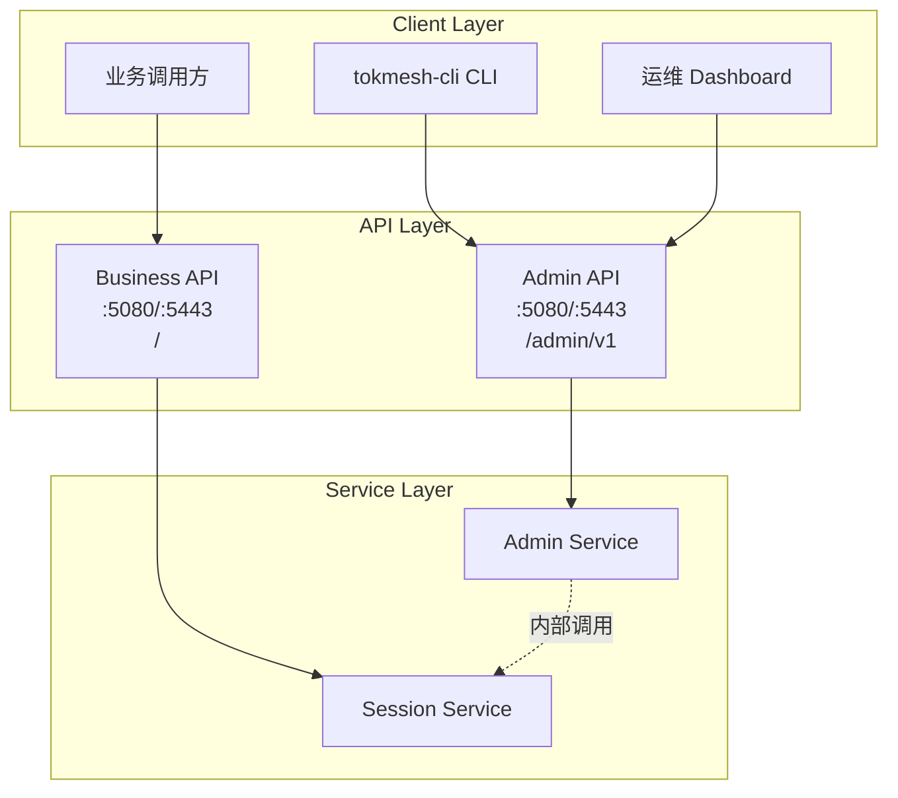
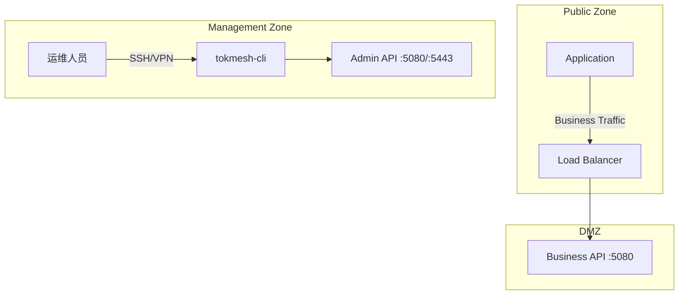

# DS-0302 - 管理接口设计

**状态**: 已批准
**优先级**: P1
**来源**: RQ-0304-管理接口规约.md
**作者**: Claude Code
**创建日期**: 2025-12-12
**最后更新**: 2025-12-18

## 1. 概述

本文档详细设计 TokMesh 的管理接口 (Admin API)，用于系统运维、监控和配置管理。这套接口供 CLI 工具 (`tokmesh-cli`) 和运维 Dashboard 使用，具有最高权限等级。

### 1.1 设计原则

1. **最小权限**: Admin API 仅对 `role=admin` 的 API Key 开放
2. **审计优先**: 所有管理操作必须记录审计日志
3. **安全隔离**: 默认仅绑定本地回环；如需对外暴露必须显式配置监听地址与安全边界
4. **幂等设计**: 所有写操作应设计为幂等，支持重试

### 1.2 与业务接口的关系



## 2. 技术架构

### 2.1 端口与路由

业务/管理端口复用：5080（明文）与 5443（TLS）暴露相同的路由集合（差异仅为是否加密传输）。

| 端口 | 端点 | 用途 | 鉴权 |
|------|------|------|------|
| 5080 | `/admin/v1/*` | 管理操作 | Admin API Key |
| 5443 | `/admin/v1/*` | 管理操作（TLS） | Admin API Key |
| 5080 | `/metrics` | Prometheus 抓取 | 可配置（默认需要鉴权） |
| 5443 | `/metrics` | Prometheus 抓取（TLS） | 可配置（默认需要鉴权） |
| 5080 | `/health` | 存活探针 | 无 |
| 5443 | `/health` | 存活探针（TLS） | 无 |
| 5080 | `/ready` | 就绪探针 | 无 |
| 5443 | `/ready` | 就绪探针（TLS） | 无 |
| 5080 | `/sessions`, `/sessions/{session_id}`, `/tokens/validate` | 业务接口 | `issuer`/`validator`/`admin`（按路由能力） |
| 5443 | `/sessions`, `/sessions/{session_id}`, `/tokens/validate` | 业务接口（TLS） | `issuer`/`validator`/`admin`（按路由能力） |

**响应格式（必须）**：
- 所有 **JSON** 响应统一使用 `specs/1-requirements/RQ-0301-业务接口规约-OpenAPI.md` 第 3 节的 envelope：`{code,message,request_id,timestamp,data}`。
- 例外：`/metrics`（Prometheus 文本格式）、下载类接口（`application/octet-stream`）不使用 JSON envelope。

**配置示例**:
```yaml
server:
  http:
    enabled: true
    address: "127.0.0.1:5080"    # 明文（默认仅本地访问）
  https:
    enabled: false                   # 默认禁用；证书就绪后显式启用
    address: "127.0.0.1:5443"    # HTTPS（默认仅本地访问）
telemetry:
  metrics:
    auth_enabled: true          # /metrics 是否需要鉴权（默认开启；显式设为 false 才关闭）
```

**生产启用 HTTPS 示例**:
```yaml
server:
  https:
    enabled: true
    address: "0.0.0.0:5443"
    tls:
      cert_file: "/etc/tokmesh-server/certs/server.crt"
      key_file: "/etc/tokmesh-server/certs/server.key"
      # client_ca_file: "/etc/tokmesh-server/certs/client-ca.crt"  # 可选：开启 mTLS
```

### 2.2 中间件链

Admin API 使用独立的中间件链，与业务 API 不同：

```mermaid
graph LR
    Request[请求] --> M1[RequestID]
    M1 --> M2[Tracing (P2 可选)]
    M2 --> M3[AdminAuthN]
    M3 --> M4[NetworkACL]
    M4 --> M5[AuditLog]
    M5 --> Handler[Handler]
```

| 中间件 | 职责 | 特殊说明 |
|--------|------|----------|
| RequestID | 生成请求唯一标识 | 同业务 API |
| Tracing | 分布式追踪 Span | **P2 可选**：`telemetry.tracing.enabled=true` 时生效（详见 DS-0402） |
| **AdminAuthN** | Admin 角色校验 | **拒绝非 admin 角色** |
| **NetworkACL** | 网络允许名单检查 | 可选：当 `security.auth.allow_list` 非空时启用（IP/CIDR 列表；单个 IP 等价于 `/32` 或 `/128`） |
| **AuditLog** | 审计日志记录 | **所有操作均记录** |

### 2.3 鉴权实现

#### 2.3.1 AdminAuthMiddleware (核心管理鉴权)

```go
// AdminAuthMiddleware 校验 admin 角色
func AdminAuthMiddleware(next http.Handler) http.Handler {
    return http.HandlerFunc(func(w http.ResponseWriter, r *http.Request) {
        apiKey := extractAPIKey(r)

        if apiKey == "" {
            writeJSON(w, 401, ErrorResponse{
                Code:    "TM-AUTH-4010",
                Message: "API Key not provided",
            })
            return
        }

        // 1. 校验 API Key 有效性
        keyInfo, err := authService.ValidateAPIKey(r.Context(), apiKey)
        if err != nil {
            writeJSON(w, 401, ErrorResponse{
                Code:    "TM-AUTH-4011",
                Message: "Invalid API Key",
            })
            return
        }

        // 2. 校验 admin 角色
        if keyInfo.Role != "admin" {
            writeJSON(w, 403, ErrorResponse{
                Code:    "TM-ADMIN-4030",
                Message: "Admin role required",
            })
            return
        }

        // 3. 注入上下文
        ctx := context.WithValue(r.Context(), "api_key_id", keyInfo.ID)
        ctx = context.WithValue(ctx, "operator_role", keyInfo.Role)
        next.ServeHTTP(w, r.WithContext(ctx))
    })
}
```

`extractAPIKey(r)` 的提取顺序（与全仓鉴权口径一致）：
1. 优先读取 `Authorization: Bearer <api_key>`
2. 兼容读取 `X-API-Key: <api_key>`
3. 两者都不存在则视为未提供凭证

> 说明：`<api_key>` 的实际格式为 `<key_id>:<key_secret>`（例如 `<key_id>:<key_secret>`）。

#### 2.3.2 MetricsAuthMiddleware (可观测性鉴权)

专门用于 `/metrics` 端点，支持配置化鉴权策略，避免 Prometheus 抓取被阻断。

```go
// MetricsAuthMiddleware 处理 Prometheus 指标鉴权
func MetricsAuthMiddleware(authRequired bool, next http.Handler) http.Handler {
    return http.HandlerFunc(func(w http.ResponseWriter, r *http.Request) {
        // 1. 若配置为无需鉴权，直接放行
        if !authRequired {
            next.ServeHTTP(w, r)
            return
        }

        // 2. 提取并校验 API Key
        apiKey := extractAPIKey(r)
        keyInfo, err := authService.ValidateAPIKey(r.Context(), apiKey)
        if err != nil {
            // Prometheus 通常只需要 HTTP 401/403，不需要 JSON Body
            w.WriteHeader(http.StatusUnauthorized)
            return
        }

        // 3. 角色校验：允许 'metrics' 或 'admin' 角色
        if keyInfo.Role != "metrics" && keyInfo.Role != "admin" {
            w.WriteHeader(http.StatusForbidden)
            return
        }

        next.ServeHTTP(w, r)
    })
}
```

## 3. 接口设计

### 3.1 系统状态 (System Status)

#### 3.1.1 获取状态摘要

```
GET /admin/v1/status/summary
```

**响应**:
```json
{
  "code": "OK",
  "message": "Success",
  "request_id": "req-abc123",
  "timestamp": 1702400000000,
  "data": {
    "uptime_seconds": 3600,
    "version": "1.2.0",
    "build_time": "2025-12-01T10:00:00Z",
    "node_id": "tmnd-abc123",
    "cluster_state": "healthy",
    "metrics": {
      "total_sessions": 120500,
      "active_sessions": 98000,
      "memory_usage_mb": 256,
      "current_qps": 1500,
      "goroutines": 150
    }
  }
}
```

**实现要点**:
- 从 runtime/metrics 和内部计数器聚合数据
- 轻量级查询，无锁或使用原子读取
- 缓存聚合结果 (1s TTL) 避免高频调用开销

#### 3.1.2 触发垃圾回收

```
POST /admin/v1/gc/trigger
```

**请求**:
```json
{
  "type": "expired_sessions"    // 可选: "expired_sessions" | "memory" | "all"
}
```

**响应**:
```json
{
  "code": "OK",
  "message": "Success",
  "request_id": "req-abc123",
  "timestamp": 1702400000000,
  "data": {
    "cleaned_count": 50,
    "duration_ms": 12,
    "freed_memory_mb": 8
  }
}
```

**实现要点**:
- `expired_sessions`: 清理过期会话 (同后台定时任务)
- `memory`: 触发 Go runtime.GC()
- 限流: 同类型 GC 请求 60s 内仅允许 1 次

### 3.2 API Key 管理

#### 3.2.1 创建 Key

```
POST /admin/v1/keys
```

**请求**:
```json
{
  "role": "validator",                      // "metrics" | "validator" | "issuer" | "admin"
  "description": "Production App Key",
  "allowedlist": ["10.0.0.0/8","192.168.1.10","2001:db8::/64"],          // 可选（IP/CIDR 列表）
  "rate_limit": 1000,                       // 可选，默认 1000 QPS
  "expires_at": 1735689600000               // 可选，Unix ms
}
```

**响应**:
```json
{
  "code": "OK",
  "message": "Success",
  "request_id": "req-abc123",
  "timestamp": 1702400000000,
  "data": {
    "key_id": "tmak-01jf8y2k4m5nqp7r9s1w3x5z7a8",
    "key_secret": "tmas_xxxxxxxxxxxxxxxxxxxxxxxxxxxx",
    "created_at": 1702368000000,
    "expires_at": 1735689600000,
    "warning": "Security Warning: This key is valid for more than 1 year. Please consider a shorter rotation cycle."
  }
}
```

**实现要点**:
- `key_id` 使用 `tmak-` 前缀 + 26 字符小写 ULID（总长 31；见 `specs/1-requirements/RQ-0101-核心数据模型.md` 第 2 节）
- `key_secret` 使用 `tmas_` 前缀 + 32 字节随机数 (Base62 编码)
- Secret 哈希后存储 (Argon2id)，原文仅返回一次
- 有效期 > 365 天时返回 warning 字段

#### 3.2.2 列出 Keys

```
GET /admin/v1/keys?page=1&size=20&role=validator
```

**响应**:
```json
{
  "code": "OK",
  "message": "Success",
  "request_id": "req-abc123",
  "timestamp": 1702400000000,
  "data": {
    "items": [
      {
        "key_id": "tmak-01jf8y2k4m5nqp7r9s1w3x5z7a8",
        "role": "validator",
        "description": "Production App",
        "created_at": 1702368000000,
        "expires_at": 1735689600000,
        "last_used_at": 1702400000000,
        "status": "active",
        "rate_limit": 1000
      }
    ],
    "pagination": {
      "page": 1,
      "size": 20,
      "total": 45
    }
  }
}
```

**注意**: 响应中**不包含** `key_secret`。

#### 3.2.3 更新 Key 状态

```
POST /admin/v1/keys/{key_id}/status
```

**请求**:
```json
{
  "status": "disabled"    // "active" | "disabled"
}
```

**响应**:
```json
{
  "code": "OK",
  "message": "Success",
  "request_id": "req-abc123",
  "timestamp": 1702400000000,
  "data": {
    "key_id": "tmak-01jf8y2k4m5nqp7r9s1w3x5z7a8",
    "status": "disabled",
    "updated_at": 1702400000000
  }
}
```

**实现要点**:
- 禁用后立即失效 (清除鉴权缓存)
- 禁用操作可逆，可重新激活

#### 3.2.4 轮转 Secret

```
POST /admin/v1/keys/{key_id}/rotate
```

**响应**:
```json
{
  "code": "OK",
  "message": "Success",
  "request_id": "req-abc123",
  "timestamp": 1702400000000,
  "data": {
    "key_id": "tmak-01jf8y2k4m5nqp7r9s1w3x5z7a8",
    "new_key_secret": "tmas_yyyyyyyyyyyyyyyyyyyyyyyyyyyy",
    "old_secret_valid_until": 1702403600000    // 旧密钥宽限期 (1h)
  }
}
```

**实现要点**:
- 生成新 Secret，旧 Secret 保留 1 小时宽限期
- 宽限期内两个 Secret 均有效
- 宽限期后旧 Secret 自动失效

### 3.3 备份与恢复

#### 3.3.1 触发快照

```
POST /admin/v1/backups/snapshots
```

**请求**:
```json
{
  "description": "Before upgrade v1.3"    // 可选
}
```

**响应**:
```json
{
  "code": "OK",
  "message": "Success",
  "request_id": "req-abc123",
  "timestamp": 1702400000000,
  "data": {
    "snapshot_id": "snap-20251212-143000",
    "size_bytes": 52428800,
    "path": "/var/tokmesh/snapshots/snap-20251212-143000.bak",
    "created_at": 1702391400000,
    "checksum": "sha256:abc123..."
  }
}
```

**实现要点**:
- 快照包含: Session 数据 + API Key 数据 + 元数据
- 使用原子文件写入，避免损坏
- 自动清理超过保留期的旧快照

#### 3.3.2 查询备份状态

```
GET /admin/v1/backups/restores/{job_id}
```

**响应**:
```json
{
  "code": "OK",
  "message": "Success",
  "request_id": "req-abc123",
  "timestamp": 1702400000000,
  "data": {
    "status": "IDLE",                        // "IDLE" | "RUNNING" | "FAILED"
    "last_snapshot": {
      "snapshot_id": "snap-20251212-143000",
      "created_at": 1702391400000,
      "size_bytes": 52428800
    },
    "snapshots_count": 5,
    "total_size_bytes": 262144000
  }
}
```

#### 3.3.3 下载备份

```
GET /admin/v1/backups/snapshots/{snapshot_id}/file
```

**响应**: `application/octet-stream` 二进制流

**实现要点**:
- 支持 Range 请求 (断点续传)
- 返回 `Content-Disposition: attachment; filename="..."`
- 大文件使用流式传输，避免内存溢出

#### 3.3.4 执行还原

```
POST /admin/v1/backups/restores
```

**方式一**: 使用已有快照
```json
{
  "snapshot_id": "snap-20251212-143000"
}
```

**方式二**: 上传备份文件
```
Content-Type: multipart/form-data
file: <binary>
```

**响应**:
```json
{
  "code": "OK",
  "message": "Success",
  "request_id": "req-abc123",
  "timestamp": 1702400000000,
  "data": {
    "job_id": "restore-20251212-150000",
    "status": "RUNNING",
    "progress": 0,
    "message": "Validating backup file..."
  }
}
```

**实现要点**:
- 上传文件大小限制: 默认 100MB；由 `server.http.max_body_size` 配置控制（见 `specs/1-requirements/RQ-0502-配置管理需求.md` 7.1.1）。超限返回 `TM-ADMIN-4130`（HTTP 413）。
- 校验文件 Magic Bytes: `TOKMESH_BAK_V1`
- 还原过程:
  1. 验证文件完整性 (Checksum)
  2. 停止接受新请求（进入维护态：`/ready` 返回 503，业务写操作返回 `TM-ADMIN-5031`）
  3. 加载快照数据
  4. 回放 WAL (如有)
  5. 恢复正常模式
- 还原期间返回 503 Service Unavailable

### 3.4 审计日志

#### 3.4.1 查询审计日志

```
GET /admin/v1/audit/logs?start_time=1702300000000&end_time=1702400000000&operator_id=tmak-01jf8y2k4m5nqp7r9s1w3x5z7a8&page=1&size=50
```

**响应**:
```json
{
  "code": "OK",
  "message": "Success",
  "request_id": "req-abc123",
  "timestamp": 1702400000000,
  "data": {
    "items": [
      {
        "id": "audit-xxxx",
        "timestamp": 1702391400000,
        "operator_id": "tmak-01jf8y2k4m5nqp7r9s1w3x5z7a8",
        "action": "KEY_CREATED",
        "resource": "tmak-01jf8y3k5m6nqp8r0s2w4x6z8b9",
        "ip_address": "10.0.1.50",
        "user_agent": "tokmesh-cli/1.2.0",
        "details": {
          "role": "validator",
          "description": "New production key"
        },
        "result": "SUCCESS"
      }
    ],
    "pagination": {
      "page": 1,
      "size": 50,
      "total": 128
    }
  }
}
```

**审计事件类型**:
| Action | 描述 |
|--------|------|
| KEY_CREATED | API Key 创建 |
| KEY_DISABLED | API Key 禁用 |
| KEY_ROTATED | API Key 轮转 |
| SNAPSHOT_CREATED | 快照创建 |
| RESTORE_STARTED | 还原开始 |
| RESTORE_COMPLETED | 还原完成 |
| CONFIG_UPDATED | 配置更新 |
| NODE_REMOVED | 节点移除 |
| NODE_RESET | 节点重置 |

### 3.5 集群管理

#### 3.5.1 查看节点列表

```
GET /admin/v1/cluster/nodes
```

**响应**:
```json
{
  "code": "OK",
  "message": "Success",
  "request_id": "req-abc123",
  "timestamp": 1702400000000,
  "data": {
    "nodes": [
      {
        "node_id": "tmnd-node1",
        "address": "10.0.1.10:5080",
        "status": "healthy",
        "role": "leader",
        "version": "1.2.0",
        "uptime_seconds": 86400,
        "last_heartbeat": 1702400000000,
        "metrics": {
          "sessions_count": 50000,
          "vnodes": 128
        }
      }
    ],
    "cluster_id": "cluster-abc123",
    "leader_id": "tmnd-node1"
  }
}
```

#### 3.5.2 移除节点

```
POST /admin/v1/cluster/nodes/{node_id}/remove
```

**响应**:
```json
{
  "code": "OK",
  "message": "Success",
  "request_id": "req-abc123",
  "timestamp": 1702400000000,
  "data": {
    "node_id": "tmnd-node2",
    "status": "removed",
    "message": "Node removed from cluster. Data migration in progress."
  }
}
```

**实现要点**:
- 触发数据迁移到其他节点
- 从 Raft 成员中移除
- 不可逆操作，需在请求中确认

#### 3.5.3 节点重置

```
POST /admin/v1/cluster/reset
```

**请求**:
```json
{
  "force": true,
  "confirm": "RESET_CONFIRM"    // 安全确认字符串
}
```

**响应**:
```json
{
  "code": "OK",
  "message": "Success",
  "request_id": "req-abc123",
  "timestamp": 1702400000000,
  "data": {
    "status": "reset_initiated",
    "message": "Node will restart in standalone mode. All data will be cleared."
  }
}
```

**警告**: 此操作将清空节点的 Cluster ID、Raft Log 和所有业务数据。

### 3.6 系统配置

#### 3.6.1 获取可热更新配置

```
GET /admin/v1/config
```

**响应**:
```json
{
  "code": "OK",
  "message": "Success",
  "request_id": "req-abc123",
  "timestamp": 1702400000000,
  "data": {
    "telemetry": {
      "logging": {
        "level": "info"
      }
    }
  }
}
```

#### 3.6.2 更新配置

```
POST /admin/v1/config/apply
```

**请求**:
```json
{
  "telemetry": {
    "logging": {
      "level": "debug"
    }
  }
}
```

**响应**:
```json
{
  "code": "OK",
  "message": "Success",
  "request_id": "req-abc123",
  "timestamp": 1702400000000,
  "data": {
    "updated": ["telemetry.logging.level"],
    "rejected": [],
    "message": "Configuration updated successfully"
  }
}
```

**可热更新配置项** (与 RQ-0502 对齐):
| 配置项 | 类型 | 说明 | 触发方式 |
|--------|------|------|----------|
| `telemetry.logging.level` | string | 日志级别 (debug/info/warn/error) | API / SIGHUP |

> **注意**: TLS 证书虽支持热加载，但通过文件监听/SIGHUP 信号触发，不通过此 API 更新。详见 RQ-0502。

**不可热更新** (需重启):
- 端口配置 (`server.*.address`)
- 存储路径 (`storage.wal.dir`, `storage.snapshot.dir`)
- 集群配置 (`cluster.*`)
- 会话配额 (`session.quota.*`)

#### 3.6.3 配置验证（上传配置并在服务端执行完整校验）

```
POST /admin/v1/config/validate
```

**请求**:
```json
{
  "config_yaml": "server:\\n  http:\\n    enabled: true\\n    address: 127.0.0.1:5080\\n"
}
```

**响应（通过）**:
```json
{
  "code": "OK",
  "message": "Success",
  "request_id": "req-abc123",
  "timestamp": 1702400000000,
  "data": {
    "valid": true,
    "errors": []
  }
}
```

**响应（失败）**:
```json
{
  "code": "OK",
  "message": "Success",
  "request_id": "req-abc123",
  "timestamp": 1702400000000,
  "data": {
    "valid": false,
    "errors": [
      { "code": "TM-CFG-1002", "field": "server.http.address", "message": "port out of range" }
    ]
  }
}
```

**实现要点**:
- 复用 `RQ-0502` 的配置解析与验证逻辑（Fail Fast，输出结构化错误列表）
- 错误码使用 `TM-CFG-*`（见 `specs/governance/error-codes.md`），HTTP 状态码使用 400

#### 3.6.4 触发热加载（仅热加载项：TLS 证书、日志级别等）

```
POST /admin/v1/config/reload
```

**响应**:
```json
{
  "code": "OK",
  "message": "Success",
  "request_id": "req-abc123",
  "timestamp": 1702400000000,
  "data": {
    "updated": ["server.https.tls", "telemetry.logging.level"],
    "ignored": ["server.http.address"]
  }
}
```

**说明**:
- 该接口不修改配置值，仅触发“从文件重新加载”已支持热加载的配置项
- TLS 证书热加载的具体行为以 `RQ-0502` 为准（文件监听/SIGHUP 机制）；本接口等价于触发一次 reload

### 3.7 WAL 日志管理

#### 3.7.1 查看 WAL 状态

```
GET /admin/v1/wal/status
```

**响应**:
```json
{
  "code": "OK",
  "message": "Success",
  "request_id": "req-abc123",
  "timestamp": 1702400000000,
  "data": {
    "enabled": true,
    "current_segment": "wal-0001234.log",
    "total_segments": 5,
    "total_size_bytes": 104857600,
    "oldest_entry_time": 1702300000000,
    "newest_entry_time": 1702400000000,
    "sync_mode": "sync"
  }
}
```

#### 3.7.2 读取 WAL 日志 (调试用)

```
GET /admin/v1/wal/logs?offset=0&limit=1024&follow=false
```

**响应**: `application/octet-stream` 二进制流

**实现要点**:
- `follow=true` 时使用 SSE 或 WebSocket 持续推送
- 仅用于调试，生产环境应限制访问

### 3.8 可观测性端点 (Observability Endpoints)

	> 这些端点与管理 API 共用端口（5080/5443），但有独立的鉴权策略。

#### 3.8.1 健康检查 (Liveness)

```
GET /health
```

**鉴权**: 无 (供 K8s Liveness Probe)

**响应**:
```json
{
  "code": "OK",
  "message": "Success",
  "request_id": "req-abc123",
  "timestamp": 1702400000000,
  "data": {
    "status": "healthy",
    "timestamp": 1702400000000
  }
}
```

**实现要点**:
- 仅检查进程存活，不依赖外部资源
- 响应时间 < 10ms
- 任何情况下都返回 200，除非进程即将终止

```go
func HealthHandler(w http.ResponseWriter, r *http.Request) {
    writeJSON(w, 200, map[string]any{
        "code":       "OK",
        "message":    "Success",
        "request_id": requestIDFromContext(r.Context()),
        "timestamp":  time.Now().UnixMilli(),
        "data": map[string]any{
            "status":    "healthy",
            "timestamp": time.Now().UnixMilli(),
        },
    })
}
```

#### 3.8.2 就绪检查 (Readiness)

```
GET /ready
```

**鉴权**: 无 (供 K8s Readiness Probe)

**响应 (就绪)**:
```json
{
  "code": "OK",
  "message": "Success",
  "request_id": "req-abc123",
  "timestamp": 1702400000000,
  "data": {
    "status": "ready",
    "checks": {
      "storage": "ok",
      "cluster": "ok"
    }
  }
}
```

**响应 (未就绪)**: HTTP 503
```json
{
  "code": "TM-SYS-5030",
  "message": "Service not ready",
  "request_id": "req-abc123",
  "timestamp": 1702400000000,
  "details": {
    "checks": {
      "storage": "ok",
      "cluster": "initializing"
    }
  }
}
```

**实现要点**:
- 检查存储层是否可用
- 检查集群状态 (单节点模式跳过)
- 服务启动中、还原中返回 503

```go
func ReadyHandler(w http.ResponseWriter, r *http.Request) {
    checks := map[string]string{
        "storage": checkStorage(),
        "cluster": checkCluster(),
    }

    allOk := true
    for _, v := range checks {
        if v != "ok" {
            allOk = false
            break
        }
    }

    status := "ready"
    httpCode := 200
    if !allOk {
        status = "not_ready"
        httpCode = 503
    }

    writeJSON(w, httpCode, map[string]any{
        "status": status,
        "checks": checks,
    })
}
```

#### 3.8.3 Prometheus 指标 (Metrics)

```
GET /metrics
```

**鉴权**: 可配置
- `telemetry.metrics.auth_enabled = true` (默认): 需 API Key
- `telemetry.metrics.auth_enabled = false`: 无鉴权（仅建议用于本机/受控内网；对外暴露会扩大信息泄露面）

**响应**: `text/plain; charset=utf-8` (Prometheus 格式)

**实现要点**:
- 使用 `prometheus/client_golang` 库
- 详细指标定义见 DS-0402-可观测性设计.md
- 配置鉴权时，Prometheus scrape 配置需添加 `Authorization: Bearer <api_key>`（见 `configs/telemetry/prometheus/README.md`）

```go
func MetricsHandler(metricsAuth bool) http.Handler {
    promHandler := promhttp.Handler()

    return http.HandlerFunc(func(w http.ResponseWriter, r *http.Request) {
        if metricsAuth {
            // 复用 API Key 鉴权逻辑
            if !validateAPIKey(r) {
                w.WriteHeader(401)
                return
            }
        }
        promHandler.ServeHTTP(w, r)
    })
}
```

**Prometheus 配置示例** (需鉴权时):
```yaml
	scrape_configs:
	  - job_name: 'tokmesh'
	    static_configs:
	      - targets: ['localhost:5080']
		    authorization:
		      type: Bearer
		      credentials: '<key_id>:<key_secret>'  # API Key（示例占位符）
```

## 4. 错误处理

### 4.1 Admin API 特定错误码

| 错误码 | HTTP | 描述 |
|--------|------|------|
| TM-ADMIN-4030 | 403 | 需要 Admin 角色 |
| TM-ADMIN-4031 | 403 | IP 不在白名单 |
| TM-ADMIN-4041 | 404 | 快照不存在 |
| TM-ADMIN-4091 | 409 | 操作冲突 (如还原进行中) |
| TM-ADMIN-4092 | 409 | 禁用最后一个管理员 Key |
| TM-ADMIN-4221 | 422 | 备份文件格式无效 |
| TM-ADMIN-4291 | 429 | 操作频率限制 (如 GC) |
| TM-ADMIN-5001 | 500 | 快照创建失败 |
| TM-ADMIN-5031 | 503 | 服务不可用 (还原中) |

### 4.2 错误响应格式

```json
{
  "code": "TM-ADMIN-4030",
  "message": "Admin role required for this operation",
  "request_id": "req-abc123",
  "timestamp": 1702400000000,
  "details": {
    "required_role": "admin",
    "current_role": "user"
  }
}
```

## 5. 安全设计

### 5.1 网络隔离



### 5.2 审计日志存储

- **存储位置**: 独立于业务数据，建议使用单独的存储路径
- **保留期**: 默认 90 天，可配置
- **格式**: JSON Lines，便于 ELK/Loki 采集
- **敏感字段**: `key_secret` 等敏感字段不记录原文

### 5.3 危险操作保护

| 操作 | 保护机制 |
|------|----------|
| 节点重置 | 需要 `confirm` 确认字符串 |
| 还原备份 | 还原前自动创建快照 |
| 删除节点 | 需要集群健康状态 |
| 禁用最后一个 Admin Key | 允许操作（显示警告），可通过 `localserver` 紧急恢复 |

## 6. 验收标准

### 6.1 鉴权测试
- [ ] 使用非 `role=admin` 的 Key 访问 `/admin/v1/*`，返回 403
- [ ] 使用无效 Key 访问，返回 401
- [ ] 使用 `role=admin` 的 Key 访问，返回正常数据

### 6.2 功能测试
- [ ] 创建 API Key，返回 `key_secret` 仅一次
- [ ] 轮转 Key 后，旧 Secret 在宽限期内有效
- [ ] 创建快照并下载，校验 Checksum 一致
- [ ] 执行还原，验证数据恢复正确

### 6.3 安全测试
- [ ] 上传非法文件 (.txt) 作为备份，被拒绝
- [ ] 从非白名单 IP 访问，被拒绝 (启用 ACL 时)
- [ ] 审计日志不包含敏感字段明文

### 6.4 性能测试
- [ ] `/status/summary` 响应时间 < 10ms
- [ ] 审计日志写入不阻塞请求处理

### 6.5 可观测性端点测试
- [ ] `/health` 无需鉴权，返回 200
- [ ] `/ready` 服务就绪后返回 200，启动中返回 503
- [ ] `/metrics` 默认需要鉴权：未提供 API Key 必须被拒绝；提供 `role=metrics`（或 `role=admin`）Key 必须允许
- [ ] `/metrics` 显式配置 `telemetry.metrics.auth_enabled=false` 后，可无鉴权访问（仅限内网/本机场景）
- [ ] 所有端点响应时间 < 50ms

---

## 7. Localserver 紧急管理通道

### 7.1 概述

`localserver` 是一个仅监听本地 Unix Domain Socket (Linux/macOS) 或 Named Pipe (Windows) 的紧急管理通道，用于在丢失所有 Admin API Key 时恢复系统管理能力。

**设计原则**:
- **物理访问即信任**: 能够访问服务器本地套接字的用户被视为可信
- **无需 API Key**: 所有 localserver 命令不需要 API Key 鉴权
- **最小功能集**: 仅提供紧急恢复必需的命令

### 7.2 监听地址

| 平台 | 默认路径 | 配置项 |
|------|----------|--------|
| Linux/macOS | `/var/run/tokmesh/admin.sock` | `server.local.socket_path` |
| Windows | `\\.\pipe\tokmesh-admin` | `server.local.pipe_name` |

**权限**:
- Socket 文件权限: `0600` (仅 owner 可读写)
- 建议: 仅 root 或 tokmesh 服务账户可访问

### 7.3 紧急命令

#### 7.3.1 创建紧急 Admin Key

```
EMERGENCY_CREATE_ADMIN_KEY [description]
```

**响应**:
```json
{
  "key_id": "tmak-01jf8y2k4m5nqp7r9s1w3x5z7a8",
  "key_secret": "tmas_xxxxxxxxxxxxxxxxxxxxxxxxxxxx",
  "created_at": 1702400000000,
  "warning": "This key was created via emergency channel. Please rotate it after normal access is restored."
}
```

**行为**:
- 创建一个 `role=admin` 的 API Key
- 无需任何鉴权
- 审计日志记录 `action=EMERGENCY_KEY_CREATED`，`operator_id=LOCAL_ADMIN`

#### 7.3.2 查看系统状态

```
STATUS
```

**响应**: 与 `GET /admin/v1/status/summary` 相同

#### 7.3.3 强制关闭

```
SHUTDOWN [grace_seconds]
```

**行为**: 触发优雅关闭，默认宽限期 30 秒

### 7.4 CLI 集成

`tokmesh-cli` 支持通过 localserver 连接：

```bash
# 连接到本地紧急通道
tokmesh-cli connect --local

# 创建紧急 Admin Key
tokmesh-cli apikey create-emergency --local

# 查看状态
tokmesh-cli system status --local
```

### 7.5 安全考量

| 风险 | 缓解措施 |
|------|----------|
| 未授权本地访问 | Socket 权限 0600，仅 owner 可访问 |
| 滥用紧急通道 | 所有操作记录审计日志，标记 `LOCAL_ADMIN` |
| Socket 文件泄露 | 默认路径在 `/var/run/`，重启后清理 |

### 7.6 验收标准

- [ ] Linux: Unix Socket 正常监听，权限为 0600
- [ ] Windows: Named Pipe 正常监听
- [ ] `EMERGENCY_CREATE_ADMIN_KEY` 成功创建 Admin Key
- [ ] 创建的 Key 可用于正常 Admin API 访问
- [ ] 审计日志正确记录紧急操作
