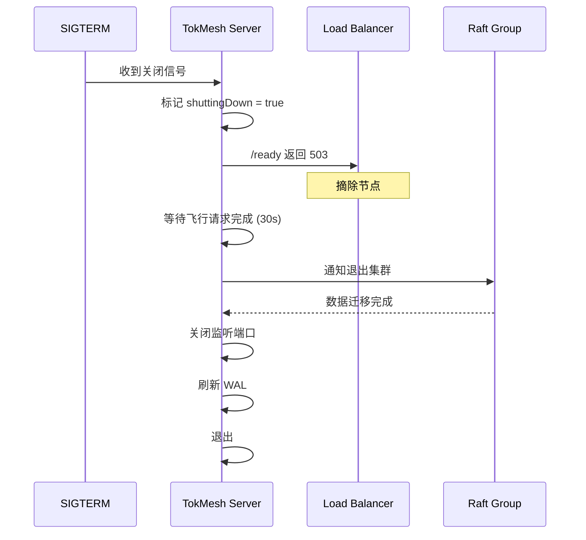

# DS-0501 - 部署与运维设计

**状态**: 草稿
**优先级**: P1
**来源**: RQ-0501-部署与交付需求.md, RQ-0502-配置管理需求.md
**作者**: yndnr
**创建日期**: 2025-12-12
**最后更新**: 2025-12-17

## 1. 概述

本文档详细设计 TokMesh 的部署架构、交付物规范和配置管理机制。设计目标是支持多种部署模式（单机、集群、容器化），提供灵活的配置管理能力，并确保运维便捷性。

## 2. 交付物规范

### 2.1 核心组件

| 组件 | 类型 | 说明 |
|------|------|------|
| `tokmesh-server` | 二进制 | 核心服务进程 |
| `tokmesh-cli` | 二进制 | CLI 管理工具（命令入口位于 `src/cmd/tokmesh-cli`） |
| `config.yaml` | 配置文件 | 默认配置模板 |

### 2.2 平台支持矩阵

| 平台 | 架构 | 包格式 | 服务管理 |
|------|------|--------|----------|
| Linux | amd64, arm64 | tar.gz, deb, rpm | systemd |
| Windows | amd64 | zip, msi | Windows Service |
| macOS | amd64, arm64 | tar.gz | launchd |
| Container | amd64, arm64 | Docker Image | - |

### 2.3 目录结构

#### 2.3.1 Linux (FHS 标准)

```
/usr/local/bin/
├── tokmesh-server          # 主服务
└── tokmesh-cli              # CLI 工具

/etc/tokmesh-server/
├── config.yaml             # 主配置文件
├── certs/                  # TLS 证书目录
│   ├── server.crt
│   ├── server.key
│   └── ca.crt
└── config.d/               # 配置片段目录 (可选)

/var/lib/tokmesh-server/
├── data/                   # 业务数据
│   ├── wal/                # WAL 日志
│   └── snapshots/          # 快照文件
└── raft/                   # Raft 状态

/var/log/tokmesh-server/
└── (可选)                   # 默认不创建；TokMesh 默认输出 stdout，如需落盘由部署侧采集（journald/agent）决定是否写入该目录

/var/run/tokmesh-server/
└── tokmesh-server.sock     # 紧急管理 Socket（UDS）
```

#### 2.3.2 Windows

```
%ProgramFiles%\TokMesh\
├── bin\
│   ├── tokmesh-server.exe
│   └── tokmesh-cli.exe

%ProgramData%\tokmesh-server\
├── config.yaml
├── certs\
├── data\
└── logs\   (可选；默认建议 stdout)
```

## 3. 服务管理

### 3.1 Linux (systemd)

```ini
# /etc/systemd/system/tokmesh-server.service
[Unit]
Description=TokMesh Server (Session/Token Cache Service)
After=network.target

[Service]
Type=simple
User=tokmesh
Group=tokmesh
ExecStart=/usr/local/bin/tokmesh-server --config /etc/tokmesh-server/config.yaml
ExecReload=/bin/kill -HUP $MAINPID
Restart=on-failure
RestartSec=5
LimitNOFILE=65535
RuntimeDirectory=tokmesh-server
RuntimeDirectoryMode=0750

# 安全加固
NoNewPrivileges=true
ProtectSystem=strict
ProtectHome=true
ReadWritePaths=/var/lib/tokmesh-server /var/run/tokmesh-server

[Install]
WantedBy=multi-user.target
```

#### 3.1.1 默认用户与目录权限（Linux）

安装包应创建系统用户/组 `tokmesh`（无登录能力），并设置目录最小权限：
- 用户：`tokmesh`（system user），shell 为 `/usr/sbin/nologin`（或等效 no-login 配置）
- 配置目录：`/etc/tokmesh-server/` 建议 `root:tokmesh`，`0750`；`config.yaml` 建议 `root:tokmesh`，`0640`
- 数据目录：`/var/lib/tokmesh-server/` 建议 `tokmesh:tokmesh`，`0750`
- 运行目录：`/var/run/tokmesh-server/`（或 `/run/tokmesh-server/`）建议 `tokmesh:tokmesh`，`0750`；Socket 为 `/var/run/tokmesh-server/tokmesh-server.sock`
  - 说明：推荐在 systemd unit 中配置 `RuntimeDirectory=tokmesh-server`，由 systemd 自动创建 `/run/tokmesh-server/`（通常 `/var/run` 会指向 `/run`）。

示例（仅说明意图）：
```bash
useradd --system --no-create-home --home-dir /var/lib/tokmesh-server --shell /usr/sbin/nologin tokmesh
install -d -o root   -g tokmesh -m 0750 /etc/tokmesh-server
install -d -o tokmesh -g tokmesh -m 0750 /var/lib/tokmesh-server /var/run/tokmesh-server
chmod 0640 /etc/tokmesh-server/config.yaml
```

### 3.2 Windows Service

```go
// Windows Service 实现
func (s *TokMeshService) Execute(args []string, r <-chan svc.ChangeRequest, changes chan<- svc.Status) (bool, uint32) {
    changes <- svc.Status{State: svc.StartPending}

    // 启动服务
    go s.server.Start()

    changes <- svc.Status{State: svc.Running, Accepts: svc.AcceptStop | svc.AcceptShutdown}

    for c := range r {
        switch c.Cmd {
        case svc.Stop, svc.Shutdown:
            changes <- svc.Status{State: svc.StopPending}
            s.server.Shutdown()
            return false, 0
        }
    }
    return false, 0
}
```

#### 3.2.1 服务账号与目录权限（Windows）

推荐策略：
- 不创建自定义本地用户 `tokmesh`（运维成本较高）。
- 使用 Windows 服务 SID（例如 `NT SERVICE\\TokMeshServer`）或受限内置账号（如 `LocalService`），并对配置/数据目录设置 ACL：
  - 配置：`%ProgramData%\\tokmesh-server\\config.yaml`（仅管理员与服务账号可读）
  - 证书：`%ProgramData%\\tokmesh-server\\certs\\`（私钥仅服务账号可读）
  - 数据：`%ProgramData%\\tokmesh-server\\data\\`（仅服务账号可写）

### 3.3 容器化部署

说明：容器环境建议仅通过 stdout 输出日志，由容器运行时/采集侧统一收集与转发（TokMesh 不内置主动 push 日志）。

#### 3.3.1 Dockerfile

```dockerfile
FROM golang:1.22-alpine AS builder
WORKDIR /app
COPY ./src ./src
WORKDIR /app/src
RUN CGO_ENABLED=0 go build -o tokmesh-server ./cmd/tokmesh-server
RUN CGO_ENABLED=0 go build -o tokmesh-cli    ./cmd/tokmesh-cli

FROM alpine:3.19
RUN apk --no-cache add ca-certificates tzdata
COPY --from=builder /app/src/tokmesh-server /usr/local/bin/
COPY --from=builder /app/src/tokmesh-cli    /usr/local/bin/
# 注意：示例使用 “server/minimal” profile；如需启用 HTTPS/集群等，请按需替换为对应 profile 配置文件。
COPY configs/server/minimal/config.yaml /etc/tokmesh-server/config.yaml

EXPOSE 5080 5443 5343
# 说明：Redis 兼容端口（6379/6380）为 P2 可选能力，默认禁用；仅在启用该能力时再对外暴露端口。
VOLUME ["/var/lib/tokmesh-server"]

ENTRYPOINT ["tokmesh-server"]
CMD ["--config", "/etc/tokmesh-server/config.yaml"]
```

#### 3.3.2 Kubernetes Deployment

```yaml
apiVersion: apps/v1
kind: StatefulSet
metadata:
  name: tokmesh
spec:
  serviceName: tokmesh
  replicas: 3
  selector:
    matchLabels:
      app: tokmesh
  template:
    metadata:
      labels:
        app: tokmesh
    spec:
      containers:
        - name: tokmesh
          image: tokmesh/tokmesh-server:latest
          ports:
            - containerPort: 5080
              name: http
            - containerPort: 5343
              name: cluster
          env:
            - name: TOKMESH_SERVER_HTTP_ADDRESS
              value: "0.0.0.0:5080"
            - name: TOKMESH_CLUSTER_ENABLED
              value: "true"
            - name: TOKMESH_CLUSTER_NODE_ID
              valueFrom:
                fieldRef:
                  fieldPath: metadata.name
            - name: POD_IP
              valueFrom:
                fieldRef:
                  fieldPath: status.podIP
            - name: TOKMESH_CLUSTER_LISTEN_ADDRESS
              value: "0.0.0.0:5343"
            - name: TOKMESH_CLUSTER_ADVERTISE_ADDRESS
              value: "$(POD_IP):5343"
            - name: TOKMESH_CLUSTER_DISCOVERY_SEEDS
              value: "tokmesh-0.tokmesh:5343,tokmesh-1.tokmesh:5343,tokmesh-2.tokmesh:5343"
          volumeMounts:
            - name: data
              mountPath: /var/lib/tokmesh-server
            - name: config
              mountPath: /etc/tokmesh-server
          livenessProbe:
            httpGet:
              path: /health
              port: 5080
            initialDelaySeconds: 10
          readinessProbe:
            httpGet:
              path: /ready
              port: 5080
            initialDelaySeconds: 5
      volumes:
        - name: config
          configMap:
            name: tokmesh-config
  volumeClaimTemplates:
  - metadata:
      name: data
    spec:
      accessModes: ["ReadWriteOnce"]
      resources:
        requests:
          storage: 10Gi
```

### 3.4 端口矩阵

TokMesh 默认对外服务端口及用途如下（含 TLS 端口与内部通信端口）：

| 端口 | 角色 | 协议 / 路径 | 推荐暴露范围 | 说明 |
|------|------|-------------|--------------|------|
| 5080 | 业务/管理 HTTP | HTTP `/sessions`, `/sessions/{session_id}`, `/tokens/validate`, `/admin/v1/*`, `/metrics`, `/health`, `/ready` | 内网 / 本机 | 明文端口，默认仅回环监听；适合内网或在上游终止 TLS 的场景 |
| 5443 | 业务/管理 HTTPS | HTTPS `/sessions`, `/sessions/{session_id}`, `/tokens/validate`, `/admin/v1/*`, `/metrics`, `/health`, `/ready` | 公网 / 内网 | TLS 端口，默认仅回环监听；如对外暴露必须显式配置并落实防火墙/TLS/API Key |
| 6379 | Redis 兼容 | RESP | 内网 | Redis 协议兼容端口，不建议直接暴露公网，可选启用 TLS |
| 6380 | Redis 兼容（TLS） | RESP over TLS | 内网 | 生产环境 Redis 协议端口（TLS） |
| 5343 | 集群内部通信 | Connect+Protobuf / Raft / Gossip | 仅集群内网 | 节点间通信端口，默认仅本地；启用集群时需显式配置为内网地址并启用 mTLS（不对外暴露） |

## 4. 配置管理

详细的配置加载机制、文件结构验证规则及热加载设计，请参阅专门的设计文档：

👉 **[DS-0502-配置管理设计.md](./DS-0502-配置管理设计.md)**

该文档涵盖了：
- 基于 Koanf 的配置加载与优先级处理 (**CLI > Env > File > Default**；以 `specs/1-requirements/RQ-0502-配置管理需求.md` 为唯一事实来源)
- 完整的配置结构定义
- 启动时配置验证逻辑
- TLS 证书热加载机制


## 5. 健康检查

### 5.1 端点定义

| 端点 | 用途 | 返回 |
|------|------|------|
| `/health` | 存活检查 (Liveness) | 进程存活即返回 200 |
| `/ready` | 就绪检查 (Readiness) | 服务就绪返回 200；未就绪返回 503 |

### 5.2 就绪条件

```go
func (s *Server) IsReady() bool {
    return s.walReady &&           // WAL 初始化完成
           s.raftReady &&          // Raft 加入集群
           s.indexReady &&         // 索引重建完成
           !s.shuttingDown         // 未在关闭中
}
```

## 6. 优雅关闭

### 6.1 关闭流程



### 6.2 超时配置

| 阶段 | 超时 | 配置项 |
|------|------|--------|
| 请求排空 | 30s | `server.shutdown.grace_period` |
| 集群退出 | 60s | `cluster.shutdown.timeout` |
| 总超时 | 120s | `server.shutdown.timeout` |

## 7. 验收标准 (Acceptance Criteria)

### 7.1 部署
- [ ] Linux 包安装后服务自动注册
- [ ] Windows 服务可通过 services.msc 管理
- [ ] Docker 镜像大小 < 100MB
- [ ] K8s StatefulSet 部署 3 节点集群成功

### 7.2 配置
- [ ] 环境变量覆盖配置文件
- [ ] 配置验证失败时拒绝启动
- [ ] 热加载日志级别生效
- [ ] 配置变更记录审计日志

### 7.3 服务管理
- [ ] systemctl reload 触发热加载
- [ ] 优雅关闭不丢失数据
- [ ] 健康检查正确反映服务状态

---

## 附录 A: 代码骨架

> **完整代码目录结构已独立为规范文档，详见：**
>
> 👉 **[specs/governance/code-skeleton.md](../governance/code-skeleton.md)**
>
> 该文档是代码组织的**单一事实来源 (Single Source of Truth)**，包含：
> - 完整目录结构树
> - 依赖边界规则
> - 模块职责说明
> - 设计决策记录
> - 文件清单统计

---

## 变更历史

| 日期 | 版本 | 变更说明 | 作者 |
|------|------|----------|------|
| 2025-12-17 | v1.3 | 代码骨架重构：storage 提升为独立顶级目录，cli/cmd→cli/command，service 文件去除 _svc 后缀 | yndnr |
| 2025-12-17 | v1.2 | 代码骨架审查修订：rpcserver→clusterserver, config 归属各进程目录, graceful→shutdown | yndnr |
| 2025-12-16 | v1.1 | 新增附录 A 完整代码骨架，统一项目代码结构定义 | yndnr |
| 2025-12-12 | v1.0 | 初始版本 | yndnr |
