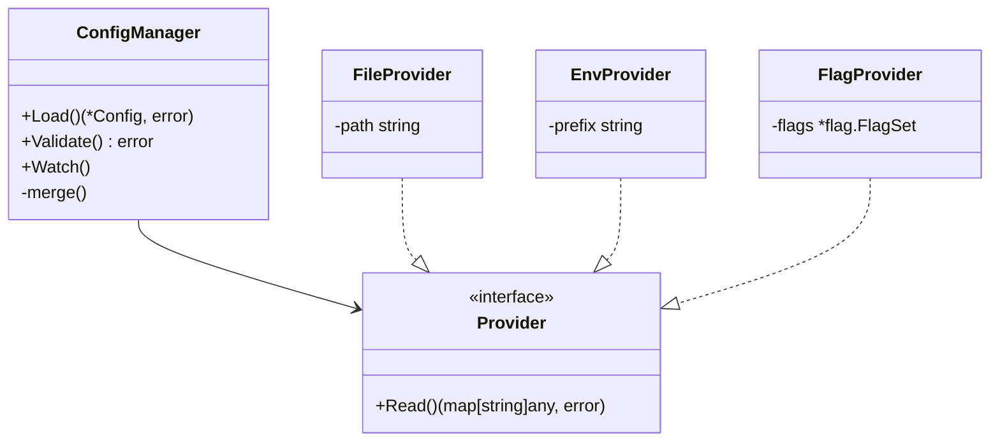

# DS-0502 - 配置管理设计

**状态**: 已批准
**优先级**: P0（加载/验证/默认安全），P1（热加载），P2（增强工具链）
**来源**: RQ-0502-配置管理需求.md
**作者**: AI Agent
**创建日期**: 2025-12-15
**最后更新**: 2025-12-18

## 1. 概述

本文档详细设计 TokMesh 服务端的配置管理模块，包括配置加载、多源合并、结构化验证以及 TLS 证书的热加载机制。

**设计目标**:
- 实现 RQ-0502 定义的配置优先级 (**CLI > Env > File > Default**)。
- 提供强类型的配置结构，避免 `map[string]interface{}` 带来的运行时错误。
- 实现“快速失败”机制，在启动阶段拦截无效配置。
- 仅针对 TLS 证书实现热加载，保证核心服务稳定性。

**关联文档**:
- `specs/1-requirements/RQ-0502-配置管理需求.md`: 配置项定义、默认值与验证规则的唯一事实来源。

## 2. 核心架构

### 2.1 模块职责

配置管理采用分层设计：
- `internal/infra/confloader/` - 配置加载机制（Koanf 封装），作为独立的基础设施层
- `internal/server/config/` - 服务端配置结构定义与验证
- `internal/cli/config/` - CLI 配置结构定义与验证



### 2.2 库选型

库选型决策参见 ADR：`specs/adrs/AD-0501-配置与CLI框架选型.md`。

**理由摘要**:
1. **轻量级**: 相比 Viper 更轻量且专注于配置加载。
2. **一致性**: 服务端与 CLI 复用同一套配置加载/覆盖规则。
3. **解耦**: Provider/Parser 分离，便于严格控制行为与错误输出。

## 3. 配置结构设计

配置结构体必须与 `RQ-0502` 定义的 YAML 结构严格对应，并使用 Tag 进行元数据标注。

> **注意**: 配置值类型/单位的权威约定见 `specs/1-requirements/RQ-0502-配置管理需求.md` 的 **2.4 节**。本设计文档仅描述实现落点。

### 3.1 值类型与单位解析（实现约束）

- `duration`：使用 Go `time.ParseDuration` 解析（如 `"100ms"`, `"60s"`, `"5m"`, `"2h"`），所有 `*_ttl/*_timeout/*_interval/*_grace_period` 等时间字段必须写单位。
- `size`：使用 `<number><unit>`（`B/KB/MB/GB`，不区分大小写；`KB=1024B`），用于 `storage.*` 下的字节大小配置（如 `"1MB"`, `"64MB"`, `"10GB"`）。
- `rate`：使用 `<number><unit>`（`Kbps/Mbps/Gbps` 或 `KBps/MBps/GBps`），用于 `cluster.rebalance.max_rate` 这类带宽/速率限制配置（如 `"20Mbps"`, `"100MBps"`, `"1Gbps"`）。
- `security.auth.argon2.memory`：为保持简单与避免歧义，采用 **整数 + 固定单位 KB** 的方式表达（如 `16384`）。

```go
package config

import "time"

// Config 是根配置结构
type Config struct {
    Server    ServerConfig    `koanf:"server"`
    Cluster   ClusterConfig   `koanf:"cluster"`
    Session   SessionConfig   `koanf:"session"`
    Security  SecurityConfig  `koanf:"security"`
    Storage   StorageConfig   `koanf:"storage"`
    Telemetry TelemetryConfig `koanf:"telemetry"`
}

type ServerConfig struct {
    HTTP     HTTPConfig       `koanf:"http"`
    HTTPS    HTTPSConfig      `koanf:"https"`
    Redis    PlainRedisConfig `koanf:"redis"`
    RedisTLS TLSRedisConfig   `koanf:"redis_tls"`
    Shutdown ShutdownConfig   `koanf:"shutdown"`
}

type HTTPConfig struct {
    Enabled bool   `koanf:"enabled"`
    Address string `koanf:"address"` // e.g., "127.0.0.1:5080"
    MaxBodySize string `koanf:"max_body_size"` // size 字符串，例如 "100MB"
}

type HTTPSConfig struct {
    Enabled bool      `koanf:"enabled"`
    Address string    `koanf:"address"`
    TLS     TLSConfig `koanf:"tls"`
}

type TLSConfig struct {
    CertFile     string `koanf:"cert_file"`
    KeyFile      string `koanf:"key_file"`
    ClientCAFile string `koanf:"client_ca_file"`
}

type ShutdownConfig struct {
    Timeout     time.Duration `koanf:"timeout"`
    GracePeriod time.Duration `koanf:"grace_period"`
}

// PlainRedisConfig 定义明文 Redis 协议的配置
type PlainRedisConfig struct {
    Enabled bool   `koanf:"enabled"`
    Address string `koanf:"address"`
}

// TLSRedisConfig 定义 TLS 加密 Redis 协议的配置
type TLSRedisConfig struct {
    Enabled bool      `koanf:"enabled"`
    Address string    `koanf:"address"`
    TLS     TLSConfig `koanf:"tls"`
}

type TelemetryConfig struct {
    Metrics TelemetryMetricsConfig `koanf:"metrics"`
    Logging TelemetryLoggingConfig `koanf:"logging"`
    Tracing TelemetryTracingConfig `koanf:"tracing"`
    Audit   TelemetryAuditConfig   `koanf:"audit"`
}

type TelemetryMetricsConfig struct {
    AuthEnabled bool `koanf:"auth_enabled"`
}

type TelemetryTracingConfig struct {
    Enabled       bool    `koanf:"enabled"`
    Endpoint      string  `koanf:"endpoint"`
    SamplingRatio float64 `koanf:"sampling_ratio"`
}

type TelemetryAuditConfig struct {
    RetentionDays int `koanf:"retention_days"` // 审计日志保留天数，范围: 1-3650
}

type TelemetryLoggingConfig struct {
    Level      string `koanf:"level"`
    DumpConfig bool   `koanf:"dump_config"`
}

// NetworkConfig 定义网络信任边界配置
type NetworkConfig struct {
	TrustedProxies []string `koanf:"trusted_proxies"` // CIDR 列表；为空表示不信任任何代理头
}

// ClusterConfig 定义分布式集群配置
type ClusterConfig struct {
    Enabled          bool                  `koanf:"enabled"`
    NodeID           string                `koanf:"node_id"`
    ListenAddress    string                `koanf:"listen_address"`
    AdvertiseAddress string                `koanf:"advertise_address"`
    TLS              TLSConfig             `koanf:"tls"`
    Discovery        DiscoveryConfig       `koanf:"discovery"`
    Bootstrap        BootstrapConfig       `koanf:"bootstrap"`
    Data             DataConfig            `koanf:"data"`
    Raft             RaftConfig            `koanf:"raft"`
    Rebalance        RebalanceConfig       `koanf:"rebalance"`
    Shutdown         ClusterShutdownConfig `koanf:"shutdown"`
}

type DiscoveryConfig struct {
    Seeds []string `koanf:"seeds"`
}

type BootstrapConfig struct {
    ExpectNodes int `koanf:"expect_nodes"`
}

type DataConfig struct {
    ReplicationFactor int `koanf:"replication_factor"`
}

type RaftConfig struct {
    SnapshotThreshold int `koanf:"snapshot_threshold"`
    TrailingLogs      int `koanf:"trailing_logs"`
}

type RebalanceConfig struct {
    MaxRate string        `koanf:"max_rate"` // rate 字符串，格式: "20Mbps"(bit/s) 或 "100MBps"(byte/s)；必须带单位
    MinTTL  time.Duration `koanf:"min_ttl"`  // 剩余 TTL 低于此值不迁移，范围: 0s-24h
}

type ClusterShutdownConfig struct {
    Timeout    time.Duration `koanf:"timeout"`
    ForceLeave bool          `koanf:"force_leave"`
}

// SessionConfig 定义会话配置
type SessionConfig struct {
    TTL   SessionTTLConfig   `koanf:"ttl"`
    Quota SessionQuotaConfig `koanf:"quota"`
}

type SessionTTLConfig struct {
    Default    time.Duration `koanf:"default"`
    Max        time.Duration `koanf:"max"`
    GCInterval time.Duration `koanf:"gc_interval"`
    SampleSize int           `koanf:"sample_size"`
}

type SessionQuotaConfig struct {
    MaxPerUser int `koanf:"max_per_user"`
}

// SecurityConfig 定义安全配置
type SecurityConfig struct {
    Auth       AuthConfig              `koanf:"auth"`
    AntiReplay AntiReplayConfig        `koanf:"anti_replay"`
    Storage    StorageSecurityConfig   `koanf:"storage"`
    Network    NetworkConfig           `koanf:"network"`
}

type AuthConfig struct {
    AllowList      []string      `koanf:"allow_list"` // IP/CIDR 列表
    RotationGrace  time.Duration `koanf:"rotation_grace"`
    CacheCapacity  int           `koanf:"cache_capacity"`
    CacheTTL       time.Duration `koanf:"cache_ttl"`
    Argon2         Argon2Config  `koanf:"argon2"`
}

type Argon2Config struct {
    Memory      int `koanf:"memory"` // 内存大小（单位: KB，整数），例如 16384 表示 16384KB（约 16MB）；范围: 8192-1048576
    Iterations  int `koanf:"iterations"`  // 迭代次数，范围: 1-10
    Parallelism int `koanf:"parallelism"` // 并行度，范围: 1-16
}

type AntiReplayConfig struct {
    TimestampWindow time.Duration `koanf:"timestamp_window"`
    NonceTTL        time.Duration `koanf:"nonce_ttl"`
    NonceCacheSize  int           `koanf:"nonce_cache_size"`
}

type StorageSecurityConfig struct {
    WALEncryptionKey string `koanf:"wal_encryption_key"` // WAL 加密密钥（32 字节 hex 编码，64 字符）；留空则自动生成
}

// StorageConfig 定义存储配置
type StorageConfig struct {
    WAL      WALConfig      `koanf:"wal"`
    Snapshot SnapshotConfig `koanf:"snapshot"`
    Badger   BadgerConfig   `koanf:"badger"`
}

type WALConfig struct {
    Dir          string        `koanf:"dir"`
    SyncMode     string        `koanf:"sync_mode"` // "sync" | "batch"
    SyncInterval time.Duration `koanf:"sync_interval"`
    BatchCount   int           `koanf:"batch_count"` // 批量写入条数
    BatchSize    string        `koanf:"batch_size"`  // size（字节大小），e.g. "1MB"
}

type SnapshotConfig struct {
    Dir            string        `koanf:"dir"`
    Interval       time.Duration `koanf:"interval"`
    Threshold      string        `koanf:"threshold"`       // size（字节大小），e.g. "1GB"；WAL 累积大小达到此阈值时触发快照
    RetentionCount int           `koanf:"retention_count"` // 保留最近 N 个快照文件，默认 5
    RetentionDays  int           `koanf:"retention_days"`  // 保留最近 N 天内的快照（与 count 取并集），默认 7
}

type BadgerConfig struct {
    GCInterval  time.Duration `koanf:"gc_interval"`
    GCThreshold float64       `koanf:"gc_threshold"`
    CacheSize   string        `koanf:"cache_size"` // size（字节大小），e.g. "64MB"
}
```

## 4. 加载与合并流程

### 4.1 加载逻辑

实现 `Load()` 函数，按照以下顺序加载并覆盖：

1. **默认值**: 构造一个填充了默认值的 `Config` 结构体。
2. **配置文件**:
   - 检查 `--config` 标志。
   - 若未指定，按顺序搜索（与 `RQ-0502` 第 2.2 节保持一致）：
     1. `TOKMESH_SERVER_CONFIG_FILE` 环境变量
     2. 系统默认配置目录（服务化默认路径）:
        - Linux: `/etc/tokmesh-server/config.yaml`
        - Windows: `%ProgramData%\tokmesh-server\config.yaml`
     3. `./config.yaml` (当前目录，仅开发/调试)
     4. `$XDG_CONFIG_HOME/tokmesh-server/config.yaml` (可选，默认 `~/.config/tokmesh-server/config.yaml`)
   - 使用 `koanf.Load(file.Provider(path), yaml.Parser())` 加载。
3. **环境变量**:
   - 加载 `TOKMESH_` 前缀的环境变量。
   - 使用 `koanf.Load(env.Provider("TOKMESH_", ".", func(s string) string { ... }), nil)`。
   - *变换函数*: 将 `TOKMESH_SERVER_HTTP_ADDRESS` 转换为 `server.http.address`。
4. **命令行参数**:
   - `tokmesh-server` 使用 stdlib `flag` 定义参数。
   - 将 flags 映射到配置键（例如 `--server.http.address` → `server.http.address`）。
   - 支持的命令行参数清单见 4.1.1 节。

### 4.1.1 命令行参数支持清单

以下配置项支持通过命令行参数覆盖（格式：`--<section>.<key>=<value>`，使用 kebab-case）：

**配置文件**:
- `--config` - 配置文件路径（特殊参数，不遵循 section.key 格式）

**服务端口与地址**:
- `--server.http.address` - HTTP 监听地址
- `--server.https.address` - HTTPS 监听地址
- `--server.http.enabled` - 是否启用 HTTP
- `--server.https.enabled` - 是否启用 HTTPS

**集群相关**:
- `--cluster.enabled` - 是否启用集群
- `--cluster.node-id` - 节点唯一标识符（映射配置键：`cluster.node_id`）
- `--cluster.listen-address` - 集群内部通信监听地址
- `--cluster.advertise-address` - 节点对外宣告地址

**日志与监控**:
- `--telemetry.logging.level` - 日志级别 (debug/info/warn/error)
- `--telemetry.logging.dump-config` - 是否输出完整配置（已脱敏）
- `--telemetry.metrics.auth-enabled` - /metrics 是否鉴权

**存储相关**:
- `--storage.wal.dir` - WAL 目录路径
- `--storage.snapshot.dir` - 快照目录路径
- `--storage.wal.sync-mode` - WAL 同步模式 (sync/batch)

**总计**: 15 个常用参数（可根据实现阶段反馈调整）

> **注意**: 命令行参数使用 kebab-case（如 `--cluster.listen-address`），会自动映射到配置结构的 snake_case 字段（如 `cluster.listen_address`）。

### 4.1.2 路径解析规则（避免部署误用）

配置中涉及文件/目录的路径（证书、私钥、WAL 目录、快照目录等）若为相对路径，必须按**配置文件所在目录**解析（而非进程工作目录）。生产环境建议使用绝对路径（如 `/etc/tokmesh-server/certs/server.crt`），示例配置可使用相对路径（如 `./certs/server.crt`）。

**实现方法**:

在 `Load()` 函数返回配置后，调用 `ResolveRelativePaths()` 方法将所有相对路径转换为绝对路径：

```go
// ResolveRelativePaths 将配置中的相对路径转换为基于配置文件目录的绝对路径
func (c *Config) ResolveRelativePaths(configFileDir string) {
    // 辅助函数：将相对路径转换为基于配置文件目录的绝对路径
    resolve := func(path string) string {
        if path == "" || filepath.IsAbs(path) {
            return path
        }
        return filepath.Join(configFileDir, path)
    }

    // 解析 HTTPS TLS 证书路径
    c.Server.HTTPS.TLS.CertFile = resolve(c.Server.HTTPS.TLS.CertFile)
    c.Server.HTTPS.TLS.KeyFile = resolve(c.Server.HTTPS.TLS.KeyFile)
    c.Server.HTTPS.TLS.ClientCAFile = resolve(c.Server.HTTPS.TLS.ClientCAFile)

    // 解析 Redis TLS 证书路径
    c.Server.RedisTLS.TLS.CertFile = resolve(c.Server.RedisTLS.TLS.CertFile)
    c.Server.RedisTLS.TLS.KeyFile = resolve(c.Server.RedisTLS.TLS.KeyFile)
    c.Server.RedisTLS.TLS.ClientCAFile = resolve(c.Server.RedisTLS.TLS.ClientCAFile)

    // 解析集群 TLS 证书路径
    c.Cluster.TLS.CertFile = resolve(c.Cluster.TLS.CertFile)
    c.Cluster.TLS.KeyFile = resolve(c.Cluster.TLS.KeyFile)
    c.Cluster.TLS.ClientCAFile = resolve(c.Cluster.TLS.ClientCAFile)

    // 解析存储目录路径
    c.Storage.WAL.Dir = resolve(c.Storage.WAL.Dir)
    c.Storage.Snapshot.Dir = resolve(c.Storage.Snapshot.Dir)
}
```

**调用示例**:

```go
// 在 Load() 函数中
func Load(configFilePath string) (*Config, error) {
    cfg := NewDefaultConfig() // 见 4.3 节

    // ... 加载配置文件、环境变量、命令行参数 ...

    // 解析相对路径
    if configFilePath != "" {
        cfg.ResolveRelativePaths(filepath.Dir(configFilePath))
    }

    return cfg, nil
}
```

### 4.2 默认值定义 (default.go)

默认值通过 `NewDefaultConfig()` 函数返回，所有默认值必须与 `RQ-0502` 第 7 节保持严格一致。

```go
package config

import "time"

// NewDefaultConfig 返回填充了默认值的配置结构
// 所有默认值必须与 RQ-0502 第 7 节保持严格一致
func NewDefaultConfig() *Config {
    return &Config{
        Server: ServerConfig{
            HTTP: HTTPConfig{
                Enabled: true,
                Address: "127.0.0.1:5080",
            },
            HTTPS: HTTPSConfig{
                Enabled: false,
                Address: "127.0.0.1:5443",
                TLS: TLSConfig{
                    CertFile:     "",
                    KeyFile:      "",
                    ClientCAFile: "",
                },
            },
            Redis: PlainRedisConfig{
                Enabled: false,
                Address: "127.0.0.1:6379",
            },
            RedisTLS: TLSRedisConfig{
                Enabled: false,
                Address: "127.0.0.1:6380",
                TLS: TLSConfig{
                    CertFile:     "",
                    KeyFile:      "",
                    ClientCAFile: "",
                },
            },
            Shutdown: ShutdownConfig{
                Timeout:     30 * time.Second,
                GracePeriod: 5 * time.Second,
            },
        },
        Cluster: ClusterConfig{
            Enabled:          false,
            NodeID:           "",
            ListenAddress:    "127.0.0.1:5343",
            AdvertiseAddress: "",
            TLS: TLSConfig{
                CertFile:     "",
                KeyFile:      "",
                ClientCAFile: "",
            },
            Discovery: DiscoveryConfig{
                Seeds: []string{},
            },
            Bootstrap: BootstrapConfig{
                ExpectNodes: 1,
            },
            Data: DataConfig{
                ReplicationFactor: 1,
            },
            Raft: RaftConfig{
                SnapshotThreshold: 10000,
                TrailingLogs:      1000,
            },
            Rebalance: RebalanceConfig{
                MaxRate: "20Mbps",
                MinTTL:  60 * time.Second,
            },
            Shutdown: ClusterShutdownConfig{
                Timeout:    60 * time.Second,
                ForceLeave: false,
            },
        },
        Session: SessionConfig{
            TTL: SessionTTLConfig{
                Default:    2 * time.Hour,
                Max:        720 * time.Hour, // 30 天
                GCInterval: 100 * time.Millisecond,
                SampleSize: 20,
            },
            Quota: SessionQuotaConfig{
                MaxPerUser: 50,
            },
        },
        Security: SecurityConfig{
            Auth: AuthConfig{
                AllowList:     []string{},
                RotationGrace: 1 * time.Hour,
                CacheCapacity: 10000,
                CacheTTL:      60 * time.Second,
                Argon2: Argon2Config{
                    Memory:      16384, // 16384 KB (约 16MB)
                    Iterations:  2,
                    Parallelism: 2,
                },
            },
            AntiReplay: AntiReplayConfig{
                TimestampWindow: 30 * time.Second,
                NonceTTL:        60 * time.Second,
                NonceCacheSize:  100000,
            },
            Storage: StorageSecurityConfig{
                WALEncryptionKey: "", // 留空，启动时自动生成并持久化
            },
        },
        Storage: StorageConfig{
            WAL: WALConfig{
                Dir:          "./data/wal",
                SyncMode:     "batch",
                SyncInterval: 1 * time.Second,
                BatchCount:   100,
                BatchSize:    "1MB",
            },
            Snapshot: SnapshotConfig{
                Dir:            "./data/snapshots",
                Interval:       1 * time.Hour,
                Threshold:      "1GB",
                RetentionCount: 5,
                RetentionDays:  7,
            },
            Badger: BadgerConfig{
                GCInterval:  5 * time.Minute,
                GCThreshold: 0.7,
                CacheSize:   "64MB",
            },
        },
        Telemetry: TelemetryConfig{
            Metrics: TelemetryMetricsConfig{
                AuthEnabled: true,
            },
            Tracing: TelemetryTracingConfig{
                Enabled:       false,
                Endpoint:      "",
                SamplingRatio: 0.01,
            },
            Audit: TelemetryAuditConfig{
                RetentionDays: 90,
            },
            Logging: TelemetryLoggingConfig{
                Level:      "info",
                DumpConfig: false,
            },
        },
    }
}
```

> **注意**: 默认值更新时必须同步更新 `RQ-0502` 第 7 节，保持文档一致性。

### 4.3 验证逻辑 (Validator)

验证必须在加载完成后立即执行。不依赖 Struct Tag 验证库，而是编写显式的验证方法以提供更好的错误信息。

**完整验证实现**（基于 RQ-0502 第 4.2 节规则清单）:

```go
package config

import (
    "crypto/tls"
    "encoding/hex"
    "errors"
    "fmt"
    "net"
    "os"
    "strconv"
    "strings"
    "time"
)

// Validate 执行完整的配置验证
func (c *Config) Validate() error {
    var errs []error

    // 4.2.1 端口与地址验证
    errs = append(errs, c.validateAddresses()...)

    // 4.2.1a HTTP Server Limits（请求体大小等）
    errs = append(errs, c.validateServerLimits()...)

    // 4.2.2 TLS 证书验证
    errs = append(errs, c.validateTLSCertificates()...)

    // 4.2.3 集群配置验证
    errs = append(errs, c.validateClusterConfig()...)

    // 4.2.4 存储配置验证
    errs = append(errs, c.validateStorageConfig()...)

    // 4.2.5 会话配置验证
    errs = append(errs, c.validateSessionConfig()...)

    // 4.2.6 安全配置验证
    errs = append(errs, c.validateSecurityConfig()...)

    // 4.2.7 可观测性配置验证
    errs = append(errs, c.validateTelemetryConfig()...)

    return errors.Join(errs...)
}

// ========== 4.2.1 端口与地址验证 ==========

func (c *Config) validateAddresses() []error {
    var errs []error

    // 验证各个监听地址
    if c.Server.HTTP.Enabled {
        if err := validateListenAddr(c.Server.HTTP.Address, "server.http.address"); err != nil {
            errs = append(errs, err)
        }
    }

    if c.Server.HTTPS.Enabled {
        if err := validateListenAddr(c.Server.HTTPS.Address, "server.https.address"); err != nil {
            errs = append(errs, err)
        }
    }

    if c.Server.Redis.Enabled {
        // 注意：`server.redis.enabled` 仅用于开发明文 Redis 端口；生产环境建议使用 `server.redis_tls.enabled`。
        if err := validateListenAddr(c.Server.Redis.Address, "server.redis.address"); err != nil {
            errs = append(errs, err)
        }
    }

    if c.Server.RedisTLS.Enabled {
        if err := validateListenAddr(c.Server.RedisTLS.Address, "server.redis_tls.address"); err != nil {
            errs = append(errs, err)
        }
    }

    if c.Cluster.Enabled {
        if err := validateListenAddr(c.Cluster.ListenAddress, "cluster.listen_address"); err != nil {
            errs = append(errs, err)
        }
        if c.Cluster.AdvertiseAddress == "" {
            errs = append(errs, newValidationError("cluster.advertise_address",
                "must be explicitly configured when cluster.enabled=true",
                "TM-CFG-1006"))
        } else if err := validateListenAddr(c.Cluster.AdvertiseAddress, "cluster.advertise_address"); err != nil {
            errs = append(errs, err)
        }
    }

    // 端口冲突检测
    if err := c.detectPortConflicts(); err != nil {
        errs = append(errs, err)
    }

    return errs
}

func validateListenAddr(addr string, fieldName string) error {
    host, portStr, err := net.SplitHostPort(addr)
    if err != nil {
        return newValidationError(fieldName,
            fmt.Sprintf("invalid address format: %v (expected host:port)", err),
            "TM-CFG-1001")
    }

    // 验证端口范围
    port, err := strconv.Atoi(portStr)
    if err != nil {
        return newValidationError(fieldName,
            fmt.Sprintf("invalid port '%s': %v", portStr, err),
            "TM-CFG-1001")
    }
    if port < 1 || port > 65535 {
        return newValidationError(fieldName,
            fmt.Sprintf("port %d out of range (must be 1-65535)", port),
            "TM-CFG-1002")
    }

    // 检查 host 是否可解析（警告级别，不阻止启动）
    if host != "" && host != "0.0.0.0" && host != "::" {
        if ip := net.ParseIP(host); ip == nil {
            // 尝试 DNS 解析
            if _, err := net.LookupHost(host); err != nil {
                // 返回警告而非致命错误
                fmt.Fprintf(os.Stderr, "[WARN] %s: host '%s' cannot be resolved: %v\n", fieldName, host, err)
            }
        }
    }

    return nil
}

func (c *Config) detectPortConflicts() error {
    ports := make(map[string]string) // map[host:port]fieldName

    addPort := func(addr string, fieldName string, enabled bool) error {
        if !enabled {
            return nil
        }
        if existing, ok := ports[addr]; ok {
            return newValidationError(fieldName,
                fmt.Sprintf("port conflict with %s (both use %s)", existing, addr),
                "TM-CFG-1005")
        }
        ports[addr] = fieldName
        return nil
    }

    var errs []error
    errs = append(errs, addPort(c.Server.HTTP.Address, "server.http.address", c.Server.HTTP.Enabled))
    errs = append(errs, addPort(c.Server.HTTPS.Address, "server.https.address", c.Server.HTTPS.Enabled))
    errs = append(errs, addPort(c.Server.Redis.Address, "server.redis.address", c.Server.Redis.Enabled))
    errs = append(errs, addPort(c.Server.RedisTLS.Address, "server.redis_tls.address", c.Server.RedisTLS.Enabled))
    errs = append(errs, addPort(c.Cluster.ListenAddress, "cluster.listen_address", c.Cluster.Enabled))

    return errors.Join(errs...)
}

// ========== 4.2.1a HTTP Server Limits（请求体大小等） ==========

func (c *Config) validateServerLimits() []error {
    var errs []error

    // server.http.max_body_size（用于 Admin Restore 上传等接口）
    if c.Server.HTTP.MaxBodySize == "" {
        return errs
    }
    sizeBytes, err := parseSize(c.Server.HTTP.MaxBodySize)
    if err != nil {
        errs = append(errs, newValidationError("server.http.max_body_size",
            fmt.Sprintf("invalid size format: %v", err),
            "TM-CFG-1001"))
        return errs
    }
    // 范围：1MB-1GB（与 RQ-0502 7.1.1 对齐）
    if sizeBytes < 1<<20 || sizeBytes > 1<<30 {
        errs = append(errs, newValidationError("server.http.max_body_size",
            fmt.Sprintf("must be between 1MB and 1GB (got %s)", c.Server.HTTP.MaxBodySize),
            "TM-CFG-1002"))
    }

    return errs
}

// ========== 4.2.2 TLS 证书验证 ==========

func (c *Config) validateTLSCertificates() []error {
    var errs []error

    // HTTPS TLS
    if c.Server.HTTPS.Enabled {
        if c.Server.HTTPS.TLS.CertFile == "" {
            errs = append(errs, newValidationError("server.https.tls.cert_file",
                "required when server.https.enabled=true",
                "TM-CFG-1006"))
        } else if err := validateFileExists(c.Server.HTTPS.TLS.CertFile, "server.https.tls.cert_file"); err != nil {
            errs = append(errs, err)
        }

        if c.Server.HTTPS.TLS.KeyFile == "" {
            errs = append(errs, newValidationError("server.https.tls.key_file",
                "required when server.https.enabled=true",
                "TM-CFG-1006"))
        } else if err := validateFileExists(c.Server.HTTPS.TLS.KeyFile, "server.https.tls.key_file"); err != nil {
            errs = append(errs, err)
        }

        // 验证证书与私钥匹配
        if c.Server.HTTPS.TLS.CertFile != "" && c.Server.HTTPS.TLS.KeyFile != "" {
            if err := validateCertKeyPair(c.Server.HTTPS.TLS.CertFile, c.Server.HTTPS.TLS.KeyFile, "server.https.tls"); err != nil {
                errs = append(errs, err)
            }
        }

        // 可选的客户端 CA
        if c.Server.HTTPS.TLS.ClientCAFile != "" {
            if err := validateFileExists(c.Server.HTTPS.TLS.ClientCAFile, "server.https.tls.client_ca_file"); err != nil {
                errs = append(errs, err)
            }
        }
    }

    // Redis TLS
    if c.Server.RedisTLS.Enabled {
        if c.Server.RedisTLS.TLS.CertFile == "" {
            errs = append(errs, newValidationError("server.redis_tls.tls.cert_file",
                "required when server.redis_tls.enabled=true",
                "TM-CFG-1006"))
        } else if err := validateFileExists(c.Server.RedisTLS.TLS.CertFile, "server.redis_tls.tls.cert_file"); err != nil {
            errs = append(errs, err)
        }

        if c.Server.RedisTLS.TLS.KeyFile == "" {
            errs = append(errs, newValidationError("server.redis_tls.tls.key_file",
                "required when server.redis_tls.enabled=true",
                "TM-CFG-1006"))
        } else if err := validateFileExists(c.Server.RedisTLS.TLS.KeyFile, "server.redis_tls.tls.key_file"); err != nil {
            errs = append(errs, err)
        }

        if c.Server.RedisTLS.TLS.CertFile != "" && c.Server.RedisTLS.TLS.KeyFile != "" {
            if err := validateCertKeyPair(c.Server.RedisTLS.TLS.CertFile, c.Server.RedisTLS.TLS.KeyFile, "server.redis_tls.tls"); err != nil {
                errs = append(errs, err)
            }
        }

        if c.Server.RedisTLS.TLS.ClientCAFile != "" {
            if err := validateFileExists(c.Server.RedisTLS.TLS.ClientCAFile, "server.redis_tls.tls.client_ca_file"); err != nil {
                errs = append(errs, err)
            }
        }
    }

    // Cluster TLS (启用集群时必须配置)
    if c.Cluster.Enabled {
        if c.Cluster.TLS.CertFile == "" {
            errs = append(errs, newValidationError("cluster.tls.cert_file",
                "required when cluster.enabled=true",
                "TM-CFG-1006"))
        } else if err := validateFileExists(c.Cluster.TLS.CertFile, "cluster.tls.cert_file"); err != nil {
            errs = append(errs, err)
        }

        if c.Cluster.TLS.KeyFile == "" {
            errs = append(errs, newValidationError("cluster.tls.key_file",
                "required when cluster.enabled=true",
                "TM-CFG-1006"))
        } else if err := validateFileExists(c.Cluster.TLS.KeyFile, "cluster.tls.key_file"); err != nil {
            errs = append(errs, err)
        }

        if c.Cluster.TLS.ClientCAFile == "" {
            errs = append(errs, newValidationError("cluster.tls.client_ca_file",
                "required for cluster mTLS when cluster.enabled=true",
                "TM-CFG-1006"))
        } else if err := validateFileExists(c.Cluster.TLS.ClientCAFile, "cluster.tls.client_ca_file"); err != nil {
            errs = append(errs, err)
        }

        if c.Cluster.TLS.CertFile != "" && c.Cluster.TLS.KeyFile != "" {
            if err := validateCertKeyPair(c.Cluster.TLS.CertFile, c.Cluster.TLS.KeyFile, "cluster.tls"); err != nil {
                errs = append(errs, err)
            }
        }
    }

    return errs
}

func validateFileExists(path string, fieldName string) error {
    if _, err := os.Stat(path); os.IsNotExist(err) {
        return newValidationError(fieldName,
            fmt.Sprintf("file not found: %s", path),
            "TM-CFG-1003")
    } else if err != nil {
        return newValidationError(fieldName,
            fmt.Sprintf("cannot access file %s: %v", path, err),
            "TM-CFG-1004")
    }
    return nil
}

func validateCertKeyPair(certFile, keyFile string, prefix string) error {
    cert, err := tls.LoadX509KeyPair(certFile, keyFile)
    if err != nil {
        return newValidationError(prefix,
            fmt.Sprintf("certificate and private key do not match: %v", err),
            "TM-CFG-1007")
    }

    // 检查证书有效期（警告，不阻止启动）
    if len(cert.Certificate) > 0 {
        x509Cert, err := x509.ParseCertificate(cert.Certificate[0])
        if err == nil {
            if time.Now().After(x509Cert.NotAfter) {
                fmt.Fprintf(os.Stderr, "[WARN] %s: certificate has expired (NotAfter: %s)\n",
                    prefix, x509Cert.NotAfter.Format(time.RFC3339))
            } else if time.Now().Add(30 * 24 * time.Hour).After(x509Cert.NotAfter) {
                fmt.Fprintf(os.Stderr, "[WARN] %s: certificate will expire soon (NotAfter: %s)\n",
                    prefix, x509Cert.NotAfter.Format(time.RFC3339))
            }
        }
    }

    return nil
}

// ========== 4.2.3 集群配置验证 ==========

func (c *Config) validateClusterConfig() []error {
    var errs []error

    // 当 seeds 非空但 enabled=false 时报错
    if !c.Cluster.Enabled && len(c.Cluster.Discovery.Seeds) > 0 {
        errs = append(errs, newValidationError("cluster.discovery.seeds",
            "seeds is configured but cluster.enabled=false (must explicitly enable cluster)",
            "TM-CFG-1006"))
    }

    if c.Cluster.Enabled {
        if c.Cluster.NodeID == "" {
            errs = append(errs, newValidationError("cluster.node_id",
                "must be explicitly configured when cluster.enabled=true",
                "TM-CFG-1006"))
        }

        // cluster.shutdown.force_leave：是否在 shutdown 时强制离开集群（用于加速收敛；具体行为由 cluster 实现任务定义）。

        // replication_factor 范围检查
        if c.Cluster.Data.ReplicationFactor < 1 {
            errs = append(errs, newValidationError("cluster.data.replication_factor",
                fmt.Sprintf("must be >= 1 (got %d)", c.Cluster.Data.ReplicationFactor),
                "TM-CFG-1002"))
        }

        // expect_nodes 范围检查
        if c.Cluster.Bootstrap.ExpectNodes < 1 {
            errs = append(errs, newValidationError("cluster.bootstrap.expect_nodes",
                fmt.Sprintf("must be >= 1 (got %d)", c.Cluster.Bootstrap.ExpectNodes),
                "TM-CFG-1002"))
        }

        // cluster.rebalance.max_rate 验证
        if c.Cluster.Rebalance.MaxRate != "" {
            if _, err := parseRate(c.Cluster.Rebalance.MaxRate); err != nil {
                errs = append(errs, newValidationError("cluster.rebalance.max_rate",
                    fmt.Sprintf("invalid rate format: %v", err),
                    "TM-CFG-1001"))
            }
        }

        // cluster.rebalance.min_ttl 验证 (0s-24h)
        if c.Cluster.Rebalance.MinTTL < 0 || c.Cluster.Rebalance.MinTTL > 24*time.Hour {
            errs = append(errs, newValidationError("cluster.rebalance.min_ttl",
                fmt.Sprintf("must be between 0s and 24h (got %s)", c.Cluster.Rebalance.MinTTL),
                "TM-CFG-1002"))
        }

        // cluster.shutdown.timeout 范围检查
        if c.Cluster.Shutdown.Timeout < 10*time.Second || c.Cluster.Shutdown.Timeout > 300*time.Second {
            errs = append(errs, newValidationError("cluster.shutdown.timeout",
                fmt.Sprintf("must be between 10s and 300s (got %s)", c.Cluster.Shutdown.Timeout),
                "TM-CFG-1002"))
        }

        // cluster.raft.snapshot_threshold 范围检查（>=1000）
        if c.Cluster.Raft.SnapshotThreshold < 1000 {
            errs = append(errs, newValidationError("cluster.raft.snapshot_threshold",
                fmt.Sprintf("must be >= 1000 (got %d)", c.Cluster.Raft.SnapshotThreshold),
                "TM-CFG-1002"))
        }

        // cluster.raft.trailing_logs 范围检查（>=100）
        if c.Cluster.Raft.TrailingLogs < 100 {
            errs = append(errs, newValidationError("cluster.raft.trailing_logs",
                fmt.Sprintf("must be >= 100 (got %d)", c.Cluster.Raft.TrailingLogs),
                "TM-CFG-1002"))
        }
    }

    // shutdown timeout 范围检查
    if c.Server.Shutdown.Timeout < 5*time.Second || c.Server.Shutdown.Timeout > 300*time.Second {
        errs = append(errs, newValidationError("server.shutdown.timeout",
            fmt.Sprintf("must be between 5s and 300s (got %s)", c.Server.Shutdown.Timeout),
            "TM-CFG-1002"))
    }

    if c.Server.Shutdown.GracePeriod < 0 || c.Server.Shutdown.GracePeriod > c.Server.Shutdown.Timeout {
        errs = append(errs, newValidationError("server.shutdown.grace_period",
            fmt.Sprintf("must be >= 0 and <= server.shutdown.timeout (got %s, timeout=%s)",
                c.Server.Shutdown.GracePeriod, c.Server.Shutdown.Timeout),
            "TM-CFG-1002"))
    }

    return errs
}

// ========== 4.2.4 存储配置验证 ==========

func (c *Config) validateStorageConfig() []error {
    var errs []error

    // WAL 目录验证
    if err := validateDirWritable(c.Storage.WAL.Dir, "storage.wal.dir"); err != nil {
        errs = append(errs, err)
    }

    // sync_mode 枚举值检查
    if c.Storage.WAL.SyncMode != "sync" && c.Storage.WAL.SyncMode != "batch" {
        errs = append(errs, newValidationError("storage.wal.sync_mode",
            fmt.Sprintf("must be 'sync' or 'batch' (got '%s')", c.Storage.WAL.SyncMode),
            "TM-CFG-1001"))
    }

    // sync_interval 范围检查（仅 batch 模式）
    if c.Storage.WAL.SyncMode == "batch" {
        if c.Storage.WAL.SyncInterval < time.Millisecond || c.Storage.WAL.SyncInterval > 10*time.Second {
            errs = append(errs, newValidationError("storage.wal.sync_interval",
                fmt.Sprintf("must be between 1ms and 10s (got %s)", c.Storage.WAL.SyncInterval),
                "TM-CFG-1002"))
        }
    }

    // Snapshot 目录验证
    if err := validateDirWritable(c.Storage.Snapshot.Dir, "storage.snapshot.dir"); err != nil {
        errs = append(errs, err)
    }

    // snapshot interval 范围检查
    if c.Storage.Snapshot.Interval < time.Hour || c.Storage.Snapshot.Interval > 168*time.Hour {
        errs = append(errs, newValidationError("storage.snapshot.interval",
            fmt.Sprintf("must be between 1h and 168h (got %s)", c.Storage.Snapshot.Interval),
            "TM-CFG-1002"))
    }

    // Badger GC 参数检查
    if c.Storage.Badger.GCInterval < 100*time.Millisecond || c.Storage.Badger.GCInterval > 10*time.Minute {
        errs = append(errs, newValidationError("storage.badger.gc_interval",
            fmt.Sprintf("must be between 100ms and 10m (got %s)", c.Storage.Badger.GCInterval),
            "TM-CFG-1002"))
    }

    if c.Storage.Badger.GCThreshold < 0.5 || c.Storage.Badger.GCThreshold > 1.0 {
        errs = append(errs, newValidationError("storage.badger.gc_threshold",
            fmt.Sprintf("must be between 0.5 and 1.0 (got %f)", c.Storage.Badger.GCThreshold),
            "TM-CFG-1002"))
    }

    // batch_size 范围检查 (4KB-64MB)
    if batchSize, err := parseSize(c.Storage.WAL.BatchSize); err != nil {
        errs = append(errs, newValidationError("storage.wal.batch_size",
            fmt.Sprintf("invalid size format: %v", err),
            "TM-CFG-1001"))
    } else if batchSize < 4*1024 || batchSize > 64*1024*1024 {
        errs = append(errs, newValidationError("storage.wal.batch_size",
            fmt.Sprintf("must be between 4KB and 64MB (got %s)", c.Storage.WAL.BatchSize),
            "TM-CFG-1002"))
    }

    // batch_count 范围检查 (1-100000)
    if c.Storage.WAL.BatchCount < 1 || c.Storage.WAL.BatchCount > 100000 {
        errs = append(errs, newValidationError("storage.wal.batch_count",
            fmt.Sprintf("must be between 1 and 100000 (got %d)", c.Storage.WAL.BatchCount),
            "TM-CFG-1002"))
    }

    // snapshot threshold 范围检查 (100MB-10GB)
    if threshold, err := parseSize(c.Storage.Snapshot.Threshold); err != nil {
        errs = append(errs, newValidationError("storage.snapshot.threshold",
            fmt.Sprintf("invalid size format: %v", err),
            "TM-CFG-1001"))
    } else if threshold < 100*1024*1024 || threshold > 10*1024*1024*1024 {
        errs = append(errs, newValidationError("storage.snapshot.threshold",
            fmt.Sprintf("must be between 100MB and 10GB (got %s)", c.Storage.Snapshot.Threshold),
            "TM-CFG-1002"))
    }

    // snapshot retention_count 范围检查 (1-100)
    if c.Storage.Snapshot.RetentionCount < 1 || c.Storage.Snapshot.RetentionCount > 100 {
        errs = append(errs, newValidationError("storage.snapshot.retention_count",
            fmt.Sprintf("must be between 1 and 100 (got %d)", c.Storage.Snapshot.RetentionCount),
            "TM-CFG-1002"))
    }

    // snapshot retention_days 范围检查 (1-365)
    if c.Storage.Snapshot.RetentionDays < 1 || c.Storage.Snapshot.RetentionDays > 365 {
        errs = append(errs, newValidationError("storage.snapshot.retention_days",
            fmt.Sprintf("must be between 1 and 365 (got %d)", c.Storage.Snapshot.RetentionDays),
            "TM-CFG-1002"))
    }

    // cache_size 范围检查 (16MB-1GB)
    if cacheSize, err := parseSize(c.Storage.Badger.CacheSize); err != nil {
        errs = append(errs, newValidationError("storage.badger.cache_size",
            fmt.Sprintf("invalid size format: %v", err),
            "TM-CFG-1001"))
    } else if cacheSize < 16*1024*1024 || cacheSize > 1024*1024*1024 {
        errs = append(errs, newValidationError("storage.badger.cache_size",
            fmt.Sprintf("must be between 16MB and 1GB (got %s)", c.Storage.Badger.CacheSize),
            "TM-CFG-1002"))
    }

    return errs
}

func validateDirWritable(dir string, fieldName string) error {
    info, err := os.Stat(dir)
    if os.IsNotExist(err) {
        // 尝试创建目录
        if err := os.MkdirAll(dir, 0755); err != nil {
            return newValidationError(fieldName,
                fmt.Sprintf("directory does not exist and cannot be created: %v", err),
                "TM-CFG-1003")
        }
        return nil
    } else if err != nil {
        return newValidationError(fieldName,
            fmt.Sprintf("cannot access directory: %v", err),
            "TM-CFG-1004")
    }

    if !info.IsDir() {
        return newValidationError(fieldName,
            fmt.Sprintf("%s is not a directory", dir),
            "TM-CFG-1001")
    }

    // 检查写权限（尝试创建临时文件）
    testFile := dir + "/.write_test"
    if err := os.WriteFile(testFile, []byte("test"), 0600); err != nil {
        return newValidationError(fieldName,
            fmt.Sprintf("directory is not writable: %v", err),
            "TM-CFG-1004")
    }
    os.Remove(testFile)

    return nil
}

// ========== 4.2.5 会话配置验证 ==========

func (c *Config) validateSessionConfig() []error {
    var errs []error

    // TTL default 范围检查
    if c.Session.TTL.Default < time.Minute || c.Session.TTL.Default > c.Session.TTL.Max {
        errs = append(errs, newValidationError("session.ttl.default",
            fmt.Sprintf("must be >= 1m and <= session.ttl.max (got %s, max=%s)",
                c.Session.TTL.Default, c.Session.TTL.Max),
            "TM-CFG-1002"))
    }

    // TTL max 范围检查
    oneYear := 365 * 24 * time.Hour
	    if c.Session.TTL.Max < c.Session.TTL.Default || c.Session.TTL.Max > oneYear {
	        errs = append(errs, newValidationError("session.ttl.max",
	            fmt.Sprintf("must be >= session.ttl.default and <= 8760h (got %s, default=%s)",
	                c.Session.TTL.Max, c.Session.TTL.Default),
	            "TM-CFG-1002"))
	    }

    // quota 范围检查
    if c.Session.Quota.MaxPerUser < 1 || c.Session.Quota.MaxPerUser > 10000 {
        errs = append(errs, newValidationError("session.quota.max_per_user",
            fmt.Sprintf("must be between 1 and 10000 (got %d)", c.Session.Quota.MaxPerUser),
            "TM-CFG-1002"))
    }

    // gc_interval 范围检查 (100ms-1m)
    if c.Session.TTL.GCInterval < 100*time.Millisecond || c.Session.TTL.GCInterval > time.Minute {
        errs = append(errs, newValidationError("session.ttl.gc_interval",
            fmt.Sprintf("must be between 100ms and 1m (got %s)", c.Session.TTL.GCInterval),
            "TM-CFG-1002"))
    }

    // sample_size 范围检查 (1-10000)
    if c.Session.TTL.SampleSize < 1 || c.Session.TTL.SampleSize > 10000 {
        errs = append(errs, newValidationError("session.ttl.sample_size",
            fmt.Sprintf("must be between 1 and 10000 (got %d)", c.Session.TTL.SampleSize),
            "TM-CFG-1002"))
    }

    return errs
}

// ========== 4.2.6 安全配置验证 ==========

func (c *Config) validateSecurityConfig() []error {
    var errs []error

    // IP/CIDR 白名单验证
    for i, cidr := range c.Security.Auth.AllowList {
        if err := validateCIDR(cidr); err != nil {
            errs = append(errs, newValidationError(
                fmt.Sprintf("security.auth.allow_list[%d]", i),
                fmt.Sprintf("invalid CIDR '%s': %v", cidr, err),
                "TM-CFG-1001"))
        }
    }

    // trusted_proxies（可信代理 CIDR 列表）验证
    for i, cidr := range c.Security.Network.TrustedProxies {
        if err := validateCIDR(cidr); err != nil {
            errs = append(errs, newValidationError(
                fmt.Sprintf("security.network.trusted_proxies[%d]", i),
                fmt.Sprintf("invalid CIDR '%s': %v", cidr, err),
                "TM-CFG-1001"))
        }
    }

    // cache_capacity 范围检查
    if c.Security.Auth.CacheCapacity < 1000 || c.Security.Auth.CacheCapacity > 100000 {
        errs = append(errs, newValidationError("security.auth.cache_capacity",
            fmt.Sprintf("must be between 1000 and 100000 (got %d)", c.Security.Auth.CacheCapacity),
            "TM-CFG-1002"))
    }

    // cache_ttl 范围检查
    if c.Security.Auth.CacheTTL < 10*time.Second || c.Security.Auth.CacheTTL > 5*time.Minute {
        errs = append(errs, newValidationError("security.auth.cache_ttl",
            fmt.Sprintf("must be between 10s and 5m (got %s)", c.Security.Auth.CacheTTL),
            "TM-CFG-1002"))
    }

    // rotation_grace 范围检查 (0s-24h)
    if c.Security.Auth.RotationGrace < 0 || c.Security.Auth.RotationGrace > 24*time.Hour {
        errs = append(errs, newValidationError("security.auth.rotation_grace",
            fmt.Sprintf("must be between 0s and 24h (got %s)", c.Security.Auth.RotationGrace),
            "TM-CFG-1002"))
    }

    // Argon2 参数验证
    // memory 范围检查 (8192-1048576 KB, 即 8MB-1GB)
    if c.Security.Auth.Argon2.Memory < 8192 || c.Security.Auth.Argon2.Memory > 1048576 {
        errs = append(errs, newValidationError("security.auth.argon2.memory",
            fmt.Sprintf("must be between 8192 and 1048576 KB (got %d)", c.Security.Auth.Argon2.Memory),
            "TM-CFG-1002"))
    }

    // iterations 范围检查 (1-10)
    if c.Security.Auth.Argon2.Iterations < 1 || c.Security.Auth.Argon2.Iterations > 10 {
        errs = append(errs, newValidationError("security.auth.argon2.iterations",
            fmt.Sprintf("must be between 1 and 10 (got %d)", c.Security.Auth.Argon2.Iterations),
            "TM-CFG-1002"))
    }

    // parallelism 范围检查 (1-16)
    if c.Security.Auth.Argon2.Parallelism < 1 || c.Security.Auth.Argon2.Parallelism > 16 {
        errs = append(errs, newValidationError("security.auth.argon2.parallelism",
            fmt.Sprintf("must be between 1 and 16 (got %d)", c.Security.Auth.Argon2.Parallelism),
            "TM-CFG-1002"))
    }

    // ========== Anti-Replay ==========

    // timestamp_window 范围检查 (1s-5m)
    if c.Security.AntiReplay.TimestampWindow < time.Second || c.Security.AntiReplay.TimestampWindow > 5*time.Minute {
        errs = append(errs, newValidationError("security.anti_replay.timestamp_window",
            fmt.Sprintf("must be between 1s and 5m (got %s)", c.Security.AntiReplay.TimestampWindow),
            "TM-CFG-1002"))
    }

    // nonce_ttl 范围检查 (1s-10m)
    if c.Security.AntiReplay.NonceTTL < time.Second || c.Security.AntiReplay.NonceTTL > 10*time.Minute {
        errs = append(errs, newValidationError("security.anti_replay.nonce_ttl",
            fmt.Sprintf("must be between 1s and 10m (got %s)", c.Security.AntiReplay.NonceTTL),
            "TM-CFG-1002"))
    }

    // nonce_cache_size 范围检查 (1000-1000000)
    if c.Security.AntiReplay.NonceCacheSize < 1000 || c.Security.AntiReplay.NonceCacheSize > 1000000 {
        errs = append(errs, newValidationError("security.anti_replay.nonce_cache_size",
            fmt.Sprintf("must be between 1000 and 1000000 (got %d)", c.Security.AntiReplay.NonceCacheSize),
            "TM-CFG-1002"))
    }

    // ========== Storage Security ==========

    // wal_encryption_key 验证（必须是 64 字符的 hex 字符串或留空）
    if c.Security.Storage.WALEncryptionKey != "" {
        if len(c.Security.Storage.WALEncryptionKey) != 64 {
            errs = append(errs, newValidationError("security.storage.wal_encryption_key",
                fmt.Sprintf("must be 64 characters (32 bytes hex encoded) or empty (got %d characters)",
                    len(c.Security.Storage.WALEncryptionKey)),
                "TM-CFG-1001"))
        } else {
            // 验证是否为有效的 hex 字符串
            if _, err := hex.DecodeString(c.Security.Storage.WALEncryptionKey); err != nil {
                errs = append(errs, newValidationError("security.storage.wal_encryption_key",
                    fmt.Sprintf("must be a valid hex string: %v", err),
                    "TM-CFG-1001"))
            }
        }
    }

    return errs
}

func validateCIDR(cidr string) error {
    // 尝试解析为单个 IP
    if ip := net.ParseIP(cidr); ip != nil {
        return nil // 单个 IP 有效
    }

    // 尝试解析为 CIDR
    _, _, err := net.ParseCIDR(cidr)
    return err
}

// ========== 4.2.7 可观测性配置验证 ==========

func (c *Config) validateTelemetryConfig() []error {
    var errs []error

    // logging.level 枚举值检查
    validLevels := map[string]bool{
        "debug": true,
        "info":  true,
        "warn":  true,
        "error": true,
    }
    if !validLevels[c.Telemetry.Logging.Level] {
        errs = append(errs, newValidationError("telemetry.logging.level",
            fmt.Sprintf("must be one of: debug, info, warn, error (got '%s')", c.Telemetry.Logging.Level),
            "TM-CFG-1001"))
    }

    // tracing 依赖检查
    if c.Telemetry.Tracing.Enabled {
        if c.Telemetry.Tracing.Endpoint == "" {
            errs = append(errs, newValidationError("telemetry.tracing.endpoint",
                "required when telemetry.tracing.enabled=true",
                "TM-CFG-1006"))
        }

        if c.Telemetry.Tracing.SamplingRatio < 0.0 || c.Telemetry.Tracing.SamplingRatio > 1.0 {
            errs = append(errs, newValidationError("telemetry.tracing.sampling_ratio",
                fmt.Sprintf("must be between 0.0 and 1.0 (got %f)", c.Telemetry.Tracing.SamplingRatio),
                "TM-CFG-1002"))
        }
    }

    // audit.retention_days 范围检查
    if c.Telemetry.Audit.RetentionDays < 1 || c.Telemetry.Audit.RetentionDays > 3650 {
        errs = append(errs, newValidationError("telemetry.audit.retention_days",
            fmt.Sprintf("must be between 1 and 3650 days (got %d)", c.Telemetry.Audit.RetentionDays),
            "TM-CFG-1002"))
    }

    return errs
}

// ========== 辅助函数 ==========

// ValidationError 配置验证错误
type ValidationError struct {
    Field   string
    Message string
    Code    string
}

func (e *ValidationError) Error() string {
    return fmt.Sprintf("[%s] %s: %s", e.Code, e.Field, e.Message)
}

func newValidationError(field, message, code string) error {
    return &ValidationError{
        Field:   field,
        Message: message,
        Code:    code,
    }
}

// parseRate 解析 rate 字符串（如 "20Mbps", "100MBps", "1Gbps"）为 bit/s
// 支持单位: Kbps, Mbps, Gbps (bit/s) 或 KBps, MBps, GBps (byte/s)
func parseRate(s string) (int64, error) {
    s = strings.TrimSpace(s)
    if len(s) == 0 {
        return 0, fmt.Errorf("empty rate string")
    }

    // 提取数字部分
    var numStr string
    var unit string
    for i, c := range s {
        if (c >= '0' && c <= '9') || c == '.' {
            numStr += string(c)
        } else {
            unit = s[i:]
            break
        }
    }

    num, err := strconv.ParseFloat(numStr, 64)
    if err != nil {
        return 0, fmt.Errorf("invalid number: %s", numStr)
    }

    var bitsPerSecond int64
    switch unit {
    case "Kbps":
        bitsPerSecond = int64(num * 1000)
    case "Mbps":
        bitsPerSecond = int64(num * 1000 * 1000)
    case "Gbps":
        bitsPerSecond = int64(num * 1000 * 1000 * 1000)
    case "KBps":
        bitsPerSecond = int64(num * 8 * 1024)
    case "MBps":
        bitsPerSecond = int64(num * 8 * 1024 * 1024)
    case "GBps":
        bitsPerSecond = int64(num * 8 * 1024 * 1024 * 1024)
    default:
        return 0, fmt.Errorf("unknown rate unit: %s (expected Kbps/Mbps/Gbps or KBps/MBps/GBps)", unit)
    }

    return bitsPerSecond, nil
}

// parseSize 解析 size 字符串（如 "1MB", "64KB", "1GB"）为字节数
// 支持单位: B, KB, MB, GB (大小写不敏感, KB=1024B)
func parseSize(s string) (int64, error) {
    s = strings.TrimSpace(s)
    if len(s) == 0 {
        return 0, fmt.Errorf("empty size string")
    }

    // 提取数字和单位
    var numStr string
    var unit string
    for i, c := range s {
        if c >= '0' && c <= '9' || c == '.' {
            numStr += string(c)
        } else {
            unit = strings.ToUpper(s[i:])
            break
        }
    }

    num, err := strconv.ParseFloat(numStr, 64)
    if err != nil {
        return 0, fmt.Errorf("invalid number: %s", numStr)
    }

    var multiplier int64
    switch unit {
    case "B", "":
        multiplier = 1
    case "KB":
        multiplier = 1024
    case "MB":
        multiplier = 1024 * 1024
    case "GB":
        multiplier = 1024 * 1024 * 1024
    default:
        return 0, fmt.Errorf("unknown size unit: %s", unit)
    }

    return int64(num * float64(multiplier)), nil
}
```

**验证执行流程**:

```go
// main.go 中的用法
func main() {
    cfg, err := config.Load()
    if err != nil {
        log.Fatalf("Failed to load configuration: %v", err)
    }

    if err := cfg.Validate(); err != nil {
        // 格式化输出所有验证错误
        if merr, ok := err.(interface{ Unwrap() []error }); ok {
            fmt.Fprintf(os.Stderr, "[FATAL] Configuration validation failed:\n\n")
            for i, e := range merr.Unwrap() {
                fmt.Fprintf(os.Stderr, "Error %d/%d: %v\n\n", i+1, len(merr.Unwrap()), e)
            }
        } else {
            fmt.Fprintf(os.Stderr, "[FATAL] Configuration validation failed: %v\n", err)
        }
        os.Exit(1)
    }

    // 验证通过，继续启动服务
    log.Println("[INFO] Configuration validated successfully")
}
```

## 5. 配置热加载设计

**策略**: 仅针对 TLS 证书和日志级别进行热加载，其他配置变更需重启。

**支持热加载的配置项**:
| 配置项 | 触发方式 | 说明 |
|--------|----------|------|
| `server.https.tls.*` | 文件监听 / SIGHUP | HTTPS TLS 证书 |
| `cluster.tls.*` | 文件监听 / SIGHUP | 集群 mTLS 证书 |
| `server.redis_tls.tls.*` | 文件监听 / SIGHUP | Redis TLS 证书 |
| `telemetry.logging.level` | SIGHUP | 日志级别动态调整 |

### 5.1 组件设计

创建一个 `CertManager` 组件，负责证书的加载、监听和提供 `GetCertificate` 回调。

```go
type CertManager struct {
    certFile string
    keyFile  string
    cert     *tls.Certificate
    mu       sync.RWMutex
    watcher  *fsnotify.Watcher
}

// GetCertificate 用于 tls.Config.GetCertificate
func (m *CertManager) GetCertificate(hello *tls.ClientHelloInfo) (*tls.Certificate, error) {
    m.mu.RLock()
    defer m.mu.RUnlock()
    return m.cert, nil
}
```

### 5.2 监听流程

1. **初始化**: 启动时加载证书，若失败则根据配置决定是否致命（HTTPS Enabled 时致命）。
2. **监听**: 使用 `fsnotify` 监听证书文件所在**目录**（避免 Vim 等编辑器原子保存导致的 inode 变更问题）。
3. **重载**: 
   - 收到 `WRITE` 或 `RENAME` 事件。
   - 延时 100ms（去抖动）。
   - 读取新证书并解析 (`tls.LoadX509KeyPair`)。
   - **验证**: 只有新证书解析成功，才获取写锁更新 `m.cert`。
   - **日志**: 记录 INFO 日志 "TLS certificate reloaded successfully" 或 ERROR 日志。

## 6. 审计与脱敏

在 `Load()` 成功后，必须记录“配置审计日志”，用于排查“实际生效配置与预期不一致”的问题。

**默认行为（推荐）**：仅打印配置摘要（降低生产环境信息暴露面），例如：
- 配置版本与来源（file/env/flag）
- 关键开关（HTTP/HTTPS enabled、Redis enabled、telemetry 开关）
- 监听地址（`server.*.address`）

**显式开启才允许**：打印完整“生效配置”（已脱敏），用于调试：
- 配置项：`telemetry.logging.dump_config=true`（默认 `false`）
- 说明：即使已脱敏，完整配置仍可能暴露拓扑/路径等信息，不建议在生产环境长期开启

**脱敏实现**:
实现 `MarshalJSON` 或专门的 `Sanitize()` 方法，将敏感字段（如 `Security.Storage.WALEncryptionKey`）替换为 `***REDACTED***`。

```go
func (c *Config) LogConfigSummary() {
    logger.Info("Config summary",
        slog.String("server_http_address", c.Server.HTTP.Address),
        slog.Bool("server_http_enabled", c.Server.HTTP.Enabled),
        slog.Bool("server_https_enabled", c.Server.HTTPS.Enabled),
        slog.Bool("telemetry.metrics.auth_enabled", c.Telemetry.Metrics.AuthEnabled),
    )
}

func (c *Config) LogEffectiveConfig() {
    safeConfig := c.DeepCopy()
    safeConfig.Sanitize()
    bytes, _ := json.MarshalIndent(safeConfig, "", "  ")
    logger.Info("Effective Configuration", slog.String("config", string(bytes)))
}
```

## 7. 目录结构

> **完整目录结构详见 [specs/governance/code-skeleton.md](../governance/code-skeleton.md)**

```
src/internal/
├── infra/confloader/          # 配置加载机制 (Koanf)
│   ├── loader.go              # File -> Env -> Flag 合并
│   └── provider.go            # 各数据源 Provider
├── server/config/             # 服务端配置
│   ├── spec.go                # 结构体定义
│   ├── default.go             # 默认值常量
│   ├── verify.go              # 验证逻辑
│   └── sanitize.go            # 脱敏逻辑
└── infra/tlsroots/            # TLS 证书管理
    ├── roots.go               # 系统证书 + 自定义 CA
    └── watcher.go             # 证书热加载 (fsnotify)
```

## 8. 验收标准

1.  **优先级测试**: 设置 ENV 覆盖 Config File 中的值，验证最终 Config 结构体中取值为 ENV 的值。
2.  **验证测试**: 构造一个端口号为 70000 的配置，`Validate()` 应返回明确错误。
3.  **热加载测试**: 启动服务后，替换 cert 文件，通过 openssl s_client 连接验证是否使用了新证书。
4.  **日志检查**: 启动日志中不应包含任何密钥明文。
