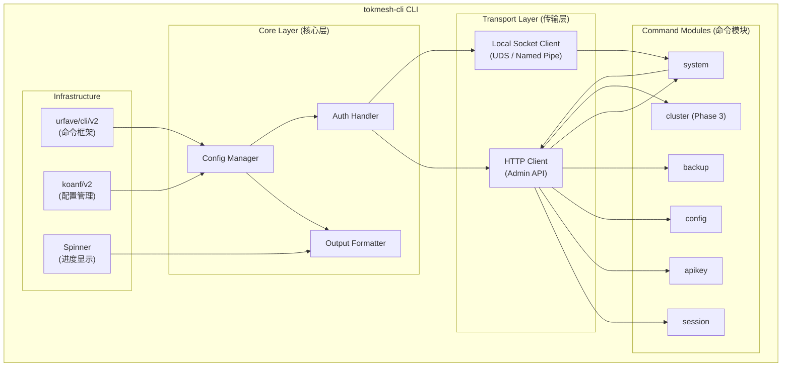
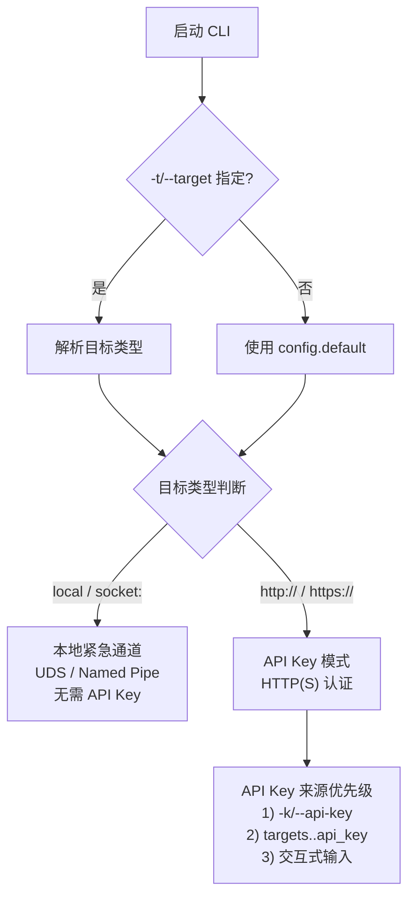

# DS-0601 - CLI总体设计

**状态**: 草稿
**优先级**: P1
**来源**: CP-0502-运维管理体系.md, RQ-0304-管理接口规约.md, RQ-0502-配置管理需求.md
**作者**: Claude Code
**创建日期**: 2025-12-12
**最后更新**: 2025-12-17

---

## 1. 概述

### 1.1 文档目的

本文档定义 TokMesh 命令行管理工具 `tokmesh-cli` 的**总体架构设计**，包括：

- CLI 架构与模块划分
- 全局选项与配置
- 输出格式规范
- 认证与授权机制
- 错误处理与退出码
- 命名与交互规范
- 子命令索引与路由

各功能域的详细子命令设计见独立文档（DS-0602 ~ DS-0607）。

**交互模式与连接管理**详见 DS-0602-CLI交互模式与连接管理.md。

### 1.2 设计原则

遵循 `specs/governance/principles.md` 定义的优先级：**简单性 > 安全性 > 性能 > 可扩展性**

**CLI 特定原则**：

1. **一致性 (Consistency)**: 所有子命令遵循统一的命名、参数、输出格式
2. **可预测性 (Predictability)**: 相似操作有相似的行为模式
3. **渐进式披露 (Progressive Disclosure)**: 默认简洁，`-v/--verbose` 显示详情
4. **故障友好 (Failure-Friendly)**: 清晰的错误信息，可操作的修复建议
5. **脚本友好 (Script-Friendly)**: 支持 JSON 输出，退出码语义明确

### 1.3 交付物

| 产物 | 说明 |
|------|------|
| `tokmesh-cli` | 单一静态二进制（Go 编译） |
| `tokmesh-cli.exe` | Windows 版本 |

**版本要求**：与 `tokmesh-server` 保持同步版本号。

---

### 1.4 代码结构约定

为区分 `tokmesh-server` 与 `tokmesh-cli` 的代码边界，同时保证复用清晰，约定如下目录结构。

> **完整代码骨架**: 参见 [specs/governance/code-skeleton.md](../governance/code-skeleton.md)

#### 1.4.1 CLI 相关目录结构

```text
src/
├── cmd/
│   └── tokmesh-cli/
│       └── main.go                  # 入口：初始化 CLI App -> Execute()
│
├── internal/
│   ├── cli/                         # [交互层] tokmesh-cli 专用
│   │   ├── command/                 # 命令定义 (urfave/cli/v2)
│   │   │   ├── root.go              # 根命令, 全局 Flag, 模式判断
│   │   │   ├── session.go           # session 子命令组
│   │   │   ├── apikey.go            # apikey 子命令组
│   │   │   ├── config.go            # config 子命令组
│   │   │   ├── backup.go            # backup 子命令组
│   │   │   ├── system.go            # system 子命令组
│   │   │   └── connect.go           # connect/disconnect/use 命令
│   │   │
│   │   ├── connection/              # 连接管理
│   │   │   ├── manager.go           # 连接状态机
│   │   │   ├── http.go              # HTTP/HTTPS Client
│   │   │   └── socket.go            # UDS/Named Pipe Client
│   │   │
│   │   ├── repl/                    # 交互模式
│   │   │   ├── repl.go              # Read-Eval-Print Loop
│   │   │   ├── completer.go         # 命令补全
│   │   │   └── history.go           # 历史记录
│   │   │
│   │   ├── output/                  # 输出格式化
│   │   │   ├── formatter.go         # 格式化接口
│   │   │   ├── table.go             # 表格渲染 (含 wide 模式)
│   │   │   ├── json.go              # JSON 输出
│   │   │   ├── yaml.go              # YAML 输出
│   │   │   └── spinner.go           # 进度动画
│   │   │
│   │   └── config/                  # CLI 配置
│   │       ├── spec.go              # CLI 配置结构 (~/.tokmesh/cli.yaml)
│   │       └── loader.go            # 加载与合并
│   │
│   └── infra/                       # [基础层] 通用基础设施
│       ├── confloader/              # 配置加载机制 (Koanf)
│       │   ├── loader.go            # File -> Env -> Flag 合并
│       │   └── provider.go          # 各数据源 Provider
│       ├── buildinfo/               # 构建信息
│       │   └── version.go           # 版本/Commit/BuildTime (ldflags)
│       └── tlsroots/                # TLS 证书管理
│           ├── roots.go             # 系统证书 + 自定义 CA
│           └── watcher.go           # 证书热加载 (fsnotify)
│
└── pkg/                             # [组件层] 可移植通用库
    ├── token/                       # Token 工具
    └── crypto/adaptive/             # 自适应加密
```

#### 1.4.2 依赖约束

| 约束规则 | 说明 |
|----------|------|
| `cmd/tokmesh-cli` | 仅进程启动与依赖装配，不含业务逻辑 |
| `internal/cli/*` | **不得**依赖 `internal/server/*` |
| `internal/server/*` | **不得**依赖 `internal/cli/*` |
| `internal/infra/*` | **不得**反向依赖 `cli` 或 `server`，仅提供基础能力 |
| `pkg/*` | **不得**依赖 `cmd` 或 `internal`，保持为可复用库 |

#### 1.4.3 设计决策说明

1. **`infra/` 替代 `shared/`**: 更明确表达"基础设施"语义，避免 `shared` 演化为杂物间（遵循 `conventions.md` 4.3）
2. **`output/` 而非 `view/`**: CLI 语境下 `output` 更直白，`view` 偏 MVC 风格
3. **`connection/` 而非 `transport/`**: 更具体表达"连接管理"职责
4. **文件命名**: `spec.go` (规格定义) 优于泛泛的 `config.go`；`verify.go` (核实) 优于 `validate.go`

## 2. 架构设计

### 2.1 整体架构



### 2.2 模块职责

| 模块 | 职责 | 依赖 |
|------|------|------|
| **urfave/cli/v2** | 命令解析、帮助生成、补全脚本 | - |
| **koanf/v2** | 配置文件加载、环境变量绑定 | - |
| **Config Manager** | 全局选项管理、配置合并 | koanf |
| **Output Formatter** | JSON/Table/YAML 格式化、颜色处理 | - |
| **Auth Handler** | API Key 处理 | Config Manager |
| **HTTP Client** | Admin API 调用、重试、超时 | Auth Handler |
| **Socket Client** | 本地紧急管理通道调用（UDS/Named Pipe） | - |
| **命令模块** | 具体子命令实现 | Core Layer |

### 2.3 目录结构

> **完整目录结构详见本文档 1.4.1 节**，此处仅列出关键模块映射。

| 目录 | 职责 | 关联设计文档 |
|------|------|--------------|
| `internal/cli/command/` | 命令定义与路由 | 本文档 §3-6 |
| `internal/cli/connection/` | 连接管理与状态机 | DS-0602 |
| `internal/cli/repl/` | 交互模式 REPL | DS-0602 |
| `internal/cli/output/` | 输出格式化 | 本文档 §7 |
| `internal/cli/config/` | CLI 配置管理 | DS-0605 |

---

## 3. 全局选项

### 3.1 选项定义

所有子命令继承以下全局选项：

| 选项 | 短选项 | 环境变量 | 默认值 | 说明 | 阶段 |
|------|--------|----------|--------|------|------|
| `--interactive` | `-i` | - | `false` | 强制进入交互模式（覆盖 TTY 检测） | P1 |
| `--target` | `-t` | `TOKMESH_TARGET` | - | 目标节点（URL/别名/local/socket:...） | P1 |
| `--api-key` | `-k` | `TOKMESH_API_KEY` | - | API Key（格式: `key_id:key_secret`；角色：`admin`/`issuer`/`validator`/`metrics`） | P1 |
| `--output` | `-o` | `TOKMESH_OUTPUT` | `table` | 输出格式: `table`, `json`, `yaml`, `wide` | P1 |
| `--config` | `-c` | `TOKMESH_CLI_CONFIG` | 平台默认路径 | CLI 配置文件路径（默认：Linux `~/.config/tokmesh-cli/cli.yaml`；Windows `%APPDATA%\\tokmesh-cli\\cli.yaml`；兼容 `~/.tokmesh/cli.yaml`） | P1 |
| `--verbose` | `-v` | - | `false` | 显示详细输出 | P1 |
| `--quiet` | `-q` | - | `false` | 静默模式，仅输出关键信息 | P1 |
| `--no-headers` | - | - | `false` | 表格输出时不显示表头（便于管道） | P1 |
| `--no-color` | - | `NO_COLOR` | `false` | 禁用颜色输出（对应配置 `no_color=true`） | P1 |
| `--timeout` | - | `TOKMESH_TIMEOUT` | `30s` | 请求超时时间 | P1 |
| `--tls-ca` | - | `TOKMESH_TLS_CA` | - | 自定义 CA 证书路径 | P1 |
| `--watch` | `-w` | - | `false` | 持续监听资源变化 | P2 |
| `--dry-run` | - | - | `false` | 模拟执行，不实际操作 | P2 |

> **kubectl 风格对齐**: `-o`、`-w`、`-q`、`--no-headers`、`--dry-run` 参考 kubectl 设计哲学，详见 RQ-0602:6.1

### 3.2 优先级规则

配置加载优先级（高 → 低）：

1. **命令行参数** (`--target=...`)
2. **环境变量** (`TOKMESH_TARGET=...`)
3. **配置文件**（默认：Linux `~/.config/tokmesh-cli/cli.yaml`；Windows `%APPDATA%\\tokmesh-cli\\cli.yaml`；兼容 `~/.tokmesh/cli.yaml`）
4. **编译时默认值**

### 3.3 CLI 配置文件格式

**路径**: Linux `~/.config/tokmesh-cli/cli.yaml`；Windows `%APPDATA%\\tokmesh-cli\\cli.yaml`（详见 RQ-0602:5.2；兼容 `~/.tokmesh/cli.yaml`）

```yaml
# Linux: ~/.config/tokmesh-cli/cli.yaml
# Windows: %APPDATA%\\tokmesh-cli\\cli.yaml

# 默认目标（可选）
default: local

# 目标节点定义
targets:
  local:
    socket: /var/run/tokmesh-server/tokmesh-server.sock

  dev:
    url: http://127.0.0.1:5080
    # api_key: "<key_id>:<key_secret>"  # 仅开发环境可选；生产环境禁止明文存储（推荐运行时 -k / 交互输入）

  prod:
    url: https://prod.example.com:5443
    # api_key 不存储，运行时通过 -k 参数或交互输入（生产环境安全建议）
    tls:
      ca_file: /etc/tokmesh-cli/certs/ca.crt
      # cert_file: /path/to/client.crt  # mTLS（可选）
      # key_file: /path/to/client.key

# CLI 默认行为（可选）
defaults:
  output: table       # table | json | yaml | wide
  timeout: "30s"
  no_color: false     # 禁用颜色输出（false=启用颜色，true=禁用颜色）
```

**配置项说明**:

| 配置项 | 类型 | 说明 |
|--------|------|------|
| `default` | string | 默认使用的目标别名 |
| `targets.<name>.socket` | string | 本地 Socket 路径（与 url 二选一） |
| `targets.<name>.url` | string | HTTP(S) 地址 |
| `targets.<name>.api_key` | string | API Key（仅开发环境） |
| `targets.<name>.tls.*` | object | TLS 配置（CA、mTLS） |
| `defaults.output` | string | 默认输出格式 |
| `defaults.timeout` | duration | 请求超时时间 |
| `defaults.no_color` | bool | 禁用颜色输出（false=启用，true=禁用） |

### 3.4 认证优先级与本地紧急通道

连接服务端时，按以下顺序解析认证信息（详见 DS-0602:4.2）：

1. **目标解析**: 解析 `--target` 参数或配置文件中的 `default` 字段
2. **目标类型分流**:
   - `local` / `socket:<path>` → **本地紧急管理通道**（由 `tokmesh-server` 暴露的本地 Socket/Named Pipe），无需 API Key
   - `http(s)://...` → HTTP(S) API，必须提供 API Key（即使是 `127.0.0.1` 回环地址）
3. **API Key 来源优先级**（仅 HTTP(S) 目标）:
   1) `-k/--api-key` 参数
   2) `targets.<name>.api_key`
   3) 交互式输入（Interactive 模式）



### 3.5 TLS 证书验证策略

> **参考**: specs/governance/principles.md - 安全性原则 (Secure by Default)

#### 3.5.1 约束

- CLI **不提供**“跳过 TLS 证书校验”的开关（不支持 `--tls-insecure-skip-verify`）。
- 使用 HTTPS 连接时必须校验证书链与主机名；如使用自签/私有 CA，必须提供 `--tls-ca`（或在配置文件中提供 `tls.ca_file`）。

#### 3.5.2 配置文件格式

```yaml
targets:
  dev:
    address: https://dev.example.com
    tls:
      ca_file: /path/to/dev-ca.pem
```

#### 3.5.3 适用场景

| 场景 | 推荐配置 |
|------|----------|
| 本地开发 (自签名证书) | `--tls-ca /path/to/dev-ca.pem` |
| 测试环境 (内部 CA) | `--tls-ca=/path/to/internal-ca.pem` |
| 生产环境 | 使用公信 CA 签发的证书 |

---

## 4. 输出格式规范

### 4.1 格式类型

| 格式 | 适用场景 | 特点 |
|------|----------|------|
| `table` | 交互式终端 | 人类可读，支持颜色，列对齐，显示核心字段 |
| `wide` | 详细查看 | 表格扩展模式，显示更多字段（类似 kubectl -o wide） |
| `json` | 脚本集成 | 机器可读，完整数据，无颜色 |
| `yaml` | 配置查看 | 可读性好，支持复杂嵌套 |

### 4.2 Table 格式规范

**标准表格**：

```
┌──────────────────┬──────────┬─────────────────────┬────────┐
│ SESSION ID       │ USER ID  │ CREATED AT          │ STATUS │
├──────────────────┼──────────┼─────────────────────┼────────┤
│ tmss-01j3n5x0... │ user-001 │ 2025-12-12 10:30:00 │ active │
│ tmss-01j3n5x0... │ user-002 │ 2025-12-12 11:45:00 │ active │
└──────────────────┴──────────┴─────────────────────┴────────┘
Total: 2 sessions
```

**颜色约定**：

| 语义 | 颜色 | ANSI Code |
|------|------|-----------|
| 成功/活跃 | 绿色 | `\033[32m` |
| 警告/过期 | 黄色 | `\033[33m` |
| 错误/禁用 | 红色 | `\033[31m` |
| 信息/ID | 青色 | `\033[36m` |
| 标题/表头 | 加粗白色 | `\033[1;37m` |

**截断规则**：

- 长 ID 默认截断显示 (如 `tmss-01j3n5x0...`)
- 使用 `-v/--verbose` 显示完整值
- 截断阈值: 16 字符

### 4.3 JSON 格式规范

**成功响应**：

```json
{
  "success": true,
  "data": {
      "sessions": [
      {
        "session_id": "tmss-01j3n5x0p9k2c7h8d4f6g1m2n8",
        "user_id": "user-001",
        "created_at": "2025-12-12T10:30:00Z",
        "status": "active"
      }
    ],
    "total": 1,
    "page": 1,
    "page_size": 20
  }
}
```

**错误响应**：

```json
{
  "success": false,
  "error": {
    "code": "TM-AUTH-4010",
    "message": "Invalid API Key",
    "details": "The provided API Key has expired",
    "suggestion": "Please create a new API Key or contact administrator"
  }
}
```

### 4.4 YAML 格式规范

```yaml
success: true
data:
  sessions:
    - session_id: tmss-01j3n5x0p9k2c7h8d4f6g1m2n8
      user_id: user-001
      created_at: "2025-12-12T10:30:00Z"
      status: active
  total: 1
  page: 1
  page_size: 20
```

### 4.5 Wide 格式规范

`-o wide` 输出扩展表格，显示更多字段（参考 kubectl -o wide）：

**各资源 wide 字段定义**:

| 资源 | table 默认字段 | wide 追加字段 |
|------|----------------|---------------|
| session | id, user_id, created, expires | device_id, created_by, status, last_accessed, metadata_keys |
| apikey | id, role, description, status | created, expires, last_used, permissions_count |
| cluster nodes | id, address, status | version, is_leader, raft_index, last_heartbeat |
| backup snapshots | id, created, size | type, encrypted, checksum |

**示例**:

```bash
# 默认输出
$ tokmesh-cli session list
SESSION ID      USER ID     CREATED              EXPIRES
tmss-01j3n5x0... user-001   2025-12-13 10:00    2025-12-13 22:00

# wide 输出
$ tokmesh-cli session list -o wide
SESSION ID   USER ID   DEVICE     CREATED BY    CREATED           EXPIRES           STATUS   LAST ACCESS
tmss-01j3n5x0... user-001 dev-xyz  api-gateway  2025-12-13 10:00  2025-12-13 22:00  active   2025-12-13 14:30
```

**与 `--no-headers` 配合**:

```bash
# 便于脚本处理
$ tokmesh-cli session list -o wide --no-headers | awk '{print $1, $6}'
tmss-01j3n5x0... active
tmss-01j3n5x0... expired
```

### 4.6 进度显示

**长时间操作**（如备份、还原）使用 Spinner：

```
⠋ Creating snapshot...
✓ Snapshot created successfully (snap-20251212-103000, 128MB)
```

**Spinner 字符集**: Braille 点阵 (`⠋⠙⠹⠸⠼⠴⠦⠧⠇⠏`)

**规则**：

- `--quiet` 模式禁用 Spinner
- 非 TTY 环境自动禁用 Spinner
- JSON/YAML 输出时禁用 Spinner

### 4.7 位置提示规范

**原则**: 所有命令输出必须明确显示执行位置（本地或远程），避免用户混淆。

**格式**:
- 本地命令: `[LOCAL] <description>`
- 远程命令: `[REMOTE: <node-label>] <description>`

**实施范围**:
- 所有产生副作用的命令（create、update、delete、revoke 等）
- 所有可能产生歧义的命令（config server test 等）
- 纯查询命令可选（session list 等）

**颜色**（可选）:
- `[LOCAL]`: 灰色 (\033[90m)
- `[REMOTE: ...]`: 青色 (\033[36m)
- `--no-color` 模式: 仅保留方括号，不使用颜色

**示例**:
```bash
# 本地测试
[LOCAL] Testing configuration syntax...
✓ Configuration is valid.

# 远程测试
[REMOTE: prod] Testing configuration on prod...
✓ Configuration is compatible with server v1.0.0.

# 远程危险操作
[REMOTE: prod] ⚠️  Revoking session tmss-01j3n5x0...
✓ Session revoked successfully.
```

---

## 5. 错误处理与退出码

### 5.1 退出码定义

> **规范口径（单一事实来源）**：`specs/governance/error-codes.md` 第 4.2 节。

| 退出码 | 含义 | 场景 | 标准来源 |
|--------|------|------|----------|
| `0` | 成功 | 命令执行成功 | - |
| `1` | 通用错误 | 业务错误（认证失败、资源不存在、操作拒绝、服务端 5xx 等） | - |
| `2` | 用户中断 | Ctrl+C 中断 | SIGINT |
| `64` | 使用错误 | 命令语法错误、参数缺失/冲突/格式错误 | EX_USAGE |
| `65` | 数据错误 | 输入/输出数据格式错误（如 JSON/YAML 序列化失败） | EX_DATAERR |
| `69` | 服务不可用 | 连接失败、TLS 握手失败、目标节点不可达、超时 | EX_UNAVAILABLE |
| `78` | 配置错误 | CLI 配置文件无效、Profile 缺失关键字段 | EX_CONFIG |

**设计决策**：采用 BSD sysexits.h 标准码，而非自定义细粒度退出码。原因：
1. **脚本兼容性**：标准退出码被广泛工具链识别（CI/CD、Shell 脚本）
2. **简单性原则**：遵循项目架构原则"简单性 > 可扩展性"
3. **错误详情由错误码承载**：具体失败原因通过 `TM-*` 错误码输出到 stderr

### 5.2 错误信息格式

**标准错误输出** (stderr)：

```
Error: Invalid API Key
  Code: TM-AUTH-4010
  Details: The provided API Key has expired on 2025-12-01

Suggestion: Create a new API Key using:
  tokmesh-cli apikey create --role=admin
```

**组成部分**：

1. **错误标题**: 简洁的错误描述
2. **错误码**: 系统错误码（遵循 `specs/governance/error-codes.md`）
3. **详情**: 具体的错误原因
4. **建议**: 可操作的修复步骤（可选）

### 5.3 错误码映射

服务端错误码到 CLI 退出码的映射（遵循 5.1 节定义）：

| 服务端错误码 | HTTP 状态 | CLI 退出码 | 说明 |
|--------------|-----------|------------|------|
| `TM-AUTH-4010` | 401 | 1 | 业务错误（认证失败） |
| `TM-AUTH-4030` | 403 | 1 | 业务错误（权限不足） |
| `TM-SESS-4040` | 404 | 1 | 业务错误（资源不存在） |
| `TM-TOKN-4010` | 401 | 1 | 业务错误（令牌无效） |
| `TM-SYS-4290` | 429 | 1 | 业务错误（限流） |
| `TM-SYS-5000` | 500 | 1 | 业务错误（服务端内部错误） |
| 连接超时/失败 | - | 69 | EX_UNAVAILABLE |
| 参数验证失败 | - | 64 | EX_USAGE |

**映射原则**：所有来自服务端的业务错误（4xx/5xx）统一映射到退出码 `1`，具体错误通过 `TM-*` 错误码区分。

### 5.4 CLI 专用错误码

CLI 内部错误应使用以下错误码（引用 `specs/governance/error-codes.md` 第 4 章）：

| 错误码 | 退出码 | 场景 |
|--------|--------|------|
| `TM-CLI-1001` | 78 | 配置文件加载失败。文件不存在或格式错误 |
| `TM-CLI-1002` | 69 | 连接目标节点失败。网络不可达或拒绝连接 |
| `TM-CLI-1003` | 69 | TLS 握手失败。证书验证不通过或协议不兼容 |
| `TM-CLI-1004` | 1 | 认证失败。API Key 无效或权限不足 |
| `TM-CLI-1005` | 64 | 命令参数错误。缺少必填参数或格式不正确 |
| `TM-CLI-1006` | 69 | 操作超时。服务端响应超时 |
| `TM-CLI-1007` | 65 | 输出格式错误。无法序列化为指定格式 (如 JSON/YAML) |

> **注意**：退出码 `2` 仅用于用户中断（Ctrl+C/SIGINT），不用于参数错误。

---

## 6. 命名与交互规范

### 6.1 命令命名规范

**格式**: `tokmesh-cli <noun> <verb> [arguments] [flags]`

**示例**：

```bash
tokmesh-cli session list              # 名词 + 动词
tokmesh-cli session get <id>          # 名词 + 动词 + 参数
tokmesh-cli apikey create --role=admin  # 名词 + 动词 + 选项
```

**动词约定**：

| 动词 | 含义 | HTTP 方法 |
|------|------|-----------|
| `list` | 列出资源 | GET |
| `get` | 获取单个资源详情 | GET |
| `create` | 创建资源 | POST |
| `update` | 更新资源 | POST（apply/action 路由） |
| `delete` | 删除资源 | （对外 API 不使用；建议以“禁用/状态变更”替代） |
| `revoke` | 撤销/吊销 | POST（action 路由） |
| `rotate` | 轮转密钥 | POST |
| `show` | 显示信息（只读） | GET |
| `validate` | 验证配置 | - (本地) |
| `trigger` | 触发操作 | POST |

### 6.2 参数命名规范

**位置参数**：

- 必要的唯一标识符作为位置参数
- 最多 1-2 个位置参数
- 示例: `tokmesh-cli session get <session-id>`

**选项命名**：

- 使用 kebab-case: `--user-id`, `--created-after`
- 布尔选项无需值: `--force`, `--verbose`
- 带值选项用 `=` 或空格: `--output=json`, `--output json`

**常用选项缩写**：

| 长选项 | 短选项 |
|--------|--------|
| `--output` | `-o` |
| `--verbose` | `-v` |
| `--quiet` | `-q` |
| `--force` | `-f` |
| `--all` | `-a` |
| `--target` | `-t` |
| `--api-key` | `-k` |
| `--config` | `-c` |
| `--watch` | `-w` |

### 6.3 资源缩写别名

为高频使用的资源命令提供缩写别名，减少输入（参考 kubectl 的 po/svc/deploy 等缩写）：

| 完整名称 | 缩写 | 说明 |
|----------|------|------|
| `session` | `sess` | 会话管理命令组 |
| `apikey` | `key` | API Key 管理命令组 |
| `system` | `sys` | 系统管理命令组 |
| `config server` | `cfg` | 服务端配置管理 |

**使用示例**:

```bash
# 等效命令对
tokmesh-cli session list        ≡  tokmesh-cli sess list
tokmesh-cli session get <id>    ≡  tokmesh-cli sess get <id>
tokmesh-cli apikey create ...   ≡  tokmesh-cli key create ...
tokmesh-cli system status       ≡  tokmesh-cli sys status
tokmesh-cli config server show  ≡  tokmesh-cli cfg show
```

**实现约束**:

- 通过 urfave/cli 的 `Aliases` 字段实现
- 帮助文档以完整名称为主，缩写标注为"Aliases"
- `--help` 输出中展示可用别名

```go
// session 命令注册示例 (urfave/cli/v2)
var sessionCmd = &cli.Command{
    Name:    "session",
    Aliases: []string{"sess"},
    Usage:   "Manage sessions",
}
```

### 6.4 危险操作确认

**需要确认的操作**：

- `delete`: 删除资源
- `revoke`: 撤销会话/Key
- `reset`: 重置配置/节点
- `restore`: 数据还原

**确认机制**：

```bash
# 默认需要确认
$ tokmesh-cli session revoke tmss-01j3n5x0p9k2c7h8d4f6g1m2n8
Are you sure you want to revoke session 'tmss-01j3n5x0p9k2c7h8d4f6g1m2n8'? [y/N]: y
Session revoked successfully.

# 使用 --force 跳过确认
$ tokmesh-cli session revoke tmss-01j3n5x0p9k2c7h8d4f6g1m2n8 --force
Session revoked successfully.

# 批量操作需要显式确认
$ tokmesh-cli session revoke --user-id=user-001
This will revoke 15 sessions for user 'user-001'.
Type 'user-001' to confirm: user-001
15 sessions revoked successfully.
```

**规则**：

- 非 TTY 环境且未指定 `--force` 时自动拒绝
- `--quiet` 模式下仍需 `--force` 确认危险操作
- 批量操作要求输入完整的资源标识确认

### 6.5 帮助信息格式

**标准格式**:

```
Usage:
  tokmesh-cli session list [flags]

Aliases:
  session, sess

Description:
  List all sessions with optional filtering.

  By default, returns the first 20 sessions sorted by creation time (newest first).
  Use pagination flags to retrieve more results.

Examples:
  # List all sessions
  tokmesh-cli session list

  # Filter by user ID
  tokmesh-cli session list --user-id=user-001

  # Output as JSON
  tokmesh-cli session list -o json

  # Show detailed information
  tokmesh-cli session list -v

Flags:
  -u, --user-id string       Filter by user ID
  -d, --device-id string     Filter by device ID
      --status string        Filter by status (active, expired)
      --created-after string Filter sessions created after (RFC3339)
      --created-before string Filter sessions created before (RFC3339)
      --page int             Page number (default 1)
      --page-size int        Page size (default 20, max 100)
  -h, --help                 Help for list

Global Flags:
  -t, --target string        Target node (URL, alias, or 'local')
  -k, --api-key string       API Key (key_id:key_secret)
  -o, --output string        Output format: table, json, yaml, wide (default "table")
  -v, --verbose              Show detailed output
  -q, --quiet                Quiet mode, output only essential info
  -w, --watch                Watch for changes (Phase 2)
      --no-headers           Omit table headers (for scripting)
      --no-color             Disable color output (overrides defaults.color_enabled)
      --dry-run              Preview action without executing (Phase 2)

See Also:
  tokmesh-cli session get     - Get session details
  tokmesh-cli session create  - Create a new session
  tokmesh-cli session revoke  - Revoke a session
```

---

## 7. 子命令索引

### 7.1 命令树

> 括号内为资源缩写别名，详见 6.3 节

```
tokmesh-cli
├── version                      # 显示版本信息
├── completion                   # 生成补全脚本
│   ├── bash
│   ├── zsh
│   ├── fish
│   └── powershell
├── session (sess)               # 会话管理 (DS-0603)
│   ├── list [-o wide] [-w]      # 列出会话
│   ├── get <id>                 # 获取会话详情
│   ├── create                   # 创建会话
│   ├── extend <id>              # 延长会话有效期
│   ├── revoke <id>              # 撤销会话
│   ├── revoke-all               # 撤销多个会话
│   └── query                    # 高级查询
├── apikey (key)                 # API Key 管理
│   ├── list [-o wide]           # 列出 Keys
│   ├── get <id>                 # 获取 Key 详情
│   ├── create [--dry-run]       # 创建 Key
│   ├── disable <id>             # 禁用 Key
│   ├── enable <id>              # 启用 Key
│   └── rotate <id>              # 轮转 Secret
├── config                       # 配置管理
│   ├── cli                      # CLI 本地配置
│   │   ├── show                 # 显示 CLI 配置文件
│   │   └── validate             # 验证 CLI 配置
│   └── server (cfg)             # 服务端配置
│       ├── show [--merged]      # 显示服务端配置（需连接）
│       ├── test <file> [--remote] # 测试配置文件（默认本地，--remote 需连接）
│       ├── diff                 # 比较配置差异 (Phase 2)
│       └── reload               # 热重载配置（需连接）
├── backup                       # 备份恢复
│   ├── snapshot [--dry-run]     # 创建快照
│   ├── list [-o wide]           # 列出快照
│   ├── download <id>            # 下载快照
│   ├── restore [--dry-run]      # 还原数据
│   └── status                   # 查看备份状态
├── system (sys)                 # 系统管理
│   ├── status [-o json]         # 系统状态摘要
│   ├── health                   # 健康检查
│   ├── gc [--dry-run]           # 触发垃圾回收
│   ├── audit                    # 审计日志查询
│   └── wal                      # WAL 日志管理
├── connect <target>             # 连接节点 (DS-0602)
├── disconnect                   # 断开连接 (DS-0602)
├── status                       # 连接状态 (DS-0602)
├── use <alias>                  # 快速切换节点 (DS-0602)
└── cluster                      # 集群管理 (Phase 3)
    ├── status
    ├── nodes
    ├── rebalance
    ├── leave
    └── reset
```

### 7.2 详细设计文档映射

| 命令组 | 设计文档 | 阶段 | 状态 |
|--------|----------|------|------|
| `session` | DS-0603-CLI-session.md | Phase 1 | 草稿 |
| `apikey` | DS-0604-CLI-apikey.md | Phase 1 | 待创建 |
| `config` | DS-0605-CLI-config.md | Phase 2 | 待创建 |
| `backup` | DS-0606-CLI-backup.md | Phase 2 | 待创建 |
| `system` | DS-0607-CLI-system.md | Phase 2 | 待创建 |
| `cluster` | DS-0608-CLI-cluster.md | Phase 3 | 延迟 |

---

## 8. Shell 补全

### 8.1 支持的 Shell

| Shell | 命令 | 安装方式 |
|-------|------|----------|
| Bash | `tokmesh-cli completion bash` | `source <(tokmesh-cli completion bash)` |
| Zsh | `tokmesh-cli completion zsh` | `tokmesh-cli completion zsh > "${fpath[1]}/_tokmesh-cli"` |
| Fish | `tokmesh-cli completion fish` | `tokmesh-cli completion fish > ~/.config/fish/completions/tokmesh-cli.fish` |
| PowerShell | `tokmesh-cli completion powershell` | `tokmesh-cli completion powershell \| Out-String \| Invoke-Expression` |

### 8.2 补全内容

- 子命令名称
- 选项名称及短选项
- 选项值（枚举类型，如 `--output` 的 table/json/yaml）
- 资源 ID（动态补全，需连接服务端）

---

## 9. 版本与兼容性

### 9.1 版本命令

```bash
$ tokmesh-cli version
tokmesh-cli version 1.2.0
  Git Commit: abc1234
  Build Date: 2025-12-12T10:00:00Z
  Go Version: go1.22.0
  OS/Arch:    linux/amd64

Server:
  Address: https://127.0.0.1:5443
  Version: 1.2.0
  Status:  healthy
```

### 9.2 版本兼容性检查

**启动时检查**：

- 若 CLI 版本与服务端版本的 Major 版本不一致，显示警告
- 若 CLI 版本 < 服务端版本，建议升级 CLI
- 检查失败不阻止命令执行，仅显示警告

```
Warning: CLI version (1.2.0) is older than server version (1.3.0).
Some features may not be available. Consider upgrading tokmesh-cli.
```

---

## 10. 安全考虑

### 10.1 敏感信息保护

**禁止在以下位置显示敏感信息**：

- 命令行历史 (`~/.bash_history`)
- 进程列表 (`ps aux`)
- 日志输出

**保护措施**：

1. **API Key 输入**: 优先从环境变量或配置文件读取，避免命令行传入
2. **密码提示**: 使用 `term.ReadPassword()` 禁止回显
3. **输出脱敏**: Secret 字段在输出中显示为 `***REDACTED***`

### 10.2 TLS 证书验证

- 默认启用 TLS 证书验证
- 自签/私有 CA 场景通过 `--tls-ca` 或配置文件 `tls.ca_file` 注入 CA

---

## 11. 验收标准

### 11.1 功能验收

- [ ] **全局选项**: 所有全局选项正确生效，优先级符合规范
- [ ] **输出格式**: 三种格式 (table/json/yaml) 输出正确
- [ ] **认证机制**: API Key 认证方式正常工作
- [ ] **退出码**: 各场景返回正确的退出码
- [ ] **错误处理**: 错误信息清晰，包含建议

### 11.2 兼容性验收

- [ ] **Linux**: 在 Ubuntu 20.04/22.04, CentOS 7/8 上正常运行
- [ ] **macOS**: 在 macOS 12+ 上正常运行
- [ ] **Windows**: 在 Windows 10/11, Server 2019 上正常运行
- [ ] **Shell 补全**: Bash/Zsh/Fish/PowerShell 补全正常

### 11.3 性能验收

- [ ] **启动时间**: CLI 启动 < 100ms（不含网络请求）
- [ ] **响应时间**: 简单命令（如 version）< 200ms
- [ ] **二进制大小**: < 20MB

---

## 12. 引用文档

| 文档 | 关系 |
|------|------|
| RQ-0304-管理接口规约.md | Admin API 定义 |
| RQ-0502-配置管理需求.md | config server 子命令需求 |
| RQ-0602-CLI交互模式与连接管理.md | 双模式、连接管理、config 命令职责划分 |
| RQ-0401-分布式集群架构.md | cluster 子命令需求 |
| RQ-0201-安全与鉴权体系.md | 认证机制需求、本地紧急接口 |
| specs/governance/error-codes.md | 错误码定义 |
| DS-0602-CLI交互模式与连接管理.md | 连接管理详细设计 |
| CP-0502-运维管理体系.md | 原始构想 |

---

## 13. 变更历史

| 日期 | 版本 | 变更说明 | 作者 |
|------|------|----------|------|
| 2025-12-18 | v2.0 | 退出码规范对齐 BSD sysexits.h；废弃自定义退出码（2-8, 130），统一使用 0/1/2/64/65/69/78 | AI Agent |
| 2025-12-17 | v1.8 | 配置项重构：对齐 Server 配置键名，CLI 配置 `no_color` -> `color_enabled` | AI Agent |
| 2025-12-17 | v1.9 | 更新CLI全局选项中--no-color的说明以对应配置`color_enabled` | AI Agent |
| 2025-12-15 | v1.6 | 配置与命令修正：新增-i参数、config server test命令、位置提示规范(4.7节)、配置文件增加wide格式（注：原计划的insecure_skip_verify已按安全原则移除，见3.5节） | AI Agent |
| 2025-12-15 | v1.5 | 依赖变更：Cobra/Viper → urfave/cli/v2 + koanf/v2（简化依赖） | AI Agent |
| 2025-12-13 | v1.4 | 对齐RQ-0602：--server/-s→--target/-t，配置文件targets格式 | AI Agent |
| 2025-12-13 | v1.3 | kubectl风格优化正式采纳：全局选项增强、资源别名、wide格式、use命令 | AI Agent |
| 2025-12-13 | v1.2 | 新增附录C可选增强章节（-o短参数、cfg别名、use命令） | AI Agent |
| 2025-12-13 | v1.1 | 新增附录B CLI→Admin API映射表 | AI Agent |
| 2025-12-12 | v1.0 | 初始版本（从DS-0502迁移） | AI Agent |

---

## 附录 A: 快速参考

### A.1 常用命令

```bash
# 查看系统状态
tokmesh-cli system status

# 列出所有会话
tokmesh-cli session list

# 创建 API Key
tokmesh-cli apikey create --role=validator --description="Gateway Validator"

# 验证服务端配置文件（示例：以 server config 为目标）
tokmesh-cli config server test /etc/tokmesh-server/config.yaml --remote

# 创建备份快照
tokmesh-cli backup snapshot

# JSON 格式输出
tokmesh-cli session list -o json

# 显式连接本地节点
tokmesh-cli -t http://127.0.0.1:5080 system status
```

### A.2 环境变量速查

```bash
export TOKMESH_SERVER="https://admin.example.com:5443"
export TOKMESH_API_KEY="<key_id>:<key_secret>"
export TOKMESH_OUTPUT="json"
export TOKMESH_TIMEOUT="60s"
export NO_COLOR=1  # 禁用颜色
```

---

## 附录 B: CLI 命令 → Admin API 映射

本节列出 CLI 远程命令与 Admin API 端点的对应关系，便于实现和测试时核对。

### B.1 系统管理 (system)

| CLI 命令 | HTTP 方法 | API 端点 | 说明 |
|----------|-----------|----------|------|
| `system status` | GET | `/admin/v1/status/summary` | 获取系统状态摘要 |
| `system health` | GET | `/health` | 健康检查（无需鉴权） |
| `system gc` | POST | `/admin/v1/gc/trigger` | 触发垃圾回收 |
| `system wal status` | GET | `/admin/v1/wal/status` | 查看 WAL 状态 |
| `system wal compact` | POST | `/admin/v1/wal/compact` | 压缩 WAL 日志 |

### B.2 会话管理 (session)

| CLI 命令 | HTTP 方法 | API 端点 | 说明 |
|----------|-----------|----------|------|
| `session list` | GET | `/sessions` | 列出会话 |
| `session get <id>` | GET | `/sessions/{session_id}` | 获取会话详情 |
| `session create` | POST | `/sessions` | 创建会话 |
| `session renew <id>` | POST | `/sessions/{session_id}/renew` | 续期会话 |
| `session revoke <id>` | POST | `/sessions/{session_id}/revoke` | 撤销会话 |
| `session revoke-all <user_id>` | POST | `/users/{user_id}/sessions/revoke` | 批量撤销 |
| `session validate` | POST | `/tokens/validate` | 验证令牌 |

### B.3 API Key 管理 (apikey)

| CLI 命令 | HTTP 方法 | API 端点 | 说明 |
|----------|-----------|----------|------|
| `apikey list` | GET | `/admin/v1/keys` | 列出 Keys |
| `apikey get <id>` | GET | `/admin/v1/keys/{id}` | 获取 Key 详情 |
| `apikey create` | POST | `/admin/v1/keys` | 创建 Key |
| `apikey disable <id>` | POST | `/admin/v1/keys/{key_id}/status` | 禁用 Key |
| `apikey enable <id>` | POST | `/admin/v1/keys/{key_id}/status` | 启用 Key |
| `apikey rotate <id>` | POST | `/admin/v1/keys/{id}/rotate` | 轮转 Secret |

### B.4 备份恢复 (backup)

| CLI 命令 | HTTP 方法 | API 端点 | 说明 |
|----------|-----------|----------|------|
| `backup snapshot` | POST | `/admin/v1/backups/snapshots` | 创建快照 |
| `backup list` | GET | `/admin/v1/backups/snapshots` | 列出快照 |
| `backup download <id>` | GET | `/admin/v1/backups/snapshots/{snapshot_id}/file` | 下载快照 |
| `backup restore` | POST | `/admin/v1/backups/restores` | 还原数据（创建 restore job） |
| `backup status <job_id>` | GET | `/admin/v1/backups/restores/{job_id}` | 还原任务状态 |

### B.5 配置管理 (config server)

| CLI 命令 | HTTP 方法 | API 端点 | 说明 |
|----------|-----------|----------|------|
| `config server show` | GET | `/admin/v1/config` | 显示服务端配置 |
| `config server show --merged` | GET | `/admin/v1/config?merged=true` | 显示合并后配置 |
| `config server validate` | POST | `/admin/v1/config/validate` | 验证配置 |
| `config server reload` | POST | `/admin/v1/config/reload` | 热重载配置 |

### B.6 集群管理 (cluster) - Phase 3

| CLI 命令 | HTTP 方法 | API 端点 | 说明 |
|----------|-----------|----------|------|
| `cluster status` | GET | `/admin/v1/cluster/status` | 集群状态 |
| `cluster nodes` | GET | `/admin/v1/cluster/nodes` | 节点列表 |
| `cluster rebalance` | POST | `/admin/v1/cluster/rebalance` | 触发再平衡 |
| `cluster leave` | POST | `/admin/v1/cluster/leave` | 节点离开集群 |
| `cluster reset` | POST | `/admin/v1/cluster/reset` | 重置集群状态 |

> **注意**: 以上端点定义以 RQ-0304-管理接口规约.md 和 RQ-0301-业务接口规约-OpenAPI.md 为准，本表仅供快速参考。

---

## 附录 C: kubectl 风格优化（已采纳）

> **状态**: 以下优化点已于 2025-12-13 正式采纳为需求，详见 RQ-0602:第6章

| 编号 | 优化项 | 状态 | 设计章节 |
|------|--------|------|----------|
| C.1 | `-o {table,json,yaml,wide}` 短参数 | ✅ 已采纳 | 3.1 全局选项、4.5 Wide 格式 |
| C.2 | 资源缩写别名（sess/key/sys/cfg） | ✅ 已采纳 | 6.3 资源缩写别名 |
| C.3 | `use <alias>` 快捷切换命令 | ✅ 已采纳 | 7.1 命令树、DS-0602 |
| C.4 | `-q/--quiet` 静默模式 | ✅ 已采纳 | 3.1 全局选项 |
| C.5 | `--no-headers` 无表头输出 | ✅ 已采纳 | 3.1 全局选项、4.5 Wide 格式 |
| C.6 | `-w/--watch` 持续监听 | ✅ 已采纳 (Phase 2) | 3.1 全局选项 |
| C.7 | `--dry-run` 模拟执行 | ✅ 已采纳 (Phase 2) | 3.1 全局选项 |

**参考来源**: kubectl 设计哲学，详见 [kubectl Quick Reference](https://kubernetes.io/docs/reference/kubectl/quick-reference/)
