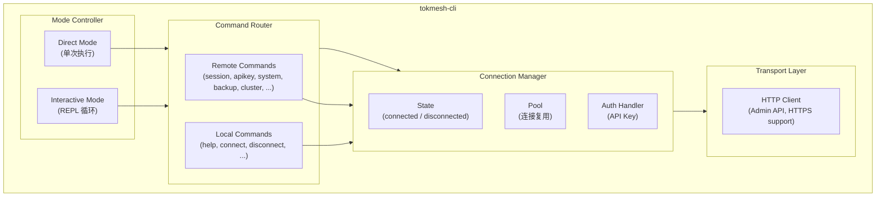
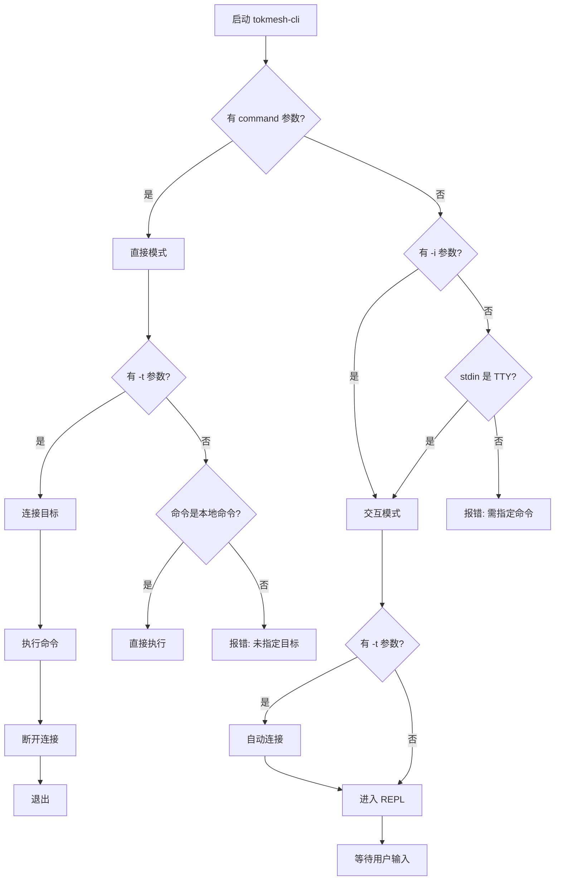
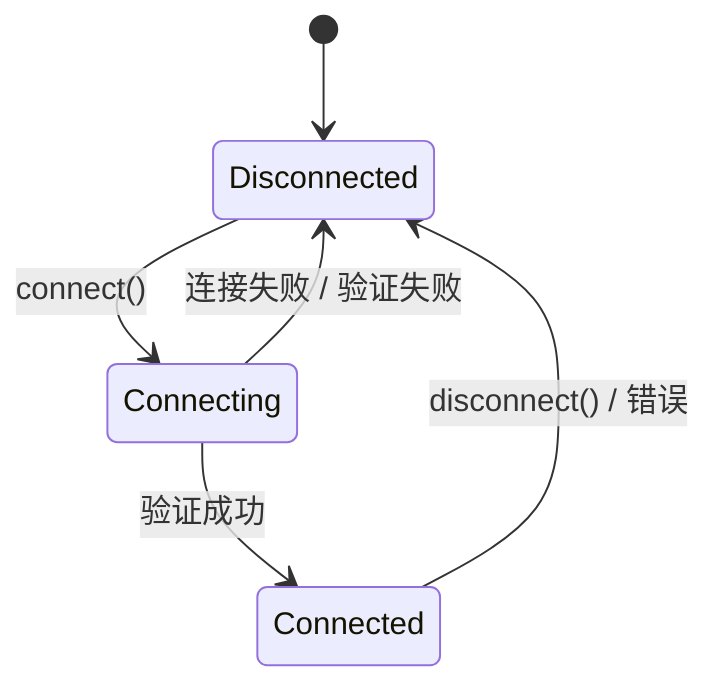

# DS-0602 - CLI交互模式与连接管理

**状态**: 草稿
**优先级**: P1
**来源**: RQ-0602-CLI交互模式与连接管理.md
**作者**: yndnr
**创建日期**: 2025-12-13
**最后更新**: 2025-12-17

---

## 1. 概述

本文档定义 `tokmesh-cli` 的**双模式运行架构**和**连接管理**的详细设计。

### 1.1 设计目标

- 支持直接模式（脚本友好）和交互模式（运维友好）
- 提供类 `sqlplus` 的连接管理体验
- 清晰区分本地命令与远程命令
- 配置文件支持多目标管理

### 1.2 关联文档

| 文档 | 关系 |
|------|------|
| RQ-0602-CLI交互模式与连接管理.md | 需求来源 |
| DS-0601-CLI总体设计.md | 父文档，CLI 架构 |
| DS-0603-CLI-session.md | session 子命令设计 |

---

## 2. 架构设计

### 2.1 模块架构



### 2.2 核心组件

| 组件 | 职责 |
|------|------|
| **Mode Controller** | 判断运行模式，启动对应处理流程 |
| **Connection Manager** | 管理连接状态、复用、认证 |
| **Command Router** | 路由命令到本地/远程处理器 |
| **Transport Layer** | 底层通信（HTTP/HTTPS） |

### 2.3 目录结构

> **完整目录结构详见 [specs/governance/code-skeleton.md](../governance/code-skeleton.md)**

本文档涉及的核心模块：

```
src/internal/cli/
├── command/                   # 命令定义 (urfave/cli/v2)
│   ├── root.go                # 根命令, 全局 Flag, 模式判断
│   ├── connect.go             # connect/disconnect/use 命令
│   └── ...                    # 其他子命令
├── connection/                # 连接管理 (本文档核心)
│   ├── manager.go             # 连接状态机
│   ├── http.go                # HTTP/HTTPS Client
│   └── socket.go              # UDS/Named Pipe Client
├── repl/                      # 交互模式 (本文档核心)
│   ├── repl.go                # Read-Eval-Print Loop
│   ├── completer.go           # Tab 补全
│   └── history.go             # 命令历史
├── output/                    # 输出格式化
└── config/                    # CLI 配置
    ├── spec.go                # CLI 配置结构
    └── loader.go              # 配置加载
```

---

## 3. 运行模式设计

### 3.1 模式判断流程



### 3.2 直接模式实现

```go
// internal/mode/direct.go

type DirectMode struct {
    connMgr *connection.Manager
    router  *commands.Router
}

func (m *DirectMode) Run(ctx context.Context, args []string) error {
    // 1. 解析目标和认证
    target, apiKey := parseConnectionFlags()

    // 2. 解析命令
    cmd, cmdArgs := parseCommand(args)

    // 3. 检查是否本地命令
    if m.router.IsLocalCommand(cmd) {
        return m.router.ExecuteLocal(ctx, cmd, cmdArgs)
    }

    // 4. 远程命令需要连接
    if target == "" {
        return errors.New("remote command requires -t/--target")
    }

    // 5. 建立连接
    if err := m.connMgr.Connect(ctx, target, apiKey); err != nil {
        return fmt.Errorf("connect failed: %w", err)
    }
    defer m.connMgr.Disconnect()

    // 6. 执行命令
    return m.router.ExecuteRemote(ctx, cmd, cmdArgs)
}
```

### 3.3 交互模式实现

```go
// internal/mode/interactive.go

type InteractiveMode struct {
    connMgr *connection.Manager
    router  *commands.Router
    repl    *repl.REPL
}

func (m *InteractiveMode) Run(ctx context.Context) error {
    // 1. 显示欢迎信息
    m.printWelcome()

    // 2. 如果指定了 -t，自动连接
    if target := getTargetFlag(); target != "" {
        if err := m.handleConnect(ctx, target); err != nil {
            fmt.Fprintf(os.Stderr, "Warning: %v\n", err)
        }
    }

    // 3. 进入 REPL 循环
    return m.repl.Run(ctx, m.handleLine)
}

func (m *InteractiveMode) handleLine(ctx context.Context, line string) error {
    cmd, args := parseLine(line)

    // 本地命令直接执行
    if m.router.IsLocalCommand(cmd) {
        return m.router.ExecuteLocal(ctx, cmd, args)
    }

    // 远程命令检查连接状态
    if !m.connMgr.IsConnected() {
        return &NotConnectedError{Command: cmd}
    }

    return m.router.ExecuteRemote(ctx, cmd, args)
}
```

---

## 4. 连接管理设计

### 4.1 连接状态机



### 4.2 Connection Manager

```go
// internal/connection/manager.go

type Manager struct {
    mu       sync.RWMutex
    state    State
    client   transport.Client  // HTTP/HTTPS 或本地 Socket 客户端
    target   *Target
    nodeInfo *NodeInfo
}

type State int

const (
    StateDisconnected State = iota
    StateConnecting
    StateConnected
)

type Target struct {
    Type     TargetType  // Socket, HTTP, HTTPS
    Address  string      // URL 或 Socket 路径
    Alias    string      // 配置别名（可选）
    APIKey   string      // API Key（HTTP(S) 必需；Socket 模式不需要）
    TLS      *TLSConfig  // TLS 配置（可选）
}

type NodeInfo struct {
    NodeID      string
    Version     string
    Role        string  // Leader, Follower, Standalone
    ClusterName string
    ClusterSize int
}

func (m *Manager) Connect(ctx context.Context, target string, apiKey string) error {
    m.mu.Lock()
    defer m.mu.Unlock()

    // 1. 解析目标
    t, err := ParseTarget(target, apiKey)
    if err != nil {
        return err
    }

    // 2. 如果已连接，先断开
    if m.state == StateConnected {
        m.disconnectLocked()
    }

    // 3. 创建客户端
    m.state = StateConnecting
    client, err := transport.NewClient(t)
    if err != nil {
        m.state = StateDisconnected
        return err
    }

    // 4. 验证连接（获取节点信息）
    info, err := client.GetNodeInfo(ctx)
    if err != nil {
        client.Close()
        m.state = StateDisconnected
        return fmt.Errorf("connection verification failed: %w", err)
    }

    // 5. 更新状态
    m.client = client
    m.target = t
    m.nodeInfo = info
    m.state = StateConnected

    return nil
}

func (m *Manager) Disconnect() {
    m.mu.Lock()
    defer m.mu.Unlock()
    m.disconnectLocked()
}

func (m *Manager) disconnectLocked() {
    if m.client != nil {
        m.client.Close()
        m.client = nil
    }
    m.target = nil
    m.nodeInfo = nil
    m.state = StateDisconnected
}

func (m *Manager) IsConnected() bool {
    m.mu.RLock()
    defer m.mu.RUnlock()
    return m.state == StateConnected
}

func (m *Manager) GetNodeLabel() string {
    m.mu.RLock()
    defer m.mu.RUnlock()

    if m.state != StateConnected {
        return ""
    }

    // 优先使用别名
    if m.target.Alias != "" {
        return m.target.Alias
    }

    // 否则使用节点 ID
    return m.nodeInfo.NodeID
}
```

### 4.3 目标解析

```go
// internal/connection/target.go

type TargetType int

const (
    TargetSocket TargetType = iota
    TargetHTTP
    TargetHTTPS
)

func ParseTarget(target string, apiKey string) (*Target, error) {
    // 1. 检查是否为 "local" - 本地 socket 管理接口（tokmesh-server 暴露的本地 Socket/Named Pipe）
    if target == "local" {
        return &Target{
            Type:    TargetSocket,
            Address: defaultSocketPath(),
            Alias:   "local",
        }, nil
    }

    // 2. 检查是否为 socket: 前缀 - 自定义 Socket 路径
    if strings.HasPrefix(target, "socket:") {
        return &Target{
            Type:    TargetSocket,
            Address: strings.TrimPrefix(target, "socket:"),
        }, nil
    }

    // 3. 检查是否为 URL
    if strings.HasPrefix(target, "http://") || strings.HasPrefix(target, "https://") {
        u, err := url.Parse(target)
        if err != nil {
            return nil, fmt.Errorf("invalid URL: %w", err)
        }

        t := &Target{
            Address: target,
            APIKey:  apiKey,
        }

        if u.Scheme == "https" {
            t.Type = TargetHTTPS
        } else {
            t.Type = TargetHTTP
        }

        // HTTP(S) 必须有 API Key
        if t.APIKey == "" {
            return nil, errors.New("API Key required for HTTP(S) target")
        }

        return t, nil
    }

    // 4. 尝试作为配置别名解析（例如 local/prod）
    cfg := config.GetCLIConfig()
    if targetCfg, ok := cfg.Targets[target]; ok {
        return targetFromConfig(target, targetCfg, apiKey)
    }

    return nil, fmt.Errorf("unknown target: %s", target)
}

func defaultSocketPath() string {
    // Windows 使用 Named Pipe；Linux/macOS 使用 Unix Domain Socket
    if runtime.GOOS == "windows" {
        return `\\.\pipe\tokmesh-server`
    }
    return "/var/run/tokmesh-server/tokmesh-server.sock"
}
```

---

## 5. REPL 设计

### 5.1 REPL 主循环

```go
// internal/repl/repl.go

type REPL struct {
    reader    *readline.Instance
    prompt    *Prompt
    history   *History
    completer *Completer
}

func New(connMgr *connection.Manager) (*REPL, error) {
    prompt := NewPrompt(connMgr)
    history := NewHistory()
    completer := NewCompleter(connMgr)

    rl, err := readline.NewEx(&readline.Config{
        Prompt:          prompt.Get(),
        HistoryFile:     history.FilePath(),
        AutoComplete:    completer,
        InterruptPrompt: "^C",
        EOFPrompt:       "exit",
    })
    if err != nil {
        return nil, err
    }

    return &REPL{
        reader:    rl,
        prompt:    prompt,
        history:   history,
        completer: completer,
    }, nil
}

func (r *REPL) Run(ctx context.Context, handler func(context.Context, string) error) error {
    for {
        // 更新提示符
        r.reader.SetPrompt(r.prompt.Get())

        // 读取输入
        line, err := r.reader.Readline()
        if err != nil {
            if err == readline.ErrInterrupt {
                continue // Ctrl+C，继续
            }
            if err == io.EOF {
                fmt.Println("Goodbye!")
                return nil // Ctrl+D，退出
            }
            return err
        }

        // 空行跳过
        line = strings.TrimSpace(line)
        if line == "" {
            continue
        }

        // 退出命令
        if line == "exit" || line == "quit" {
            fmt.Println("Goodbye!")
            return nil
        }

        // 执行命令
        if err := handler(ctx, line); err != nil {
            fmt.Fprintf(os.Stderr, "Error: %v\n", err)
        }
    }
}
```

### 5.2 提示符生成

```go
// internal/repl/prompt.go

type Prompt struct {
    connMgr *connection.Manager
}

func NewPrompt(connMgr *connection.Manager) *Prompt {
    return &Prompt{connMgr: connMgr}
}

func (p *Prompt) Get() string {
    label := p.connMgr.GetNodeLabel()

    if label == "" {
        return "tokmesh> "
    }

    return fmt.Sprintf("tokmesh:%s> ", label)
}
```

### 5.3 命令历史

```go
// internal/repl/history.go

type History struct {
    filePath string
    maxSize  int
}

func NewHistory() *History {
    homeDir, _ := os.UserHomeDir()
    return &History {
        filePath: filepath.Join(homeDir, ".tokmesh", "history"),
        maxSize:  1000,
    }
}

func (h *History) FilePath() string {
    // 确保目录存在
    dir := filepath.Dir(h.filePath)
    os.MkdirAll(dir, 0700)
    return h.filePath
}

// Clear 删除历史文件内容（用于 `history clear` 命令）
func (h *History) Clear() error {
    if err := os.Remove(h.filePath); err != nil && !os.IsNotExist(err) {
        return err
    }
    return nil
}
```

在命令层面，`history` 命令支持两个子用法：

- `history`：读取并打印历史文件。
- `history clear`：调用 `History.Clear()` 清空历史文件。

---

## 6. 命令路由设计

### 6.1 命令分类

**本地命令**（无需连接）:
| 命令 | 说明 |
|------|------|
| `help [command]` | 显示帮助信息 |
| `version` | 显示 CLI 版本 |
| `connect <target>` | 建立连接 |
| `disconnect` | 断开连接 |
| `status` | 显示连接状态 |
| `exit` / `quit` | 退出交互模式 |
| `history` / `history clear` | 显示或清空命令历史 |
| `config cli show` | 显示 CLI 本地配置 |
| `config cli validate` | 验证 CLI 配置文件语法 |
| `completion <shell>` | 生成 Shell 补全脚本 |

**远程命令**（需要连接）:
| 命令组 | 说明 | 阶段 |
|--------|------|------|
| `session *` | 会话管理 | Phase 1 |
| `apikey *` | API Key 管理 | Phase 1 |
| `system *` | 系统管理 | Phase 1 |
| `backup *` | 备份恢复 | Phase 2 |
| `config server show` | 显示服务端配置 | Phase 1 |
| `config server validate` | 验证服务端配置 | Phase 1 |
| `config server diff` | 比较配置差异 | Phase 2 |
| `config server reload` | 热重载配置 | Phase 1 |
| `cluster *` | 集群管理（参见 RQ-0401） | **Phase 3** |

```go
// commands/router.go

// 本地命令注册表
var localCommands = map[string]bool{
    "help":       true,
    "version":    true,
    "connect":    true,
    "disconnect": true,
    "status":     true,
    "exit":       true,
    "quit":       true,
    "history":    true,
    "completion": true,
}

// config 命令需要特殊处理：config cli 是本地命令，config server 是远程命令
func isConfigLocalCommand(args []string) bool {
    if len(args) < 2 {
        return false // config 必须有子命令
    }
    return args[1] == "cli"
}

type Router struct {
    connMgr  *connection.Manager
    local    map[string]Command
    remote   map[string]Command
}

func (r *Router) IsLocalCommand(cmd string) bool {
    parts := strings.Fields(cmd)
    if len(parts) == 0 {
        return true
    }

    // 特殊处理 config 命令
    if parts[0] == "config" {
        return isConfigLocalCommand(parts)
    }

    return localCommands[parts[0]]
}
```

### 6.2 未连接错误处理

```go
// commands/errors.go

type NotConnectedError struct {
    Command string
}

func (e *NotConnectedError) Error() string {
    return fmt.Sprintf("command '%s' requires connection", e.Command)
}

func (e *NotConnectedError) Suggestion() string {
    cfg := config.GetCLIConfig()

    var sb strings.Builder
    sb.WriteString("Use 'connect <target>' to connect to a node first.\n\n")

    if len(cfg.Targets) > 0 {
        sb.WriteString("Available targets from config:\n")
        for name, t := range cfg.Targets {
            if t.Socket != "" {
                sb.WriteString(fmt.Sprintf("  - %-10s (socket:%s)\n", name, t.Socket))
            } else {
                sb.WriteString(fmt.Sprintf("  - %-10s (%s)\n", name, t.URL))
            }
        }
    }

    return sb.String()
}
```

---

## 7. 配置文件设计

### 7.1 配置结构

```go
// internal/config/cli_config.go

type CLIConfig struct {
    Default  string                  `yaml:"default"`
    Targets  map[string]TargetConfig `yaml:"targets"`
    Defaults DefaultsConfig          `yaml:"defaults"`
}

type TargetConfig struct {
    Socket  string     `yaml:"socket,omitempty"`
    URL     string     `yaml:"url,omitempty"`
    APIKey  string     `yaml:"api_key,omitempty"`
    TLS     *TLSConfig `yaml:"tls,omitempty"`
}

type TLSConfig struct {
    CAFile             string `yaml:"ca_file,omitempty"`
    CertFile           string `yaml:"cert_file,omitempty"`
    KeyFile            string `yaml:"key_file,omitempty"`
}

type DefaultsConfig struct {
    Output  string        `yaml:"output"`   // table, json, yaml
    Timeout time.Duration `yaml:"timeout"`
    ColorEnabled bool     `yaml:"color_enabled"`
}
```

### 7.2 配置加载与权限检查

```go
// internal/config/loader.go

	func LoadCLIConfig(path string) (*CLIConfig, error) {
	    // 默认路径（与 RQ-0602:3.4 对齐）
	    // - 主路径：os.UserConfigDir()/tokmesh-cli/cli.yaml
	    //   - Linux: ~/.config/tokmesh-cli/cli.yaml
	    //   - Windows: %APPDATA%\\tokmesh-cli\\cli.yaml
	    // - 兼容路径（过渡期）：~/.tokmesh/cli.yaml
	    // - 可选系统级基线（非 Windows）：/etc/tokmesh-cli/cli.yaml
    if path == "" {
        path = findFirstExistingCLIConfigPath()
        if path == "" {
            return defaultConfig(), nil
        }
    }

    // 权限检查（RQ-0602:5.4 安全要求）
    checkConfigPermissions(path)

    // 读取并解析
    data, err := os.ReadFile(path)
    if err != nil {
        return nil, err
    }

    var cfg CLIConfig
    if err := yaml.Unmarshal(data, &cfg); err != nil {
        return nil, fmt.Errorf("invalid config: %w", err)
    }

    // 应用默认值
    applyDefaults(&cfg)

    return &cfg, nil
}

func findFirstExistingCLIConfigPath() string {
    // 显式优先级：用户级主路径 > 用户级兼容路径 > 系统级路径
    cfgDir, _ := os.UserConfigDir() // Linux: ~/.config, Windows: %APPDATA%
    homeDir, _ := os.UserHomeDir()
    candidates := []string{}
    if cfgDir != "" {
        candidates = append(candidates, filepath.Join(cfgDir, "tokmesh-cli", "cli.yaml"))
    }
    candidates = append(candidates,
        filepath.Join(homeDir, ".tokmesh", "cli.yaml"), // legacy
    )
    if runtime.GOOS != "windows" {
        candidates = append(candidates, "/etc/tokmesh-cli/cli.yaml")
    }

    for _, p := range candidates {
        if _, err := os.Stat(p); err == nil {
            return p
        }
    }
    return ""
}

// checkConfigPermissions 检查配置文件权限并输出警告
// 满足 RQ-0602:5.4 "生产环境安全建议" 中的权限检查要求
func checkConfigPermissions(path string) {
    info, err := os.Stat(path)
    if err != nil {
        return // 文件不存在或无法访问，后续逻辑会处理
    }

    // 仅在 Unix 系统检查
    if runtime.GOOS == "windows" {
        return // Windows 使用 ACL，权限模型不同
    }

    mode := info.Mode().Perm()
    // 检查是否 group/other 可读（0044）
    if mode&0044 != 0 {
        fmt.Fprintf(os.Stderr,
            "Warning: Config file %s has insecure permissions (%04o).\n"+
                "         Recommended: chmod 600 %s\n",
            path, mode, path)
    }
}

func defaultConfig() *CLIConfig {
    return &CLIConfig{
        Default: "local",
        Targets: map[string]TargetConfig{
            "local": {Socket: defaultSocketPath()},
        },
        Defaults: DefaultsConfig{
            Output:  "table",
            Timeout: 30 * time.Second,
        },
    }
}
```

---

## 8. connect/disconnect 命令设计

### 8.1 connect 命令

```go
// commands/local/connect.go（示例：urfave/cli/v2）

var connectCmd = &cli.Command{
    Name:      "connect",
    Usage:     "Connect to a TokMesh node",
    ArgsUsage: "<target>",
    Description: `Target formats:
  local                    Connect via local socket (tokmesh-server local management)
  socket:/path/to/sock     Connect via specified socket path
  http://host:port         Connect via HTTP
  https://host:port        Connect via HTTPS
  <alias>                  Use target from config file`,
    Action: func(c *cli.Context) error {
        target := c.Args().First()
        if target == "" {
            return cli.Exit("target is required", 2)
        }

        apiKey := c.String("api-key")
        connMgr := connection.GetManager()

        if needsAPIKey(target) && apiKey == "" {
            var err error
            apiKey, err = promptAPIKey()
            if err != nil {
                return err
            }
        }

        fmt.Printf("Connecting to %s...\n", target)
        if err := connMgr.Connect(c.Context, target, apiKey); err != nil {
            return err
        }

        info := connMgr.GetNodeInfo()
        fmt.Printf("Connected to %s\n", connMgr.GetNodeLabel())
        fmt.Printf("  Address:  %s\n", connMgr.GetTarget().Address)
        fmt.Printf("  Version:  %s\n", info.Version)
        if info.Role != "" {
            fmt.Printf("  Role:     %s\n", info.Role)
        }
        if info.ClusterName != "" {
            fmt.Printf("  Cluster:  %s (%d nodes)\n", info.ClusterName, info.ClusterSize)
        }

        return nil
    },
}

func promptAPIKey() (string, error) {
    fmt.Print("API Key: ")
    byteKey, err := term.ReadPassword(int(syscall.Stdin))
    fmt.Println()
    if err != nil {
        return "", err
    }
    return string(byteKey), nil
}
```

### 8.2 disconnect 命令

```go
// commands/local/disconnect.go

var disconnectCmd = &cli.Command{
    Name:  "disconnect",
    Usage: "Disconnect from current node",
    Action: func(c *cli.Context) error {
        connMgr := connection.GetManager()
        if !connMgr.IsConnected() {
            fmt.Println("Not connected.")
            return nil
        }
        label := connMgr.GetNodeLabel()
        connMgr.Disconnect()
        fmt.Printf("Disconnected from %s.\n", label)
        return nil
    },
}
```

### 8.3 status 命令

```go
// commands/local/status.go

var statusCmd = &cli.Command{
    Name:  "status",
    Usage: "Show connection status",
    Action: func(c *cli.Context) error {
        connMgr := connection.GetManager()
        if !connMgr.IsConnected() {
            fmt.Println("Not connected.")
            fmt.Println("Use 'connect <target>' to connect to a node.")
            return nil
        }

        target := connMgr.GetTarget()
        info := connMgr.GetNodeInfo()

        fmt.Printf("Connected to %s\n", connMgr.GetNodeLabel())
        fmt.Printf("  Address:  %s\n", target.Address)
        fmt.Printf("  Version:  %s\n", info.Version)
        if info.Role != "" {
            fmt.Printf("  Role:     %s\n", info.Role)
        }
        if info.ClusterName != "" {
            fmt.Printf("  Cluster:  %s (%d nodes)\n", info.ClusterName, info.ClusterSize)
        }
        return nil
    },
}
```

### 8.4 use 命令（快捷切换）

`use` 命令是 `connect <alias>` 的语法糖，专用于快速切换已配置的目标节点（参考 `kubectl config use-context`）。

```go
// commands/local/use.go

var useCmd = &cli.Command{
    Name:      "use",
    Usage:     "Quick switch to a configured target",
    ArgsUsage: "<alias>",
    Description: `This is a shorthand for 'connect <alias>'.
Unlike 'connect', 'use' only accepts aliases defined in the config file.`,
    Action: func(c *cli.Context) error {
        alias := c.Args().First()
        if alias == "" {
            return cli.Exit("alias is required", 2)
        }

        cfg := config.GetCLIConfig()

        target, exists := cfg.Targets[alias]
        if !exists {
            available := make([]string, 0, len(cfg.Targets))
            for k := range cfg.Targets {
                available = append(available, k)
            }
            return fmt.Errorf(
                "unknown alias: %q\nAvailable targets: %s\nUse 'connect <url>' for direct connection",
                alias,
                strings.Join(available, ", "),
            )
        }

        connMgr := connection.GetManager()
        if connMgr.IsConnected() {
            connMgr.Disconnect()
        }

        apiKey := target.APIKey
        if err := connMgr.Connect(c.Context, target.Address, apiKey); err != nil {
            return err
        }

        fmt.Printf("Switched to %s (%s)\n", alias, target.Address)
        return nil
    },
}
```

**与 `connect` 的区别**:

| 特性 | `connect` | `use` |
|------|-----------|-------|
| 接受 URL | ✅ | ❌ |
| 接受别名 | ✅ | ✅ |
| 交互式输入 API Key | ✅ | ❌（必须预配置） |
| 输出详情 | 详细（版本、集群信息） | 简洁（一行） |
| 适用场景 | 首次连接、临时连接 | 多环境快速切换 |

---

## 9. 验收标准

### 9.1 功能验收

- [ ] 无参数启动进入交互模式
- [ ] `-t <target> <command>` 使用直接模式
- [ ] `connect local` 成功连接本地 socket 管理通道（由 `tokmesh-server` 暴露的 UDS/Named Pipe）
- [ ] `connect <url> -k <key>` 成功连接远程节点
- [ ] 未提供 API Key 时交互式提示输入
- [ ] `disconnect` 正确断开连接
- [ ] 提示符正确显示连接状态
- [ ] 远程命令在未连接时报错并给出建议
- [ ] 配置文件正确加载和解析
- [ ] 命令历史持久化
- [ ] `use <alias>` 快速切换到已配置目标
- [ ] `use` 拒绝未配置的别名并列出可用别名

### 9.2 交互体验验收

- [ ] Tab 补全正常工作（包括 use 命令的别名补全）
- [ ] Ctrl+C 取消当前输入
- [ ] Ctrl+D 退出交互模式
- [ ] 上下箭头浏览历史命令

---

## 10. 引用文档

| 文档 | 关系 |
|------|------|
| RQ-0602-CLI交互模式与连接管理.md | 需求来源（含kubectl风格优化第6章） |
| DS-0601-CLI总体设计.md | CLI 架构、全局选项、资源别名 |
| RQ-0304-管理接口规约.md | Admin API 定义 |
| RQ-0401-分布式集群架构.md | cluster 命令需求来源 (Phase 3) |
| RQ-0502-配置管理需求.md | config server 命令需求来源 |

---

## 11. 变更历史

| 日期 | 版本 | 变更说明 | 作者 |
|------|------|----------|------|
| 2025-12-16 | v1.4 | 安全约束修正：移除 `insecure_skip_verify`（CLI 不提供跳过 TLS 证书校验开关） | AI Agent |
| 2025-12-15 | v1.3 | 配置修正：移除use命令中api_key_env逻辑、TLSConfig新增InsecureSkipVerify字段 | AI Agent |
| 2025-12-13 | v1.2 | 补充配置文件权限检查设计（RQ-0602:5.4） | AI Agent |
| 2025-12-13 | v1.1 | 新增8.4 use命令设计（kubectl风格快捷切换） | AI Agent |
| 2025-12-13 | v1.0 | 初始版本 | AI Agent |
