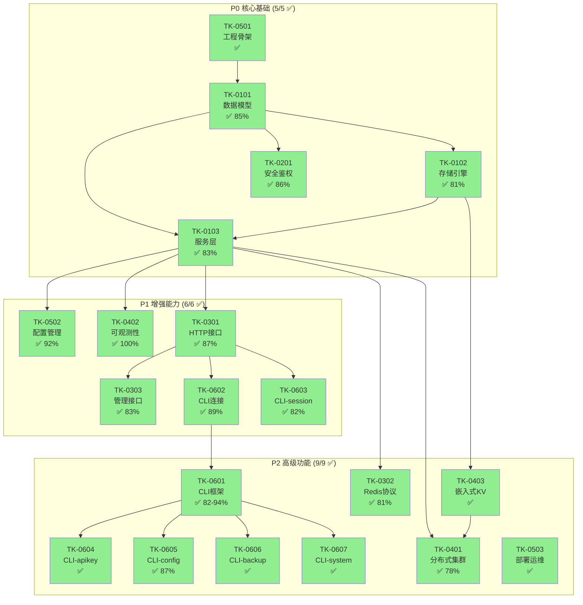

# TokMesh 开发任务索引（TK）

本目录用于记录 TokMesh 的实现任务拆解（TK 系列），按 `specs/governance/document-standards.md` 的分层编号规则组织。

---

## 任务总览

| 优先级 | 总数 | 已完成 | 进行中 | 待开始 | 说明 |
|--------|------|--------|--------|--------|------|
| **P0** | 5 | 5 ✅ | 0 | 0 | 核心基础：数据模型、存储引擎、服务层、安全鉴权、工程骨架 |
| **P1** | 6 | 6 ✅ | 0 | 0 | 增强能力：配置管理、可观测性、HTTP 接口、管理接口、CLI 连接、session 命令 |
| **P2** | 9 | 9 ✅ | 0 | 0 | 高级功能：CLI 子命令、Redis 协议、分布式集群、嵌入式 KV、部署运维 |

**整体进度**: 20/20 任务已完成 (100%)，Phase 1 + Phase 2 功能就绪

---

## 任务列表

### P0 优先级（核心基础）

| 编号 | 名称 | 状态 | 覆盖率 | 目标代码 |
|------|------|------|--------|----------|
| **[TK-0501](TK-0501-初始化工程骨架.md)** | 初始化工程骨架 | ✅ 已完成 | - | `src/` |
| **[TK-0101](TK-0101-核心域实现.md)** | 实现核心数据模型 | ✅ 已完成 | 85.0% | `internal/core/domain/` |
| **[TK-0102](TK-0102-实现存储引擎.md)** | 实现存储引擎 | ✅ 已完成 | 80.9% | `internal/storage/` |
| **[TK-0103](TK-0103-实现核心服务层.md)** | 实现核心服务层 | ✅ 已完成 | 82.5% | `internal/core/service/` |
| **[TK-0201](TK-0201-实现安全与鉴权.md)** | 实现安全与鉴权 | ✅ 已完成 | 85.5% | `internal/core/domain/`, `internal/core/service/` |

### P1 优先级（增强能力）

| 编号 | 名称 | 状态 | 覆盖率 | 目标代码 |
|------|------|------|--------|----------|
| **[TK-0502](TK-0502-实现配置管理.md)** | 实现配置管理 | ✅ 已完成 | 91.5% | `internal/server/config/`, `internal/infra/confloader/` |
| **[TK-0402](TK-0402-实现可观测性.md)** | 实现可观测性 | ✅ 已完成 | 100% | `internal/telemetry/` |
| **[TK-0301](TK-0301-实现HTTP接口.md)** | 实现 HTTP 接口 | ✅ 已完成 | 86.9% | `internal/server/httpserver/` |
| **[TK-0303](TK-0303-实现管理接口.md)** | 实现管理接口 | ✅ 已完成 | 83.1% | `internal/server/httpserver/handler/` |
| **[TK-0602](TK-0602-实现CLI连接管理.md)** | 实现 CLI 连接管理 | ✅ 已完成 | 88.5% | `internal/cli/connection/`, `internal/cli/repl/` |
| **[TK-0603](TK-0603-实现CLI-session命令.md)** | 实现 CLI session 命令 | ✅ 已完成 | 82.4% | `internal/cli/command/` |

### P2 优先级（高级功能）

| 编号 | 名称 | 状态 | 覆盖率 | 目标代码 |
|------|------|------|--------|----------|
| **[TK-0601](TK-0601-实现CLI框架.md)** | 实现 CLI 框架 | ✅ 已完成 | 82.4-94.1% | `internal/cli/` |
| **[TK-0604](TK-0604-实现CLI-apikey命令.md)** | 实现 CLI apikey 命令 | ✅ 已完成 | 82.4% | `internal/cli/command/` |
| **[TK-0605](TK-0605-实现CLI-config命令.md)** | 实现 CLI config 命令 | ✅ 已完成 | 86.7% | `internal/cli/command/` |
| **[TK-0606](TK-0606-实现CLI-backup命令.md)** | 实现 CLI backup 命令 | ✅ 已完成 | - | `internal/cli/command/` |
| **[TK-0607](TK-0607-实现CLI-system命令.md)** | 实现 CLI system 命令 | ✅ 已完成 | - | `internal/cli/command/` |
| **[TK-0302](TK-0302-实现Redis协议.md)** | 实现 Redis 协议 | ✅ 已完成 | 80.6% | `internal/server/redisserver/` |
| **[TK-0401](TK-0401-实现分布式集群.md)** | 实现分布式集群 | ✅ 已完成 | 77.7% | `internal/server/clusterserver/` |
| **[TK-0403](TK-0403-实现嵌入式KV适配.md)** | 实现嵌入式 KV 适配 | ✅ 已完成 | - | `internal/storage/` |
| **[TK-0503](TK-0503-实现部署与运维.md)** | 实现部署与运维 | ✅ 已完成 | - | `deployments/`, `scripts/` |

### 规划文档

| 编号 | 名称 | 状态 | 说明 |
|------|------|------|------|
| **[TK-0001](TK-0001-Phase1-实施计划.md)** | Phase 1 实施计划 | ✅ 已完成 | 详细的任务分解与里程碑规划 |
| **[TK-0002](TK-0002-Phase2-实施计划.md)** | Phase 2 实施计划 | ✅ 已完成 | P2 任务完成总结 |

---

## 任务依赖关系

---

## 代码目录映射

| 任务 | 目标目录 | 关联设计 | 覆盖率 |
|------|----------|----------|--------|
| TK-0101 | `internal/core/domain/` | DS-0101 | 85.0% |
| TK-0102 | `internal/storage/memory/`, `wal/`, `snapshot/` | DS-0102 | 80.9% |
| TK-0103 | `internal/core/service/` | DS-0103 | 82.5% |
| TK-0201 | `internal/core/domain/`, `internal/core/service/` | DS-0201 | 85.5% |
| TK-0301 | `internal/server/httpserver/` | DS-0301 | 86.9% |
| TK-0302 | `internal/server/redisserver/` | DS-0301 | 80.6% |
| TK-0303 | `internal/server/httpserver/handler/` | DS-0302 | 83.1% |
| TK-0401 | `internal/server/clusterserver/` | DS-0401 | 77.7% |
| TK-0402 | `internal/telemetry/` | DS-0402 | 100% |
| TK-0403 | `internal/storage/` | AD-0401/AD-0402 | - |
| TK-0501 | `src/` (完整骨架) | DS-0501 | - |
| TK-0502 | `internal/server/config/`, `internal/infra/confloader/` | DS-0502 | 91.5% |
| TK-0503 | `deployments/`, `scripts/` | DS-0501 | - |
| TK-0601 | `internal/cli/` | DS-0601 | 82.4-94.1% |
| TK-0602 | `internal/cli/connection/`, `internal/cli/repl/` | DS-0602 | 88.5% |
| TK-0603 | `internal/cli/command/session.go` | DS-0603 | 82.4% |
| TK-0604 | `internal/cli/command/apikey.go` | DS-0604 | 82.4% |
| TK-0605 | `internal/cli/command/config.go` | DS-0605 | 86.7% |
| TK-0606 | `internal/cli/command/backup.go` | DS-0606 | - |
| TK-0607 | `internal/cli/command/system.go` | DS-0607 | - |

---

## 质量指标

### 测试覆盖率达标情况

| 模块 | 目标 | 实际 | 状态 |
|------|------|------|------|
| `internal/core/domain` | ≥80% | 85.0% | ✅ |
| `internal/core/service` | ≥80% | 82.5% | ✅ |
| `internal/storage` | ≥80% | 80.9% | ✅ |
| `internal/server/httpserver` | ≥80% | 86.9% | ✅ |
| `internal/server/redisserver` | ≥80% | 80.6% | ✅ |
| `internal/server/clusterserver` | ≥80% | 77.7% | ⚠️ |
| `internal/cli` | ≥80% | 82.4-94.1% | ✅ |
| `internal/telemetry` | ≥80% | 100% | ✅ |
| `pkg/cmap` | ≥80% | 97.9% | ✅ |
| `pkg/crypto/adaptive` | ≥80% | 87.2% | ✅ |
| `pkg/token` | ≥80% | 88.2% | ✅ |

**说明**: `clusterserver` 77.7% 覆盖率因分布式代码路径需集成测试覆盖，单元测试已达预期。

---

## 参考文档

- [specs/governance/document-standards.md](../governance/document-standards.md) - 文档编号规范
- [specs/governance/code-skeleton.md](../governance/code-skeleton.md) - 代码骨架结构
- [specs/2-designs/](../2-designs/) - 技术设计文档
- [TK-0001-Phase1-实施计划.md](TK-0001-Phase1-实施计划.md) - Phase 1 实施计划
- [TK-0002-Phase2-实施计划.md](TK-0002-Phase2-实施计划.md) - Phase 2 实施计划
