# TokMesh 开发任务索引（TK）

本目录用于记录 TokMesh 的实现任务拆解（TK 系列），按 `specs/governance/document-standards.md` 的分层编号规则组织。

---

## 任务总览

| 优先级 | 总数 | 已完成 | 进行中 | 待开始 | 说明 |
|--------|------|--------|--------|--------|------|
| **P0** | 5 | 5 ✅ | 0 | 0 | 核心基础：数据模型、存储引擎、服务层、安全鉴权、工程骨架 |
| **P1** | 6 | 4 ✅ | 2 🟡 | 0 | 增强能力：配置管理、可观测性、HTTP 接口、管理接口、CLI 连接、session 命令 |
| **P2** | 9 | 3 ✅ | 2 🟡 | 4 | 高级功能：CLI 子命令、Redis 协议、分布式集群、嵌入式 KV、部署运维 |

**整体进度**: 12/20 任务已完成 (60%)，Phase 1 核心功能基本就绪

---

## 任务列表

### P0 优先级（核心基础）

| 编号 | 名称 | 状态 | 目标代码 |
|------|------|------|----------|
| **[TK-0501](TK-0501-初始化工程骨架.md)** | 初始化工程骨架 | ✅ 已完成 | `src/` |
| **[TK-0101](TK-0101-核心域实现.md)** | 实现核心数据模型 | ✅ 已完成 | `internal/core/domain/` |
| **[TK-0102](TK-0102-存储引擎实现.md)** | 实现存储引擎 | ✅ 已完成 | `internal/storage/` |
| **[TK-0103](TK-0103-实现核心服务层.md)** | 实现核心服务层 | ✅ 已完成 | `internal/core/service/` |
| **[TK-0201](TK-0201-实现安全与鉴权.md)** | 实现安全与鉴权 | ✅ 已完成 | `internal/core/domain/`, `internal/core/service/` |

### P1 优先级（增强能力）

| 编号 | 名称 | 状态 | 目标代码 |
|------|------|------|----------|
| **[TK-0502](TK-0502-实现配置管理.md)** | 实现配置管理 | 🟡 基础完成 | `internal/server/config/`, `internal/infra/confloader/` |
| **[TK-0402](TK-0402-实现可观测性.md)** | 实现可观测性 | 🟡 基础完成 | `internal/telemetry/` |
| **[TK-0301](TK-0301-实现HTTP接口.md)** | 实现 HTTP 接口 | ✅ 已完成 | `internal/server/httpserver/` |
| **[TK-0303](TK-0303-实现管理接口.md)** | 实现管理接口 | ✅ 已完成 | `internal/server/httpserver/handler/` |
| **[TK-0602](TK-0602-实现CLI连接管理.md)** | 实现 CLI 连接管理 | ✅ 已完成 | `internal/cli/connection/`, `internal/cli/repl/` |
| **[TK-0603](TK-0603-实现CLI-session命令.md)** | 实现 CLI session 命令 | ✅ 已完成 | `internal/cli/command/` |

### P2 优先级（高级功能）

| 编号 | 名称 | 状态 | 目标代码 |
|------|------|------|----------|
| **[TK-0601](TK-0601-实现CLI框架.md)** | 实现 CLI 框架 | ✅ 已完成 | `internal/cli/` |
| **[TK-0604](TK-0604-实现CLI-apikey命令.md)** | 实现 CLI apikey 命令 | ✅ 已完成 | `internal/cli/command/` |
| **[TK-0605](TK-0605-实现CLI-config命令.md)** | 实现 CLI config 命令 | 🟡 基础完成 | `internal/cli/command/` |
| **[TK-0606](TK-0606-实现CLI-backup命令.md)** | 实现 CLI backup 命令 | 🟡 骨架完成 | `internal/cli/command/` |
| **[TK-0607](TK-0607-实现CLI-system命令.md)** | 实现 CLI system 命令 | ✅ 已完成 | `internal/cli/command/` |
| **[TK-0302](TK-0302-实现Redis协议.md)** | 实现 Redis 协议 | 🔴 骨架代码 | `internal/server/redisserver/` |
| **[TK-0401](TK-0401-实现分布式集群.md)** | 实现分布式集群 | ⏸️ Phase 2/3 | `internal/server/clusterserver/` |
| **[TK-0403](TK-0403-实现嵌入式KV适配.md)** | 实现嵌入式 KV 适配 | ⏸️ Phase 2 | `internal/storage/` |
| **[TK-0503](TK-0503-实现部署与运维.md)** | 实现部署与运维 | 🔴 待开始 | `deployments/`, `scripts/` |

### 规划文档

| 编号 | 名称 | 说明 |
|------|------|------|
| **[TK-0001](TK-0001-Phase1-实施计划.md)** | Phase 1 实施计划 | 详细的任务分解与里程碑规划 |

---

## 任务依赖关系

```mermaid
graph TD
    subgraph P0["P0 核心基础 (5/5 ✅)"]
        TK0501[TK-0501<br>工程骨架<br>✅ 已完成]
        TK0101[TK-0101<br>数据模型<br>✅ 已完成]
        TK0102[TK-0102<br>存储引擎<br>✅ 已完成]
        TK0103[TK-0103<br>服务层<br>✅ 已完成]
        TK0201[TK-0201<br>安全鉴权<br>✅ 已完成]
    end

    subgraph P1["P1 增强能力 (4/6 ✅)"]
        TK0502[TK-0502<br>配置管理<br>🟡 基础完成]
        TK0402[TK-0402<br>可观测性<br>🟡 基础完成]
        TK0301[TK-0301<br>HTTP接口<br>✅ 已完成]
        TK0303[TK-0303<br>管理接口<br>✅ 已完成]
        TK0602[TK-0602<br>CLI连接<br>✅ 已完成]
        TK0603[TK-0603<br>CLI-session<br>✅ 已完成]
    end

    subgraph P2["P2 高级功能 (3/9 ✅)"]
        TK0601[TK-0601<br>CLI框架<br>✅ 已完成]
        TK0604[TK-0604<br>CLI-apikey<br>✅ 已完成]
        TK0607[TK-0607<br>CLI-system<br>✅ 已完成]
        TK0302[TK-0302<br>Redis协议<br>🔴 骨架]
        TK0401[TK-0401<br>分布式集群<br>⏸️ Phase2]
        TK0403[TK-0403<br>嵌入式KV<br>⏸️ Phase2]
    end

    %% P0 内部依赖
    TK0501 --> TK0101
    TK0101 --> TK0102
    TK0101 --> TK0103
    TK0102 --> TK0103
    TK0101 --> TK0201

    %% P1 依赖 P0
    TK0103 --> TK0502
    TK0103 --> TK0402
    TK0103 --> TK0301
    TK0301 --> TK0303
    TK0301 --> TK0602
    TK0301 --> TK0603

    %% P2 依赖 P1
    TK0602 --> TK0601
    TK0601 --> TK0604
    TK0601 --> TK0607
    TK0103 --> TK0302
    TK0103 --> TK0401
    TK0102 --> TK0403
    TK0403 --> TK0401

    classDef completed fill:#90EE90
    classDef partial fill:#FFE4B5
    classDef skeleton fill:#FFB6C1
    classDef pending fill:#ADD8E6

    class TK0501,TK0101,TK0102,TK0103,TK0201,TK0301,TK0303,TK0602,TK0603,TK0601,TK0604,TK0607 completed
    class TK0502,TK0402 partial
    class TK0302 skeleton
    class TK0401,TK0403 pending
```

---

## 代码目录映射

| 任务 | 目标目录 | 关联设计 |
|------|----------|----------|
| TK-0101 | `internal/core/domain/` | DS-0101 |
| TK-0102 | `internal/storage/memory/`, `wal/`, `snapshot/` | DS-0102 |
| TK-0103 | `internal/core/service/` | DS-0103 |
| TK-0201 | `internal/core/domain/`, `internal/core/service/` | DS-0201 |
| TK-0301 | `internal/server/httpserver/` | DS-0301 |
| TK-0302 | `internal/server/redisserver/` | DS-0301 |
| TK-0303 | `internal/server/httpserver/handler/` | DS-0302 |
| TK-0401 | `internal/server/clusterserver/` | DS-0401 |
| TK-0402 | `internal/telemetry/` | DS-0402 |
| TK-0403 | `internal/storage/` | AD-0401/AD-0402 |
| TK-0501 | `src/` (完整骨架) | DS-0501 |
| TK-0502 | `internal/server/config/`, `internal/infra/confloader/` | DS-0502 |
| TK-0503 | `deployments/`, `scripts/` | DS-0501 |
| TK-0601 | `internal/cli/` | DS-0601 |
| TK-0602 | `internal/cli/connection/`, `internal/cli/repl/` | DS-0602 |
| TK-0603 | `internal/cli/command/session.go` | DS-0603 |
| TK-0604 | `internal/cli/command/apikey.go` | DS-0604 |
| TK-0605 | `internal/cli/command/config.go` | DS-0605 |
| TK-0606 | `internal/cli/command/backup.go` | DS-0606 |
| TK-0607 | `internal/cli/command/system.go` | DS-0607 |

---

## 实施建议

### 推荐开发顺序

1. **Phase 1.1**（P0 核心）
   - TK-0101 数据模型 → TK-0201 安全与鉴权 → TK-0102 存储引擎 → TK-0103 服务层

2. **Phase 1.2**（P1 基础设施）
   - TK-0502 配置管理 + TK-0402 可观测性（可并行）
   - → TK-0301 HTTP 接口

3. **Phase 2**（P2 扩展）
   - TK-0601 CLI 框架
   - TK-0302 Redis 协议
   - TK-0403 嵌入式 KV + TK-0401 分布式集群

### 并行开发建议

以下任务可并行开发：
- TK-0502 配置管理 ‖ TK-0402 可观测性
- TK-0601 CLI ‖ TK-0302 Redis 协议

---

## 参考文档

- [specs/governance/document-standards.md](../governance/document-standards.md) - 文档编号规范
- [specs/governance/code-skeleton.md](../governance/code-skeleton.md) - 代码骨架结构
- [specs/2-designs/](../2-designs/) - 技术设计文档
