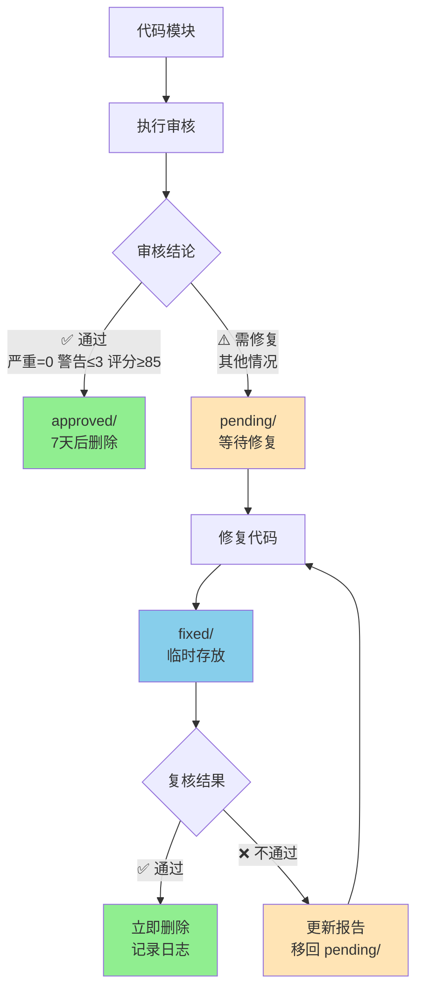

# 代码审核工作流规范 v2.0（优化版）

**版本**: 2.0
**状态**: 草稿
**最后更新**: 2025-12-21
**变更**: 优化审核报告分类存储，减少pending目录冗余

---

## 1. 工作流概述

本规范定义了**按质量分级、即时归档**的代码审核流程：
- ✅ 审核通过的报告直接归档到 `approved/`（定期清理）
- ⚠️ 需要修复的报告放入 `pending/`（等待修复）
- 🔄 修复后的报告放入 `fixed/`（等待复核）
- ❌ 复核不通过的报告放入 `rejected/`（重新修复）

---

## 2. 目录结构与分类标准

### 2.1 目录结构

```
specs/audits/
├── approved/          # ✅ 审核通过（无严重问题，7天后自动删除）
├── pending/           # ⚠️ 待修复（有严重问题或警告需修复）
├── fixed/             # 🔄 已修复，待复核（临时存放，复核后删除）
└── review.log         # 复核通过记录（日志形式）
```

**目录说明**:
- **approved/**: 审核直接通过的文件，7天后自动删除
- **pending/**: 需要修复的文件，修复后移至 `fixed/`
- **fixed/**: 临时存放已修复的文件，复核后**立即删除**（无论通过与否）
- **review.log**: 记录所有复核通过的文件（仅日志，不生成报告）

### 2.2 分类标准

| 审核结论 | 存放目录 | 条件 | 保留期限 |
|----------|----------|------|----------|
| ✅ **审核通过** | `approved/` | 无严重问题 **且** 警告≤3个 **且** 评分≥85 | 7天后删除 |
| ⚠️ **需修复** | `pending/` | 有严重问题 **或** 警告>3个 **或** 评分<85 | 修复后移至 `fixed/` |
| 🔄 **待复核** | `fixed/` | 问题已修复，等待复核 | **复核后立即删除** |
| ✅ **复核通过** | ~~无~~ (删除) | 所有问题已彻底解决 | **立即删除，仅记录日志** |
| ❌ **复核不通过** | `pending/` | 修复不彻底或引入新问题 | 更新报告，等待下轮修复 |

**注意**:
- 复核通过的文件**不再归档**，直接删除以减少冗余
- 复核不通过的文件**更新原审核报告**，移回 `pending/` 继续跟踪

---

## 3. 阶段一：代码审核（Audit）

### 3.1 审核结论判定

审核完成后，根据以下规则判定结论：

```python
def classify_audit_result(critical_count, warning_count, score):
    if critical_count == 0 and warning_count <= 3 and score >= 85:
        return "approved"  # 直接通过
    else:
        return "pending"   # 需要修复
```

**示例**:
| 文件 | 严重 | 警告 | 评分 | 结论 | 存放目录 |
|------|------|------|------|------|----------|
| `token.go` | 0 | 2 | 88 | ✅ 通过 | `approved/` |
| `errors.go` | 1 | 3 | 78 | ⚠️ 需修复 | `pending/` |
| `session.go` | 2 | 4 | 82 | ⚠️ 需修复 | `pending/` |
| `apikey.go` | 0 | 3 | 85 | ✅ 通过 | `approved/` |

### 3.2 文件命名规范

**格式**: `{date}_{module-path}_{status}.md`

**示例**:
- `approved/2025-12-21_internal-core-domain-token_approved.md`
- `pending/2025-12-21_internal-core-domain-errors_pending.md`

### 3.3 审核报告标记

在审核报告末尾明确标注：

**通过示例**:
```markdown
---

**审核结论**: ✅ 通过（质量良好，建议非阻塞性优化）

**分类理由**:
- 严重问题: 0 个
- 警告问题: 2 个（≤ 3）
- 总体评分: 88/100（≥ 85）

**后续操作**: 本报告已归档至 `specs/audits/approved/`，7天后自动删除。
```

**需修复示例**:
```markdown
---

**审核结论**: ⚠️ 需要修复后才能合并

**分类理由**:
- 严重问题: 1 个（> 0）
- 警告问题: 3 个
- 总体评分: 78/100（< 85）

**后续操作**:
1. 修复严重问题和警告
2. 生成修复记录到 `specs/audits/fixed/`
3. 触发复核流程
```

---

## 4. 阶段二：问题修复（Fix）

### 4.1 仅对 `pending/` 中的报告执行修复

```bash
# 修复所有待修复问题
./fix_all.sh

# 修复指定模块
./fix_all.sh 2025-12-21_internal-core-domain-errors_pending.md
```

### 4.2 修复完成后

1. 生成修复记录: `fixed/2025-12-21_internal-core-domain-errors_fix.md`
2. 移动原审核报告: `pending/*.md` → `fixed/` (备份)
3. 触发复核流程

---

## 5. 阶段三：修复复核（Review）

### 5.1 复核 `fixed/` 中的修复记录

```bash
# 复核所有已修复模块
./review_all.sh

# 复核指定模块
./review_all.sh 2025-12-21_internal-core-domain-errors_fix.md
```

### 5.2 复核判定

**✅ 复核通过**:
1. **立即删除** `fixed/` 中的修复记录和原审核报告
2. **不再归档**，减少文档冗余
3. 在日志中记录复核通过的文件名和时间

**❌ 复核不通过**:
1. **更新审核报告**，添加复核结果章节（标注未解决的问题）
2. **移回 `pending/`**，等待下一轮修复
3. 删除 `fixed/` 中的修复记录（已过时）
4. 保留更新后的审核报告，继续跟踪

### 5.3 复核结果记录格式

**复核通过**（记录到日志，不生成文件）:
```log
2025-12-21 15:30:00 [REVIEW-PASS] internal-core-domain-errors - 所有问题已修复
2025-12-21 15:35:00 [REVIEW-PASS] internal-core-domain-session - 所有问题已修复
```

**复核不通过**（更新原审核报告）:
在原 `pending/` 报告末尾追加：
```markdown
---

## 🔄 复核记录

### 复核 #1 (2025-12-21 15:40:00)

**复核结论**: ❌ 不通过

**已解决问题**:
- ✅ [严重] NewSession() 已添加 userID 参数校验
- ✅ [警告] Touch() 已添加长度截断

**未解决问题**:
- ❌ [严重] Validate() 仍未校验 TokenHash 格式
  - **原因**: 修复代码中使用了错误的正则表达式
  - **要求**: 使用 `ValidateTokenHashFormat()` 函数而非手写正则

**下一步**:
1. 修复 Validate() 中的 TokenHash 校验逻辑
2. 补充单元测试覆盖 TokenHash 格式错误的情况
3. 重新提交修复

**复核者**: Claude Code
```

---

## 6. 自动化脚本调整

### 6.1 audit_all.sh 修改

```bash
#!/bin/bash
# 审核完成后自动分类

if [ $critical_count -eq 0 ] && [ $warning_count -le 3 ] && [ $score -ge 85 ]; then
    # 通过：移至 approved/
    mv "$report_file" "specs/audits/approved/${basename}_approved.md"
    echo "✅ [通过] $module_name (评分: $score)"
else
    # 需修复：移至 pending/
    mv "$report_file" "specs/audits/pending/${basename}_pending.md"
    echo "⚠️ [需修复] $module_name (严重: $critical_count, 警告: $warning_count)"
fi
```

### 6.3 review_all.sh 修改（新增）

```bash
#!/bin/bash
# 复核已修复的代码

FIXED_DIR="specs/audits/fixed"
PENDING_DIR="specs/audits/pending"
REVIEW_LOG="specs/audits/review.log"

for fix_file in "$FIXED_DIR"/*_fix.md; do
    [ ! -f "$fix_file" ] && continue

    module_name=$(basename "$fix_file" _fix.md)
    echo "📋 复核: $module_name"

    # AI 执行复核（检查所有问题是否已解决）
    # ... 复核逻辑 ...

    if [ "$review_result" = "PASS" ]; then
        # ✅ 复核通过：删除所有相关文件，记录日志
        echo "$(date '+%Y-%m-%d %H:%M:%S') [REVIEW-PASS] $module_name - 所有问题已修复" >> "$REVIEW_LOG"
        rm -f "$fix_file"
        rm -f "$PENDING_DIR/${module_name}_pending.md"
        echo "✅ [复核通过] $module_name - 已删除报告"
    else
        # ❌ 复核不通过：更新审核报告，移回 pending/
        echo "⚠️ [复核不通过] $module_name - 更新报告并移回 pending/"

        # 在原审核报告末尾追加复核结果
        cat >> "$PENDING_DIR/${module_name}_pending.md" << EOF

---

## 🔄 复核记录

### 复核 #1 ($(date '+%Y-%m-%d %H:%M:%S'))

**复核结论**: ❌ 不通过

$review_feedback

**下一步**: 修复未解决的问题后重新提交
EOF

        # 删除 fixed/ 中的修复记录
        rm -f "$fix_file"
    fi
done
```

### 6.2 定期清理脚本

```bash
#!/bin/bash
# specs/audits/scripts/cleanup_approved.sh

# 删除 approved/ 中 7 天前的报告
find specs/audits/approved -name "*.md" -mtime +7 -delete

echo "✅ 已清理 7 天前的审核通过报告"
```

**定时任务** (crontab):
```cron
# 每天凌晨 2 点清理
0 2 * * * /home/yangsen/codes/tokmesh/specs/audits/scripts/cleanup_approved.sh
```

---

## 7. 与 v1.0 的对比

| 项目 | v1.0 (原版) | v2.0 (优化版) |
|------|-------------|---------------|
| **pending/** | 所有审核报告 | 仅存放需修复的报告 |
| **approved/** | 复核通过后归档（可选） | **审核通过即归档**（主要变化） |
| **清理策略** | 手动删除 | **7天自动删除** |
| **分类标准** | 无明确标准 | **严重=0 且 警告≤3 且 评分≥85** |
| **工作流** | 三阶段（审核→修复→复核） | **动态分流**（通过→归档，不通过→修复→复核） |

---

## 8. 迁移现有报告

### 8.1 检查现有报告

```bash
cd /home/yangsen/codes/tokmesh/specs/audits/pending

# 查看当前 pending/ 中的报告
ls -lh
```

### 8.2 重新分类

根据当前已生成的报告，按新标准分类：

| 报告 | 严重 | 警告 | 评分 | 建议目录 |
|------|------|------|------|----------|
| `token_audit.md` | 0 | 2 | 88 | → `approved/` |
| `errors_audit.md` | 1 | 3 | 78 | → 保留 `pending/` |
| `session_audit.md` | 2 | 4 | 82 | → 保留 `pending/` |
| `apikey_audit.md` | 0 | 3 | 85 | → `approved/` |

**执行迁移**:
```bash
# 移动通过的报告
mv pending/2025-12-21_internal-core-domain-token_audit.md \
   approved/2025-12-21_internal-core-domain-token_approved.md

mv pending/2025-12-21_internal-core-domain-apikey_audit.md \
   approved/2025-12-21_internal-core-domain-apikey_approved.md
```

---

## 9. 更新后的工作流图



**关键变化**:
- **复核通过** → 直接删除（不再归档到 approved/）
- **复核不通过** → 更新报告并移回 pending/（不再使用 rejected/ 目录）

---

## 10. 总结

### v2.0 核心改进

1. **即时归档**: 审核通过的报告直接进 `approved/`，减少 `pending/` 冗余
2. **自动清理**: 7天后自动删除通过报告，避免文档堆积
3. **明确标准**: 量化分类标准（严重=0 且 警告≤3 且 评分≥85）
4. **简化流程**: 通过的代码跳过修复和复核阶段，节省时间

### 使用建议

- **日常审核**: 大部分高质量代码直接通过，归档到 `approved/`
- **重点关注**: `pending/` 中的报告是真正需要修复的问题
- **定期检查**: 每周检查 `pending/` 进度，确保问题得到解决

---

**维护者**: 项目所有者
**生效日期**: 待批准后立即生效
