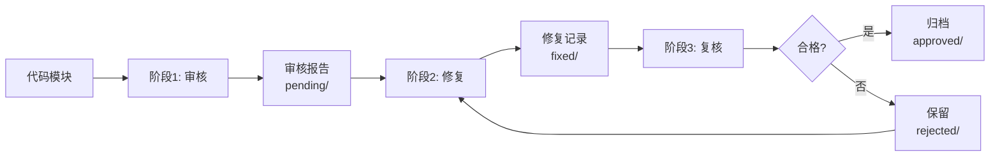

# 代码审核工作流规范 (Audit Workflow)

**版本**: 1.0
**状态**: 生效
**最后更新**: 2025-12-21
**适用范围**: 所有 `src/` 目录下的代码模块审核

---

## 1. 工作流概述

本规范定义了一个**三阶段、多会话、可追溯**的代码审核流程，旨在：
- ✅ 节省单次会话的提示词开销（每个模块独立会话）
- ✅ 保证审核质量（每个阶段独立复查）
- ✅ 完整可追溯（所有中间产物留档）

### 1.1 三阶段流程



---

## 2. 目录结构与文件管理

### 2.1 目录结构

```
specs/audits/
├── pending/           # 待修复的审核报告（阶段1输出）
├── fixed/             # 已修复，待复核（阶段2输出）
├── approved/          # 复核通过（阶段3成功，归档后可删除）
└── rejected/          # 复核不通过（阶段3失败，需重新修复）
```

### 2.2 文件命名规范

**格式**: `{date}_{module-path}_{stage}.md`

| 阶段 | 文件名示例 | 存放目录 |
|------|-----------|---------|
| 审核 | `2025-12-21_internal-core-service-session_audit.md` | `pending/` |
| 修复 | `2025-12-21_internal-core-service-session_fix.md` | `fixed/` |
| 复核 | `2025-12-21_internal-core-service-session_review.md` | `approved/` 或 `rejected/` |

**module-path 转换规则**:
- 原路径: `src/internal/core/service/session.go`
- 模块名: `internal-core-service-session`
- 转换: 去掉 `src/`，去掉 `.go`，`/` 替换为 `-`

### 2.3 文件生命周期

```
specs/audits/pending/xxx_audit.md  (审核报告)
       ↓
specs/audits/fixed/xxx_fix.md      (修复记录)
       ↓
   [复核判定]
       ↓
   ┌───────┴───────┐
   ↓               ↓
approved/      rejected/
xxx_review.md  xxx_review.md
(归档/删除)     (保留，重新修复)
```

### 2.4 颜色标识规范（终端输出）

所有脚本输出必须使用 ANSI 颜色码标识风险等级：

| 风险等级 | 颜色 | ANSI 代码 | 使用场景 |
|----------|------|-----------|----------|
| ✅ 成功 | 绿色 | `\033[32m` | 审核通过、修复完成、复核合格 |
| ℹ️ 低危 | 蓝色 | `\033[34m` | [建议] 级别问题、代码风格问题 |
| ⚠️ 中危 | 黄色 | `\033[33m` | [警告] 级别问题、性能隐患 |
| 🔴 高危 | 红色 | `\033[31m` | [严重] 级别问题、安全漏洞 |
| 🚨 紧急 | 红色加粗 | `\033[1;31m` | 阻塞合并的致命问题 |
| 📊 信息 | 灰色 | `\033[90m` | 统计信息、日志输出 |

**示例输出**:
```
✅ [成功] 审核通过: internal/core/service/session.go
⚠️ [中危] 发现 3 个警告问题
🔴 [高危] 发现 1 个严重安全问题: 会话创建未校验 userID 长度
🚨 [紧急] 必须修复后才能合并
```

---

## 3. 阶段一：代码审核 (Audit)

### 3.1 触发方式

```bash
# 全量审核
./audit_all.sh

# 指定模块审核
./audit_all.sh internal/core/service/session.go

# 指定目录审核
./audit_all.sh internal/core/service/
```

### 3.2 执行规则

- **一模块一会话**: 每个 Go 文件或 package 开启独立 AI 会话
- **依据框架**: 严格遵循 `specs/governance/audit-framework.md` 的所有维度
- **输出报告**: 生成 Markdown 格式审核报告，存入 `specs/audits/pending/`
- **任务过滤**: 仅扫描 `specs/3-tasks/README.md` 中标记为“✅ 已完成”的目标目录

### 3.3 审核报告格式

**文件名**: `{date}_{module-path}_audit.md`

**模板**:
```markdown
# 代码审核报告

**模块**: `src/internal/core/service/session.go`
**审核时间**: 2025-12-21 14:30:00
**审核者**: Claude Code (audit-framework.md v1.2)
**审核维度**: 9 个维度全覆盖

---

## 📊 审核摘要

- **总体评分**: 72/100
- **风险等级**: 中危
- **问题统计**:
  - [严重] 2 个
  - [警告] 5 个
  - [建议] 3 个

---

## ❌ 问题列表

### [严重] 会话创建未校验 userID 长度

- **位置**: `internal/core/service/session.go:45`
- **维度**: 2.4 边界与鲁棒性 > 参数校验清单 > 长度校验
- **分析**:
  ```go
  func (s *Service) Create(ctx context.Context, userID string, ...) {
      // 直接使用 userID，未检查长度
      sess := &Session{UserID: userID, ...}
  ```
  攻击者可传入超长 userID（如 10MB），导致内存溢出或 DoS。

- **建议**:
  ```go
  const MaxUserIDLength = 256

  if len(userID) == 0 || len(userID) > MaxUserIDLength {
      return nil, "", fmt.Errorf("invalid userID length: %d (max %d)",
          len(userID), MaxUserIDLength)
  }
  ```

### [警告] 错误未包装上下文

- **位置**: `internal/core/service/session.go:67`
- **维度**: 2.5 错误处理 > 上下文
- **分析**:
  ```go
  if err := s.repo.Save(ctx, sess); err != nil {
      return err  // ❌ 直接返回，丢失调用栈
  }
  ```

- **建议**:
  ```go
  if err := s.repo.Save(ctx, sess); err != nil {
      return fmt.Errorf("save session: %w", err)
  }
  ```

... (其他问题)

---

## ✅ 总结与建议

### 必须修复（阻塞合并）
1. [严重] 所有参数校验问题
2. [严重] 安全性问题

### 建议修复（非阻塞）
1. [警告] 错误包装问题
2. [建议] 命名规范问题

### 架构建议
- 建议在 `internal/core/domain/` 中定义统一的参数校验器
- 建议补充 `session_service_test.go` 中的边界测试用例

---

**审核结论**: ⚠️ 需要修复后才能合并
```

### 3.4 AI 执行指令

当执行审核任务时，AI 必须：

1. **加载审核框架**: 读取 `specs/governance/audit-framework.md`
2. **单模块聚焦**: 仅审核指定的单个文件或 package
3. **全维度扫描**: 必须覆盖框架定义的所有维度（2.1-2.9）
4. **生成报告**: 严格按照 3.3 节模板输出，存入 `specs/audits/pending/`
5. **禁止修复**: 此阶段仅输出报告，不修改代码

---

## 4. 阶段二：问题修复 (Fix)

### 4.1 触发方式

```bash
# 修复所有待修复问题
./fix_all.sh

# 修复指定模块
./fix_all.sh 2025-12-21_internal-core-service-session_audit.md
```

### 4.2 执行规则

- **一报告一会话**: 每个审核报告开启独立 AI 会话
- **逐问题修复**: 按 [严重] → [警告] → [建议] 顺序修复
- **生成修复记录**: 记录每个问题的修复方案和代码变更

### 4.3 修复记录格式

**文件名**: `{date}_{module-path}_fix.md`

**模板**:
```markdown
# 代码修复记录

**源审核报告**: `2025-12-21_internal-core-service-session_audit.md`
**修复时间**: 2025-12-21 15:00:00
**修复者**: Claude Code

---

## 📊 修复摘要

- **问题总数**: 10
- **已修复**: 10
- **未修复**: 0
- **修复文件**:
  - `src/internal/core/service/session.go`
  - `src/internal/core/service/session_test.go`

---

## 🔧 修复详情

### 问题1: 会话创建未校验 userID 长度

**原问题**: [严重] 审核报告第 23 行

**修复方案**:
1. 在 `internal/core/domain/session.go` 中定义常量 `MaxUserIDLength = 256`
2. 在 `Create()` 方法开头添加长度校验
3. 补充单元测试 `TestCreate_InvalidUserIDLength`

**代码变更**:
```diff
// src/internal/core/service/session.go

+const (
+    MaxUserIDLength = 256
+    MaxDataSize     = 4096
+)
+
 func (s *Service) Create(ctx context.Context, userID string, data []byte, ttl time.Duration) (*Session, string, error) {
+    // 校验 userID 长度
+    if len(userID) == 0 {
+        return nil, "", ErrInvalidUserID
+    }
+    if len(userID) > MaxUserIDLength {
+        return nil, "", fmt.Errorf("userID too long: %d > %d", len(userID), MaxUserIDLength)
+    }
+
     // ... 原有逻辑
 }
```

**测试验证**:
```bash
go test -run TestCreate_InvalidUserIDLength -v
# PASS
```

---

### 问题2: 错误未包装上下文

**原问题**: [警告] 审核报告第 45 行

**修复方案**: 所有 `return err` 改为 `return fmt.Errorf("context: %w", err)`

**代码变更**:
```diff
 if err := s.repo.Save(ctx, sess); err != nil {
-    return err
+    return fmt.Errorf("save session: %w", err)
 }
```

---

## ✅ 修复完成

- ✅ 所有 [严重] 问题已修复
- ✅ 所有 [警告] 问题已修复
- ✅ 所有 [建议] 问题已修复
- ✅ 单元测试全部通过
- ✅ 代码已格式化 (`gofmt`)

**状态**: 等待复核
```

### 4.4 AI 执行指令

当执行修复任务时，AI 必须：

1. **读取审核报告**: 从 `specs/audits/pending/` 加载报告
2. **逐问题修复**: 严格按照报告中的问题顺序修复
3. **运行测试**: 每次修改后运行相关单元测试
4. **生成修复记录**: 详细记录每个问题的修复方案，存入 `specs/audits/fixed/`
5. **移动文件**: 将审核报告从 `pending/` 移至 `fixed/`

---

## 5. 阶段三：修复复核 (Review)

### 5.1 触发方式

```bash
# 复核所有已修复模块
./review_all.sh

# 复核指定模块
./review_all.sh 2025-12-21_internal-core-service-session_fix.md
```

### 5.2 执行规则

- **一修复一会话**: 每个修复记录开启独立 AI 会话
- **三重验证**:
  1. 问题是否真正解决
  2. 修复是否引入新问题
  3. 是否遗漏审核报告中的问题
- **判定结果**: 合格或不合格

### 5.3 复核结果格式

**文件名**: `{date}_{module-path}_review.md`

**模板**:
```markdown
# 代码修复复核报告

**源审核报告**: `2025-12-21_internal-core-service-session_audit.md`
**源修复记录**: `2025-12-21_internal-core-service-session_fix.md`
**复核时间**: 2025-12-21 16:00:00
**复核者**: Claude Code (audit-framework.md v1.2)

---

## 📊 复核摘要

- **复核结果**: ✅ 合格 / ❌ 不合格
- **原问题数**: 10
- **已解决**: 10
- **未解决**: 0
- **新增问题**: 0

---

## ✅ 问题解决验证

### 问题1: 会话创建未校验 userID 长度

- **原问题**: [严重] userID 长度未校验
- **修复方案**: 添加长度校验 (0 < len <= 256)
- **验证结果**: ✅ 通过
  - [x] 代码已添加校验逻辑
  - [x] 常量定义合理 (`MaxUserIDLength = 256`)
  - [x] 错误信息清晰
  - [x] 单元测试覆盖边界情况
  - [x] 测试用例通过

### 问题2: 错误未包装上下文

- **原问题**: [警告] 错误直接返回
- **修复方案**: 使用 `fmt.Errorf("context: %w", err)`
- **验证结果**: ✅ 通过
  - [x] 所有错误返回都已包装
  - [x] 上下文信息完整

... (其他问题验证)

---

## 🔍 新问题检测

### 扫描结果
- ✅ 未发现新的安全问题
- ✅ 未发现新的边界问题
- ✅ 未发现新的错误处理问题
- ✅ 代码风格符合规范
- ✅ 测试覆盖率 >= 80%

---

## 📋 最终判定

### ✅ 合格 - 可归档

**理由**:
1. 所有原问题已彻底解决
2. 修复方案符合项目规范
3. 单元测试覆盖完整
4. 未引入新问题

**后续操作**:
- 删除 `specs/audits/pending/xxx_audit.md`
- 删除 `specs/audits/fixed/xxx_fix.md`
- 归档 `specs/audits/approved/xxx_review.md`（可选，7天后自动删除）

---

### ❌ 不合格 - 需重新修复

**不合格原因**:
1. [严重] 问题3未彻底解决（仅修复了部分边界情况）
2. [警告] 修复引入了新的并发安全问题（session.go:78 未加锁）

**具体问题**:

#### 未解决的问题
- **问题3**: Token 哈希计算使用了弱算法
  - 修复声称使用 SHA-256，但实际代码仍是 MD5
  - 位置: `session.go:56`

#### 新增问题
- **并发安全**: 修复过程中引入了竞态条件
  - 位置: `session.go:78`
  - 问题: `s.cache[id] = sess` 未加锁

**修复建议**:
1. 将 `crypto/md5` 改为 `crypto/sha256`
2. 在 78 行前后添加 `s.mu.Lock()` / `s.mu.Unlock()`
3. 运行 `go test -race` 验证

**后续操作**:
- 保留 `specs/audits/rejected/xxx_review.md`
- 将原审核报告和修复记录保留在 `rejected/` 目录
- 生成新的审核报告到 `pending/`，重新执行修复流程
```

### 5.4 AI 执行指令

当执行复核任务时，AI 必须：

1. **加载双报告**: 读取审核报告 + 修复记录（从 `specs/audits/fixed/`）
2. **逐问题验证**: 验证每个问题的修复是否彻底
3. **代码扫描**: 使用 `audit-framework.md` 重新扫描修复后的代码
4. **运行测试**: 验证测试覆盖率和测试通过率
5. **判定结果**:
   - 合格 → 删除 `pending/` 和 `fixed/` 中的文件，归档到 `approved/`
   - 不合格 → 将 review 报告保留在 `rejected/`，说明原因和修复建议

---

## 6. 自动化脚本规范

### 6.1 脚本命名

| 脚本 | 功能 | 输出目录 |
|------|------|---------|
| `audit_all.sh` | 执行代码审核 | `specs/audits/pending/` |
| `fix_all.sh` | 执行问题修复 | `specs/audits/fixed/` |
| `review_all.sh` | 执行修复复核 | `specs/audits/approved/` 或 `rejected/` |

### 6.2 脚本约定

1. **颜色输出**: 使用 ANSI 颜色码（详见 2.4 节），绿色=成功，红色=失败，黄色=警告
2. **进度显示**: 显示当前进度（如 `[2/10] 审核 session.go...`）
3. **日志记录**: 所有操作记录到 `specs/audits/audit.log`
4. **错误处理**: 任何失败立即停止，输出错误信息
5. **并发控制**: 默认串行执行（避免 AI 会话冲突），可选并发模式
6. **代理配置**: 自动设置代理服务器 `http://127.0.0.1:65210`
7. **Agent 选择**: 支持 7 种 AI Agent，默认使用 `codex-plus`
8. **任务过滤**: 审核仅扫描已完成任务目录，未完成/未开始目录必须跳过

### 6.3 触发方式

```bash
# 脚本位置
cd specs/audits/scripts

# ========== 审核 ==========
# 1. 全量审核（默认使用 codex-plus，仅扫描已完成任务目录）
./audit_all.sh

# 2. 指定 Agent 审核
./audit_all.sh --agent claude-88code
./audit_all.sh -a gemini

# 3. 指定目录审核
./audit_all.sh ../../../src/internal/core/service/
./audit_all.sh -a gemini ../../../src/internal/core/

# 4. 指定文件审核
./audit_all.sh ../../../src/internal/core/service/session.go

# 5. 查看帮助
./audit_all.sh --help

# ========== 修复 ==========
# 6. 修复所有待修复问题（默认 codex-plus）
./fix_all.sh

# 7. 指定 Agent 修复
./fix_all.sh --agent claude-88code

# 8. 指定模块修复
./fix_all.sh 2025-12-21_internal-core-service-session_audit.md
./fix_all.sh -a gemini 2025-12-21_session_audit.md

# ========== 复核 ==========
# 9. 复核所有已修复模块（默认 codex-plus）
./review_all.sh

# 10. 指定 Agent 复核
./review_all.sh --agent claude-88code
./review_all.sh -a gemini

# ========== 完整流程 ==========
# 11. 一键执行完整流程（审核→修复→复核，使用同一 Agent）
./audit_all.sh -a codex-plus && \
./fix_all.sh -a codex-plus && \
./review_all.sh -a codex-plus

# ========== 从项目根目录执行 ==========
./specs/audits/scripts/audit_all.sh
./specs/audits/scripts/fix_all.sh -a claude-88code
./specs/audits/scripts/review_all.sh --agent gemini
```

### 6.4 可用 AI Agent

| Agent 别名 | 说明 | 用途 |
|-----------|------|------|
| `codex-plus` | OpenAI Codex Plus | **默认** - 通用审核、修复、复核 |
| `gemini` | Google Gemini | 通用审核、修复、复核 |
| `claude-88code` | Claude Code 88 | 代码专项审核 |
| `claude-crs` | Claude CRS | Code Review 专项 |
| `claude-pro` | Claude Pro | 高级审核 |
| `codex-88code` | Codex Code 88 | 代码专项 |
| `codex-crs` | Codex CRS | Code Review |

**选择建议**:
- **审核阶段**: 推荐 `codex-plus` 或 `claude-crs`（全面性强）
- **修复阶段**: 推荐 `codex-plus` 或 `claude-88code`（代码生成能力强）
- **复核阶段**: 推荐 `codex-plus` 或 `gemini`（严谨性高）

---

## 7. 与现有规范的关系

### 7.1 依赖文档

| 文档 | 关系 |
|------|------|
| `audit-framework.md` | 定义审核维度和标准（本工作流的执行依据） |
| `std-go.md` | Go 编码规范（审核时的参照标准） |
| `conventions.md` | 项目开发规约（命名、提交等规范） |
| `error-codes.md` | 错误码规范（审核错误处理时参照） |

### 7.2 文档优先级

```
audit-workflow.md (本文档)  # 定义"怎么审核"
         ↓
audit-framework.md          # 定义"审核什么"
         ↓
std-go.md / conventions.md  # 定义"代码标准"
```

---

## 8. 注意事项

### 8.1 会话管理

- ✅ 每个模块的审核/修复/复核都应在**新会话**中进行
- ✅ 不要在同一会话中处理多个模块（避免提示词膨胀）
- ✅ 复核时不要复用修复会话（保证独立视角）

### 8.2 报告管理

- ✅ 报告文件使用 UTF-8 编码
- ✅ 代码片段使用 Markdown 代码块（带语言标识）
- ✅ 问题编号在同一报告内保持唯一
- ✅ 复核通过后可删除 pending 和 fixed 中的报告（approved 可选择归档或删除）

### 8.3 质量保证

- ✅ 审核报告必须覆盖 `audit-framework.md` 的所有维度
- ✅ 修复必须包含单元测试
- ✅ 复核必须验证测试通过率和覆盖率
- ✅ 任何阶段发现框架遗漏的问题，应及时更新 `audit-framework.md`

---

## 9. 维护

### 9.1 文档更新

当以下情况发生时，必须更新本文档：
1. `audit-framework.md` 新增审核维度
2. 报告格式需要调整
3. 脚本功能需要扩展

### 9.2 版本历史

| 版本 | 日期 | 变更 |
|------|------|------|
| 1.0 | 2025-12-21 | 初始版本，定义三阶段工作流 |
