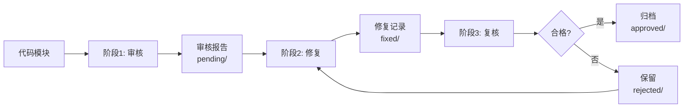

# 代码审核工作流规范 (Audit Workflow)

**版本**: 2.0
**状态**: 生效
**最后更新**: 2025-12-22
**适用范围**: 所有 `src/` 目录下的代码模块审核

---

## 1. 工作流概述

本规范定义了一个**三阶段、多会话、可追溯**的代码审核流程，旨在：
- ✅ 节省单次会话的提示词开销（每个模块独立会话）
- ✅ 保证审核质量（每个阶段独立复查）
- ✅ 完整可追溯（所有中间产物留档）

### 1.1 三阶段流程



---

## 2. 目录结构与文件管理

### 2.1 目录结构

```
specs/audits/
├── pending/           # 待修复的审核报告（阶段1输出）
├── fixed/             # 已修复，待复核（阶段2输出）
├── approved/          # 复核通过（阶段3成功，归档后可删除）
└── rejected/          # 复核不通过（阶段3失败，需重新修复）
```

### 2.2 文件命名规范

**格式**: `{date}_{module-path}_{stage}.md`

| 阶段 | 文件名示例 | 存放目录 |
|------|-----------|---------|
| 审核 | `2025-12-21_internal-core-service-session_audit.md` | `pending/` |
| 修复 | `2025-12-21_internal-core-service-session_fix.md` | `fixed/` |
| 复核 | `2025-12-21_internal-core-service-session_review.md` | `approved/` 或 `rejected/` |

**module-path 转换规则**:
- 原路径: `src/internal/core/service/session.go`
- 模块名: `internal-core-service-session`
- 转换: 去掉 `src/`，去掉 `.go`，`/` 替换为 `-`

### 2.3 分类标准

| 审核结论 | 存放目录 | 条件 | 保留期限 |
|----------|----------|------|----------|
| ✅ **审核通过** | `approved/` | 无严重问题 **且** 警告≤3个 **且** 评分≥85 | 7天后删除 |
| ⚠️ **需修复** | `pending/` | 有严重问题 **或** 警告>3个 **或** 评分<85 | 修复后移至 `fixed/` |
| 🔄 **待复核** | `fixed/` | 问题已修复，等待复核 | 复核后删除 |
| ❌ **复核不通过** | `rejected/` | 修复不彻底或引入新问题 | 更新报告，等待下轮修复 |

### 2.4 颜色标识规范（终端输出）

| 风险等级 | 颜色 | ANSI 代码 | 使用场景 |
|----------|------|-----------|----------|
| ✅ 成功 | 绿色 | `\033[32m` | 审核通过、修复完成、复核合格 |
| ℹ️ 低危 | 蓝色 | `\033[34m` | [建议] 级别问题、代码风格问题 |
| ⚠️ 中危 | 黄色 | `\033[33m` | [警告] 级别问题、性能隐患 |
| 🔴 高危 | 红色 | `\033[31m` | [严重] 级别问题、安全漏洞 |
| 🚨 紧急 | 红色加粗 | `\033[1;31m` | 阻塞合并的致命问题 |

---

## 3. 阶段一：代码审核 (Audit)

### 3.1 触发方式

```bash
# 全量审核
./audit_all.sh

# 指定模块审核
./audit_all.sh internal/core/service/session.go

# 指定目录审核
./audit_all.sh internal/core/service/
```

### 3.2 执行规则

- **一模块一会话**: 每个 Go 文件或 package 开启独立审核会话
- **依据框架**: 严格遵循 `specs/governance/audit-framework.md` 的所有维度
- **输出报告**: 生成 Markdown 格式审核报告，存入 `specs/audits/pending/`
- **任务过滤**: 仅扫描 `specs/3-tasks/README.md` 中标记为"✅ 已完成"的目标目录

### 3.3 审核结论判定

```python
def classify_audit_result(critical_count, warning_count, score):
    if critical_count == 0 and warning_count <= 3 and score >= 85:
        return "approved"  # 直接通过
    else:
        return "pending"   # 需要修复
```

### 3.4 审核报告格式

**文件名**: `{date}_{module-path}_audit.md`

**模板**:
```markdown
# 代码审核报告

**模块**: `src/internal/core/service/session.go`
**审核时间**: 2025-12-21 14:30:00
**审核者**: yndnr
**审核维度**: 9 个维度全覆盖

---

## 📊 审核摘要

- **总体评分**: 72/100
- **风险等级**: 中危
- **问题统计**:
  - [严重] 2 个
  - [警告] 5 个
  - [建议] 3 个

---

## ❌ 问题列表

### [严重] 会话创建未校验 userID 长度

- **位置**: `internal/core/service/session.go:45`
- **维度**: 2.4 边界与鲁棒性 > 参数校验清单 > 长度校验
- **分析**: 攻击者可传入超长 userID，导致内存溢出或 DoS。
- **建议**: 添加长度校验

---

## ✅ 总结与建议

### 必须修复（阻塞合并）
1. [严重] 所有参数校验问题

### 建议修复（非阻塞）
1. [警告] 错误包装问题

---

**审核结论**: ⚠️ 需要修复后才能合并
```

---

## 4. 阶段二：问题修复 (Fix)

### 4.1 触发方式

```bash
# 修复所有待修复问题
./fix_all.sh

# 修复指定模块
./fix_all.sh 2025-12-21_internal-core-service-session_audit.md
```

### 4.2 执行规则

- **一报告一会话**: 每个审核报告开启独立修复会话
- **逐问题修复**: 按 [严重] → [警告] → [建议] 顺序修复
- **生成修复记录**: 记录每个问题的修复方案和代码变更

### 4.3 修复记录格式

**文件名**: `{date}_{module-path}_fix.md`

**模板**:
```markdown
# 代码修复记录

**源审核报告**: `2025-12-21_internal-core-service-session_audit.md`
**修复时间**: 2025-12-21 15:00:00
**修复者**: yndnr

---

## 📊 修复摘要

- **问题总数**: 10
- **已修复**: 10
- **未修复**: 0

---

## 🔧 修复详情

### 问题1: 会话创建未校验 userID 长度

**代码变更**:
```diff
+if len(userID) > MaxUserIDLength {
+    return nil, "", ErrInvalidUserID
+}
```

**测试验证**: `go test -run TestCreate_InvalidUserIDLength -v` PASS

---

**状态**: 等待复核
```

---

## 5. 阶段三：修复复核 (Review)

### 5.1 触发方式

```bash
# 复核所有已修复模块
./review_all.sh

# 复核指定模块
./review_all.sh 2025-12-21_internal-core-service-session_fix.md
```

### 5.2 执行规则

- **一修复一会话**: 每个修复记录开启独立复核会话
- **三重验证**:
  1. 问题是否真正解决
  2. 修复是否引入新问题
  3. 是否遗漏审核报告中的问题
- **判定结果**: 合格或不合格

### 5.3 复核结果处理

- **合格**: 删除 `pending/` 和 `fixed/` 中的文件，归档到 `approved/`
- **不合格**: 将 review 报告保留在 `rejected/`，说明原因和修复建议

---

## 6. 自动化脚本规范

### 6.1 脚本列表

| 脚本 | 功能 | 输出目录 |
|------|------|---------|
| `audit_all.sh` | 执行代码审核 | `specs/audits/pending/` |
| `fix_all.sh` | 执行问题修复 | `specs/audits/fixed/` |
| `review_all.sh` | 执行修复复核 | `specs/audits/approved/` 或 `rejected/` |

### 6.2 脚本约定

1. **颜色输出**: 使用 ANSI 颜色码，绿色=成功，红色=失败，黄色=警告
2. **进度显示**: 显示当前进度（如 `[2/10] 审核 session.go...`）
3. **日志记录**: 所有操作记录到 `specs/audits/audit.log`
4. **错误处理**: 任何失败立即停止，输出错误信息
5. **并发控制**: 默认串行执行，可选并发模式

---

## 7. 与现有规范的关系

### 7.1 依赖文档

| 文档 | 关系 |
|------|------|
| `audit-framework.md` | 定义审核维度和标准（本��作流的执行依据） |
| `std-go.md` | Go 编码规范（审核时的参照标准） |
| `conventions.md` | 项目开发规约（命名、提交等规范） |

### 7.2 文档优先级

```
audit-workflow.md (本文档)  # 定义"怎么审核"
         ↓
audit-framework.md          # 定义"审核什么"
         ↓
std-go.md / conventions.md  # 定义"代码标准"
```

---

## 8. 注意事项

### 8.1 会话管理

- ✅ 每个模块的审核/修复/复核都应在**新会话**中进行
- ✅ 不要在同一会话中处理多个模块（避免提示词膨胀）
- ✅ 复核时不要复用修复会话（保证独立视角）

### 8.2 报告管理

- ✅ 报告文件使用 UTF-8 编码
- ✅ 代码片段使用 Markdown 代码块（带语言标识）
- ✅ 问题编号在同一报告内保持唯一

### 8.3 质量保证

- ✅ 审核报告必须覆盖 `audit-framework.md` 的所有维度
- ✅ 修复必须包含单���测试
- ✅ 复核必须验证测试通过率和覆盖率

---

## 9. 版本历史

| 版本 | 日期 | 变更 |
|------|------|------|
| 1.0 | 2025-12-21 | 初始版本，定义三阶段工作流 |
| 2.0 | 2025-12-22 | 合并 v2 改进，移除第三方 Agent 依赖 |
