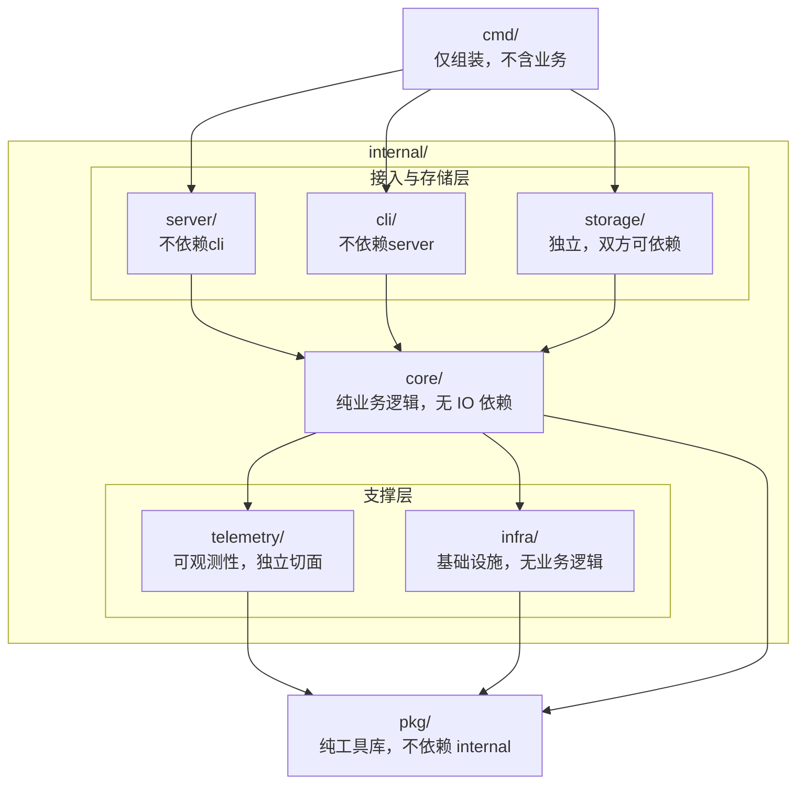

# 代码工程骨架 / Code Skeleton

**版本**: 1.0
**状态**: 已批准
**更新日期**: 2025-12-17
**维护者**: 项目所有者

---

## 1. 概述

本文档定义 TokMesh 项目的完整代码目录结构，作为代码组织的**单一事实来源 (Single Source of Truth)**。

所有涉及代码路径的设计文档、任务文档均应引用本文档，而非自行定义目录结构。

**Go 模块路径**: `github.com/yndnr/tokmesh-go`

---

## 2. 目录结构

```text
src/
├── go.mod                           # github.com/yndnr/tokmesh-go
├── go.sum
│
├── cmd/                             # [入口层] 极薄，仅做组装
│   ├── tokmesh-server/
│   │   └── main.go                  # 加载配置 -> 初始化 Infra -> 启动 Server
│   └── tokmesh-cli/
│       └── main.go                  # 初始化 CLI App -> Execute()
│
├── api/                             # [契约层] 协议定义
│   └── proto/v1/
│       ├── cluster.proto            # 集群 RPC 定义 (Connect + Protobuf)
│       └── cluster.pb.go            # (Generated, 不提交；生成策略见 specs/governance/alignment-open-decisions.md)
│
├── internal/                        # [私有实现层]
│   │
│   ├── core/                        # [核心域] 纯业务逻辑，无 IO，无框架
│   │   ├── domain/                  # 领域模型 (Entity & Value Object)
│   │   │   ├── session.go           # type Session struct
│   │   │   ├── token.go             # type Token struct (Hash)
│   │   │   ├── apikey.go            # type APIKey struct
│   │   │   └── errors.go            # 领域错误定义 (ErrSessionExpired, ...)
│   │   └── service/                 # 领域服务 (Domain Service)
│   │       ├── session.go           # Create, Validate, Revoke, Extend, GC
│   │       ├── token.go             # Generate, Hash, Verify
│   │       └── auth.go              # APIKey 验证, 权限检查
│   │
│   ├── storage/                     # [存储层] 独立顶级，server/cli 均可依赖
│   │   ├── memory/                  # 内存数据结构
│   │   │   ├── store.go             # 主存储接口实现
│   │   │   └── index.go             # 二级索引 (UserID -> SessionIDs)
│   │   ├── wal/                     # 预写日志
│   │   │   ├── writer.go            # 日志写入
│   │   │   ├── reader.go            # 日志回放
│   │   │   └── compactor.go         # 日志压缩
│   │   └── snapshot/                # 快照管理
│   │       ├── manager.go           # 快照创建/恢复
│   │       └── encrypt.go           # 快照加密
│   │
│   ├── server/                      # [接入层] tokmesh-server 专用
│   │   ├── httpserver/              # 对外 HTTP/HTTPS (stdlib net/http)
│   │   │   ├── server.go            # ListenAndServe, GracefulShutdown
│   │   │   ├── router.go            # ServeMux 路由注册
│   │   │   ├── middleware.go        # Auth, RateLimit, Audit, RequestID
│   │   │   └── handler/             # HTTP Handlers
│   │   │       ├── session.go       # /sessions, /sessions/{session_id}, /sessions/{session_id}/renew
│   │   │       ├── token.go         # /tokens/validate
│   │   │       ├── admin.go         # /admin/v1/*
│   │   │       └── health.go        # /health, /ready, /metrics
│   │   │
│   │   ├── redisserver/             # 对外 Redis 协议 (RESP)
│   │   │   ├── server.go            # TCP Listener, 连接管理
│   │   │   ├── parser.go            # RESP 协议解析
│   │   │   └── command.go           # GET, SET, DEL, TM.* 扩展命令
│   │   │
│   │   ├── clusterserver/           # 集群内部互联 (Connect + Protobuf / Raft / Gossip)
│   │   │   ├── server.go            # 集群通信 Handler 实现
│   │   │   └── interceptor.go       # mTLS 验证, 日志
│   │   │
│   │   ├── localserver/             # 对内 UDS 本地 socket 管理通道
│   │   │   ├── server.go            # Unix Socket / Named Pipe Listener
│   │   │   └── handler.go           # 本地指令处理 (无需 API Key)
│   │   │
│   │   └── config/                  # Server 业务配置定义
│   │       ├── spec.go              # type ServerConfig struct
│   │       ├── default.go           # 默认值常量
│   │       ├── verify.go            # 业务校验 (端口冲突、路径存在性)
│   │       └── sanitize.go          # 日志脱敏 (隐藏密钥)
│   │
│   ├── cli/                         # [交互层] tokmesh-cli 专用
│   │   ├── command/                 # 命令定义 (urfave/cli/v2)
│   │   │   ├── root.go              # 根命令, 全局 Flag, 模式判断
│   │   │   ├── session.go           # session 子命令组
│   │   │   ├── apikey.go            # apikey 子命令组
│   │   │   ├── config.go            # config 子命令组
│   │   │   ├── backup.go            # backup 子命令组
│   │   │   ├── system.go            # system 子命令组
│   │   │   └── connect.go           # connect/disconnect/use 命令
│   │   │
│   │   ├── connection/              # 连接管理
│   │   │   ├── manager.go           # 连接状态机
│   │   │   ├── http.go              # HTTP/HTTPS Client
│   │   │   └── socket.go            # UDS/Named Pipe Client
│   │   │
│   │   ├── repl/                    # 交互模式
│   │   │   ├── repl.go              # Read-Eval-Print Loop
│   │   │   ├── completer.go         # 命令补全
│   │   │   └── history.go           # 历史记录
│   │   │
│   │   ├── output/                  # 输出格式化
│   │   │   ├── formatter.go         # 格式化接口
│   │   │   ├── table.go             # 表格渲染 (含 wide 模式)
│   │   │   ├── json.go              # JSON 输出
│   │   │   ├── yaml.go              # YAML 输出
│   │   │   └── spinner.go           # 进度动画
│   │   │
│   │   └── config/                  # CLI 配置定义
│   │       ├── spec.go              # CLI 配置结构 (~/.tokmesh/cli.yaml)
│   │       └── loader.go            # 加载与合并
│   │
│   ├── telemetry/                   # [观测域] 可观测性切面
│   │   ├── logger/
│   │   │   ├── zap.go               # Zap Logger 封装
│   │   │   └── context.go           # 上下文日志注入
│   │   ├── metric/
│   │   │   ├── prometheus.go        # Prometheus Registry
│   │   │   └── collector.go         # 自定义 Collector
│   │   └── tracer/
│   │       └── otel.go              # OpenTelemetry Provider (预留)
│   │
│   └── infra/                       # [基础层] 通用基础设施
│       ├── confloader/              # 配置加载机制 (Koanf)
│       │   ├── loader.go            # File -> Env -> Flag 合并
│       │   └── provider.go          # 各数据源 Provider
│       ├── buildinfo/               # 构建信息
│       │   └── version.go           # 版本/Commit/BuildTime (ldflags)
│       ├── tlsroots/                # TLS 证书管理
│       │   ├── roots.go             # 系统证书 + 自定义 CA
│       │   └── watcher.go           # 证书热加载 (fsnotify)
│       └── shutdown/                # 优雅关闭
│           └── shutdown.go          # 信号处理, 超时控制
│
└── pkg/                             # [组件层] 可移植通用库 (无 internal 依赖)
    ├── token/                       # Token 工具
    │   ├── generator.go             # CSPRNG 生成 (crypto/rand)
    │   └── hash.go                  # SHA-256 哈希
    │
    ├── crypto/                      # 加密套件
    │   └── adaptive/                # 自适应加密
    │       ├── cipher.go            # 统一接口
    │       ├── aes_gcm.go           # AES-GCM 实现
    │       └── chacha20.go          # ChaCha20-Poly1305 实现
    │
    └── cmap/                        # 并发安全 Map
        ├── sharded.go               # 分片锁实现
        └── iter.go                  # 安全迭代器
```

---

## 3. 依赖边界规则



### 3.1 依赖约束表

| 模块 | 可依赖 | 禁止依赖 |
|------|--------|----------|
| `cmd/` | `internal/*`, `pkg/*` | - |
| `internal/server/` | `core/`, `storage/`, `telemetry/`, `infra/`, `pkg/` | `cli/` |
| `internal/cli/` | `core/`, `storage/`, `telemetry/`, `infra/`, `pkg/` | `server/` |
| `internal/storage/` | `core/`, `infra/`, `pkg/` | `server/`, `cli/` |
| `internal/core/` | `pkg/` | `server/`, `cli/`, `storage/`, `telemetry/`, `infra/` |
| `internal/telemetry/` | `pkg/` | `server/`, `cli/`, `core/`, `storage/` |
| `internal/infra/` | `pkg/` | `server/`, `cli/`, `core/`, `storage/` |
| `pkg/` | 标准库, 白名单第三方库 | `internal/*`, `cmd/*` |

---

## 4. 模块职责说明

### 4.1 入口层 (`cmd/`)

| 目录 | 职责 |
|------|------|
| `tokmesh-server/` | 服务端入口，加载配置 → 初始化 Infra → 启动各 Server |
| `tokmesh-cli/` | CLI 入口，初始化 CLI App → Execute() |

**原则**: 极薄，仅做依赖组装，不含业务逻辑。

### 4.2 核心域 (`internal/core/`)

| 目录 | 职责 |
|------|------|
| `domain/` | 领域模型（Entity & Value Object），定义 Session, Token, APIKey 等核心结构 |
| `service/` | 领域服务，实现核心业务逻辑（Create, Validate, Revoke 等） |

**原则**: 纯业务逻辑，无 IO 依赖，无框架依赖，可独立单元测试。

### 4.3 存储层 (`internal/storage/`)

| 目录 | 职责 |
|------|------|
| `memory/` | 内存数据结构，主存储接口实现，二级索引 |
| `wal/` | 预写日志，日志写入/回放/压缩 |
| `snapshot/` | 快照管理，快照创建/恢复/加密 |

**原则**: 独立顶级目录，server 和 cli (backup 命令) 均可依赖。

### 4.4 接入层 (`internal/server/`)

| 目录 | 职责 |
|------|------|
| `httpserver/` | 对外 HTTP/HTTPS 服务（stdlib net/http） |
| `redisserver/` | 对外 Redis 协议兼容服务（RESP） |
| `clusterserver/` | 集群内部互联（Connect + Protobuf / Raft / Gossip） |
| `localserver/` | 对内 UDS 本地 socket 管理通道 |
| `config/` | 服务端配置结构定义与验证 |

**HTTP 路由前缀策略（强制，避免漂移）**：
- 业务/数据面 HTTP Base URL：`/`（当前版本**不使用** `/api/v1` 版本前缀；以 `specs/1-requirements/RQ-0301-业务接口规约-OpenAPI.md` 为准）
- 管理面 Base URL：`/admin/v1`（以 `specs/1-requirements/RQ-0304-管理接口规约.md` 为准）

**原则**: tokmesh-server 专用，不依赖 cli。

### 4.5 交互层 (`internal/cli/`)

| 目录 | 职责 |
|------|------|
| `command/` | 命令定义（urfave/cli/v2），各子命令组 |
| `connection/` | 连接管理，HTTP/HTTPS Client，UDS Client |
| `repl/` | 交互模式，REPL 主循环，命令补全，历史记录 |
| `output/` | 输出格式化，Table/JSON/YAML 渲染 |
| `config/` | CLI 配置结构定义与加载 |

**原则**: tokmesh-cli 专用，不依赖 server。

### 4.6 观测域 (`internal/telemetry/`)

| 目录 | 职责 |
|------|------|
| `logger/` | Zap Logger 封装，上下文日志注入 |
| `metric/` | Prometheus Registry，自定义 Collector |
| `tracer/` | OpenTelemetry Provider（预留） |

**原则**: 横切关注点集中管理，独立切面。

### 4.7 基础层 (`internal/infra/`)

| 目录 | 职责 |
|------|------|
| `confloader/` | 配置加载机制（Koanf），File → Env → Flag 合并 |
| `buildinfo/` | 构建信息，版本/Commit/BuildTime |
| `tlsroots/` | TLS 证书管理，系统证书 + 自定义 CA，热加载 |
| `shutdown/` | 优雅关闭，信号处理，超时控制 |

**原则**: 通用基础设施，无业务逻辑，目录名保持名词性风格一致。

### 4.8 组件层 (`pkg/`)

| 目录 | 职责 |
|------|------|
| `token/` | Token 生成（CSPRNG）和哈希（SHA-256） |
| `crypto/adaptive/` | 自适应加密，AES-GCM / ChaCha20-Poly1305 |
| `cmap/` | 并发安全 Map，分片锁实现 |

**原则**: 可移植通用库，不依赖 internal，可被外部项目复用。

---

## 5. 设计决策记录

| 决策点 | 选择 | 理由 |
|--------|------|------|
| **服务器命名** | `httpserver/redisserver/clusterserver` | 避免与 `net/http` 冲突；体现业务语义而非底层协议 |
| **存储层归属** | `internal/storage/` 独立顶级 | 存储是核心能力，server 和 cli (backup) 均需依赖，避免交叉依赖 |
| **基础层命名** | `infra/` 替代 `shared/` | 明确"基础设施"语义，避免杂物间化（遵循 conventions.md §4.3） |
| **配置归属** | `server/config/` + `cli/config/` | 配置定义归属各自进程目录，完全对称；`infra/confloader/` 提供加载机制 |
| **CLI 命令目录** | `cli/command/` 而非 `cli/cmd/` | 避免与顶层 `cmd/`（程序入口）命名混淆 |
| **服务文件命名** | `session.go` 而非 `session_svc.go` | 文件已在 `service/` 包下，后缀冗余 |
| **优雅关闭命名** | `infra/shutdown/` 而非 `infra/graceful/` | 保持 `infra/*` 目录名词性风格一致 |
| **CLI 输出层** | `output/` 而非 `view/` | CLI 语境下更直白，`view` 偏 MVC 风格 |

---

## 6. 文件清单统计

| 目录 | 文件数 | 说明 |
|------|--------|------|
| `cmd/` | 2 | 两个入口 main.go |
| `api/proto/` | 1~2 | proto + generated |
| `internal/core/` | 7 | 领域模型 + 服务 |
| `internal/storage/` | 7 | 内存 + WAL + 快照 |
| `internal/server/` | 18 | 4个服务器 + 配置 |
| `internal/cli/` | 20 | 命令 + 连接 + 输出 + 配置 |
| `internal/telemetry/` | 5 | 日志/指标/追踪 |
| `internal/infra/` | 6 | 加载器/版本/TLS/关闭 |
| `pkg/` | 7 | token/crypto/cmap |
| **总计** | **~72** | 不含测试文件 |

---

## 变更历史

| 日期 | 版本 | 变更说明 | 作者 |
|------|------|----------|------|
| 2025-12-17 | v1.0 | 从 DS-0501 附录 A 独立为规范文档 | Claude Code |
